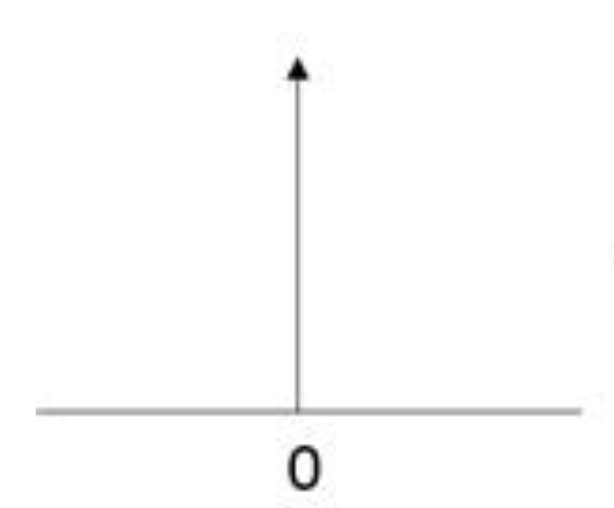
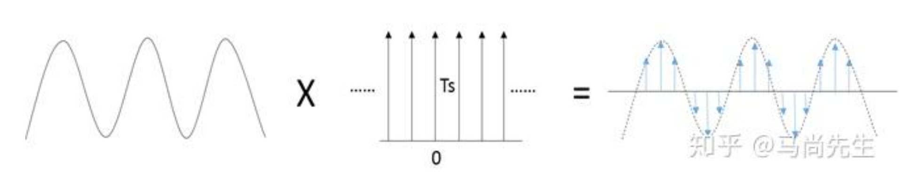
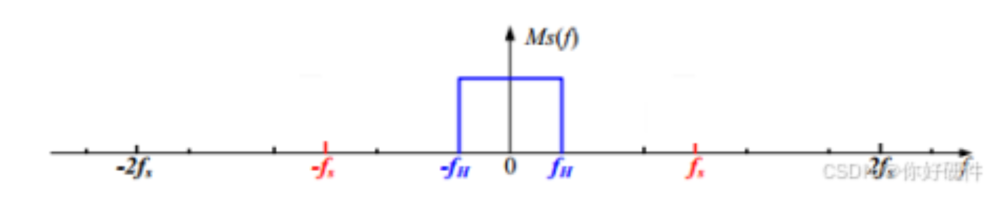
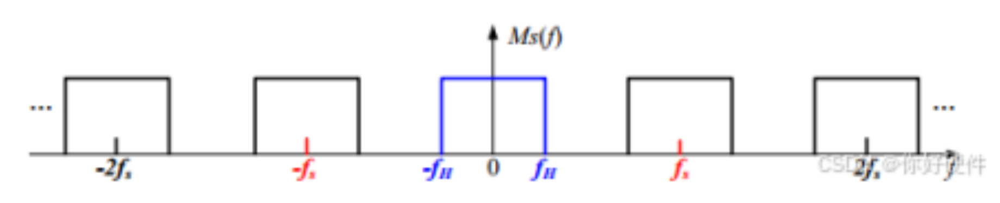

# signal processing
## 采样定理
### 采样定理的数学描述
假设一个连续时间信号 $ x(t) $ 是带限的，即它的频谱（傅里叶变换）满足：
$X(f) = 0, \quad \forall |f| > B,$
其中 $B$ 是信号的最高频率（带宽），单位是赫兹（Hz）。这种信号称为**带限信号**。
根据采样定理：
1. 如果用采样间隔 $T_s = \frac{1}{2B} $ 或更小的时间间隔对信号 $ x(t) $ 进行采样：$x[n] = x(nT_s), \quad n \in \mathbb{Z},$
   则可以通过采样值完全重建原信号 \( x(t) \)。
2. 重建公式是通过**奈奎斯特重建公式**给出的：
   $$
      x(t) = \sum_{n=-\infty}^{\infty} x[n] \, \text{sinc}\left(\frac{t - nT_s}{T_s}\right),
   $$
   其中
   $
   \text{sinc}(x) = \frac{\sin(\pi x)}{\pi x}.
   $
### 关键条件与解释

- **带限性**：信号 $ x(t) $ 的频谱中没有超过 $ B $ 的频率分量。
- **采样率要求**：采样频率必须满足 $ f_s \geq 2B $，即采样间隔 $ T_s \leq \frac{1}{2B} $。这里的 $ f_s = \frac{1}{T_s} $ 是采样频率，称为**奈奎斯特频率**。
只有在满足这些条件时，采样信号 $ x[n] $ 可以**无损地重建**为原信号 $ x(t) $.

### 重建例子
### 1.3 重建例子

考虑一个连续时间信号：
$$
x(t) = \cos(10\pi t)
$$

这个信号的频率为 $f = 5\text{ Hz}$（因为 $10\pi = 2\pi \cdot 5$）。根据奈奎斯特采样定理，采样频率应满足：
$$
f_s > 2f = 10\text{ Hz}
$$

让我们选择采样频率 $f_s = 12\text{ Hz}$，即采样间隔 $T_s = \frac{1}{12}\text{ s}$。

#### 1.3.1 采样过程
采样点可以表示为：
$$
x[n] = \cos(10\pi \cdot \frac{n}{12}), \quad n = 0, \pm1, \pm2, \dots
$$

#### 1.3.2 重建公式
根据奈奎斯特重建公式，原始信号可以通过以下公式重建：
$$
x(t) = \sum_{n=-\infty}^{\infty} x[n] \cdot \text{sinc}(\frac{t-nT_s}{T_s})
$$

代入我们的例子：
$$
x(t) = \sum_{n=-\infty}^{\infty} \cos(10\pi \cdot \frac{n}{12}) \cdot \text{sinc}(12t-n)
$$

#### 1.3.3 重建原理解释
1. 每个采样点 $x[n]$ 都通过 sinc 函数进行插值
2. sinc 函数具有以下性质：
   - 在采样点处，当前采样点的 sinc 函数值为 1，其他采样点处为 0
   - 所有采样点的 sinc 函数之和在任意时刻 t 都能重建出原始信号值

#### 1.3.4 验证
可以证明这个重建公式确实能得到原始信号 $\cos(10\pi t)$：
1. 重建信号的频谱被限制在 $[-6\text{ Hz}, 6\text{ Hz}]$ 范围内
2. 由于原始信号频率为 5 Hz，低于奈奎斯特频率 6 Hz
3. 因此重建信号与原始信号完全相同
#### 1.3.5 推导过程
让我们证明重建公式 $\sum_{n=-\infty}^{\infty} \cos(10\pi \cdot \frac{n}{12}) \cdot \text{sinc}(12t-n)$ 等于 $\cos(10\pi t)$：

1. **频域分析**
   - 原始信号 $\cos(10\pi t)$ 的频谱包含两个冲激函数：
     $$
     X(f) = \frac{1}{2}[\delta(f-5) + \delta(f+5)]
     $$

2. **采样信号频谱**
   - 采样后的信号频谱是原始频谱的周期延拓，周期为采样频率 $f_s = 12\text{ Hz}$：
     $$
     X_s(f) = \frac{1}{12}\sum_{k=-\infty}^{\infty} \frac{1}{2}[\delta(f-5-12k) + \delta(f+5-12k)]
     $$

3. **重建滤波器**
   - sinc 函数的傅里叶变换是矩形窗：
     $$
     \mathcal{F}\{\text{sinc}(12t)\} = \text{rect}(\frac{f}{12})
     $$
   - 这个理想低通滤波器在 $[-6\text{ Hz}, 6\text{ Hz}]$ 范围内为 1，其他频率为 0

4. **频域重建过程**
   - 重建过程等价于采样信号与理想低通滤波器相乘：
     $$
     X_r(f) = X_s(f) \cdot \text{rect}(\frac{f}{12})
     $$
   - 由于原始信号频率（5 Hz）小于奈奎斯特频率（6 Hz），只有 $k=0$ 的频谱分量会被保留：
     $$
     X_r(f) = \frac{1}{2}[\delta(f-5) + \delta(f+5)]
     $$

5. **时域结果**
   - 对 $X_r(f)$ 进行逆傅里叶变换，得到：
     $$
     x_r(t) = \cos(10\pi t)
     $$

因此，我们证明了重建公式确实能完美重建原始信号 $\cos(10\pi t)$。这个推导过程也说明了为什么采样频率必须大于信号频率的两倍：只有这样，采样后的频谱周期延拓才不会发生混叠。
## 2. 频谱混叠
### 狄拉克函数与狄拉克梳状函数的特性

---

#### 1. **狄拉克函数（Dirac Delta Function）**

##### 定义
- 狄拉克函数 $\delta(t)$ 是一个理想化的脉冲函数，用于描述时间 $t=0$ 时的无限窄和无限高的信号。

- 满足以下性质：
  $$
  \int_{-\infty}^\infty \delta(t) \, dt = 1
  $$
  对任意函数 $x(t)$，有：
  $$
  \int_{-\infty}^\infty x(t) \delta(t - t_0) \, dt = x(t_0)
  $$

##### 特性
1. **集中性**：$\delta(t) = 0$ 当 $t \neq 0$。
2. **单位化**：$\int_{-\infty}^\infty \delta(t) \, dt = 1$。
3. **对称性**：$\delta(-t) = \delta(t)$。
4. **缩放性**：$\delta(at) = \frac{1}{|a|} \delta(t)$。
5. **卷积特性**：
   - 与任意函数卷积：$(x * \delta)(t) = x(t)$。
   - 与位移的狄拉克函数卷积：$(x * \delta(t - t_0))(t) = x(t - t_0)$。

---

#### 2. **狄拉克梳状函数（Dirac Comb Function）**

##### 定义
- 狄拉克梳状函数 $\mathrm{III}(t)$ 是一列等间隔的狄拉克函数组成的周期性脉冲列：

  $$
  \mathrm{III}(t) = \sum_{n=-\infty}^\infty \delta(t - nT)
  $$
  其中 $T$ 是脉冲间隔。

##### 特性
1. **周期性**：$\mathrm{III}(t)$ 是周期为 $T$ 的函数。
2. **频域关系**：
   - 傅里叶变换仍是一个狄拉克梳状函数，频率间隔为 $\frac{1}{T}$：
     $$
     \mathcal{F}\{\mathrm{III}(t)\} = \frac{1}{T} \mathrm{III}\left(\frac{f}{T}\right)
     $$
3. **卷积特性**：
   - 与任意函数卷积：$(x * \mathrm{III})(t) = \sum_{n=-\infty}^\infty x(t - nT)$。
   - 与自身卷积：$\mathrm{III}(t) * \mathrm{III}(t) = \mathrm{III}(t)$。

---

#### 3. **狄拉克函数与信号采样**

##### 采样过程
- 连续信号 $x(t)$ 的采样可表示为与狄拉克梳状函数的乘积：
  $$
  x_s(t) = x(t) \cdot \mathrm{III}(t) = \sum_{n=-\infty}^\infty x(nT) \delta(t - nT)
  $$
  其中 $T$ 是采样间隔。

##### 频域特性
- 采样的频谱是原信号频谱的周期性延拓：
  $$
  X_s(f) = \frac{1}{T} \sum_{k=-\infty}^\infty X(f - kf_s)
  $$
  其中 $f_s = \frac{1}{T}$ 是采样频率。
   信号频谱
   
   采样型号频谱
   
---

#### 4. **总结**

| **特性**               | **狄拉克函数**                                | **狄拉克梳状函数**                              |
|-----------------------|---------------------------------------------|-----------------------------------------------|
| **定义**               | 理想化的脉冲，只有 $t=0$ 时非零                | 周期性脉冲列，由多个狄拉克函数组成               |
| **数学表示**           | $\delta(t)$                                 | $\mathrm{III}(t) = \sum_{n=-\infty}^\infty \delta(t - nT)$ |
| **卷积特性**           | 保持函数原样或平移                           | 生成信号的周期性重复                            |
| **频域关系**           | 与任意函数卷积保持频谱不变                    | 频谱延拓或周期性重复                            |
| **采样中的作用**       | 提取连续信号的离散值                         | 表示采样过程及频谱延拓                          |

## 3. 滤波器

滤波器是一种对信号进行频率选择性处理的系统，可以让某些频率成分通过，同时抑制或阻止其他频率成分。

### 3.1 基本概念

#### 3.1.1 频率响应
滤波器的频率响应 $H(f)$ 描述了滤波器对不同频率分量的处理方式：
- **幅频响应** $|H(f)|$：表示对不同频率分量的增益或衰减
- **相频响应** $\angle H(f)$：表示对不同频率分量的相位变化

#### 3.1.2 重要参数
- **截止频率**（Cutoff Frequency）：滤波器的幅频响应下降到 -3dB 处的频率
- **通带**（Passband）：信号几乎无衰减通过的频率范围
- **阻带**（Stopband）：信号被显著衰减的频率范围
- **过渡带**（Transition Band）：通带和阻带之间的过渡区域
- **阻带衰减**（Stopband Attenuation）：在阻带中的最小衰减量

### 3.2 滤波器类型

#### 3.2.1 低通滤波器（Low-Pass Filter）
- **功能**：允许低频信号通过，衰减高频信号
- **应用**：去除高频噪声，平滑信号
- **频率响应**：
  $$
  H(f) = \begin{cases}
  1, & |f| \leq f_c \\
  0, & |f| > f_c
  \end{cases}
  $$

#### 3.2.2 高通滤波器（High-Pass Filter）
- **功能**：允许高频信号通过，衰减低频信号
- **应用**：去除直流分量，突出信号的快速变化
- **频率响应**：
  $$
  H(f) = \begin{cases}
  0, & |f| \leq f_c \\
  1, & |f| > f_c
  \end{cases}
  $$

#### 3.2.3 带通滤波器（Band-Pass Filter）
- **功能**：只允许特定频率范围内的信号通过
- **应用**：提取特定频段的信号，如音频处理
- **频率响应**：
  $$
  H(f) = \begin{cases}
  1, & f_1 \leq |f| \leq f_2 \\
  0, & \text{其他}
  \end{cases}
  $$

#### 3.2.4 带阻滤波器（Band-Stop Filter）
- **功能**：阻止特定频率范围内的信号通过
- **应用**：去除特定频率的干扰，如工频干扰
- **频率响应**：
  $$
  H(f) = \begin{cases}
  0, & f_1 \leq |f| \leq f_2 \\
  1, & \text{其他}
  \end{cases}
  $$

### 3.3 滤波器特性

#### 3.3.1 理想滤波器与实际滤波器
- **理想滤波器**：频率响应在通带和阻带之间有突变，无过渡带
- **实际滤波器**：
  - 存在过渡带
  - 通带有波纹
  - 阻带衰减有限
  - 相位响应非线性

#### 3.3.2 常见滤波器类型
1. **巴特沃斯滤波器**：
   - 特点：通带最平坦，相位响应较好
   - 缺点：过渡带较宽

2. **切比雪夫滤波器**：
   - 特点：过渡带较窄
   - 缺点：通带有波纹

3. **椭圆滤波器**：
   - 特点：最陡峭的过渡带
   - 缺点：通带和阻带都有波纹

### 3.4 滤波器的应用

#### 3.4.1 信号处理中的应用
1. **噪声去除**：使用低通滤波器去除高频噪声
2. **信号分离**：使用带通滤波器提取特定频段的信号
3. **干扰消除**：使用带阻滤波器去除特定频率的干扰
4. **信号重建**：使用理想低通滤波器进行信号重建

#### 3.4.2 实际应用举例
1. **音频处理**：均衡器使用多个带通滤波器
2. **通信系统**：信道选择使用带通滤波器
3. **生物医学**：心电信号处理使用带阻滤波器去除工频干扰

# references
1. [频谱混叠](https://zhuanlan.zhihu.com/p/74736706)
2. [视频教程采样](https://www.youtube.com/watch?v=bmbv8N3xsT0&t=281s)