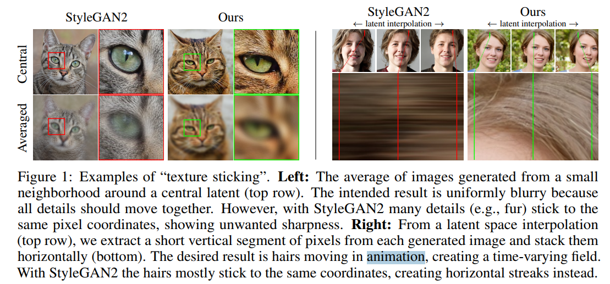

# [stylegan3](https://proceedings.neurips.cc/paper/2021/file/076ccd93ad68be51f23707988e934906-Paper.pdf)

**Author**: Tero Karras

**Institution**: NVIDIA

# Terms
Aliasing（混叠） 是一个信号处理领域的基本问题，指的是当信号在采样过程中采样率不足时，高频信号的特性会被错误地映射到低频部分，从而导致失真或不正确的结果。这种现象同样适用于图像处理和深度学习中的生成网络。

在信号处理中的解释
定义：

在离散化连续信号时，如果采样率低于信号的奈奎斯特频率（Nyquist frequency，即信号最高频率的两倍），就会发生混叠。
混叠会导致高频信号被“折叠”到低频域，产生错误的频率信息。
示例：

在音频信号中，采样不足会导致原本的高音变成不相关的低音。
在图像处理中，缩小图像而没有正确低通滤波时会导致边缘或纹理出现波纹或锯齿状伪影。
## Aliasing


# 摘要

**问题描述：**
当前典型的 GAN 尽管具有层次化的卷积结构，但生成过程却依赖于绝对像素坐标，导致图像细节“粘在”像素网格上，而不是自然地附着在物体表面。

**问题根源：**
这种现象的根本原因是生成器网络中的不当信号处理，特别是混叠问题（aliasing）。

**解决方法：**
通过将网络中的所有信号视为连续信号，作者提出了一些普适的、较小的架构调整，以确保不必要的信息不会泄漏到层次化的生成过程中。

**改进效果：**
新架构在图像质量指标（如 FID）上与 StyleGAN2 相当，但其内部表示发生了显著变化。
新模型在亚像素级别实现了对平移和旋转的等变性。

**应用前景：**
这些改进为生成模型在视频和动画等动态任务中的应用奠定了基础，使生成效果更加自然和连贯。

# Introduction



# 根据连续信号解释的等变形

* 采样定理
```According to the Nyquist–Shannon sampling theorem [51 ], a regularly sampled signal can represent
any continuous signal containing frequencies between zero and half of the sampling rate
```
翻译为插值频率是连续信号的两倍时，可以完全重建原始信号
