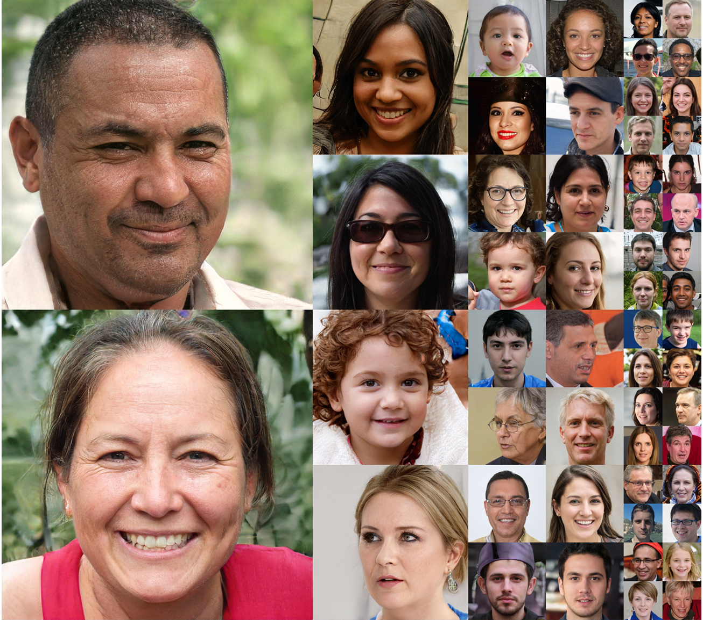
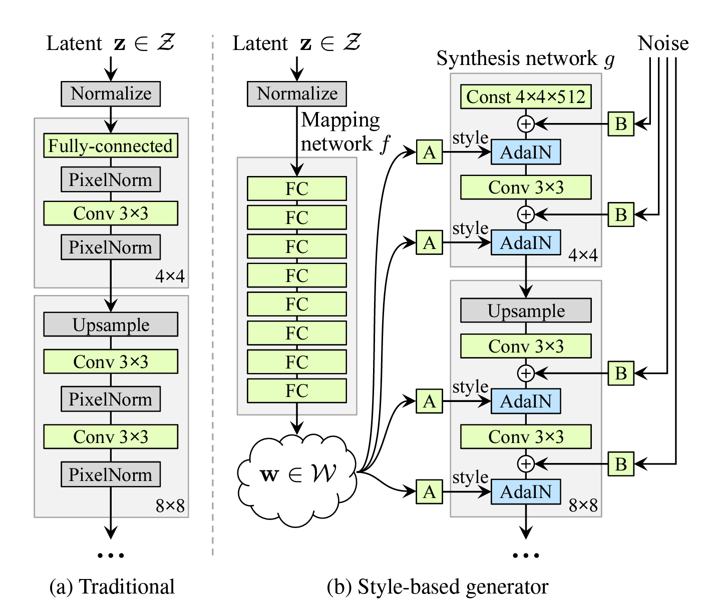
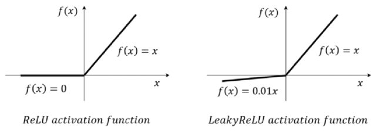
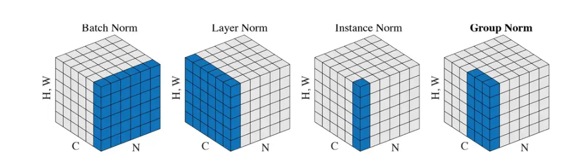

# StyleGAN: A Style-Based Generator Architecture for Generative Adversarial Networks
[Paper Link](https://arxiv.org/abs/1812.04948)


## 核心创新

1. **基于风格的生成器架构**

   - 将传统的输入层替换为常量输入
   - 通过AdaIN层将潜在编码注入到不同的层级
   - 实现了对不同尺度特征的精确控制

2. **中间潜在空间W**
   - 引入映射网络F将潜在空间Z映射到中间潜在空间W
   - W空间具有更好的解耦特性
   - 支持更好的特征混合和编辑操作

3. **自适应实例归一化(AdaIN)**
   - 通过风格向量调制每个通道的均值和方差
   - 实现了对特定特征的精确控制
   ```python
   x = x * (style_split[:, 0] + 1) + style_split[:, 1]
   ```
   - 每个channel的feature map显式调节方差和均值，这两个统计量表示图片的风格

## 技术细节

1. **LOD (Level of Detail) 计算**:
   - **目的**: 控制训练期间的分辨率级别，支持渐进式增长。
   - **计算**:
     - `lod` 基于已见图像数量 (`seen_img`) 和每个级别的持续时间 (`lod_duration`) 计算。
     - 随训练进展而减少，平滑过渡于不同分辨率。
   - **阶段**:
     - 稳定阶段：`lod` 保持不变。
     - 过渡阶段：`lod` 取分数值，平滑分辨率变化。

2. **合成网络 (Synthesis Network)**:
   - **结构**: 由多个分辨率层组成，每层包含两个卷积块。
   - **分辨率层**:
     - **初始层**: 将常量输入转换为特征图。
     - **后续层**: 每层分辨率加倍，通道减半，保持参数一致。
   - **卷积块 (ConvBlock)**:
     - **上采样**: 使用最近邻插值增加分辨率。
     - **卷积**: 受 PGGAN 启发的缩放权重，稳定训练。
     - **噪声添加**: 空间或通道噪声，增强细节多样性。
     - **激活**: LeakyReLU 防止神经元死亡，改善梯度流动。
     - **归一化**: 实例归一化标准化特征图。
     - **风格化**: 使用学习的风格向量调制特征图，调整每个特征图的均值和方差。

3. **风格调制 (Style Modulation)**:
   - **过程**: 每个特征图通道使用风格向量调制。
   - **方程**:
    $$
     x = x \times (\text{style\_split}[:, 0] + 1) + \text{style\_split}[:, 1]
    $$
   - **目的**: 显式调整特征图方差和均值，表示图片风格。

4. **截断技巧 (Truncation Trick)**:
   - **目的**: 控制生成图像的多样性与稳定性。
   - **过程**: 使用中心平均值 (`w_{avg}`) 和缩放因子 (`trunc_psi`) 调整风格向量。它更相当于一个缩放操作，而不是传统意义上的截断操作。

5. **噪声注入 (Noise Injection)**:
   - **类型**: 空间或通道。
   - **目的**: 为特征图添加随机变化，增强细节多样性。

## 代码解读
### 1. Generator
```

    def forward(self,
                z,
                label=None,
                lod=None,
                w_moving_decay=0.995,
                style_mixing_prob=0.9,
                trunc_psi=None,
                trunc_layers=None,
                randomize_noise=False,
                **_unused_kwargs):
        mapping_results = self.mapping(z, label) # label 是用于条件生成的标签
        w = mapping_results['w'] #  W空间
        # w shape : [batch_size, w_space_dim] = [B,512]

        if self.training and w_moving_decay < 1:
            batch_w_avg = all_gather(w).mean(dim=0)
            self.truncation.w_avg.copy_(
                self.truncation.w_avg * w_moving_decay +
                batch_w_avg * (1 - w_moving_decay))
            # 计算一个W空间中的中心点,用于截断操作
        if self.training and style_mixing_prob > 0:
            new_z = torch.randn_like(z)
            new_w = self.mapping(new_z, label)['w']
            lod = self.synthesis.lod.cpu().tolist() if lod is None else lod
            # 这里的 tolist() 可能造成混淆，但对于0维tensor（标量tensor），它返回的是一个标量值。例如：
            # 所以在这里，lod 就是一个数值，比如 0、1、2 或者 1.5 这样的值，用于控制生成图像的分辨率级别。这个值：

            # 可以是整数：直接对应某个分辨率级别
            # 也可以是小数：表示在两个分辨率级别之间进行插值

            current_layers = self.num_layers - int(lod) * 2
            if np.random.uniform() < style_mixing_prob:
                mixing_cutoff = np.random.randint(1, current_layers)
                # 前面的current_layers 表示当前的分辨率级别
                # 后面的 mixing_cutoff 表示截断点
                # 这里的 np.random.randint(1, current_layers) 表示随机选择一个截断点

                w = self.truncation(w)
                new_w = self.truncation(new_w)
                w[:, mixing_cutoff:] = new_w[:, mixing_cutoff:]
                # 前半部分的 W 空间不变，后半部分的 W 空间进行了替换

        wp = self.truncation(w, trunc_psi, trunc_layers)
        # wp 也进行了截断。
        # 形状变化  ：
        # 输入 w: [batch_size, w_space_dim] = [B, 512]
        # 输出 wp: [batch_size, num_layers, w_space_dim] = [B, num_layers, 512]
        synthesis_results = self.synthesis(wp, lod, randomize_noise)

        return {**mapping_results, **synthesis_results}
```
generator 分成几个步骤
#### 1. 映射网络 (Mapping Network)
```
mapping_results = self.mapping(z, label) # label 是用于条件生成的标签
w = mapping_results['w']
```
**输入** :
  - $z$: 潜在向量，通常是从标准正态分布中采样，形状为 $[B, z\_dim]$
  - $\text{label}$: 条件生成的标签，可选，用于控制生成内容。
- **过程** :
  - 使用一个多层感知机 (MLP) 将潜在向量 $z$ 映射到样式空间 $w$：
    $$w = f(z) $$
    其中 $f$ 是映射网络，输出 $w$ 的形状为 $[B, w\_dim]$，  通常 $w\_dim = 512$。
- **输出** :
  - $w$: 样式向量，作为后续生成过程中的特征控制参数。

#### 2. W 空间均值的移动平均更新

```python
if self.training and w_moving_decay < 1:
    batch_w_avg = all_gather(w).mean(dim=0)
    self.truncation.w_avg.copy_(
        self.truncation.w_avg * w_moving_decay +
        batch_w_avg * (1 - w_moving_decay))
```

- **目的** :
  - 在训练阶段，计算 $w$ 的均值并进行移动平均更新，得到样式空间的中心点 $w_{avg}$。

  - $w_{avg}$ 用于后续的截断操作（truncation trick），以控制生成内容的多样性和平衡性。

- **过程** :
  - 计算当前批次的样式向量平均值 $\text{batch\_w\_avg}$。

  - 使用指数移动平均 (EMA) 更新全局样式均值 $w\_avg$:
    $$
    w_{avg} \gets w_{avg} \cdot \text{decay} + \text{batch-w-avg} \cdot (1 - \text{decay})
    $$


#### 3. 样式混合 (Style Mixing)
```python
if self.training and style_mixing_prob > 0:
    new_z = torch.randn_like(z)
    new_w = self.mapping(new_z, label)['w']
    lod = self.synthesis.lod.cpu().tolist() if lod is None else lod
    current_layers = self.num_layers - int(lod) * 2
    if np.random.uniform() < style_mixing_prob:
        mixing_cutoff = np.random.randint(1, current_layers)
        # 前面的current_layers 表示当前的分辨率级别
        # 后面的 mixing_cutoff 表示截断点
        # 这里的 np.random.randint(1, current_layers) 表示随机选择一个截断点

        w = self.truncation(w)
        new_w = self.truncation(new_w)
        w[:, mixing_cutoff:] = new_w[:, mixing_cutoff:]
        # 前半部分的 W 空间不变，后半部分的 W 空间进行了替换

        # 问题：同一个batch里的mixing_point是一样的。如果对同一个batch里的不同样本做不一样的样式混合，会不会有问题？

#### 4. 截断操作 (Truncation Trick)
```python
wp = self.truncation(w, trunc_psi, trunc_layers)
```
在self.truncation里面 会先对$w$进行复制，复制后的shape 为 $[B, \text{num\_layers}, w\_dim]$，
每一层的样式向量都是相同的。
然后再进行截断操作.

```
#self traucation
if w.ndim == 2:
    if self.repeat_w and w.shape[1] == self.w_space_dim:
        w = w.view(-1, 1, self.w_space_dim)
        wp = w.repeat(1, self.num_layers, 1)
    else:
        assert w.shape[1] == self.w_space_dim * self.num_layers
        wp = w.view(-1, self.num_layers, self.w_space_dim)
```
- **目的** :
  - 控制生成内容的多样性与稳定性。

- **过程** :
  - 使用样式空间的中心点 $w\_avg$ 和截断因子 $\psi$ 对样式向量 $w$ 进行缩放：
    $$
    w'_i = w_{avg} + \psi \cdot (w_i - w_{avg}), \quad \text{for layers } i < \text{trunclayers}
    $$
  - 截断操作可以减小样式空间中样式向量的偏离程度，从而生成更稳定的图像。
- **输出** :
  - $wp$: 每一层的样式向量，形状为 $[B, \text{num\_layers}, w\_dim]$。
- **问题** : 严格来说，这个操作确实更接近于 **缩放 (scaling)**  而不是传统意义上的 **截断 (truncation)** ，尽管在 StyleGAN 的术语中被称为 "truncation trick"。

    **为什么是缩放？**
    截断操作的公式为：
    $$
    wp = w_{avg} + (wp - w_{avg}) \cdot \text{trunc-psi}
    $$
    观察公式可以看出：
    1. 样式向量 $wp$ 被重新调整到一个以 $w_{avg}$ 为中心的范围内。

    2. $\text{trunc-psi}$ 是一个缩放因子，决定了 $wp$ 偏离 $w_{avg}$ 的程度。

    **物理意义** ：
    - 如果 $\text{trunc-psi} < 1$，样式向量的偏离被缩小，生成的图像更接近于全局样式的“平均值”。

    - 如果 $\text{trunc-psi} > 1$，样式向量的偏离被放大，生成的图像会更极端，更偏离平均风格。

    **传统截断 (Clipping)** 在传统的“截断”概念中，我们会将某些超出指定范围的值 **直接限制**  在这个范围内，例如：$
    x = \max(\min(x, \text{upper\_bound}), \text{lower\_bound})
    $

    leGAN 的这个实现中：

    - 过缩放操作调整样式向量的幅度。

    - 这种方式不会完全去除多样性，而是控制多样性的幅度。
    因此，StyleGAN 的“截断技巧”实际上是一种动态的 **样式向量缩放操作** 。

    **为什么称为截断？**
    尽管操作本质是缩放，但被称为截断可能有以下原因：

    1. **结果上的类似性** ：
    - 缩放操作和传统截断在减少生成样式的多样性上有相似效果。

    - 当 $\text{trunc\_psi}$ 接近 0 时，样式向量趋近 $w\_avg$，此时的行为类似于将所有样式向量“截断”到一个狭窄的范围。

    2. **术语沿袭** ：
    - 在 GAN 社区，"truncation trick" 是一个广泛使用的术语，尽管具体实现可能会有所不同。

**总结**
1. **StyleGAN 的操作是缩放** ：
  - 它根据 $w\_avg$ 动态调整样式向量 $wp$ 的幅度，而不是简单地对其值进行裁剪(缩放)。

2. **称为截断的原因** ：
  - 结果上类似传统截断，能有效减少生成样式的多样性。

  - 术语延续了 GAN 社区的习惯用法。

3. **本质** ：
  - 它是 **样式向量的幅度缩放** ，调控生成图像的多样性与稳定性之间的权衡。


#### 5. 图像生成
```python
synthesis_results = self.synthesis(wp, lod, randomize_noise)
```
- **输入** :
  - $wp$: 分层样式向量。
  - $\text{lod}$: 分辨率级别（Level of Detail），用于控制生成图像的细节层次。
  - $\text{randomize\_noise}$: 是否在生成过程中随机化噪声。
- **过程** :
  - 使用样式向量 $wp$ 和噪声控制图像的生成过程。

  - $\text{lod}$ 可以调整生成图像的分辨率，支持逐步增加细节（渐进式生成）。
- *输出* :
    - 生成的图像及其相关特征。

### 2. synthesis network
synthesis network 定义在class SynthesisModule 里面，是一个生成器的主要部分，负责生成图像的过程。
它的参数意义
```
resolution (默认1024): 生成图像的最终输出分辨率。例如设置为1024时，最终生成1024x1024像素的图像。
init_resolution (默认4): 生成器的初始特征图分辨率。StyleGAN从这个低分辨率(通常是4或8)开始，然后通过一系列上采样层逐步增加分辨率直到达到目标分辨率。
w_space_dim (默认512): W潜在空间的维度。这是StyleGAN的一个关键特征，它是将输入的Z空间通过映射网络转换后的中间潜在空间，用于更好地控制不同尺度的图像特征。
image_channels (默认3): 输出图像的颜色通道数，对于RGB彩色图像是3。
final_tanh (默认False): 是否在网络最后一层使用tanh激活函数。使用tanh可以将输出严格限制在[-1, 1]范围内。
const_input (默认True): 是否使用常量输入。StyleGAN的一个创新是使用学习的常量作为生成器的起点，而不是随机噪声。
fused_scale (默认'auto'): 控制是否使用融合的上采样卷积操作。融合操作可以提高计算效率。
use_wscale (默认True): 是否使用权重缩放。这是一种训练技巧，通过对权重进行适当的缩放来帮助训练稳定性。
noise_type (默认'spatial'): 控制添加到每一层的随机噪声的类型。空间噪声可以帮助生成更多的细节变化。
fmaps_base (默认16<<10): 基础特征图数量，用于控制网络各层的通道数。默认值是16384。
fmaps_max (默认512): 限制网络中任何层的最大特征图数量，防止网络变得过大。
```
forward 步骤
```
    def forward(self, wp, lod=None, randomize_noise=False):
        # wp 代表经过映射网络处理后的风格向量（style vector）。
        # Z 空间（初始潜在空间）
        # 这是输入的随机噪声向量
        # 通常是从标准正态分布采样得到
        # W 空间（中间潜在空间）
        # 通过映射网络(Mapping Network)将 Z 空间向量转换得到
        # 相比 Z 空间，W 空间具有更好的解耦特性
        # W+ 空间（扩展的 W 空间）
        # 这就是代码中的 wp（w plus）
        # 它是将 W 空间的向量扩展到每一层都有一个独立的风格向量
        # 如果网络有 n 层，那么 wp 的形状就是 [batch_size, n, w_dim]
        lod = self.lod.cpu().tolist() if lod is None else lod
        # lod 的计算过程：
        # 基于已训练的图像数量（total_img）计算
        # 每个分辨率级别的持续时间 = 训练图像数 + 过渡图像数
        # 当前的 lod 值决定了生成图像的分辨率
        # 例如，对于512x512的最终分辨率：
        # 分辨率序列：8 → 16 → 32 → 64 → 128 → 256 → 512
        # LOD序列：6 → 5 → 4 → 3 → 2 → 1 → 0
        if lod + self.init_res_log2 > self.final_res_log2: # lod 异常
            raise ValueError(f'Maximum level-of-detail (lod) is '
                             f'{self.final_res_log2 - self.init_res_log2}, '
                             f'but `{lod}` is received!')

        results = {'wp': wp}
        for res_log2 in range(self.init_res_log2, self.final_res_log2 + 1):
            current_lod = self.final_res_log2 - res_log2
            if lod < current_lod + 1:
                block_idx = res_log2 - self.init_res_log2
                if block_idx == 0: # 最低分辨率
                    if self.const_input:
                        x, style = self.layer0(None, wp[:, 0], randomize_noise)
                    else:
                        x = wp[:, 0].view(-1, self.w_space_dim, 1, 1)
                        x, style = self.layer0(x, wp[:, 0], randomize_noise)
                else:
                    x, style = self.__getattr__(f'layer{2 * block_idx}')(
                        x, wp[:, 2 * block_idx], randomize_noise)
                    results[f'style{2 * block_idx:02d}'] = style
                    x, style = self.__getattr__(f'layer{2 * block_idx + 1}')(
                        x, wp[:, 2 * block_idx + 1], randomize_noise)
                    results[f'style{2 * block_idx + 1:02d}'] = style
            if current_lod - 1 < lod <= current_lod:
                image = self.__getattr__(f'output{block_idx}')(x, None)
            elif current_lod < lod < current_lod + 1:
                alpha = np.ceil(lod) - lod
                image = (self.__getattr__(f'output{block_idx}')(x, None) * alpha
                         + self.upsample(image) * (1 - alpha))
            elif lod >= current_lod + 1:
                image = self.upsample(image)
        results['image'] = self.final_activate(image)
        return results
```
lod 表示 level of details.表示分辨率。
```
        # Compute level-of-details.
        phase, subphase = divmod(runner.seen_img, self.lod_duration)
        lod = self.init_lod - phase
        if self.lod_transition_img:
            transition_img = max(subphase - self.lod_training_img, 0)
            lod = lod - transition_img / self.lod_transition_img
        lod = max(lod, 0.0)
        resolution = self.init_res * (2 ** int(np.ceil(self.init_lod - lod)))
        return lod, resolution
```
lod 详细计算过程。假设
其中，init_res 是初始分辨率（通常是4或8）。
举例说明：
>
    假设 init_lod = 8（从8x8到2048x2048）
    lod_duration = 600,000（每个分辨率级别60万张图像）,
    lod_training_img = 300,000（稳定阶段30万张图像）这个阶段lod一直保持为8,分辨率为8x8,
    lod_transition_img = 300,000（过渡阶段30万张图像）,
    到了这个阶段之后, lod 从 8.0 逐渐降低到 7.0，分辨率一直是16x16。,
    直观上看 每个分辨率训练分成两个阶段，第一阶段训练当前分辨率的稳定阶段，第二阶段训练下一个分辨率的过渡阶段，lod线性递减到下一个分辨率对应的lod。

synthesis 网络的每一个分辨率层都有两个卷积层。初始分辨率的第一个卷积层有所区别。

#### 第一个分辨率层
##### layer0
layer0 的网络定义为
```
self.layer0 =ConvBlock(
    in_channels=self.get_nf(res),
    out_channels=self.get_nf(res),
    resolution=self.init_res,
    w_space_dim=self.w_space_dim,
    position='const_init', # 标记为const_init
    use_wscale=self.use_wscale,
    noise_type=self.noise_type)
```
输入为
```
x, style = self.layer0(None, wp[:, 0], randomize_noise)
```
第一个分辨率只有一个convblock，将原始的输入4x4x512 转化为 4x4x512
#### 第k个分辨率层
次后的每个分辨率层包含两个convblock
第一个convblock 增加了上采样的操作。其余的一样。
最后一个分辨率只有一个convblock，将512x512x32 转化为 1024x1024x16
分辨率增加一倍，output channel 减半，保持卷积整体的参数量每一层一致。
```
self.layer{2k-1} =  ConvBlock(
    in_channels=self.get_nf(res // 2),
    out_channels=self.get_nf(res),
    resolution=res,
    w_space_dim=self.w_space_dim,
    upsample=True,
    fused_scale=fused_scale,
    use_wscale=self.use_wscale,
    noise_type=self.noise_type
)

self.layer{2k} =ConvBlock(
    in_channels=self.w_space_dim,
    out_channels=self.get_nf(res),
    resolution=self.init_res,
    w_space_dim=self.w_space_dim,
    kernel_size=self.init_res,
    padding=self.init_res - 1,
    use_wscale=self.use_wscale,
    noise_type=self.noise_type
)

```
输入
```
x, style = f"self.layer{2k-11}"(x, wp[:, 2 * block_idx - 1], randomize_noise)
x, style = f"self.layer{2k}"(x, wp[:, 2 * block_idx],randomize_noise)
```
每个convblock 的输入都包含上一层的输入,本层的风格向量，以及是否需要添加噪声。

每一个分辨率的第一个卷积层和第二个卷积层区别在于第二个会加入上采样。
### 3. ConvBlock
```
    def forward(self, x, w, randomize_noise=False):
        if self.position != 'const_init':
            x = self.upsample(x)
            weight = self.weight * self.wscale
            x = F.conv2d(x,
                             weight=weight,
                             bias=None,
                             stride=self.stride,
                             padding=self.padding)
            x = self.blur(x)
        else:
            x = self.const.repeat(w.shape[0], 1, 1, 1)  # 初始输入

        bias = self.bias * self.bscale if self.bias is not None else None

        if self.position == 'last':
            if bias is not None:
                x = x + bias.view(1, -1, 1, 1)
            return x

        x = self.apply_noise(x, randomize_noise)
        if bias is not None:
            x = x + bias.view(1, -1, 1, 1)
        x = self.activate(x)
        x = self.normalize(x)
        x, style = self.style(x, w)
        return x, style
```
具体步骤
1. 上采样和卷积。只在每一个分辨率的第一层进行上采样。使用的上采样是
    ```
    return F.interpolate(x, scale_factor=self.scale_factor, mode='nearest')
    ```
    卷积的过程中会利用可学习的一个$w_{scale}$对卷积的权重进行缩放。这个想法来自于
    [progressive growing of gan](book/chapter%203%20GAN/2.2%20pggan/paper.md)中。

    其中，如果是init 输入 只会将可以学习的init在batch 维度进行复制
2. 增加bias
可学习的一个bias。这个应该不重要。
3. 增加噪声
```
if randomize_noise:
    if self.noise_type == 'spatial':
        noise = torch.randn(x.shape[0], 1, self.res, self.res).to(x)
    elif self.noise_type == 'channel':
        noise = torch.randn(x.shape[0], self.channels, 1, 1).to(x)
else:
    noise = self.noise
if self.noise_type == 'spatial':
    x = x + noise * self.weight.view(1, self.channels, 1, 1)
elif self.noise_type == 'channel':
    x = x + noise * self.weight.view(1, 1, self.res, self.res)
```
噪音的增加有两种法案。一个是增加在空间上，一个是增加在channel 上。
4. 非线性激活函数
```
self.activate = nn.LeakyReLU(negative_slope=0.2, inplace=True)
```

LeakyReLU 的好处主要体现在以下几个方面：
* 防止神经元死亡：负值区域的斜率使得神经元不会完全失活。
* 改善梯度流动：减少梯度消失问题，支持更深层网络的训练。
* 适应数据分布：捕捉负值区域的信息，更好地处理具有负值特征的数据。
* 训练稳定性：提升训练过程的稳定性和收敛性。
* 通用性：在图像生成任务和深度学习网络中表现优异，成为许多模型的默认选择。

5. instance normalization

标准instance normalization。 使得每个样本的每个通道的featuremap的均值为0， 方差为1.
6. 风格化
```
def forward(self, x, w):
    style = self.forward_style(w)
    style_split = style.view(-1, 2, self.out_channels, 1, 1)
    x = x * (style_split[:, 0] + 1) + style_split[:, 1]
    return x, style
```
对featuremap的每一层利用学习到的风格向量进行风格调制。具体来说style_split 每个channel 包含一个学习到的标准差和均值
```
x = x * (style_split[:, 0] + 1) + style_split[:, 1]
```
意味最每一个channel 的feature map显式得调节方差和标准差。一般得，featuremap的方差和均值表示图片的风格。


```
