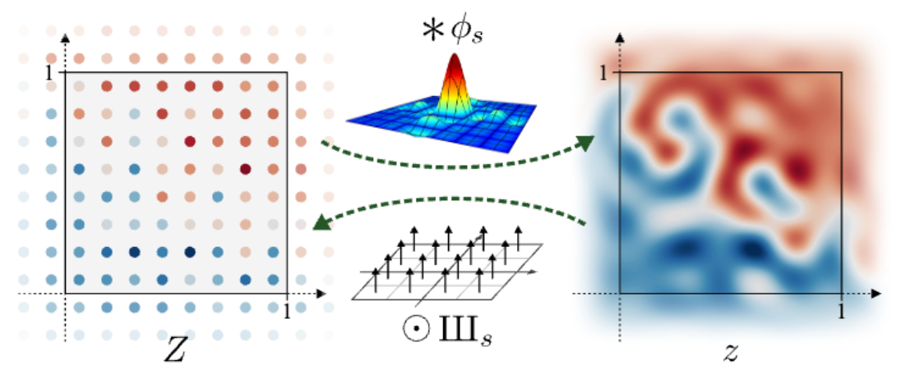
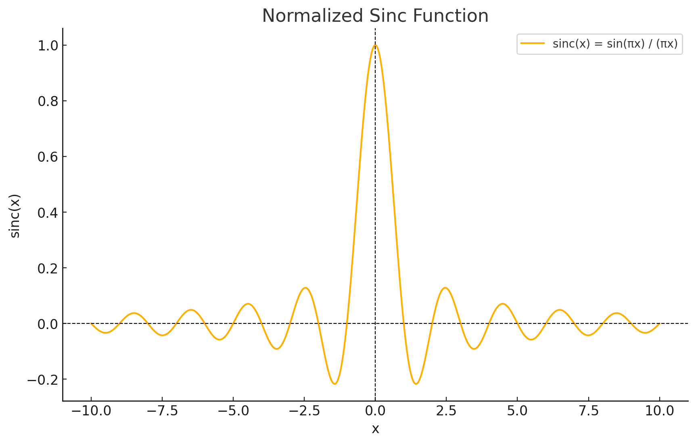
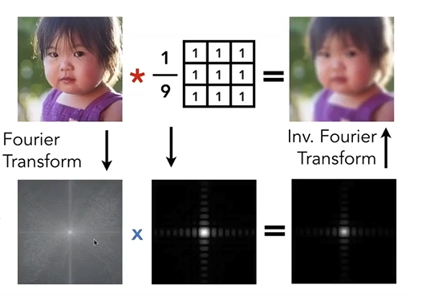
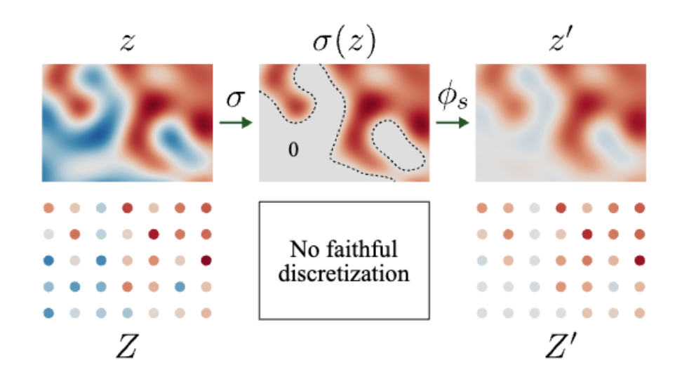

# [stylegan3](https://proceedings.neurips.cc/paper/2021/file/076ccd93ad68be51f23707988e934906-Paper.pdf)
**Author**: Tero Karras
**Institution**: NVIDIA
# Terms

Aliasing（混叠） 是一个信号处理领域的基本问题，指的是当信号在采样过程中采样率不足时，高频信号的特性会被错误地映射到低频部分，从而导致失真或不正确的结果。这种现象同样适用于图像处理和深度学习中的生成网络。

在信号处理中的解释
定义：

在离散化连续信号时，如果采样率低于信号的奈奎斯特频率（Nyquist frequency，即信号最高频率的两倍），就会发生混叠。
混叠会导致高频信号被“折叠”到低频域，产生错误的频率信息。
示例：

在音频信号中，采样不足会导致原本的高音变成不相关的低音。
在图像处理中，缩小图像而没有正确低通滤波时会导致边缘或纹理出现波纹或锯齿状伪影。
## Aliasing


# 摘要

**问题描述：**
当前典型的 GAN 尽管具有层次化的卷积结构，但生成过程却依赖于绝对像素坐标，导致图像细节“粘在”像素网格上，而不是自然地附着在物体表面。

**问题根源：**
这种现象的根本原因是生成器网络中的不当信号处理，特别是混叠问题（aliasing）。

**解决方法：**
通过将网络中的所有信号视为连续信号，作者提出了一些普适的、较小的架构调整，以确保不必要的信息不会泄漏到层次化的生成过程中。

**改进效果：**
新架构在图像质量指标（如 FID）上与 StyleGAN2 相当，但其内部表示发生了显著变化。
新模型在亚像素级别实现了对平移和旋转的等变性。

**应用前景：**
这些改进为生成模型在视频和动画等动态任务中的应用奠定了基础，使生成效果更加自然和连贯。


# Introduction
引言部分明确了现有 GAN 中混叠问题的危害，分析了其原因，并提出了通过改进信号处理和生成器架构来解决这一问题的研究目标和贡献

1. 问题背景
近年来，GAN 的图像生成质量有了显著提升（如 StyleGAN2 等），广泛应用于图像编辑、域迁移和视频生成等领域。
尽管生成器具有层次化的卷积结构，但生成过程对绝对像素坐标的依赖会导致 “纹理粘连”（texture sticking） 问题，即细节固定在像素坐标上而非自然附着在物体表面。
2. 问题分析
纹理粘连现象：
生成细节（如纹理、毛发）在对象移动时未能正确随物体表面移动，破坏了视觉一致性，特别是在视频和动画生成中。
问题根源：
混叠是导致这一现象的核心原因。混叠源于不当的信号处理，如：
   - 不理想的上采样滤波器（如双线性插值）。
   - 激活函数（如 ReLU）带来的高频分量。
   - 网络边界填充（padding）等操作导致绝对像素坐标泄露。
   - 混叠的放大机制：
网络会主动利用这些混叠信息，通过多个尺度的结合放大它们，从而建立依赖绝对屏幕坐标的纹理模式。
3. 论文目标
设计一个生成器架构，能够：
完全消除混叠问题，确保生成过程不依赖绝对像素坐标。
实现 平移和旋转等变性（translation and rotation equivariance），使生成的图像细节能够自然随物体变化。
保持与现有 GAN（如 StyleGAN2）相当的图像质量。
4. 主要贡献
提出一种基于 连续信号解释（continuous signal interpretation） 的方法，重新设计 StyleGAN2 的生成器架构。
发现当前上采样滤波器在抑制混叠方面不够有效，需要更高质量的滤波器（如超过 100dB 的衰减能力）。
提出了一些普适的小型架构改动，既能有效抑制混叠，又能保证生成器的等变性。
新的生成器在图像质量指标（如 FID）上与 StyleGAN2 持平，但解决了纹理粘连问题，更适合用于视频和动画生成。

* **Texture sticking** 问题举例说明
左侧（Central 和 Averaged）：
StyleGAN2：
现象：即使生成了一个图像的多个版本（通过对潜在空间的细微扰动），图像的细节（如猫的毛发或纹理）依然固定在绝对的像素坐标上。
结果：当对不同版本进行平均时，细节会呈现出非自然的锐化（sharpness），因为纹理没有随物体移动。
Ours（改进后的模型）：
现象：图像的细节不再固定于像素坐标，而是自然地跟随物体表面的变化。
结果：平均后的图像更平滑，符合预期。
右侧（Latent Interpolation）：
StyleGAN2：
现象：在潜在空间中进行插值生成时，(当生成内容进行水平的traslation时) 头发等细节没有跟随人脸的位置变化，而是像“粘在”固定的像素上，导致生成的动画中头发呈现水平条纹（streaks）。
Ours（改进后的模型）：
现象：头发的细节会随人物的位置自然移动，生成更连贯的动态效果。
结果：解决了纹理粘连问题，头发看起来更像真实物体的一部分。
视屏中更加明显。


<iframe width="560" height="315"
        src="https://nvlabs-fi-cdn.nvidia.com/_web/stylegan3/videos/video_9_slice_visualization.mp4"
        frameborder="0"
        allow="accelerometer; autoplay; clipboard-write; encrypted-media; gyroscope; picture-in-picture"
        allowfullscreen>
</iframe>

# 通过连续信号的解释实现生成器的集合等变性(平移和旋转)
将网络中的特征图视为连续信号，而不是离散像素，从而严格遵循信号处理理论（如 Nyquist 定理）


# 根据连续信号解释的等变形

* 采样定理
```According to the Nyquist–Shannon sampling theorem [51 ], a regularly sampled signal can represent
any continuous signal containing frequencies between zero and half of the sampling rate
```
翻译为:插值频率是连续信号的两倍时，可以完全重建原始信号
需要注意的是 这里假设原始信号是一个带限信号，也就信号的频率被限制在一个空间内。

## 连续型号和离散型号的关系
假设连续信号为$z(x)$,离散信号为$Z(x)$, 采样频率为$s$, 采样间隔则为$T=\frac{1}{s}$.$\cdot$表示乘积, 卷积表示$\ast$.
二维狄拉克梳妆函数为$III(x,y)=\sum_{m=-\infty}^{\infty}\sum_{n=-\infty}^{\infty}\delta(x-mT)\delta(y-nT)$
根据插值公式
$$
Z(x,y)=z(x,y)\cdot\left(\text{III}(x,y)\right)\newline
= z(x,y)\cdot\left(\sum_{m=-\infty}^{\infty}\sum_{n=-\infty}^{\infty}\delta(x-mT)\delta(y-nT)\right)\newline
= \sum_{m=-\infty}^{\infty}\sum_{n=-\infty}^{\infty}z(mT,nT)\delta(x-mT)\delta(y-nT)\newline
$$

论文中对采样点向右进行了$\frac{T}{2}$的偏移，这样的话
$$Z(x,y) = \left(\sum_{m=-\infty}^{\infty}\sum_{n=-\infty}^{\infty}
z\left((m+\frac{1}{2})T,(n+\frac{1}{2})T\right)\delta(x-(m+\frac{1}{2})T)\delta(y-(n+\frac{1}{2})T)\right)\newline
$$
从离散信号恢复为连续信号， 根据插值公式
$$
z(x,y) = \left(\sum_{m=-\infty}^{\infty}\sum_{n=-\infty}^{\infty}Z(mT,nT)\text{sinc}(\frac{x - mT}{T})\text{sinc}(\frac{y - nT}{T})\right)\newline
 = \left(\sum_{m=-\infty}^{\infty}\sum_{n=-\infty}^{\infty}Z(mT,nT)\alpha(x - mT,y - nT)\right)\newline
 = (Z\ast \alpha)(x,y)
$$
suppose$\alpha(x，y) = \text{sinc}(\frac{x}{T})\text{sinc}(\frac{y}{T})$

假设限定空间画布为[0,1]x[0,1]， 以$s=\frac{1}{T}$频率进行采样时，偏移$\frac{1}{2}T$采样会生成总共$s^2$个采样点.
根据插值公式，如果要完全恢复原始信号，则需要[0,1]x[0,1] 之外的信号。
为什么呢？

上面是sinc 函数的图形。对于x,y 这个位置, 恢复这一点的信息需要附近区域的采样值，且距离x,y 越远，对于恢复信息的贡献越小。
这就是为什么需要扩充采样空间的原因。在实际情况下，对于给定区域不需要扩充太大，因为sinc 呈现了一个随距离衰减的趋势。论文在实现的时候会先对特征图做一个扩充，也就是这个原理。

**连续和离散的网络操作表达**
$$
f(z) = \phi_{s'} \ast \text{F}(\Pi_s \odot z),\quad\quad
\text{F}(Z) = \Pi_{s'} \odot f(\phi_s \ast Z),
$$
其中$\odot$表示点乘，$s$and$s'$表示输入的采样频率和输出的采样频率
有些操作会改变采样频率 比如上采样 下采样
## Equivariant network layers

translation equivariance transformation
$$f\cdot t = t\cdot f$$
假设输出的采样频率为$s'$， 那么根据采样定理，需要满足$f$作用之后的信号频率不操作$s'/2$，也就$f$不产生超过$s'/2$的高频信号。

###  convolution layer
### Convolution

Consider a standard convolution with a discrete kernel$K$. We can interpret$K$as living in the same grid as the input feature map, with sampling rate$s$. The discrete-domain operation is simply:

$$
\text{F}_{\text{conv}}(Z) = K \ast Z,
$$

and we obtain the corresponding continuous operation:

$$
\text{f}_{\text{conv}}(z) = \varphi_s \ast \left( K \ast \left( \Pi_s \odot z \right) \right) = K \ast \left( \varphi_s \ast \left( \Pi_s \odot z \right) \right) = K \ast z
$$
这一步用到了卷积是可以交换的。

同时 根据卷积的频域等于频域的乘积
$$
\text{F}_{\text{conv}}(K\ast Z)(e^{jw}) =\text{F}_{\text{conv}}(Z)(e^{jw}) \ast\text{F}_{\text{conv}}(K)(e^{jw})
$$
也就是对应频率的系数等于原始信号的频率乘以卷积的频率系数。
因此带宽只会变小，不会变大。
这就使得卷积操作天然满足采样定理的要求。

卷积对应的频域示意图

###  upsample and downsample

**上采样**
上采样增加了信号的采样率。这里假设是理想上采样，也就是“插0” + 理想低通滤波
理想上采样后的信号频率会被压缩$n$倍.$n$是上采样的倍数。
经过理想上采样后，输出$Y(e^{j\omega})$完全和原来的
$X(e^{j\omega})$在频域中“缩放”后的主瓣部分相对应，也就是说，它在新的采样率下处于带宽$\pi/n$的范围之内，且携带着原信号不失真的频谱信息。这就是“理想升采样”要达到的目的。

**下采样**

下采样频域公式离散形式
$$y[m] = x[m\,M], \quad
Y(e^{j\Omega}) = \frac{1}{M}\sum_{k=0}^{M-1} X\!\Bigl(e^{\,j\,\tfrac{\Omega + 2\pi k}{M}}\Bigr).$$

连续形式
$$
Y_{\mathrm{sample}}(\omega)
\;=\;
\frac{1}{M\,T}
\sum_{k=-\infty}^{\infty}
X\!\Bigl(\omega - 2\pi\,\tfrac{k}{M\,T}\Bigr).
$$

为了消除混叠现象，需要过滤掉高频信号(f/2以上的, f是原始信号频率)再进行下采样。

假设下采样倍数为$s' = s/n$,$s$为原始采样频率，那么
$$
\begin{aligned}
F_{down} (Z)& = \mathrm{III}_{s'} \odot \left[  \psi_{s'} \ast \left( \phi_{s} \ast Z \right) \right]\\
& = \frac{1}{s^2} \mathrm{III}_{s'} \odot \left[  \psi_{s'} \ast \psi_{s} \ast Z \right]\\
& = \frac{s'^2}{s^2} \mathrm{III}_{s'} \odot \left[  \phi_{s'} \ast Z \right]
\end{aligned}
$$

两个低通滤波的卷积任然是一个低通滤波.带宽为最小的带宽。
$\left( \phi_{s} \ast Z \right)$是原始采样信号经过低通滤波，去除离散采用导致的高频信号。
因为需要下采样,需要额外移除高频信号，所以会作用另外一个$\psi_{s'}$低通滤波。理想低通滤波器的系数只改变信号整体的强度，相当于归一下。先忽略掉系数的影响。
因为卷积具有交换律，可以先结合两个理想高通滤波器，从而得到最终的结果。
这个结果直观表示为 下采样之后的信号和原始信号按照最新的下采样频率进行采样时一致的，都满足采样定理，前提是原始信号需要满足带限性，并且带宽$f<\frac{1}{2}s'$。

下采样具有translation 不变性，即平移之后再下采样和下采样之后再平移得到的结果是一样的。
但是对于旋转并不保持不变性。如果要保持选择不变性，需要引入理想圆盘低筒滤波器， i.e., 2D Jinc filter
#### 2D "Jinc" Filter Frequency Spectrum

##### Spatial Domain Definition
In the spatial domain, the 2D "Jinc" filter is:
$$
h(x, y) = 2 \frac{J_1(2\pi r)}{r}, \quad r = \sqrt{x^2 + y^2}.
$$
At$r = 0$,$h(0, 0) = 1$.
---
### Fourier Transform
The frequency response is:
$$
H(\rho) = 2\pi \int_0^\infty h(r) r J_0(2\pi \rho r) \, dr,
$$

where:
-$\rho = \sqrt{u^2 + v^2}$,
-$J_0$is the zero-order Bessel function.
Substitute$h(r)$:
$$
H(\rho) = 4\pi \int_0^\infty J_1(2\pi r) J_0(2\pi \rho r) \, dr.
$$
Using Bessel orthogonality:
$$
H(\rho) =
\begin{cases}
1, & \rho \leq 1, \\
0, & \rho > 1.
\end{cases}
$$
根据傅里叶变换理论，可知空间的旋转对应着频域的旋转，频域的旋转对应空间的旋转。即旋转等变性。
如果一个操作在空间上满足旋转不变性，就需要在频域上满足旋转不变性。频域上更容易理解。因此我们只要考虑频域就行。频域满足旋转不变性首先就需要频域是径向对称的，这也是为什么需要一个径向对称理想滤波器(2D Jinc filter)的原因。当然进一步严格实现选择不变性需要下采样是作用在极坐标空间下。

**非线性激活函数**
pointwise操作天然满足 几何等变性。下面考虑带宽的条件。


举一个具体的例子，例如$x^2$,
- 原始信号
    设一个信号的傅里叶展开为：
   $$
    x(t) = \sum_{k} a_k e^{j 2\pi f_k t},
   $$
    其中：
    -$a_k$：信号的傅里叶系数。
    -$f_k$：信号的频率分量。
- 非线性操作后的频谱**
    假设对信号进行非线性操作$f(x(t))$，如平方操作$x^2(t)$，则结果为：
   $$
    f(x(t)) \sim \sum_{k,l} g(a_k, a_l) e^{j 2\pi (f_k + f_l)t},
   $$
    其中：
    -$g(a_k, a_l)$：非线性操作产生的系数。
    -$f_k + f_l$：新产生的频率分量。

**那要怎么实现非线性操作的带宽限制**

非线性操作后，结合理想低通滤波器$\psi_s$，连续表示为：
$$
f_\sigma(z) = \psi_s * \sigma(z),
$$
其中：
-$\psi_s$是理想低通滤波器。
-$\sigma(z)$是非线性操作后的信号。
-$*$表示卷积。

#### 离散形式
对应的离散版本表示为：
$$
F_\sigma(Z) = s^2 \cdot \Pi_s \odot (\phi_s * \sigma(\phi_s * Z)),
$$
其中：
-$s^2$是比例因子。
-$\Pi_s$表示降采样操作。
-$\odot$表示逐点乘积（Hadamard乘积）。
-$\phi_s$是插值滤波器。
-$\sigma(\phi_s * Z)$表示在上采样后应用非线性操作。

其中$\sigma(\phi_s * Z)$需要在连续空间中进行操作。为什么不能在离散空间中实现？

理想低通滤波器的无限支持：理想低通滤波器的频域是一个矩形函数，其时域响应是一个无限长的 sinc 函数。在离散域中，这种无限支持无法直接实现，只能通过截断近似，但这会引入其他误差（如振铃效应）。
非线性操作会引入高频分量，离散域中容易产生频谱混叠。


因此作者的想法是用上采样模拟连续空间，先上采样，再做非线性操作，再下采样。当然，要满足旋转不变性，则需要下采样应用 2D Jinc filter。

而且非线性操作也是网络中唯一生成额外高频信息的操作。可以控制她从而控制每一层需要的额外高频信息。高频信息即纹理信息。

# practical application

descriminator 不发生变化

**generator**
**目标**： 设计等变性神经网络
用PSNR值衡量。值越高表示等变形越强。
## EQ-T 公式
$$
\text{EQ-T} = 10 \cdot \log_{10} \left( \frac{I_{\text{max}}^2}{\mathbb{E}_{\text{w} \sim \mathcal{W}, x \sim \mathcal{X}^2, p \sim \mathcal{V}, c \sim \mathcal{C}} \left[ \left( g(t_x[z_0]; \text{w})_c(p) - t_x[g(z_0; \text{w})]_c(p) \right)^2 \right]} \right)
$$
#### 说明
-$I_{\text{max}}$: 图像像素的最大可能值（如 255）。
-$\mathbb{E}$: 表示期望值。
-$\text{w} \sim \mathcal{W}$: 权重从分布$\mathcal{W}$中采样。
-$x \sim \mathcal{X}^2$: 输入从分布$\mathcal{X}^2$中采样。
-$p \sim \mathcal{V}$: 像素坐标从空间分布$\mathcal{V}$中采样。
-$c \sim \mathcal{C}$: 通道$c$从通道分布$\mathcal{C}$中采样。
-$g(\cdot; \text{w})$: 表示图像操作或模型生成函数。
-$t_x$: 几何变换（如平移、旋转、缩放等）。
-$z_0$: 输入噪声或潜在变量。
从这个公式可以看到, 在旋转和平移是作用在 初始输入$z_0$上的，而不是latent code$w$.

##  Fourier 特征
用 Fourier 特征替换 StyleGAN2 中的学习输入常数，便于精确连续变换输入，改善了 FID 并能计算等变性指标，但初始架构离等变性仍远。
SynthesisInput Forward 计算流程数学公式
输入定义和符号说明
假设：
-$\text{w} \in \mathbb{R}^{B \times d}$：输入样式向量，来自潜在空间的映射网络。
-$\text{f} \in \mathbb{R}^{C \times 2}$：可训练的频率向量。
-$\text{p} \in \mathbb{R}^C$：可训练的相位向量。
-$\text{A} \in \mathbb{R}^{C \times C}$：可训练的线性映射权重。
-$\text{T} \in \mathbb{R}^{3 \times 3}$：用户定义的变换矩阵。
-$H, W$：输出特征图的空间尺寸。
-$\text{bandwidth}$和$\text{sampling\_rate}$：频率范围和采样率。
初始化频率和相位
频率归一化
对于每个通道的频率向量$\text{f}_i \in \mathbb{R}^2$，进行归一化：
$$
\text{f}_i' = \frac{\text{f}_i}{\|\text{f}_i\|^2} \cdot \|\text{f}_i\|^{0.25} \cdot \text{bandwidth}, \quad \forall i \in [1, C]
$$
其中：
-$\|\text{f}_i\|^2 = \text{f}_i \cdot \text{f}_i$是频率向量的平方范数。
随机初始化相位
相位$\text{p}_i$初始化为均匀分布：
$$
\text{p}_i \sim \text{Uniform}(-0.5, 0.5), \quad \forall i \in [1, C]
$$
样式向量到变换参数
从样式向量$\text{w}$映射到变换参数$\text{t}$：
$$
\text{t} = \text{Affine}(\text{w}), \quad \text{t} = [r_c, r_s, t_x, t_y] \in \mathbb{R}^{B \times 4}
$$
归一化旋转参数
对旋转参数进行归一化：
$$
r_c' = \frac{r_c}{\sqrt{r_c^2 + r_s^2}}, \quad r_s' = \frac{r_s}{\sqrt{r_c^2 + r_s^2}}
$$
构造变换矩阵
构造旋转矩阵和平移矩阵：
$$
\text{M}_r=\begin{bmatrix}
r_c'&-r_s'&0;\\
r_s'&r_c'&0;\\
0&0&1;
\end{bmatrix},
\text{M}_t=\begin{bmatrix}
1&0&-t_x;\\
0&1&-t_y;\\
0&0&1;\end{bmatrix}$$

用户定义的变换矩阵$T_\text{user}$和上述矩阵组合得到最终的变换矩阵：
$$
T = M_r M_t T_\text{user}
$$
频率和相位的变换
将变换矩阵应用于频率和相位：
### 3.1 频率变换
$$
\text{f}_i'' = \text{f}_i' \cdot \text{T}_{1:2, 1:2}, \quad \forall i \in [1, C]
$$
相位变换
$$
\text{p}_i'' = \text{p}_i + \text{f}_i' \cdot \text{T}_{1:2, 2:3}, \quad \forall i \in [1, C]
$$
频率幅值调整
为了抑制超出频率范围的分量，调整幅值：
$$
\text{a}_i = \max\left(0, 1 - \frac{\|\text{f}_i''\| - \text{bandwidth}}{\frac{\text{sampling\_rate}}{2} - \text{bandwidth}}\right), \quad \forall i \in [1, C]
$$
构造傅里叶特征
采样网格
定义采样网格$\text{G} \in \mathbb{R}^{H \times W \times 2}$：
$$
\text{G}[h, w] = \left(\frac{w}{W} - 0.5, \frac{h}{H} - 0.5\right), \quad \forall h \in [0, H], w \in [0, W]
$$
傅里叶特征计算
通过频率和相位生成傅里叶特征：
$$
\text{x}_\text{fourier}[b, h, w, c] = \sin\left(2 \pi (\text{G}[h, w] \cdot \text{f}_c'' + \text{p}_c'')\right) \cdot \text{a}_c
$$
应用线性映射
使用可训练的线性权重$\text{A}$对傅里叶特征进行通道映射：
$$
\text{x}_\text{out}[b, c, h, w] = \sum_{c'=1}^C \text{x}_\text{fourier}[b, h, w, c'] \cdot \frac{\text{A}_{c, c'}}{\sqrt{C}}
$$
最终公式总结
完整的 `SynthesisInput` forward 计算流程：
$$
\text{x}_\text{out}[b, c, h, w] = \sum_{c'=1}^C \left[ \sin\left(2 \pi (\text{G}[h, w] \cdot \text{f}_{c'}'' + \text{p}_{c'}'')\right) \cdot \text{a}_{c'} \right] \cdot \frac{\text{A}_{c, c'}}{\sqrt{C}}
$$
其中：
-$\text{f}_c''$和$\text{p}_c''$是经过样式变换后的频率和相位。
-$\text{a}_c$是幅值调整因子。
-$\text{A}$是通道映射的权重。
物理意义
1. 通过频率$\text{f}$和相位$\text{p}$生成傅里叶特征，构建空间位置和样式相关的初始特征。
2. 线性映射$\text{A}$学习不同频率和相位的组合关系，为生成器提供任务相关的特征。
平移不会改变信号的频率分量（振幅不变），但会引入与平移量成比例的相位偏移。
旋转会同时改变空间域和频域信号的方向，但频率的幅度不变


##  移除逐像素噪声输入
虽对 FID 近乎无影响，但单独考虑时未提升等变性指标。
## 简化设置
包括减少映射网络深度、禁用混合正则化和路径长度正则化、消除输出跳跃连接，并通过跟踪像素和特征图的指数移动平均进行归一化，使 FID 回到原始 StyleGAN2 水平且略微提升了平移等变性。

## 边界和上采样（config E）
通过在目标画布周围保持固定边界扩展特征图近似无限空间，用窗口化 sinc 滤波器（）替代双线性上采样滤波器，提升了平移等变性，但 FID 有所下降。
## 滤波非线性（config F）
按照理论对非线性函数进行滤波处理，用自定义 CUDA 内核实现高效的上采样 - 非线性 - 下采样操作，进一步提高了平移等变性（EQ - T）。
## 非临界采样（config G）
采用非临界采样降低截止频率抑制混叠，改善平移等变性且使 FID 低于原始 StyleGAN2，同时根据新的采样方式调整了确定特征图数量的启发式方法。
## 变换 Fourier 特征（config H）
引入学习仿射层变换输入 Fourier 特征，使特征方向可基于变化，略微改善了 FID。
## 灵活层规格（config T）
灵活设置每层滤波器参数，改善了平移等变性并消除剩余伪影，使网络结构更灵活，且固定层数在不同输出分辨率下表现稳定。
## 旋转等变性（config R）
将所有层的卷积换为卷积并补偿容量，用径向对称 jinc 基滤波器替换 sinc 基下采样滤波器，实现旋转等变性且不损害 FID，同时采用高斯模糊技巧防止训练初期崩溃。


# 代码解读
## modulated_conv2d
```
def modulated_conv2d(
    x,                  # Input tensor: [batch_size, in_channels, in_height, in_width]
    w,                  # Weight tensor: [out_channels, in_channels, kernel_height, kernel_width]
    s,                  # Style tensor: [batch_size, in_channels]
    demodulate  = True, # Apply weight demodulation?
    padding     = 0,    # Padding: int or [padH, padW]
    input_gain  = None, # Optional scale factors for the input channels: [], [in_channels], or [batch_size, in_channels]
):
    with misc.suppress_tracer_warnings(): # this value will be treated as a constant
        batch_size = int(x.shape[0])
    out_channels, in_channels, kh, kw = w.shape
    misc.assert_shape(w, [out_channels, in_channels, kh, kw]) # [OIkk]
    misc.assert_shape(x, [batch_size, in_channels, None, None]) # [NIHW]
    misc.assert_shape(s, [batch_size, in_channels]) # [NI]

    # Pre-normalize inputs.
    if demodulate:
        w = w * w.square().mean([1,2,3], keepdim=True).rsqrt()
        s = s * s.square().mean().rsqrt()

    # Modulate weights.
    w = w.unsqueeze(0) # [NOIkk] # 增加batch维度
    w = w * s.unsqueeze(1).unsqueeze(3).unsqueeze(4) # [NOIkk]

    # Demodulate weights.
    if demodulate:
        dcoefs = (w.square().sum(dim=[2,3,4]) + 1e-8).rsqrt() # [NO]
        w = w * dcoefs.unsqueeze(2).unsqueeze(3).unsqueeze(4) # [NOIkk]

    # Apply input scaling.
    if input_gain is not None:
        input_gain = input_gain.expand(batch_size, in_channels) # [NI]
        w = w * input_gain.unsqueeze(1).unsqueeze(3).unsqueeze(4) # [NOIkk]

    # Execute as one fused op using grouped convolution.
    x = x.reshape(1, -1, *x.shape[2:])
    w = w.reshape(-1, in_channels, kh, kw)
    x = conv2d_gradfix.conv2d(input=x, weight=w.to(x.dtype), padding=padding, groups=batch_size)
    x = x.reshape(batch_size, -1, *x.shape[2:])
    return x
```

### 最终数学表达式

经过以上步骤，最终输出 \( y \) 的数学表达为：

$$
y_{b,o,h',w'} = \sum_{i,k_h,k_w} \left[ x_{b,i,h+k_h,w+k_w} \cdot \left( w_{o,i,k_h,k_w} \cdot s_{b,i} \cdot d_{\text{coef},o} \cdot \text{input\_gain}_{b,i} \right) \right]
$$

其中：
- $ b $: 批量索引。
- $ o, i $: 输出通道和输入通道索引。
- $ h', w'$: 输出特征图的位置。
- $ k_h, k_w $: 卷积核的空间维度索引。
### 直观意义

1. 样式 $ s $ 动态地调节权重，调整每个卷积核的权重。同一个batch里不同的不同的样本style是独立的。体现了生成式模型中特征的个性化调整。
2. 归一化和去归一化过程避免了数值不稳定性。权重归一化作用在i,k,h 维度上，也就是不同的卷积核上做normalize，具有相同的范数。对style 的归一化作用在所有的维度上。也就是整个s 归一化之后的范数为1.
3. 分组卷积高效地实现了每个样本独立的权重调制计算。

## SynthesisLayer

```
# Track input magnitude.
if update_emas:
    with torch.autograd.profiler.record_function('update_magnitude_ema'):
        magnitude_cur = x.detach().to(torch.float32).square().mean()
        self.magnitude_ema.copy_(magnitude_cur.lerp(self.magnitude_ema, self.magnitude_ema_beta))
input_gain = self.magnitude_ema.rsqrt()

# Execute affine layer.
styles = self.affine(w)
if self.is_torgb:
    weight_gain = 1 / np.sqrt(self.in_channels * (self.conv_kernel ** 2))
    styles = styles * weight_gain

# Execute modulated conv2d.
dtype = torch.float16 if (self.use_fp16 and not force_fp32 and x.device.type == 'cuda') else torch.float32
x = modulated_conv2d(x=x.to(dtype), w=self.weight, s=styles,
    padding=self.conv_kernel-1, demodulate=(not self.is_torgb), input_gain=input_gain)
```
### 数学公式

1. **当前输入幅值的平方均值**：
   $$
   \text{magnitude\_cur} = \frac{1}{N} \sum_i x_i^2
   $$
   其中：
   - \( x \): 输入特征。
   - \( N \): 输入特征中元素的总数。

2. **EMA 更新**：
   $$
   \text{magnitude\_ema} = \beta \cdot \text{magnitude\_ema} + (1 - \beta) \cdot \text{magnitude\_cur}
   $$
   其中：
   - $ \beta$: EMA 的平滑系数 ($ 0 < \beta < 1 $)。
   - $ \text{magnitude\_cur} $: 当前输入幅值的平方均值。
   - $ \text{magnitude\_ema} $: 历史平滑的输入幅值。

3. **输入增益**：
   $$
   \text{input\_gain} = \frac{1}{\sqrt{\text{magnitude\_ema}}}
   $$

---

### 公式的直观意义

- **动态归一化**：通过 $\text{input\_gain}$ 调整输入特征的幅值，确保其在训练过程中保持适当范围。
- **平滑更新**：EMA 提供了一种平滑的历史幅值估计，避免训练中的剧烈波动。
- **数值稳定性**：限制输入特征幅值的过大或过小，确保训练中的梯度稳定。
    input_gain 会作用在之后的卷积上，作用相当于对X做了一个归一化。可以称之为滑动平均归一化。目前所有的归一化都不改变mean。

### filtered_lrelu
```
x = filtered_lrelu.filtered_lrelu(x=x, fu=self.up_filter, fd=self.down_filter, b=self.bias.to(x.dtype),
            up=self.up_factor, down=self.down_factor, padding=self.padding, gain=gain, slope=slope, clamp=self.conv_clamp)
```
https://github.com/NVlabs/stylegan3/blob/main/torch_utils/ops/filtered_lrelu.py
作者把上采样下采样和激活函数重新写了一个cuda kernel。太过于工程化，先跳过这部分。


### SynthesisLayer.design_lowpass_filter
```
    @staticmethod
    def design_lowpass_filter(numtaps, cutoff, width, fs, radial=False):
        assert numtaps >= 1

        # Identity filter.
        if numtaps == 1:
            return None

        # Separable Kaiser low-pass filter.
        if not radial:
            f = scipy.signal.firwin(numtaps=numtaps, cutoff=cutoff, width=width, fs=fs)
            return torch.as_tensor(f, dtype=torch.float32)

        # Radially symmetric jinc-based filter.
        x = (np.arange(numtaps) - (numtaps - 1) / 2) / fs
        r = np.hypot(*np.meshgrid(x, x))
        f = scipy.special.j1(2 * cutoff * (np.pi * r)) / (np.pi * r)
        beta = scipy.signal.kaiser_beta(scipy.signal.kaiser_atten(numtaps, width / (fs / 2)))
        w = np.kaiser(numtaps, beta)
        f *= np.outer(w, w)
        f /= np.sum(f)
        return torch.as_tensor(f, dtype=torch.float32)
```
### 滤波器的作用域与设计过程

#### **作用域**
这些滤波器 **作用在时间域**，它们通过时间域卷积操作处理输入信号或图像。卷积公式为：
$$
y[n] = \sum_{k} x[k] \cdot h[n-k]
$$
其中：
- $x[k]$: 输入信号。
- $h[k]$: 滤波器的时间域权重（脉冲响应）。
- $y[n]$: 滤波后的输出信号。
#### **设计过程**
尽管滤波器作用在时间域，其设计过程通常基于频域的要求，比如：
- **截止频率** ($\text{cutoff}$)：指定滤波器允许通过的频率范围。
- **过渡带宽** ($\text{width}$)：控制滤波器从通带到阻带的过渡区域的宽度。
- **频域形状**：滤波器的设计目标是实现某种理想频率响应（如低通、高通或带通）。
#### **频域与时间域的关系**
根据傅里叶变换理论，时间域与频域是一对互补的表示：
- 滤波器的 **时间域权重（脉冲响应）** 决定其频域响应。
- 滤波器的 **频域设计目标**（如截止频率、过渡带宽）通过设计过程映射为时间域权重。
### 代码中的滤波器设计
1. **Kaiser 滤波器**：
   - 使用 `scipy.signal.firwin` 基于频域要求生成时间域滤波器权重。
   - 窗函数法通过调整 Kaiser 窗口的形状实现频率响应的优化。
2. **Jinc 滤波器**：
   - 基于径向对称的 Jinc 函数设计，其核心思想源自频域特性。
   - 通过叠加 Kaiser 窗口进一步调整频域特性并生成时间域滤波器权重。
### 总结
- **作用域**：滤波器作用在时间域，使用卷积操作处理输入信号或图像。
- **设计过程**：基于频域要求（如截止频率、带宽）设计时间域滤波器权重。
- **实际应用**：在时间域中通过卷积实现对信号或图像频率成分的控制。
