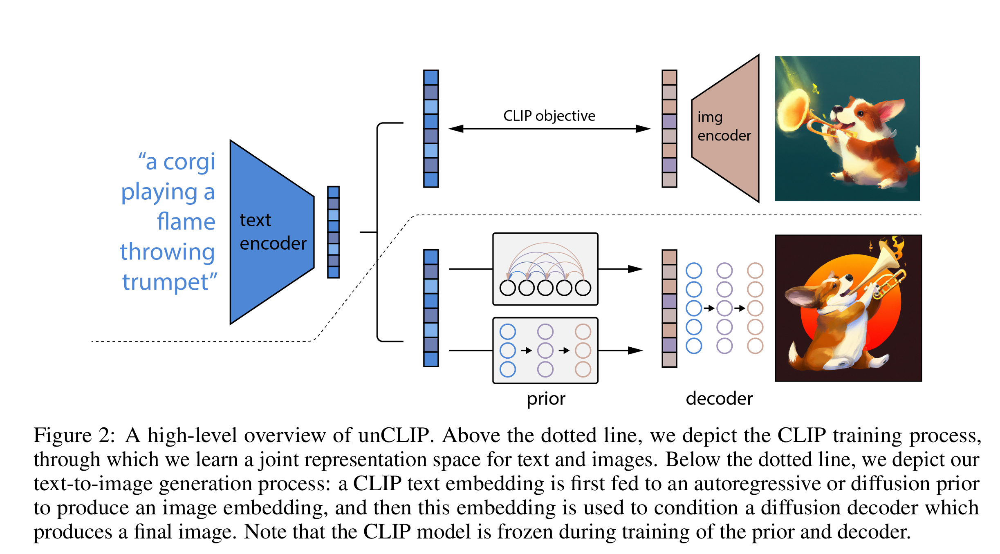
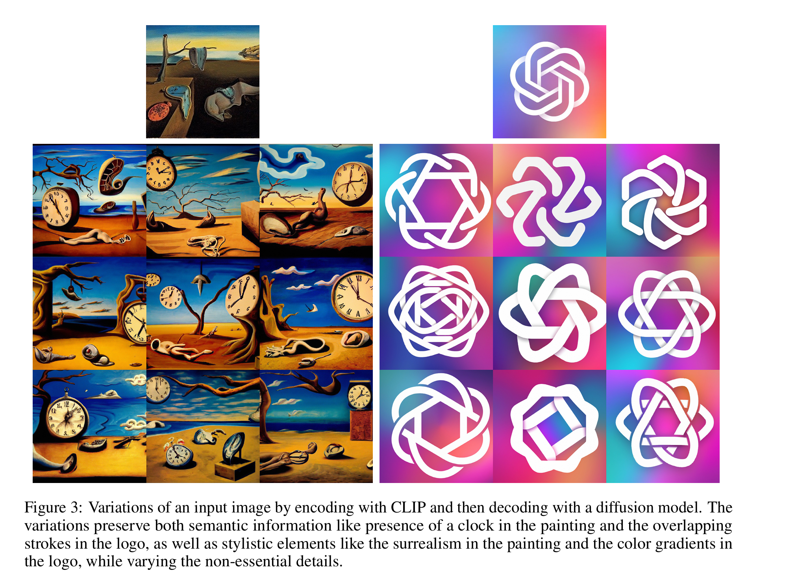
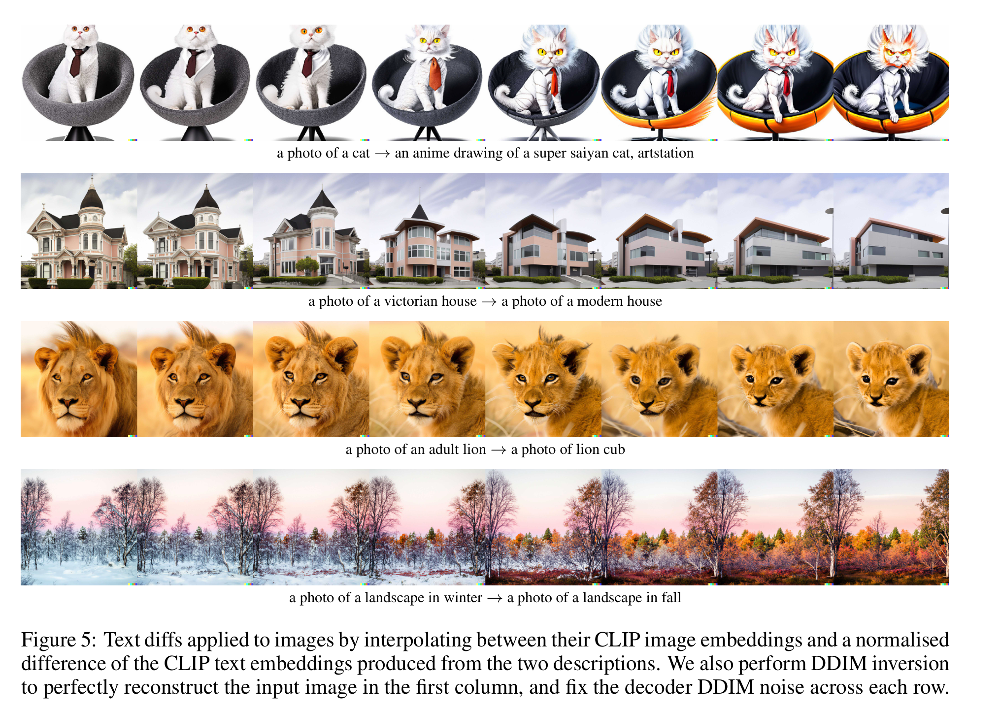

# Dalle Series
## Dalle 2 (unCLIP)

- Year: 2022 Apr
- Paper: <https://arxiv.org/pdf/2204.06125>
- Author: Open AI Aditya Ramesh, etc.

### Overall structure

Theoretically
 Let $y$ be the condition, i.e., the caption of the image, $x$ be the image. SO the $x$ and $y$ are 1-1 corresponded.

 Let $z_i$ and $z_t$ be the CIP image and text embedding.

 We have

- prio $P(z_i|y)$ that produces CLIP image embedding given condition $y$.
- decoder $P(x|z_i,y)$ that preduces the image samples dontiionaed on clip image embedding and caption

$$P(x|y) = P(x,z_i|y) = P(x|z_i,y)P(z_i|y)$$

Which means we can first sample the clip image embedding from the caption, and then use the clip image embedding to decode the image.

There are two different types of Prior

1. Autoregressive Prior
2. DIffusion Prior

In the diffusion prior, we can also use clip text embedding to map text to vector.
### Experiments

Interplate on the caption text embedding

