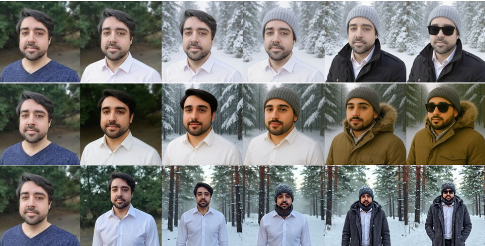
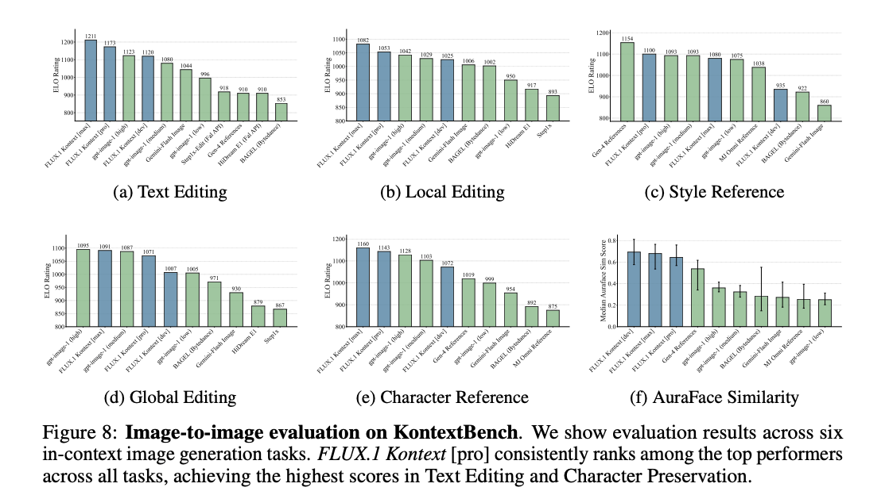
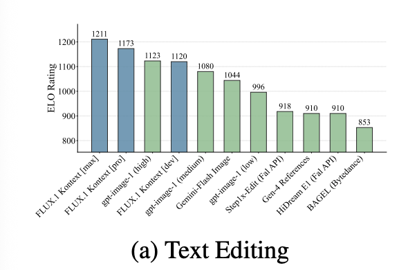
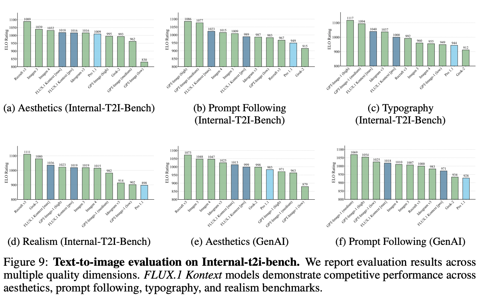

Title: FLUX.1 Kontext: Flow Matching for In‑Context Image Generation and Editing in Latent Space(arXiv:2506.15742)
Date: 2025年6月


# 1. Methods
	•	Flow‑matching 模型：在潜空间（latent space）中训练，将图像与文本提示共同作为输入，通过传递图像上下文和文本 instruction，实现生成与编辑功能的统一。
	•	Token 序列拼接：将潜编码上下文图片和目标图片拼接为一个序列，通过 transformer 处理，支持不同分辨率和迭代多图输入  。
	•	Rectified‑flow 目标 + 蒸馏优化：使用无监督 flow‑matching 损失训练，随后通过扩散蒸馏加速推理（约 3–5 秒/图），兼具质量与效率  。

## 1.1 如何实现角色保持



在这篇论文《FLUX.1 Kontext》中，作者没有显式地引入“人脸识别器”或“identity loss”来约束 identity，但他们通过以下结构设计、训练策略和数据构建方式，实现了身份一致性（identity consistency），特别是在多轮编辑中也能保持角色的脸不变。

下面我们来系统地分析他们是如何保持 identity 一致性的：


### 1.1.1 上下文拼接机制（Context Concatenation）


模型输入中直接拼接 原图的 latent token（context image）和文本指令（instruction）：

```
[input = concat(context_image_latent, instruction_text_embedding)]
```
这个设计让模型：
	•	显式地“看到”原始人物的样子
	•	把 identity 作为条件直接传入
	•	学习“在保持上下文人物基础上进行变化”

🧠 效果：
	•	相当于提示模型：你不能从零生成，而是要“在此人基础上进行修改”
	•	可类比于 image-conditioned diffusion，但更统一和高效

⸻

### 1.1.2. 在潜空间中训练（latent space）


FLUX.1 模型是在 VAE 编码后的 latent space 中操作的（而不是 RGB 图像）：
	• 图像的 identity、布局、风格等信息，已经被压缩为 token（如 64x64x4）
	• 拼接这些 token 更容易捕捉低层特征一致性（比如人脸结构）

🧠 效果：
	• 相对于 RGB 层的编辑，latent 层对人物 identity 表达更紧凑且一致性更强
	• 变动不会“抹去”原有 identity 结构

### 1.1.3. flow matching 训练目标对 identity 变化更敏感

📌 机制：

训练时采用 Rectified Flow Matching 目标：

• 从起始 latent x₀ 走向目标 latent x₁，要求预测向量场（flow）

$$v_\theta(x_t) \approx \frac{x_1 - x_t}{1 - t}$$

• 如果 x₁ 改变太大（比如换了 identity），flow 误差会很大 → loss 大 → 被惩罚

🧠 效果：
	•	模型学会了“只动必要部分”，保持 identity 不变
	•	与扩散模型相比更容易学习 identity-preserving 的向量场


### 1.1.4. KontextBench 数据集中的 identity consistency 指令引导

数据集里包含了大量 identity 保持相关的 instruction，例如：
	•	“让她穿不同的衣服，但脸不要变”
	•	“在同一个人的基础上添加帽子”
	•	“保持这个男人的发型不变，换背景”

模型通过 instruction+图像联合训练，学会理解保持 identity 的需求


### 1.1.5. 多轮编辑时使用前一张图作为上下文

每轮编辑都把上一轮生成的图像作为新的 context image 重新拼接输入。

🧠 效果：
	•	就像“把历史记住了”，而不是独立处理每一轮
	•	身份信息始终由 latent 表达传承下来，避免角色脸漂移


🚫 没有显式 identity loss？

是的，论文没有使用如下显式手段：
	•	❌ 预训练人脸识别器（如 ArcFace）来加 identity loss
	•	❌ CLIP 相似度监督 identity
	•	❌ GAN 特征对齐（如 styleGAN latent distance）

但即便如此，通过上述设计也达到了非常强的 identity consistency，甚至在人脸一致性任务中超过了部分 commercial 模型。


🧪 实验验证

作者用 AuraFace 提取人脸 embedding，并计算：
• 多轮编辑前后人脸距离
• FLUX.1 模型在“人脸不变”这一指标上表现最好（见论文图6）




# 2. 贡献与性能

一、统一生成＋编辑
	•	同一个模型既能处理文本生成（T2I），也能执行图像编辑（I2I）任务，无需切换模型

二、KontextBench 基准
	•	发布了 KontextBench：1026 对图片+指令，涵盖本地局部编辑、全局编辑、人物参考,风格参照、文本编辑等五大场景

三、多轮一致性
	•	多轮编辑在“角色一致性”测评（利用 AuraFace 人脸嵌入）上表现优异，比现有模型在稳定性和细节保留方面有明显提升

四、推理速度快
	•	在主流 T2I/I2I 模型中，FLUX.1 Kontext 的推理速度最快（中位数 3–5 秒），尤其是在迭代多轮交互场景中表现突出


# 3. 评估表现
• I2I 编辑任务：在局部编辑、文本编辑与人物参照任务中，FLUX.1 Kontext [max]/[pro] 名列前茅，比 GPT-Image-1 等专有模型快一个数量级  。
• T2I 生成任务：在 prompt 遵循性、美感、真实性、文字准确性等多个维度上，表现均衡且竞争力强


# 4. 限制与未来工作
• 多轮编辑过多仍可能导致细节漂移（artifact）与一致性下降
• 有时未能严格执行指令，蒸馏简化带来偶发质量损失
• 工作重点集中在单图，多图输入（多上下文图）、视频扩展、实时响应仍是未来方向
