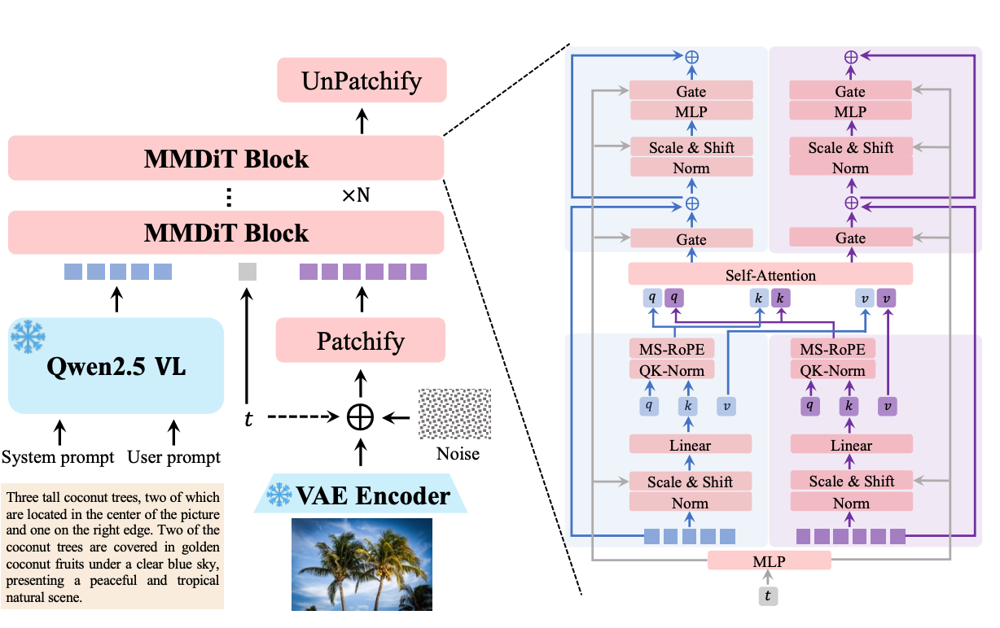
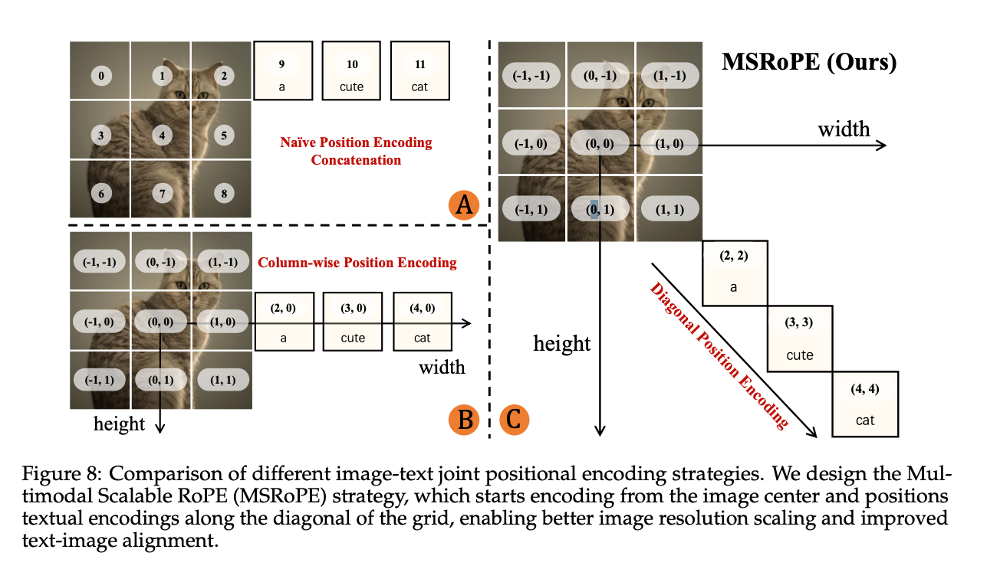
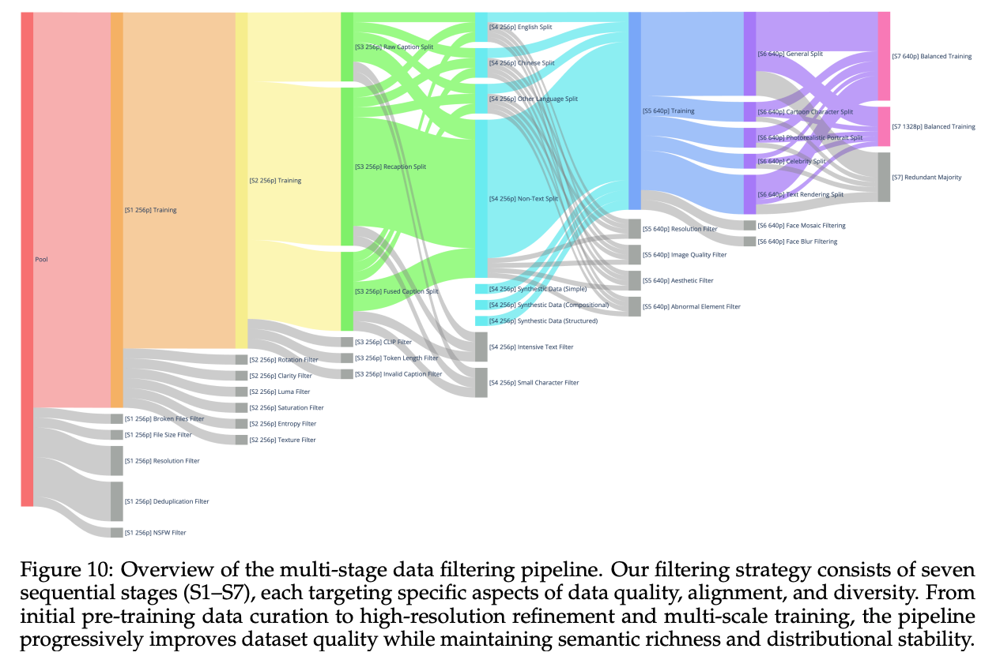

# Qwen‑Image Technical Report
- date: 发布于 2025 年 8 月 4 日
- author: Qwen Team
- report: https://qianwen-res.oss-cn-beijing.aliyuncs.com/Qwen-Image/Qwen_Image.pdf

## 核心内容总结
- 研究目标	开发 Qwen‑Image，提升复杂文本（尤其中文）在图像中的自然渲染与精确编辑能力  
- 数据与管道	构建大规模数据流水线：海量收集 → 过滤 → 注释 → 合成 → 平衡，确保文本图像训练样本质量与多样性  
- 训练策略	采用课程式训练：从无文字生成入手，逐步过渡到简短文字，再到段落描述，显著增强原生文本渲染表现  
- 多任务混合训练	同时训练三种任务：T2I（文本到图像）、TI2I（文本图像到图像）、I2I（图像重构）。通过对齐 Qwen2.5‑VL 与 MMDiT 的潜在空间，实现编辑一致性  
- 双编码机制	原始图像分别输入 Qwen2.5‑VL（语义）和 VAE 编码器（重构），结合语义与视觉信息，实现准确编辑且保持视觉 fidelity  
- 性能评估	在多个 benchmark 上表现领先：既在英文等 alphabetic 语言有优良文字渲染，也在中文等 logographic 语言上取得显著进展  
- 创新亮点	- 针对中文复杂字体及结构的 native rendering 优化- 教育式训练（渐进式）提升能力- 多任务融合加强图像编辑质量和一致性
- 局限与未来方向	报告未详细披露模型规模、推理效率、生成速度、算力需求等；未来可关注扩展性、实时性、多语言支持、风格迁移等能力。


•	优点：
    •	明确解决复杂语言文字渲染难题，尤其针对中文，这一课题在多数图像生成模型中尚不成熟。
    •	综合文本生成与图像编辑设计，融合词语视觉与语义表示，提升生成质量与一致性。
•	不足/待完善：
    •	技术报告未披露模型推理效率、参数量、实际应用场景对比等细节。
    •	对比研究较少涉及其他主流模型（如 Imagen 4、Midjourney、DALL·E），缺乏综合对照性能数据    。


## Introduction
### 名词解释
1. T2I：text to image generation
2. TI2I: text and image to image generation or image editing
Current sota image model has two main problems
- text rendering for multiple or non-alphabetic languages
- visual consistency

### 改进方式
1. 使用两个不同的feature embedding

    - Qwen-VL 生成的 embedding 含有更多的语义信息，高层次的场景理解信息
    - VAE encoder 出来的 embedding 包含更多低层次的视觉细节
    - 这两个 feature 同时传到 MMDiT 模块中
2. 训练上
    - 设计了一个 Producer-Consumer framework，其中使用到了TensorPipe 用来做分布式数据加载和处理。 其中Producer 扶着处理 VAE encoding 和数据 I/O, consumer 负责分布式训练（使用了 Megatron framework）

### 优势
1. text rendering 能力
2. consistency: 保持语义信息和视觉真实性
3. Strong Cross benchmark performance: 在过个测试数据上效果领先

## 模型


模型包含三个模块
1. MLLM 作为条件生成中的条件，输出prompt的 embedding 或者图片加上 prompt 的 embedding
2. VAE： 将图片压缩到特征空间，具有更紧凑的图片表示，并且减少计算量
3. MMDiT (Multimodal Diffusin Transformer): 扩散模型的主要部分

### QWen2.5 VL
使用 QWen2.5 VL 作为特征提取模块 有三点原因
1. Qwen2.5 VL 的语言特征空间和视觉特征空间是已经对齐了的，因此可能比 LLM 更好适应图片生成。比如 T5，它是一个单纯的语言模型，和图片空间的特征可能不对齐，因此使用的时候需要模型在这个特征上进一步对齐，这个对齐可以是单独训练对齐，比如 clip 的方式，也可能是隐式得对齐，让模型在学习生成图片的时候自动对齐。但是使用一个已经对齐了的模型，可能会减少这方面的难度，从而达到更好的效果
2. Qwen2.5 VL 本身的LLM 能力也不差相对于单纯的语言模型
3. QWen2.5 VL 作为多模态大语言模型，支持多模态的输入，这样就比较好的支持图片编辑这种任务。在实际的做法中，对于 T2I 和 TI2I，设计了不同的 prompt

```
<|im_start|>system
Describe the image by detailing the color, quantity, text, shape, size, texture, spatial relationships of
the objects and background: <|im_end|>
<|im_start|>user
<|user_text|><|im_end|>
<|im_start|>assistant
```

### VAE
使用了 Wan-2.1-VAE 的结构，这个是 Wan Team https://arxiv.org/pdf/2503.20314 ，面向视频生成任务的 3D 因果变分自编码器（VAE）结构，用于在 Wan-2.1 等视频生成模型中进行高效的视频压缩与解码。
在这个项目里，Encoder 被分 freeze 了，只有 decoder 在进行 finetune。为了提高对文字和小物体的重建能力，特别在富文本字数据上进行了训练，包括拉丁文字和象形文字。在训练的时候发现 Adversarial loss 没什么用了，可能是因为重建的效果很好，判别器失去了作用。为什么会失去作用？如果生成模型已经生成的很真实了，那判别器就没有办法去判断生成的和真实的差异了。这样的话 loss 就会维持在一个水平不动。 根据这个，finetune 过程只有重建和 perceptual loss 。
Perceptual loss 是什么呢？Perceptual loss（感知损失）是一种用于图像生成或图像重建任务的损失函数，不是直接对像素差异做比较（如 L1/L2），而是比较图像在高层特征空间中的差异，以更好地模拟人类视觉感知。 如果对于文字生成而言，也可以换成 OCR 的感知 loss。不过具体的 Wan-2.1-VAE 中用的感知 loss 是怎么样的还不清楚

### MMDiT
Novel positional encoding method: Multimodal Scalable RoPE


有效解决了图文融合中 token 混淆和位置选择困难的问题，兼顾了图像分辨率可扩展性与文本语义一致性

## 数据
billions of image-text pairs to support the training of our
image generation model。在手机数据时 更加注重数据质量和分布的均衡
数据分为 四个主要类别 Nature, Design, People and Synthetic Data

 Qwen-Image 数据集分类分布表

| 大类分类          | 占比       | 子类及说明                                                                                                                                 |
| ------------- | -------- | ------------------------------------------------------------------------------------------------------------------------------------- |
| **Nature**    | \~55%    | Objects (21.67%), Cityscape (8.67%), Food (6.59%), Plants (5.14%), Indoor (4.59%), Landscape 等其他；包含模糊分类内容，如不能归入 People 或 Design 的也算在内 |
| **Design**    | \~27.41% | Posters (5.81%), UI (5.03%), Slides (4.18%), Arts (9.63%)；包含结构化视觉内容：海报、界面、PPT、艺术绘画等，包含复杂文本和布局                                         |
| **People**    | \~13.21% | Portrait (3.68%), Sports (2.77%), Activities 等；聚焦于以人为中心的图像，如肖像、活动、运动等                                                                 |
| **Synthetic** | \~5%     | 用于增强文本渲染的合成数据，不包括 AI 生成图像，而是人工控制文本渲染生成，用于文字区域增强                                                                                       |
| **总计**        | 100%     | 数据集涵盖四大类，用于确保模型具备广泛的通用能力及文本理解能力                                                                                                       |

### 数据过滤


七阶段数据清洗流程总结表

| 阶段          | 名称                                             | 核心操作与目标                                                                                              |
| ----------- | ---------------------------------------------- | ---------------------------------------------------------------------------------------------------- |
| **Stage 1** | **Initial Pre-training Data Curation**         | 图像统一 resize 为 256px，清除无效或低质图像（如损坏文件、低分辨率图、重复图、NSFW 内容），为初期训练准备稳定数据。                                  |
| **Stage 2** | **Image Quality Enhancement**                  | 利用图像质量指标（如模糊度、亮度、饱和度、对比度、entropy、纹理复杂度）进行筛选，剔除模糊、过曝、低信息量或过度合成图像。图 11 展示了多个打分示例。                      |
| **Stage 3** | **Image-Text Alignment Improvement**           | 优化图文对齐：数据来源包括网页提取和合成文本，结合 OpenAI Captioner、CLIP、SigLIP 和自研打分器判断图文一致性，剔除语义偏离、无效 caption 的样本。          |
| **Stage 4** | **Text Rendering Enhancement**                 | 提升模型对文本渲染能力：增强含丰富文字的图像（如海报、幻灯片），识别并过滤带有水印、过小文本、虚假语义文字的图像。                                            |
| **Stage 5** | **High-Resolution Refinement**                 | 训练转向高分辨率（640px 和 1328px）；删除低分辨率图像，保证细节质量与审美；特别强调 resolution filter 和质量打分策略。                          |
| **Stage 6** | **Category Balancing & Targeted Augmentation** | 分类重构并进行少样本增强：将图像按五大类重新划分（Nature, People, Design, Synthetic, Text Rendering），并在弱类上进行合成图像扩充，增强多样性与健壮性。 |
| **Stage 7** | **Balanced Multi-Scale Training**              | 最终模型训练阶段，仅保留高质量图像，使用分类层级结构平衡 token 频率，采用多尺度结构保证泛化能力与细节保真度的融合。                                        |


根据你提供的图文内容，以下是对 Qwen-Image 论文中 **数据标注（Data Annotation）** 和 **数据生成（Data Synthesis）** 两部分的总结：


### 🧷 数据标注（3.3 Data Annotation）

| 项目          | 内容                                                                                       |
| ----------- | ---------------------------------------------------------------------------------------- |
| **使用模型**    | 使用能力强的图像描述模型，如 **Qwen2.5‑VL**，对图像进行 **图文描述+结构化属性元信息提取**。                                 |
| **标注输出内容**  | - 图像描述（caption）<br>- 对象属性（如类型、风格）<br>- 场景关系（如位置、环境）<br>- 可见文字转写<br>- 图像异常元素（如水印、二维码、马赛克） |
| **结构化输出**   | 采用统一结构格式（如 JSON）输出，便于大规模处理与模型使用。                                                         |
| **与传统方法对比** | 不再把 caption 和 metadata 抽取作为独立任务，而是统一设计成一个 joint annotation pipeline，一次性输出全部信息。           |
| **后处理优化**   | 进一步结合专家规则与轻量分类器进行内容过滤，如水印检测、暴力色情内容过滤等。                                                   |
| **目标**      | 在提高标注效率的同时，提升训练数据质量与结构化丰富度，为后续训练打下高质量基础。                                                 |


### 🧱 数据生成（3.4 Data Synthesis）

设计了三种文本合成策略，用于提升模型的文本渲染能力，解决真实图像中文本稀缺问题：

| 渲染策略                                    | 说明                                                                                                            | 示例                                               |
| --------------------------------------- | ------------------------------------------------------------------------------------------------------------- | ------------------------------------------------ |
| **Pure Rendering**<br>（纯净背景渲染）          | - 从高质量语料中抽取句子，渲染到**单一背景**（如纯色）上；<br>- 采用动态字体布局算法控制字体大小与位置；<br>- 筛除渲染失败或不可读字符；<br>✅ 强调字符识别与生成的清晰度。             | 例如：一段中文文本在浅灰背景上清晰展示                              |
| **Compositional Rendering**<br>（真实场景合成） | - 将文本合成到现实物体（如纸张、木板、广告牌）上，并嵌入真实背景中；<br>- 使用 Qwen-VL Captioner 生成**视觉语义对齐的描述**；<br>✅ 提升模型对自然场景中的文本理解和还原能力。     | 例如：“I love you too” 被合成到便签纸上，并贴在风景背景中            |
| **Complex Rendering**<br>（复杂结构模板）       | - 针对复杂布局（如幻灯片、UI 模板）进行语法填充；<br>- 保持布局结构完整，替换占位文本；<br>- 覆盖多行、多字体、多颜色、空间对齐等挑战性任务；<br>✅ 提升模型对复杂指令与多格式文本的理解与执行能力。 | 示例图中显示幻灯片布局中自动替换中文内容，并用 Qwen-VL Captioner 描述整个场景 |


## training
### Pre-training（预训练）

| 模块       | 内容                                                                                                                                |
| -------- | --------------------------------------------------------------------------------------------------------------------------------- |
| **目标**   | 使用流匹配（flow matching）目标来稳定地训练 Qwen-Image，同时保持与最大似然目标的等价性                                                                           |
| **方法核心** | 基于变分自编码器（VAE）与 **Rectified Flow** 框架，预测**从随机噪声到原始图像 latent** 的速度向量                                                                |
| **数据定义** | - `x₀`: 原始图像 latent<br>- `x₁`: 来自标准正态分布的随机噪声<br>- `xₜ`: 线性插值（用于训练）<br>- `vₜ`: `x₀ − x₁`，作为目标速度<br>- `h`: MLLM 生成的 guidance latent |
| **损失函数** | 使用 MSE 计算预测速度和真实速度之间的差异：<br> $ \mathcal{L} = \mathbb{E} \left[\|v_θ(x_t, t, h) - v_t\|^2$                                         |

---

#### Producer-Consumer Framework（生产者-消费者框架）

| 项目             | 内容                                                                                        |
| -------------- | ----------------------------------------------------------------------------------------- |
| **目的**         | 提高大规模训练效率，解耦 **数据预处理** 和 **模型训练**，支持 GPU 集群扩展                                             |
| **Producer 端** | - 图像/文字对先经过预定义过滤<br>- 用 MLLM（如 Qwen2.5‑VL）和 VAE 提取 latent<br>- 按 resolution 分类缓存，存储于共享缓存中 |
| **Consumer 端** | - 位于 GPU 集中集群<br>- 仅负责模型训练，使用高效 RPC 调度拉取已预处理数据                                            |
| **优势**         | - 训练过程不中断即可动态更新数据管道<br>- 避免等待，提高吞吐量和并行度                                                   |

---

#### Distributed Training Optimization（分布式训练优化）

| 策略          | 说明                                                                                            |
| ----------- | --------------------------------------------------------------------------------------------- |
| **并行策略**    | 使用 **混合并行**（Hybrid Parallelism）：结合 **数据并行** 和 **张量并行**（Tensor Parallelism）                    |
| **技术实现**    | - 使用 Megatron‑LM 和 **Transformer Engine**（支持动态切换并行粒度）<br>- **head-wise 并行**：每个注意力头并行处理，减少通信成本 |
| **优化器与检查点** | - 分布式优化器<br>- 激活检查点（checkpointing）减少显存使用<br>⚠️ 注意：激活检查点可能降低训练速度                               |


##### activation checkpoint 技术
下面是对 **Activation Checkpointing** 的总结

> Activation Checkpointing 是一种节省显存的训练策略，通过只保存部分中间激活值，其余在反向传播时**动态重算**，从而节省 GPU 内存。


✅ 普通训练流程（全部保存激活）

```
Forward:
x ─▶ [L1] ─▶ [L2] ─▶ [L3] ─▶ [L4] ─▶ loss
         ↑     ↑     ↑     ↑
       保存  保存  保存  保存

Backward:
利用全部保存的激活值进行反向传播
```

* 所有层的激活都保存在显存中
* 反向传播不需要重算，但显存占用高


Activation Checkpointing

```
Forward:
x ─▶ [L1] ─▶ [L2] ─▶ [L3] ─▶ [L4] ─▶ loss
         ↑           ↑
     ✅ checkpoint  ✅ checkpoint
     （仅保存部分）

Backward:
需要反传 L3 → 找不到激活 → 从 L1 checkpoint 开始重算 L2 → L3
```

* 只保存了 L1、L4 的激活值
* 反向传播时，从最近的 checkpoint 重算缺失激活
* 显存占用大幅下降


优缺点对比表

| 项目   | 普通训练 | Activation Checkpointing |
| ---- | ---- | ------------------------ |
| 显存使用 | 高    | 低（显著减少激活缓存）              |
| 计算速度 | 快    | 略慢（需重算）                  |
| 适用场景 | 小模型  | 大模型 / 内存受限训练             |

---


```python
from torch.utils.checkpoint import checkpoint

def layer_block(x):
    x = layer1(x)
    x = layer2(x)
    return x

# 使用 checkpoint 包裹需要重算的部分
out = checkpoint(layer_block, input_tensor)
```

> **Activation Checkpointing 就是“只存关键点、需要时重算”，显著节省显存，适合大模型训练。**

### 训练
训练部分涉及到了 reinforcement learning 这个我还不熟悉 要再学习学习