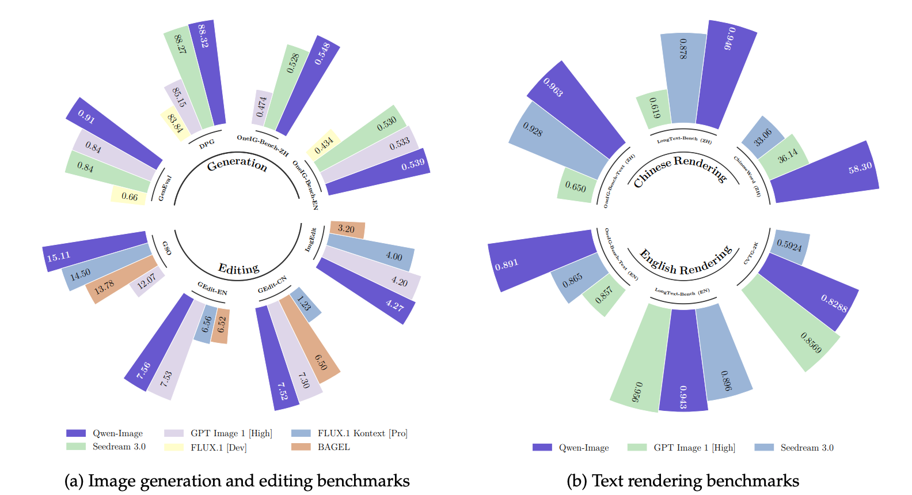

# The Qwen-Image Journey: From Text-to-Image to Precise Editing

- **发布时间**: 2025 年 8 月 4 日
- **作者团队**: Qwen Team
- **技术报告**: [Qwen-Image Technical Report](https://qianwen-res.oss-cn-beijing.aliyuncs.com/Qwen-Image/Qwen_Image.pdf)
- **arXiv 论文**: [2508.02324] Qwen-Image Technical Report
- **项目主页**: [Qwen-Image-Edit: Image Editing with Higher Quality and Efficiency](https://qwenlm.github.io/blog/qwen-image-edit/)
- **GitHub**: [QwenLM/Qwen-Image](https://github.com/QwenLM/Qwen-Image)

## 故事的开始：为什么需要 Qwen-Image？

想象一下，你有一张漂亮的照片，但想要在上面添加一些中文文字，或者想要精确地编辑图片中的某个元素。传统的图像生成模型面临两大挑战：**复杂文本渲染**（特别是中文等非字母语言）和**视觉一致性**保持。这就是 Qwen-Image 诞生的背景——它不只是一个图像生成模型，更是一个精确的图像编辑工具。

## 核心创新亮点

### 🧠 双编码器的智慧设计
Qwen-Image-Edit 采用了独特的"双编码机制"：
- **Qwen2.5-VL**: 理解图像的语义内容和用户的编辑意图
- **VAE编码器**: 保留图像的视觉细节和纹理信息
- 两种信息在 MMDiT（多模态扩散Transformer）中完美融合

这就像给模型配备了一双眼睛——一只看懂"内容"，一只记住"外观"。

### 🎯 渐进式训练策略
团队采用了聪明的"课程式学习"方法：
1. **第一阶段**：从无文字的简单图像生成开始
2. **第二阶段**：逐步引入简短文字渲染
3. **第三阶段**：最终挑战复杂段落描述

这种循序渐进的方式，让模型像人类学习一样，从简单到复杂，稳步提升能力。

### 🔄 多任务协同训练
模型同时学习三种核心任务：
- **T2I** (Text-to-Image): 从文本生成图像
- **TI2I** (Text+Image-to-Image): 基于文本指令编辑图像
- **I2I** (Image-to-Image): 图像重构保持一致性

通过对齐 Qwen2.5-VL 与 MMDiT 的潜在空间，实现了编辑的精确性和一致性。

## 架构深度解析：三个核心模块

### 1. 多模态文本编码器 (Qwen2.5-VL-7B)

想象 Qwen2.5-VL 是一个经验丰富的翻译官，它能够：
- 🔍 **理解图像内容**：分析原图中的物体、场景、文字等信息
- 📝 **解析编辑指令**：理解用户想要进行的修改操作
- 🌐 **多语言支持**：特别擅长处理中文等复杂语言

**工作流程**：
```
用户输入: "在图片右下角添加一只灰色小猫"
↓
Qwen2.5-VL 处理: 提取图像语义 + 理解编辑意图
↓
输出: 融合的语义embedding (shape: [batch, seq_len, 3584])
```

### 2. 图像自动编码器 (VAE)

VAE 就像一个精密的图像"压缩器"：
- 📥 **编码**: 将 512×512 图像压缩为 64×64 的潜在表示
- 🎨 **保真**: 保留重要的视觉细节，特别是文字和小物体
- 📤 **解码**: 将编辑后的潜在表示还原为高质量图像

**特殊设计**：
- 基于 Wan-2.1-VAE 架构，专门针对文本渲染优化
- 16通道潜在空间（vs 传统4通道），信息容量大幅提升
- 2×2 patch打包策略，适配Transformer处理

### 3. 多模态扩散Transformer (MMDiT)

MMDiT 是整个系统的"艺术大师"：
- 🏗️ **双流架构**: 图像流和文本流并行处理，通过注意力机制交互
- 🔄 **60层深度**: 每层包含自注意力和交叉注意力模块
- 📍 **创新位置编码**: Multimodal Scalable RoPE，解决图文融合中的位置困扰

**魔法时刻**：
```
输入: 嘈杂的图像潜在 + 原图潜在 + 文本条件
↓
60层Transformer处理: 逐步去噪，精确编辑
↓
输出: 清晰的编辑结果潜在表示
```

## 数据构建：百亿级训练样本的秘密

### 📊 数据分布策略
团队精心设计了数据配比：

| 类别 | 占比 | 说明 |
|------|------|------|
| **Nature** | ~55% | 自然场景、物体、食物等日常内容 |
| **Design** | ~27.41% | 海报、UI界面、PPT、艺术作品 |
| **People** | ~13.21% | 人像、体育、活动等人物场景 |
| **Synthetic** | ~5% | 专门增强文本渲染的合成数据 |

### 🔧 七阶段数据清洗流程

像淘金一样，团队通过严格的七阶段流程筛选高质量数据：

1. **Stage 1**: 初始预处理 - 统一尺寸，清除损坏文件
2. **Stage 2**: 质量增强 - 基于模糊度、对比度等指标筛选
3. **Stage 3**: 图文对齐 - 确保图像与文本描述的一致性
4. **Stage 4**: 文本渲染增强 - 重点保留富含文字的图像
5. **Stage 5**: 高分辨率优化 - 转向640px和1328px训练
6. **Stage 6**: 类别平衡 - 少样本类别增强，保证多样性
7. **Stage 7**: 多尺度平衡训练 - 最终质量把关

### 🎨 智能数据合成

为了提升文本渲染能力，团队设计了三种合成策略：

**Pure Rendering（纯净渲染）**：
- 在简单背景上渲染高质量文本
- 专注字符识别的清晰度

**Compositional Rendering（场景合成）**：
- 将文本自然地嵌入真实场景
- 如便签贴在风景照上的效果

**Complex Rendering（复杂模板）**：
- 处理幻灯片、UI等复杂布局
- 支持多行、多字体、多颜色文本

## 训练策略：Producer-Consumer 的分布式智慧

### 🏭 生产者-消费者框架

团队设计了高效的分布式训练架构：

**Producer（生产者）**：
- 负责数据预处理和VAE编码
- 动态缓存不同分辨率的latent数据

**Consumer（消费者）**：
- GPU集群专注模型训练
- 通过高效RPC调用获取预处理数据

这种设计让数据处理和模型训练解耦，大大提升了训练效率。

### 🔄 Flow Matching 优化

采用 Flow Matching 替代传统DDPM：

损失函数: $L = E[||v_θ(x_t, t, h) - v_t||²]$
其中: $v_t = x₀ - x₁$ (从噪声到图像的速度向量)


这种方法提供了更稳定的训练过程和更好的编辑一致性。

## 实战应用：数据流与Tensor变化

让我们跟随一张 512×512 图像的编辑之旅：

### 🚀 推理流程
```
1. 输入预处理
   原图: [B, 3, 512, 512] → VAE编码 → [B, 16, 1, 64, 64]

2. Latent打包
   [B, 16, 64, 64] → 2×2打包 → [B, 1024, 64]

3. 文本编码
   "添加小猫" → Qwen2.5-VL → [B, seq_len, 3584]

4. 扩散过程 (50步迭代)
   嘈杂latent + 原图latent → MMDiT → 去噪预测

5. 结果生成
   最终latent → VAE解码 → [B, 3, 512, 512] 编辑结果
```

### 🔧 关键技术细节

**多尺寸支持**：
- 支持 384×384 到 3072×3072 像素范围
- 相对位置编码RoPE实现尺寸泛化
- 动态调度器适配不同分辨率

**批量处理**：
- 支持多张图像批量编辑
- 每张图像独立处理，互不影响
- 显存占用随批量大小线性增长

**精度控制**：
- CFG (Classifier-Free Guidance) 指导生成质量
- 可调节的引导强度控制编辑程度
- 范数归一化保持数值稳定

## 性能表现：突破性的中文渲染

### 🏆 核心优势

1. **卓越文本渲染**：
   - 在英文等字母语言上表现优秀
   - 在中文等象形文字上取得突破性进展
   - 支持复杂字体结构和多行布局

2. **强化一致性保持**：
   - 未修改区域完美保持原样
   - 语义理解与视觉细节平衡
   - 编辑边界自然融合

3. **跨基准测试领先**：
   - 多个benchmark表现突出
   - 特别在复杂指令理解上优势明显

### ⚠️ 当前限制

- 技术报告未详细披露模型规模和推理效率
- 与主流模型（Midjourney、DALL-E等）对比数据有限
- 超高分辨率处理仍需额外优化

## 创新总结：不只是CLIP的替代

Qwen-Image-Edit 的最大创新在于**完全抛弃了传统CLIP**，转而使用更强大的 Qwen2.5-VL-7B 作为多模态编码器。这带来了：

- 🧠 **更丰富的语义理解**：3584维度 vs CLIP的512/768维
- 🌐 **原生多语言支持**：特别是中文等复杂语言
- 🎯 **精准指令遵循**：经过Instruct调优的指令理解能力

## 未来展望

Qwen-Image-Edit 代表了图像编辑领域的一次重大突破，特别是在：
- 复杂文本渲染的原生支持
- 多模态信息的深度融合
- 渐进式训练的有效性验证

随着模型的不断优化和开源生态的发展，我们有理由相信，这将开启图像编辑的新纪元——一个人人都能精确控制视觉创作的时代。

---

## 参考资料

- [Qwen-Image Technical Report](https://qianwen-res.oss-cn-beijing.aliyuncs.com/Qwen-Image/Qwen_Image.pdf)
- [arXiv:2508.02324] Qwen-Image Technical Report
- [Qwen-Image-Edit Blog](https://qwenlm.github.io/blog/qwen-image-edit/)
- [GitHub Repository](https://github.com/QwenLM/Qwen-Image)
- [Alibaba Cloud API Documentation](https://www.alibabacloud.com/help/en/model-studio/qwen-image-edit-api)
- [Diffusers Implementation](https://github.com/huggingface/diffusers/tree/main/src/diffusers/pipelines/qwenimage)


