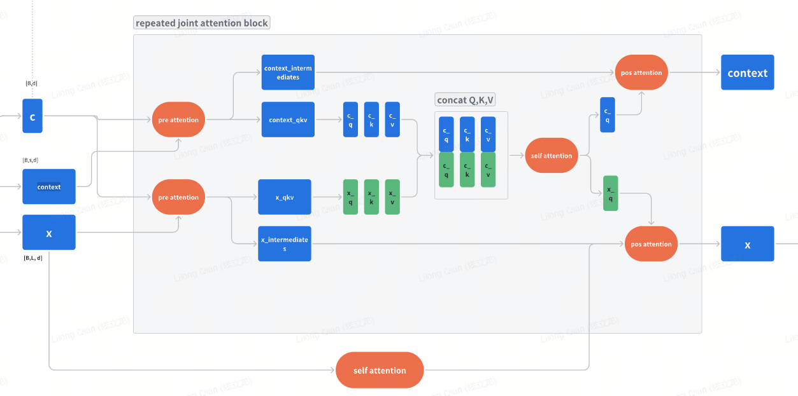

# Stable Diffusion 3.5

- repo: <https://github.com/Stability-AI/sd3.5>

## Summary of Key Architectural Differences

1. Architecture Enhancements
   1. Skip Layer Guidance (SLG):
         - SD3.5 introduces this novel technique that selectively skips specific transformer layers (typically 7-9)
         - Only active during 1-20% of the sampling process
         - Uses a separate guidance scale (2.5 in SD3.5 Medium) distinct from the main CFG scale
         - Significantly improves image coherence and reduces artifacts
   2. MMDiTX vs MMDiT:
        - SD3.5 uses the enhanced MMDiTX architecture with more flexible configuration options
        - Added support for cross-block attention with x_block_self_attn
        - Improved normalization with RMSNorm support as an alternative to LayerNorm
        - Better parameter management and more modular design
2. Sampling Improvements
   1. Default Samplers:
         - SD3: Uses euler sampler as default
         - SD3.5: Uses dpmpp_2m (DPM-Solver++) sampler for better quality
   2. Noise Scheduling:
         - SD3: Uses shift=1.0
         - SD3.5: Uses shift=3.0 for improved noise distribution
   3. Default Configurations:
         - SD3.5 Medium: 50 steps, CFG 5.0, with Skip Layer Guidance
         - SD3.5 Large: 40 steps, CFG 4.5
         - SD3.5 Large Turbo: 4 steps, CFG 1.0 (optimized for speed)
3. New Capabilities
    1. ControlNet Integration:
            - Native support for various ControlNet types (blur, canny, depth)
            - Dedicated ControlNetEmbedder class for processing control inputs
            - Support for 8-bit and 2-bit ControlNet variations
    2. Attention Mechanisms:
            - More configurable attention with qk_norm options
            - Enhanced cross-attention capabilities
            - Better handling of long-range dependencies

4. Technical Implementation

   1. Code Quality:
      - More modular design in SD3.5
      - Better type hinting and parameter validation
      - Enhanced error handling and debugging capabilities
   2. Performance:
      - More efficient attention mechanisms
      - Better memory management
      - Support for different precision modes

In this article, we will study the differences in architecture, such as skip layer guidance and MM-DiTX. We will also explore how ControlNet is implemented in SD3.5.

As for the elements that are similar to SD 3, including the VAE, prompt processing, and sampling scheme, the differences are not significant. Please refer to the previous article [stable diffusion 3 reading](./stable_diffusion_3_reading.md) for more information.

## Skip Layer Guidance

| | |
|---|---|
| w/o SLG | w/ SLG |

Apparently, the fingers look better. This could be evidence that supports the claimed benefits (improved anatomy). However, other aspects of the image also change.

| | ||
|---|---|---|
| vanilla diffusers which looks awful| skipping layers 6, 7, 8, 9 with SLG scale of 5.6| skipping 7, 8, 9 with SLG scale of 2.8|

See more comparisons of CFG and SLG in [here](https://sandner.art/sd-35-medium-skip-layer-guidance-and-fix-composition-hands-and-anatomy/)

    ```py3
    # From SkipLayerCFGDenoiser in SD3.5
    def forward(self, x, timestep, cond, uncond, cond_scale, **kwargs):
        # Run cond and uncond in a batch together
        batched = self.model.apply_model(
            torch.cat([x, x]),
            torch.cat([timestep, timestep]),
            c_crossattn=torch.cat([cond["c_crossattn"], uncond["c_crossattn"]]),
            y=torch.cat([cond["y"], uncond["y"]]),
            **kwargs,
        )
        # Then split and apply CFG Scaling
        pos_out, neg_out = batched.chunk(2)
        scaled = neg_out + (pos_out - neg_out) * cond_scale

        # Then run with skip layer
        if (self.slg > 0 and self.step > (self.skip_start * self.steps)
            and self.step < (self.skip_end * self.steps)):
            skip_layer_out = self.model.apply_model(
                x, timestep, c_crossattn=cond["c_crossattn"],
                y=cond["y"], skip_layers=self.skip_layers,
            )
            # Then scale acc to skip layer guidance
            scaled = scaled + (pos_out - skip_layer_out) * self.slg

        self.step += 1
        return scaled
    ```

Compared to CFG, SLG incorporates an additional direction correction term, which helps improve anatomical accuracy in generated images.

According to the configuration:

    ```json
    "sd3.5_medium": {
        "shift": 3.0,
        "steps": 50,
        "cfg": 5.0,
        "sampler": "dpmpp_2m",
        "skip_layer_config": {
            "scale": 2.5,
            "start": 0.01,  # skip_start value
            "end": 0.20,    # skip_end value
            "layers": [7, 8, 9],
            "cfg": 4.0,
        },
    }
    ```
The skip layer guidance is only active during the initial 1-20% of the sampling process, targeting layers [7, 8, 9], and scaling the CFG to 4.0.

In the MM-DiTX implementation, the skip layers are treated as identity functions:

    ```py3
    for i, block in enumerate(self.joint_blocks):
        if i in skip_layers:
            continue
        context, x = block(context, x, c=c_mod)
    ```

Both `pos_out` and `skip_layer_out` use the same positive condition but differ in their treatment of skip layers. If we consider the skipped layers as a negative condition, this effectively pushes the sample away from that negative influence. What does this negative influence represent when removing layers 7, 8, and 9 (or any specific layers)? If we assume that specific layers are responsible for different features in the image—for example, if layers 7, 8, and 9 handle finer details—then the negative condition would produce images with poor fine structure. Therefore, moving away from this negative influence results in images with enhanced fine details and better structural integrity.

## MM-DiTX

By comparing the implementations of SD3's MMDiT and SD3.5's MMDiTX, I found the following key differences:

### Architecture Enhancements

#### Cross-Block Self-Attention

- **New in MMDiTX:** The addition of the `x_block_self_attn` feature.
- **Implementation:** A second self-attention module, `self.attn2`, has been added within the `DismantledBlock`.
- **Control:** This feature is enabled on specific layers using the `x_block_self_attn_layers` parameter.
- **Purpose:** It allows specific layers to perform two different self-attention operations simultaneously, enhancing the model's expressive capability.

Structure of MM-DiT


The DismantleBlock added new methods

##### Pre-Attention

=== "pre_attention_x"

    ```py3
        def pre_attention_x(self, x: torch.Tensor, c: torch.Tensor) -> torch.Tensor:
            assert self.x_block_self_attn
            (
                shift_msa,
                scale_msa,
                gate_msa,
                shift_mlp,
                scale_mlp,
                gate_mlp,
                shift_msa2,
                scale_msa2,
                gate_msa2,
            ) = self.adaLN_modulation(c).chunk(9, dim=1)
            x_norm = self.norm1(x)
            qkv = self.attn.pre_attention(modulate(x_norm, shift_msa, scale_msa))
            qkv2 = self.attn2.pre_attention(modulate(x_norm, shift_msa2, scale_msa2))
            return (
                qkv,
                qkv2,
                (
                    x,
                    gate_msa,
                    shift_mlp,
                    scale_mlp,
                    gate_mlp,
                    gate_msa2,
                ),
            )
    ```

=== "pre_attention"

    ```py3
    def pre_attention(self, x: torch.Tensor, c: torch.Tensor):
        assert x is not None, "pre_attention called with None input"
        if not self.pre_only:
            if not self.scale_mod_only:
                shift_msa, scale_msa, gate_msa, shift_mlp, scale_mlp, gate_mlp = self.adaLN_modulation(c).chunk(6, dim=1)
            else:
                shift_msa = None
                shift_mlp = None
                scale_msa, gate_msa, scale_mlp, gate_mlp = self.adaLN_modulation(c).chunk(4, dim=1)
            qkv = self.attn.pre_attention(modulate(self.norm1(x), shift_msa, scale_msa))
            return qkv, (x, gate_msa, shift_mlp, scale_mlp, gate_mlp)
        else:
            if not self.scale_mod_only:
                shift_msa, scale_msa = self.adaLN_modulation(c).chunk(2, dim=1)
            else:
                shift_msa = None
                scale_msa = self.adaLN_modulation(c)
            qkv = self.attn.pre_attention(modulate(self.norm1(x), shift_msa, scale_msa))
            return qkv, None
    ```

    compared with the `pre_attention`, the `pre_attention_x` process `x` twice.

##### Post Attention

=== "SD3"

    ```py3
    def post_attention_x(
        self,
        attn,
        attn2,
        x,
        gate_msa,
        shift_mlp,
        scale_mlp,
        gate_mlp,
        gate_msa2,
        attn1_dropout: float = 0.0,
    ):
        assert not self.pre_only
        if attn1_dropout > 0.0:
            # Use torch.bernoulli to implement dropout, only dropout the batch dimension
            attn1_dropout = torch.bernoulli(
                torch.full((attn.size(0), 1, 1), 1 - attn1_dropout, device=attn.device)
            )
            attn_ = (
                gate_msa.unsqueeze(1) * self.attn.post_attention(attn) * attn1_dropout
            )
        else:
            attn_ = gate_msa.unsqueeze(1) * self.attn.post_attention(attn)
        x = x + attn_
        attn2_ = gate_msa2.unsqueeze(1) * self.attn2.post_attention(attn2)
        x = x + attn2_
        mlp_ = gate_mlp.unsqueeze(1) * self.mlp(
            modulate(self.norm2(x), shift_mlp, scale_mlp)
        )
        x = x + mlp_
        return x
    ```

=== "post_attention"

    ```py3
    def post_attention(self, attn, x, gate_msa, shift_mlp, scale_mlp, gate_mlp):
        assert not self.pre_only
        x = x + gate_msa.unsqueeze(1) * self.attn.post_attention(attn)
        x = x + gate_mlp.unsqueeze(1) * self.mlp(modulate(self.norm2(x), shift_mlp, scale_mlp))
        return x
    ```
Compared with `post_attention`, the `post_attention` accepts two attentions `attn` and `attn2`.

##### block_mixing

=== "sd3.5"

    ```py3
    def block_mixing(context, x, context_block, x_block, c):
        assert context is not None, "block_mixing called with None context"
        context_qkv, context_intermediates = context_block.pre_attention(context, c)
        if x_block.x_block_self_attn:
            x_qkv, x_qkv2, x_intermediates = x_block.pre_attention_x(x, c)
        else:
            x_qkv, x_intermediates = x_block.pre_attention(x, c)
        q, k, v = tuple(
            torch.cat(tuple(qkv[i] for qkv in [context_qkv, x_qkv]), dim=1)
            for i in range(3)
        )
        attn = attention(q, k, v, x_block.attn.num_heads)
        context_attn, x_attn = (
            attn[:, : context_qkv[0].shape[1]],
            attn[:, context_qkv[0].shape[1] :],
        )
        if not context_block.pre_only:
            context = context_block.post_attention(context_attn, *context_intermediates)
        else:
            context = None
        if x_block.x_block_self_attn:
            x_q2, x_k2, x_v2 = x_qkv2
            attn2 = attention(x_q2, x_k2, x_v2, x_block.attn2.num_heads)
            x = x_block.post_attention_x(x_attn, attn2, *x_intermediates)
        else:
            x = x_block.post_attention(x_attn, *x_intermediates)
        return context, x
    ```

=== "sd3"

    ```py3
    def block_mixing(context, x, context_block, x_block, c):
        assert context is not None, "block_mixing called with None context"
        context_qkv, context_intermediates = context_block.pre_attention(context, c)
        x_qkv, x_intermediates = x_block.pre_attention(x, c)
        o = []
        for t in range(3):
            o.append(torch.cat((context_qkv[t], x_qkv[t]), dim=1))
        q, k, v = tuple(o)
        attn = attention(q, k, v, x_block.attn.num_heads)
        context_attn, x_attn = (attn[:, : context_qkv[0].shape[1]], attn[:, context_qkv[0].shape[1] :])
        if not context_block.pre_only:
            context = context_block.post_attention(context_attn, *context_intermediates)
        else:
            context = None
        x = x_block.post_attention(x_attn, *x_intermediates)
        return context, x
    ```

if 'x_block_self_attn' is False in the `blocking_mixing`, then it is same as old version. If it true, then

    ```py3
    def block_mixing(context, x, context_block, x_block, c):
        assert context is not None, "block_mixing called with None context"
        context_qkv, context_intermediates = context_block.pre_attention(context, c)
        x_qkv, x_qkv2, x_intermediates = x_block.pre_attention_x(x, c)
        q, k, v = tuple(
            torch.cat(tuple(qkv[i] for qkv in [context_qkv, x_qkv]), dim=1)
            for i in range(3)
        )
        attn = attention(q, k, v, x_block.attn.num_heads)
        context_attn, x_attn = (
            attn[:, : context_qkv[0].shape[1]],
            attn[:, context_qkv[0].shape[1] :],
        )
        if not context_block.pre_only:
            context = context_block.post_attention(context_attn, *context_intermediates)
        else:
            context = None
        x_q2, x_k2, x_v2 = x_qkv2
        attn2 = attention(x_q2, x_k2, x_v2, x_block.attn2.num_heads)
        x = x_block.post_attention_x(x_attn, attn2, *x_intermediates)
        return context, x
    ```

This added another attention for the copy of $x$, the main purpise is to increase the capability for latent path, which in sd3, the path for 'context' and 'latent' is symmetric.



#### More Flexible Attention Mechanism

- **Removed in MMDiTX:** The `attn_mode` parameter (which in MMDiT supported modes like "xformers", "torch", "torch-hb", "math", "debug").
- **Simplification:** The attention implementation is now more unified, eliminating the need to switch between different modes.

#### Support for ControlNet

- **New in MMDiTX:** The `controlnet_hidden_states` parameter has been added to the `forward` method.
- **Implementation:** ControlNet feature injection logic has been integrated within the Transformer block.

!!! note "SD3"

    ```py3
    def forward_core_with_concat(self, x: torch.Tensor, c_mod: torch.Tensor, context: Optional[torch.Tensor] = None) -> torch.Tensor:
        if self.register_length > 0:
            context = torch.cat((repeat(self.register, "1 ... -> b ...", b=x.shape[0]), context if context is not None else torch.Tensor([]).type_as(x)), 1)

        # context is B, L', D
        # x is B, L, D
        for block in self.joint_blocks:
            context, x = block(context, x, c=c_mod)

        x = self.final_layer(x, c_mod)  # (N, T, patch_size ** 2 * out_channels)
        return x
    ```

!!! note "SD3.5"

    ```python
    def forward_core_with_concat(
        self,
        x: torch.Tensor,
        c_mod: torch.Tensor,
        context: Optional[torch.Tensor] = None,
        skip_layers: Optional[List] = [],
        controlnet_hidden_states: Optional[torch.Tensor] = None,
    ) -> torch.Tensor:
        if self.register_length > 0:
            context = torch.cat(
                (
                    repeat(self.register, "1 ... -> b ...", b=x.shape[0]),
                    context if context is not None else torch.Tensor([]).type_as(x),
                ),
                1,
            )
        # context is B, L', D
        # x is B, L, D
        for i, block in enumerate(self.joint_blocks):
            if i in skip_layers:
                continue
            context, x = block(context, x, c=c_mod)
            if controlnet_hidden_states is not None:
                controlnet_block_interval = len(self.joint_blocks) // len(
                    controlnet_hidden_states
                )
                x = x + controlnet_hidden_states[i // controlnet_block_interval]
        x = self.final_layer(x, c_mod)  # (N, T, patch_size ** 2 * out_channels)
        return x
    ```

The difference is that in sd3.5, there is a `controlnet_hidden_states` input. At every block, add the controlnet hidden states to the input after MM-DiT block. See more details on the controlnet study in [control-net](../../chapter7_diffusion/controlnet.md). It is equivalent to add an increment in each block. And since the control-net is decoupled, we can train the diffusion first, and then train the controlnet with diffusion model being freezed to simplify the training process.

### 2. Module Improvements

#### 2.1 Enhanced DismantledBlock

- **New in MMDiTX:** Support for `x_block_self_attn` mode.
- **New Methods:** `pre_attention_x` and `post_attention_x` have been introduced.
- **New Logic:** When `x_block_self_attn` is enabled, 9 modulation parameters are used (instead of the standard 6).

```python
if x_block_self_attn:
    assert not pre_only
    assert not scale_mod_only
    n_mods = 9  # instead of the standard 6
```

#### 2.2 Enhanced Attention Mechanism

- **New in MMDiTX:** Support for attention dropout has been added.

```python
def post_attention_x(self, ..., attn1_dropout: float = 0.0):
    if attn1_dropout > 0.0:
        attn1_dropout = torch.bernoulli(torch.full((attn.size(0), 1, 1), 1 - attn1_dropout, device=attn.device))
        attn_ = gate_msa.unsqueeze(1) * self.attn.post_attention(attn) * attn1_dropout
```

#### 2.3 Skip Layer Support

- **New in MMDiTX:** A `skip_layers` parameter has been added to the `forward_core_with_concat` method.

```python
for i, block in enumerate(self.joint_blocks):
    if i in skip_layers:
        continue
    context, x = block(context, x, c=c_mod)
```

---

### 3. Code Quality and Maintainability

#### 3.1 Better Type Hints

- **Improvement:** More detailed type annotations have been added.

```python
from typing import Dict, List, Optional  # MMDiTX adds List
```

#### 3.2 Clearer Code Formatting

- **Improvement:** More consistent code style and indentation.
- **Improvement:** Enhanced parameter validation and error checking.

#### 3.3 More Detailed Documentation

- **Improvement:** Docstrings for functions and classes have been made more detailed.

---

### 4. Performance Optimization

#### 4.1 More Efficient Attention Computation

- **Improvement:** Multiple attention modes have been removed, focusing on the most efficient implementation.

#### 4.2 More Flexible Normalization Options

- **Retention:** Like MMDiT, MMDiTX still supports RMSNorm as an alternative to LayerNorm.

---

### Summary
The main improvements of MMDiTX over MMDiT are:

- **Enhanced Model Expressiveness:** The addition of the cross-block self-attention mechanism.
- **Native Support for Advanced Features:** Built-in support for ControlNet and Skip Layer Guidance.
- **More Flexible Attention Mechanism:** A unified attention mechanism with additional modulation parameters.
- **Improved Code Quality:** Enhanced type hints, consistent formatting, better validation, and more detailed documentation.
- **Performance Optimizations:** More efficient attention computation and flexible normalization options.

## ControlNet in SD 3.5

### CnotrolNet Condition Process

    ```py3
                controlnet_cond = self._image_to_latent(
                    controlnet_cond_image, width, height, using_2b, control_type
                )
    ...
    ...
    def _image_to_latent(
        self,
        image,
        width,
        height,
        using_2b_controlnet: bool = False,
        controlnet_type: int = 0,
    ) -> torch.Tensor:
        image_data = Image.open(image)
        image_data = image_data.resize((width, height), Image.LANCZOS)
        latent = self.vae_encode(image_data, using_2b_controlnet, controlnet_type)
        latent = SD3LatentFormat().process_in(latent)
        return latent

    ```

The controlnet condition, usually the depthmap, blur, canny, is processed in the same way as the input image, and then prepared into a special kind condition with key `controlnet_cond`.
