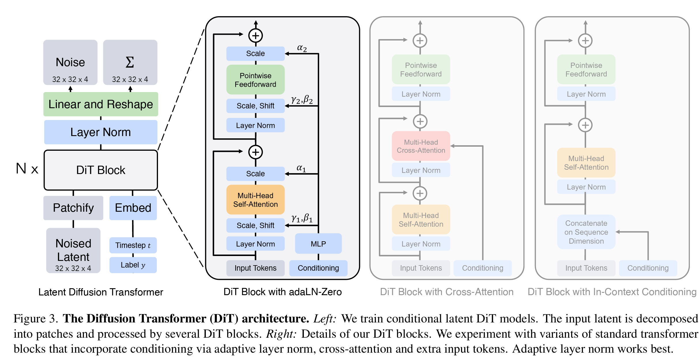
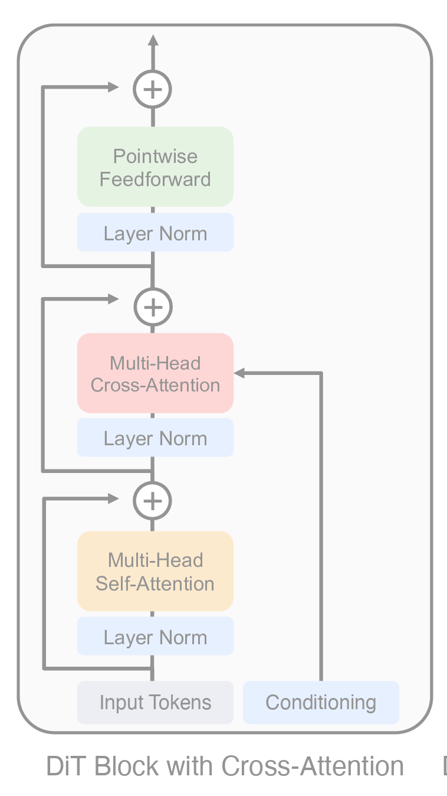
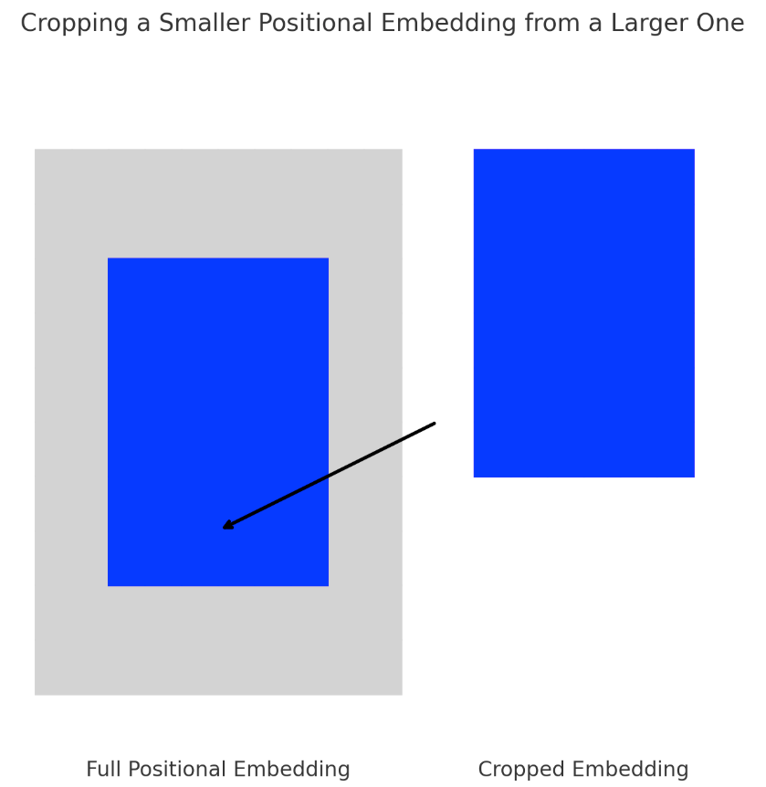
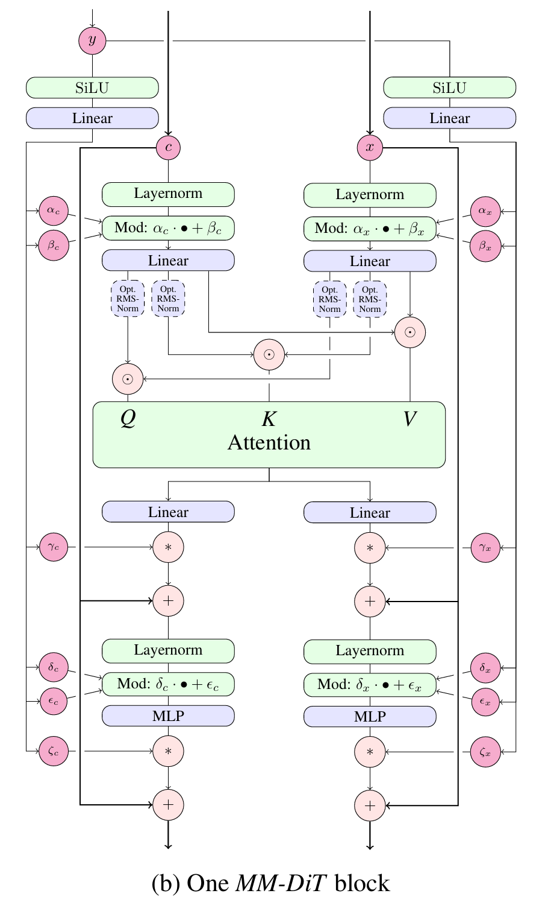
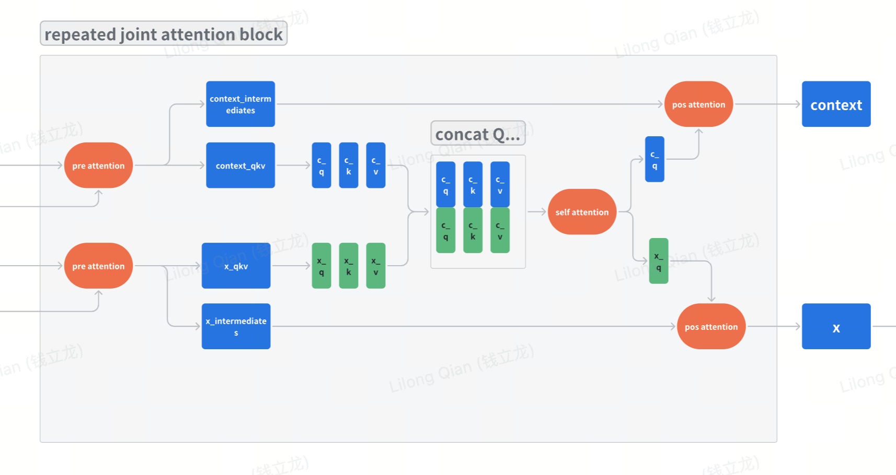
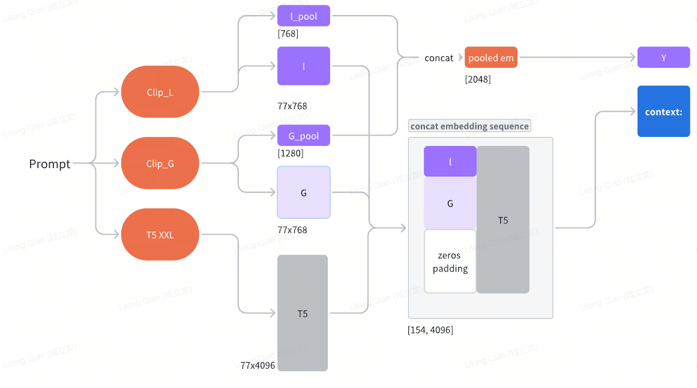
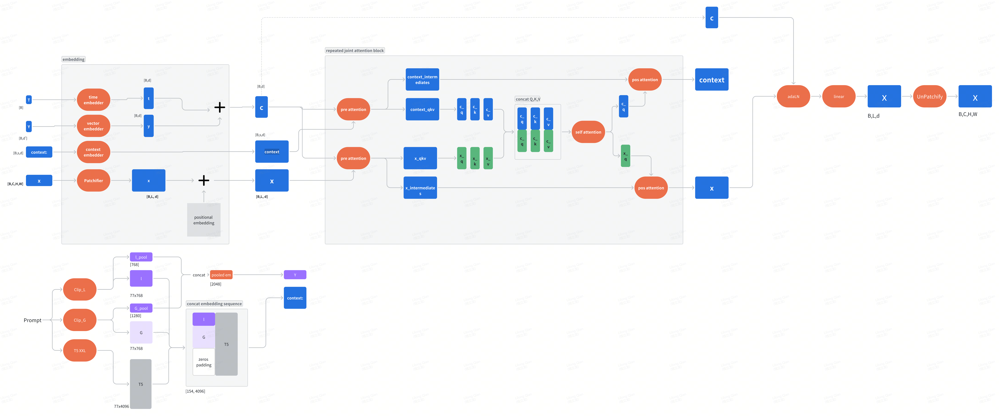

# [SD3] Scaling Rectified Flow Transformers for High-Resolution Image Synthesis

> [Paper: Scaling Rectified Flow Transformers for High-Resolution Image Synthesis
](https://arxiv.org/pdf/2403.03206)

Before reading this paper, we suggest reader to undertand the flow matching chapter first.

## Abstract

- Establish the practic for the rectified flow

## Introduction

- The forward path from data to noise is important in efficient training

  - Fails to remove all noise from the data (? now understand what this meaning)
  - affect sampling efficiency
  - curved paths required more integration steps
  - straight path has less error accumulations
- No large size experiments for class conditional rectified flow models
  - Introduce **re-weighting of the noise scales** in rectified flow models

- Text representation fussion
  - claim that text representation fed into model directly is not **ideal**
  - Introduce **new architecture** for information flow between text and image

## Preliminary

- Refer [Diffusion Transformer](../../chapter7_diffusion/DiT.md) for the details of DiT model

> This section revisted the flow matching scheme

## Network Structure
### VAE
In the previous stable diffusion models, the VAE transform the original image of shape

$$ [H,W,3] \longrightarrow [\frac{H}{8},\frac{W}{8},d], \quad d=4$$


Increase $d$ can improve the performance as described in the above table.

Let consider the details of the SDVAE carefully

=== "SDVAE"

    ```py3 title='SDVAE'
    class SDVAE(torch.nn.Module):
        def **init**(self, dtype=torch.float32, device=None):
            super().**init**()
            self.encoder = VAEEncoder(dtype=dtype, device=device)
            self.decoder = VAEDecoder(dtype=dtype, device=device)

        @torch.autocast("cuda", dtype=torch.float16)
        def decode(self, latent):
            return self.decoder(latent)

        @torch.autocast("cuda", dtype=torch.float16)
        def encode(self, image):
            hidden = self.encoder(image)
            mean, logvar = torch.chunk(hidden, 2, dim=1)
            logvar = torch.clamp(logvar, -30.0, 20.0)
            std = torch.exp(0.5 * logvar)
            return mean + std * torch.randn_like(mean)
    ```

    encoder predicted the mean and log variance.   And then saples by reparametrization.
    The encoder outputs a hidden representation, which is then split into a **mean** (\(\mu\)) and **log-variance** (\(\log \sigma^2\)):

    $$
    h = \text{Encoder}(x)
    $$


    $$
    \mu, \log\sigma^2 = \text{split}(h)
    $$


    The **log-variance** is clamped to prevent extreme values:

    $$
    \log \sigma^2 = \text{clamp}(\log \sigma^2, -30, 20)
    $$


    The standard deviation is computed as:

    $$
    \sigma = \exp\left(\frac{1}{2} \log \sigma^2\right)
    $$


    Using the **reparameterization trick**, the latent variable \( z \) is sampled as:

    $$
    z = \mu + \sigma \cdot \epsilon, \quad \text{where } \epsilon \sim \mathcal{N}(0, I)
    $$


    #### **Decoding Step:**
    The decoder takes the latent variable \( z \) and reconstructs the image:

    $$
    \hat{x} = \text{Decoder}(z)
    $$


    where \(\hat{x}\) is the reconstructed image.

    These equations describe how the VAE transforms input images into a latent space representation and reconstructs them using the decoder.

=== "VAEEncoder"
    ```py3
    class VAEEncoder(torch.nn.Module):
        def __init__(self, ch=128, ch_mult=(1,2,4,4), num_res_blocks=2, in_channels=3, z_channels=16, dtype=torch.float32, device=None):
            super().__init__()
            self.num_resolutions = len(ch_mult)
            self.num_res_blocks = num_res_blocks
            # downsampling
            self.conv_in = torch.nn.Conv2d(in_channels, ch, kernel_size=3, stride=1, padding=1, dtype=dtype, device=device)
            in_ch_mult = (1,) + tuple(ch_mult)
            self.in_ch_mult = in_ch_mult
            self.down = torch.nn.ModuleList()
            for i_level in range(self.num_resolutions):
                block = torch.nn.ModuleList()
                attn = torch.nn.ModuleList()
                block_in = ch*in_ch_mult[i_level]
                block_out = ch*ch_mult[i_level]
                for i_block in range(num_res_blocks):
                    block.append(ResnetBlock(in_channels=block_in, out_channels=block_out, dtype=dtype, device=device))
                    block_in = block_out
                down = torch.nn.Module()
                down.block = block
                down.attn = attn
                if i_level != self.num_resolutions - 1:
                    down.downsample = Downsample(block_in, dtype=dtype, device=device)
                self.down.append(down)
            # middle
            self.mid = torch.nn.Module()
            self.mid.block_1 = ResnetBlock(in_channels=block_in, out_channels=block_in, dtype=dtype, device=device)
            self.mid.attn_1 = AttnBlock(block_in, dtype=dtype, device=device)
            self.mid.block_2 = ResnetBlock(in_channels=block_in, out_channels=block_in, dtype=dtype, device=device)
            # end
            self.norm_out = Normalize(block_in, dtype=dtype, device=device)
            self.conv_out = torch.nn.Conv2d(block_in, 2 * z_channels, kernel_size=3, stride=1, padding=1, dtype=dtype, device=device)
            self.swish = torch.nn.SiLU(inplace=True)
        def forward(self, x):
            # downsampling
            hs = [self.conv_in(x)]
            for i_level in range(self.num_resolutions):
                for i_block in range(self.num_res_blocks):
                    h = self.down[i_level].block[i_block](hs[-1])
                    hs.append(h)
                if i_level != self.num_resolutions-1:
                    hs.append(self.down[i_level].downsample(hs[-1]))
            # middle
            h = hs[-1]
            h = self.mid.block_1(h)
            h = self.mid.attn_1(h)
            h = self.mid.block_2(h)
            # end
            h = self.norm_out(h)
            h = self.swish(h)
            h = self.conv_out(h)
            return h
    ```

    The code is same as that in the LDM, see more details in 

    Here is an updated table summarizing the **VAEEncoder** feature map shapes, including the **network components** (e.g., ResNet blocks, self-attention layers, convolutions, etc.) at each stage.

    | **Stage**               | **Resolution (H × W)**                          | **Channels**       | **Downsampling Applied?** | **Network Components** |
    |-------------------------|-------------------------------------------------|--------------------|----------------------|-------------------------|
    | **Input Image**         | \( H \times W \)                                | 3                  | No                   | Raw image input |
    | **Conv In**             | \( H \times W \)                                | 128                | No                   | \(3 \times 3\) Conv layer |
    | **Downsampling Level 1** | \( H \times W \) → \( \frac{H}{2} \times \frac{W}{2} \) | 128 → 256 | ✅ Yes | 2 × ResNet Blocks + \(3 \times 3\) Downsampling |
    | **Downsampling Level 2** | \( \frac{H}{2} \times \frac{W}{2} \) → \( \frac{H}{4} \times \frac{W}{4} \) | 256 → 512 | ✅ Yes | 2 × ResNet Blocks + \(3 \times 3\) Downsampling |
    | **Downsampling Level 3** | \( \frac{H}{4} \times \frac{W}{4} \) → \( \frac{H}{8} \times \frac{W}{8} \) | 512 → 512 | ✅ Yes | 2 × ResNet Blocks + \(3 \times 3\) Downsampling |
    | **Middle (Bottleneck)** | \( \frac{H}{8} \times \frac{W}{8} \)            | 512                | ❌ No  | 1 × ResNet Block + 1 × Self-Attention Block + 1 × ResNet Block |
    | **Final Output**        | \( \frac{H}{8} \times \frac{W}{8} \)            | 32 (2 × z_channels) | ❌ No  | Normalization + Swish + \(3 \times 3\) Conv layer (outputs mean & log-variance) |

    ### **Key Observations**
    - **ResNet Blocks** are used at every resolution level to refine features.
    - **Self-Attention is applied only in the middle (bottleneck)** to capture global dependencies.
    - **Downsampling occurs at levels 1, 2, and 3**, reducing spatial dimensions by half each time.
    - The **final layer outputs mean & log-variance** of the latent distribution for sampling.

=== "VAEDecoder"

    ```py3 title="VAEDecoder"
    class VAEDecoder(torch.nn.Module):
        def __init__(self, ch=128, out_ch=3, ch_mult=(1, 2, 4, 4), num_res_blocks=2, resolution=256, z_channels=16, dtype=torch.float32, device=None):
            super().__init__()
            self.num_resolutions = len(ch_mult)
            self.num_res_blocks = num_res_blocks
            block_in = ch * ch_mult[self.num_resolutions - 1]
            curr_res = resolution // 2 ** (self.num_resolutions - 1)
            # z to block_in
            self.conv_in = torch.nn.Conv2d(z_channels, block_in, kernel_size=3, stride=1, padding=1, dtype=dtype, device=device)
            # middle
            self.mid = torch.nn.Module()
            self.mid.block_1 = ResnetBlock(in_channels=block_in, out_channels=block_in, dtype=dtype, device=device)
            self.mid.attn_1 = AttnBlock(block_in, dtype=dtype, device=device)
            self.mid.block_2 = ResnetBlock(in_channels=block_in, out_channels=block_in, dtype=dtype, device=device)
            # upsampling
            self.up = torch.nn.ModuleList()
            for i_level in reversed(range(self.num_resolutions)):
                block = torch.nn.ModuleList()
                block_out = ch * ch_mult[i_level]
                for i_block in range(self.num_res_blocks + 1):
                    block.append(ResnetBlock(in_channels=block_in, out_channels=block_out, dtype=dtype, device=device))
                    block_in = block_out
                up = torch.nn.Module()
                up.block = block
                if i_level != 0:
                    up.upsample = Upsample(block_in, dtype=dtype, device=device)
                    curr_res = curr_res * 2
                self.up.insert(0, up) # prepend to get consistent order
            # end
            self.norm_out = Normalize(block_in, dtype=dtype, device=device)
            self.conv_out = torch.nn.Conv2d(block_in, out_ch, kernel_size=3, stride=1, padding=1, dtype=dtype, device=device)
            self.swish = torch.nn.SiLU(inplace=True)
        def forward(self, z):
            # z to block_in
            hidden = self.conv_in(z)
            # middle
            hidden = self.mid.block_1(hidden)
            hidden = self.mid.attn_1(hidden)
            hidden = self.mid.block_2(hidden)
            # upsampling
            for i_level in reversed(range(self.num_resolutions)):
                for i_block in range(self.num_res_blocks + 1):
                    hidden = self.up[i_level].block[i_block](hidden)
                if i_level != 0:
                    hidden = self.up[i_level].upsample(hidden)
            # end
            hidden = self.norm_out(hidden)
            hidden = self.swish(hidden)
            hidden = self.conv_out(hidden)
            return hidden
    ```

    | **Stage**               | **Resolution (H × W)**                          | **Channels**       | **Upsampling Applied?** | **Network Components** |
    |-------------------------|-------------------------------------------------|--------------------|----------------------|-------------------------|
    | **Latent Input**        | \( \frac{H}{8} \times \frac{W}{8} \)            | 16                 | No                   | Raw latent space representation \( z \) |
    | **Conv In**             | \( \frac{H}{8} \times \frac{W}{8} \)            | 512                | No                   | \(3 \times 3\) Conv layer |
    | **Middle (Bottleneck)** | \( \frac{H}{8} \times \frac{W}{8} \)            | 512                | No                   | 1 × ResNet Block + 1 × Self-Attention Block + 1 × ResNet Block |
    | **Upsampling Level 1**  | \( \frac{H}{8} \times \frac{W}{8} \) → \( \frac{H}{4} \times \frac{W}{4} \) | 512 → 512 | ✅ Yes | 3 × ResNet Blocks + Upsample (\(2 \times\)) |
    | **Upsampling Level 2**  | \( \frac{H}{4} \times \frac{W}{4} \) → \( \frac{H}{2} \times \frac{W}{2} \) | 512 → 256 | ✅ Yes | 3 × ResNet Blocks + Upsample (\(2 \times\)) |
    | **Upsampling Level 3**  | \( \frac{H}{2} \times \frac{W}{2} \) → \( H \times W \) | 256 → 128 | ✅ Yes | 3 × ResNet Blocks + Upsample (\(2 \times\)) |
    | **Upsampling Level 4**  | \( H \times W \)                                | 128 → 128 | ❌ No | 3 × ResNet Blocks (Final stage, no upsampling) |
    | **Final Processing**    | \( H \times W \)                                | 3                  | ❌ No                | Normalize → Swish Activation → \(3 \times 3\) Conv layer |

    The VAEDecoder reconstructs an image from a latent space representation by progressively upsampling and refining features through ResNet blocks, self-attention, and convolutional layers.

=== "AttnBlock"

    ```py3 title="AttnBlock"
    class AttnBlock(torch.nn.Module):
    def __init__(self, in_channels, dtype=torch.float32, device=None):
        super().__init__()
        self.norm = Normalize(in_channels, dtype=dtype, device=device)
        self.q = torch.nn.Conv2d(in_channels, in_channels, kernel_size=1, stride=1, padding=0, dtype=dtype, device=device)
        self.k = torch.nn.Conv2d(in_channels, in_channels, kernel_size=1, stride=1, padding=0, dtype=dtype, device=device)
        self.v = torch.nn.Conv2d(in_channels, in_channels, kernel_size=1, stride=1, padding=0, dtype=dtype, device=device)
        self.proj_out = torch.nn.Conv2d(in_channels, in_channels, kernel_size=1, stride=1, padding=0, dtype=dtype, device=device)
    def forward(self, x):
        hidden = self.norm(x)
        q = self.q(hidden)
        k = self.k(hidden)
        v = self.v(hidden)
        b, c, h, w = q.shape
        q, k, v = map(lambda x: einops.rearrange(x, "b c h w -> b 1 (h w) c").contiguous(), (q, k, v))
        hidden = torch.nn.functional.scaled_dot_product_attention(q, k, v)  # scale is dim ** -0.5 per default
        hidden = einops.rearrange(hidden, "b 1 (h w) c -> b c h w", h=h, w=w, c=c, b=b)
        hidden = self.proj_out(hidden)
        return x + hidden
    ```
    which is a standard self attention block.

=== "resnet block"
    ```py3 title="ResnetBlock"
    def Normalize(in_channels, num_groups=32, dtype=torch.float32, device=None):
        return torch.nn.GroupNorm(num_groups=num_groups, num_channels=in_channels, eps=1e-6, affine=True, dtype=dtype, device=device)
    class ResnetBlock(torch.nn.Module):
        def **init**(self, *, in_channels, out_channels=None, dtype=torch.float32, device=None):
            super().**init**()
            self.in_channels = in_channels
            out_channels = in_channels if out_channels is None else out_channels
            self.out_channels = out_channels
            self.norm1 = Normalize(in_channels, dtype=dtype, device=device)
            self.conv1 = torch.nn.Conv2d(in_channels, out_channels, kernel_size=3, stride=1, padding=1, dtype=dtype, device=device)
            self.norm2 = Normalize(out_channels, dtype=dtype, device=device)
            self.conv2 = torch.nn.Conv2d(out_channels, out_channels, kernel_size=3, stride=1, padding=1, dtype=dtype, device=device)
            if self.in_channels != self.out_channels:
                self.nin_shortcut = torch.nn.Conv2d(in_channels, out_channels, kernel_size=1, stride=1, padding=0, dtype=dtype, device=device)
            else:
                self.nin_shortcut = None
            self.swish = torch.nn.SiLU(inplace=True)
        def forward(self, x):
            hidden = x
            hidden = self.norm1(hidden)
            hidden = self.swish(hidden)
            hidden = self.conv1(hidden)
            hidden = self.norm2(hidden)
            hidden = self.swish(hidden)
            hidden = self.conv2(hidden)
            if self.in_channels != self.out_channels:
                x = self.nin_shortcut(x)
            return x + hidden
    ```

    $$
    F(X) = \text{Conv2} \left( \text{Swish} \left( \text{Norm2} \left( \text{Conv1} \left( \text{Swish} \left( \text{Norm1}(X) \right) \right) \right) \right) \right)
    $$


    The **final output**  is:

    $$   Y = X + F(X) $$

### Patchify

=== "PatchEmbed"
    ```py3 title="Patchify"
    class PatchEmbed(nn.Module):
        """ 2D Image to Patch Embedding"""
        def __init__(
                self,
                img_size: Optional[int] = 224,
                patch_size: int = 16,
                in_chans: int = 3,
                embed_dim: int = 768,
                flatten: bool = True,
                bias: bool = True,
                strict_img_size: bool = True,
                dynamic_img_pad: bool = False,
                dtype=None,
                device=None,
        ):
            super().__init__()
            self.patch_size = (patch_size, patch_size)
            if img_size is not None:
                self.img_size = (img_size, img_size)
                self.grid_size = tuple([s // p for s, p in zip(self.img_size, self.patch_size)])
                self.num_patches = self.grid_size[0] * self.grid_size[1]
            else:
                self.img_size = None
                self.grid_size = None
                self.num_patches = None
            # flatten spatial dim and transpose to channels last, kept for bwd compat
            self.flatten = flatten
            self.strict_img_size = strict_img_size
            self.dynamic_img_pad = dynamic_img_pad
            self.proj = nn.Conv2d(in_chans, embed_dim, kernel_size=patch_size, stride=patch_size, bias=bias, dtype=dtype, device=device)
        def forward(self, x):
            B, C, H, W = x.shape
            x = self.proj(x)
            if self.flatten:
                x = x.flatten(2).transpose(1, 2)  # NCHW -> NLC
            return x
    ```

Use the convolution to do the patchify that convert the original image from [B,C,H,W] to $[B,N,C]$, where $N=\frac{H}{\text{patch size}}\times\frac{W}{\text{patch size}}=\frac{H\times W}{4}$. The convolutional kernel size is $patch_size\times patch_size$.

### TimeEmbedding

=== "TimestepEmbedder"
    ```py3
    class TimestepEmbedder(nn.Module):
        """Embeds scalar timesteps into vector representations."""

        def __init__(self, hidden_size, frequency_embedding_size=256, dtype=None, device=None):
            super().__init__()
            self.mlp = nn.Sequential(
                nn.Linear(frequency_embedding_size, hidden_size, bias=True, dtype=dtype, device=device),
                nn.SiLU(),
                nn.Linear(hidden_size, hidden_size, bias=True, dtype=dtype, device=device),
            )
            self.frequency_embedding_size = frequency_embedding_size

        @staticmethod
        def timestep_embedding(t, dim, max_period=10000):
            """
            Create sinusoidal timestep embeddings.
            :param t: a 1-D Tensor of N indices, one per batch element.
                            These may be fractional.
            :param dim: the dimension of the output.
            :param max_period: controls the minimum frequency of the embeddings.
            :return: an (N, D) Tensor of positional embeddings.
            """
            half = dim // 2
            freqs = torch.exp(
                -math.log(max_period)
                * torch.arange(start=0, end=half, dtype=torch.float32)
                / half
            ).to(device=t.device)
            args = t[:, None].float() * freqs[None]
            embedding = torch.cat([torch.cos(args), torch.sin(args)], dim=-1)
            if dim % 2:
                embedding = torch.cat([embedding, torch.zeros_like(embedding[:, :1])], dim=-1)
            if torch.is_floating_point(t):
                embedding = embedding.to(dtype=t.dtype)
            return embedding

        def forward(self, t, dtype, **kwargs):
            t_freq = self.timestep_embedding(t, self.frequency_embedding_size).to(dtype)
            t_emb = self.mlp(t_freq)
            return t_emb
    ```

The **timestep embedding** function generates a vector representation of time \( t \) using **sinusoidal embeddings**. The formula can be rewritten as a single vector equation.

**Embedding as a Vector**
For a given timestep \( t \), the embedding vector **\( E_t \)** is computed as:

$$
E_t = \left[ \cos\left(t \cdot f_1\right), \sin\left(t \cdot f_1\right), \cos\left(t \cdot f_2\right), \sin\left(t \cdot f_2\right), \dots, \cos\left(t \cdot f_{\frac{D}{2}}\right), \sin\left(t \cdot f_{\frac{D}{2}}\right) \right]
$$

where:

- \( f_i = e^{-\frac{\log(\text{max\_period})}{D/2} \cdot i} \) are the frequency components.
- \( D \) is the embedding dimension.
- The final embedding vector **\( E_t \)** has shape **\( (D,) \)**.

If \( D \) is **odd**, an extra zero is appended:

$$
E_t = \left[ E_t, 0 \right]
$$

This vector representation ensures **smooth temporal encoding** and is widely used in **diffusion models, transformers, and time-aware architectures**. 🚀

### MM-DiT



The overall structure of the MM-DiT network


In each MM-DiT Block, the text context and image context are fed into the attention by concatenation

#### DiT Block
=== "DismantledBlock"

    ```python3
    # code
    class DismantledBlock(nn.Module):
        """A DiT block with gated adaptive layer norm (adaLN) conditioning."""
        ATTENTION_MODES = ("xformers", "torch", "torch-hb", "math", "debug")
        def __init__(
            self,
            hidden_size: int,
            num_heads: int,
            mlp_ratio: float = 4.0,
            attn_mode: str = "xformers",
            qkv_bias: bool = False,
            pre_only: bool = False,
            rmsnorm: bool = False,
            scale_mod_only: bool = False,
            swiglu: bool = False,
            qk_norm: Optional[str] = None,
            dtype=None,
            device=None,
            **block_kwargs,
        ):
            super().__init__()
            assert attn_mode in self.ATTENTION_MODES
            if not rmsnorm:
                self.norm1 = nn.LayerNorm(hidden_size, elementwise_affine=False, eps=1e-6, dtype=dtype, device=device)
            else:
                self.norm1 = RMSNorm(hidden_size, elementwise_affine=False, eps=1e-6)
            self.attn = SelfAttention(dim=hidden_size, num_heads=num_heads, qkv_bias=qkv_bias, attn_mode=attn_mode, pre_only=pre_only, qk_norm=qk_norm, rmsnorm=rmsnorm, dtype=dtype, device=device)
            if not pre_only:
                if not rmsnorm:
                    self.norm2 = nn.LayerNorm(hidden_size, elementwise_affine=False, eps=1e-6, dtype=dtype, device=device)
                else:
                    self.norm2 = RMSNorm(hidden_size, elementwise_affine=False, eps=1e-6)
            mlp_hidden_dim = int(hidden_size * mlp_ratio)
            if not pre_only:
                if not swiglu:
                    self.mlp = Mlp(in_features=hidden_size, hidden_features=mlp_hidden_dim, act_layer=nn.GELU(approximate="tanh"), dtype=dtype, device=device)
                else:
                    self.mlp = SwiGLUFeedForward(dim=hidden_size, hidden_dim=mlp_hidden_dim, multiple_of=256)
            self.scale_mod_only = scale_mod_only
            if not scale_mod_only:
                n_mods = 6 if not pre_only else 2
            else:
                n_mods = 4 if not pre_only else 1
            self.adaLN_modulation = nn.Sequential(nn.SiLU(), nn.Linear(hidden_size, n_mods * hidden_size, bias=True, dtype=dtype, device=device))
            self.pre_only = pre_only
        def pre_attention(self, x: torch.Tensor, c: torch.Tensor):
            assert x is not None, "pre_attention called with None input"
            if not self.pre_only:
                if not self.scale_mod_only:
                    shift_msa, scale_msa, gate_msa, shift_mlp, scale_mlp, gate_mlp = self.adaLN_modulation(c).chunk(6, dim=1)
                else:
                    shift_msa = None
                    shift_mlp = None
                    scale_msa, gate_msa, scale_mlp, gate_mlp = self.adaLN_modulation(c).chunk(4, dim=1)
                qkv = self.attn.pre_attention(modulate(self.norm1(x), shift_msa, scale_msa))
                return qkv, (x, gate_msa, shift_mlp, scale_mlp, gate_mlp)
            else:
                if not self.scale_mod_only:
                    shift_msa, scale_msa = self.adaLN_modulation(c).chunk(2, dim=1)
                else:
                    shift_msa = None
                    scale_msa = self.adaLN_modulation(c)
                qkv = self.attn.pre_attention(modulate(self.norm1(x), shift_msa, scale_msa))
                return qkv, None
        def post_attention(self, attn, x, gate_msa, shift_mlp, scale_mlp, gate_mlp):
            assert not self.pre_only
            x = x + gate_msa.unsqueeze(1) * self.attn.post_attention(attn)
            x = x + gate_mlp.unsqueeze(1) * self.mlp(modulate(self.norm2(x), shift_mlp, scale_mlp))
            return x
        def forward(self, x: torch.Tensor, c: torch.Tensor) -> torch.Tensor:
            assert not self.pre_only
            (q, k, v), intermediates = self.pre_attention(x, c)
            attn = attention(q, k, v, self.attn.num_heads)
            return self.post_attention(attn, *intermediates)
    ```

It got three main blocks

- pre_attention
- attention
- post_attention

=== "SelfAttention"
    ```py3
    class SelfAttention(nn.Module):
        ATTENTION_MODES = ("xformers", "torch", "torch-hb", "math", "debug")
        def **init**(
            self,
            dim: int,
            num_heads: int = 8,
            qkv_bias: bool = False,
            qk_scale: Optional[float] = None,
            attn_mode: str = "xformers",
            pre_only: bool = False,
            qk_norm: Optional[str] = None,
            rmsnorm: bool = False,
            dtype=None,
            device=None,
        ):
            super().**init**()
            self.num_heads = num_heads
            self.head_dim = dim // num_heads
            self.qkv = nn.Linear(dim, dim * 3, bias=qkv_bias, dtype=dtype, device=device)
            if not pre_only:
                self.proj = nn.Linear(dim, dim, dtype=dtype, device=device)
            assert attn_mode in self.ATTENTION_MODES
            self.attn_mode = attn_mode
            self.pre_only = pre_only
            if qk_norm == "rms":
                self.ln_q = RMSNorm(self.head_dim, elementwise_affine=True, eps=1.0e-6, dtype=dtype, device=device)
                self.ln_k = RMSNorm(self.head_dim, elementwise_affine=True, eps=1.0e-6, dtype=dtype, device=device)
            elif qk_norm == "ln":
                self.ln_q = nn.LayerNorm(self.head_dim, elementwise_affine=True, eps=1.0e-6, dtype=dtype, device=device)
                self.ln_k = nn.LayerNorm(self.head_dim, elementwise_affine=True, eps=1.0e-6, dtype=dtype, device=device)
            elif qk_norm is None:
                self.ln_q = nn.Identity()
                self.ln_k = nn.Identity()
            else:
                raise ValueError(qk_norm)
        def pre_attention(self, x: torch.Tensor):
            B, L, C = x.shape
            qkv = self.qkv(x)
            q, k, v = split_qkv(qkv, self.head_dim)
            q = self.ln_q(q).reshape(q.shape[0], q.shape[1], -1)
            k = self.ln_k(k).reshape(q.shape[0], q.shape[1], -1)
            return (q, k, v)
        def post_attention(self, x: torch.Tensor) -> torch.Tensor:
            assert not self.pre_only
            x = self.proj(x)
            return x
        def forward(self, x: torch.Tensor) -> torch.Tensor:
            (q, k, v) = self.pre_attention(x)
            x = attention(q, k, v, self.num_heads)
            x = self.post_attention(x)
            return x
    ```

It is a normal self attention network but with different layernorm layers. Also, it cobines the linear projections of Q,K, and V together into a single linear projection.

##### RMSNorm

Given an input feature vector $x$ with **dimension**  $d$, RMSNorm is defined as:

$$
\text{RMSNorm}(x) = \frac{x}{\text{RMS}(x)} \cdot \gamma
$$

where:

- **RMS (Root Mean Square) is calculated as:**

$$
\text{RMS}(x) = \sqrt{\frac{1}{d} \sum_{i=1}^{d} x_i^2 + \epsilon}
$$

- $\epsilon$ is a small constant to prevent division by zero.

- $\gamma$ is a **learnable scaling parameter**  (similar to LayerNorm).
If a **bias term**  $\beta$ is added, the formula becomes:

$$
\text{RMSNorm}(x) = \frac{x}{\text{RMS}(x)} \cdot \gamma + \beta
$$

#### MM-Dit

=== "cropped_pos_embed"

    ```py3
    def cropped_pos_embed(self, hw):
        assert self.pos_embed_max_size is not None
        p = self.x_embedder.patch_size[0]
        h, w = hw
        # patched size
        h = h // p
        w = w // p
        assert h <= self.pos_embed_max_size, (h, self.pos_embed_max_size)
        assert w <= self.pos_embed_max_size, (w, self.pos_embed_max_size)
        top = (self.pos_embed_max_size - h) // 2
        left = (self.pos_embed_max_size - w) // 2
        spatial_pos_embed = rearrange(
            self.pos_embed,
            "1 (h w) c -> 1 h w c",
            h=self.pos_embed_max_size,
            w=self.pos_embed_max_size,
        )
        spatial_pos_embed = spatial_pos_embed[:, top : top + h, left : left + w, :]
        spatial_pos_embed = rearrange(spatial_pos_embed, "1 h w c -> 1 (h w) c")
        return spatial_pos_embed
    ```

    This function **extracts a cropped positional embedding** from a larger precomputed embedding, ensuring spatial alignment in Transformers for varying input sizes.

    **Key Steps:**
    1. **Compute Patched Size** – Converts input dimensions to patch-based resolution.
    2. **Validate Size** – Ensures it does not exceed the stored max embedding size.
    3. **Center Crop** – Extracts the relevant portion of the positional embedding.
    4. **Format Adjustment** – Reshapes from **(1, H*W, C) → (1, H, W, C) → (1, h*w, C)**.

    **Purpose:**
    - Adapts positional embeddings for different resolutions.
    - Maintains spatial awareness in **ViT/DiT** models.
    - Enables flexibility without retraining embeddings.

    

=== "forward_core_with_concat"

    ```py3 title="forward_core_with_concat"
    def forward_core_with_concat(self, x: torch.Tensor, c_mod: torch.Tensor, context: Optional[torch.Tensor] = None) -> torch.Tensor:
        if self.register_length > 0:
            context = torch.cat((repeat(self.register, "1 ... -> b ...", b=x.shape[0]), context if context is not None else torch.Tensor([]).type_as(x)), 1)
        # context is B, L', D
        # x is B, L, D
        for block in self.joint_blocks:
            context, x = block(context, x, c=c_mod)
        x = self.final_layer(x, c_mod)  # (N, T, patch_size ** 2 * out_channels)
        return x
    ```

    It handles the case when context is None, the empty tensor will be created as context.
    If register_length>0, it will create 'register_length's tokens appending before the context sequence. Like

    $$[e_{pre_1},e_{pre_2},...,e_{context_1},e_{context_e},...,e_{context_L}]$$

    The Final Layer is a simple AdaLn module that is Same in DiT.

    The core structure in the function is the  the joint block. Let's device into the joint block further.

    ```py3
    class JointBlock(nn.Module):
        def __init__(self, *args, **kwargs):
            super().__init__()
            pre_only = kwargs.pop("pre_only")
            qk_norm = kwargs.pop("qk_norm", None)
            self.context_block = DismantledBlock(*args, pre_only=pre_only, qk_norm=qk_norm, **kwargs)
            self.x_block = DismantledBlock(*args, pre_only=False, qk_norm=qk_norm, **kwargs)

        def forward(self, *args, **kwargs):
            return block_mixing(*args, context_block=self.context_block, x_block=self.x_block, **kwargs)
    ```

    The joint block is composed of the block mixing, DismantledBlock. Let's check them step by step.

    The overall strucrure of the MM-DiT block is

    

=== "Final Layer"

    ```py3
    class FinalLayer(nn.Module):
        def __init__(self, hidden_size: int, patch_size: int, out_channels: int, total_out_channels: Optional[int] = None, dtype=None, device=None):
            super().__init__()
            self.norm_final = nn.LayerNorm(hidden_size, elementwise_affine=False, eps=1e-6, dtype=dtype, device=device)
            self.linear = (
                nn.Linear(hidden_size, patch_size * patch_size * out_channels, bias=True, dtype=dtype, device=device)
                if (total_out_channels is None)
                else nn.Linear(hidden_size, total_out_channels, bias=True, dtype=dtype, device=device)
            )
            self.adaLN_modulation = nn.Sequential(nn.SiLU(), nn.Linear(hidden_size, 2 * hidden_size, bias=True, dtype=dtype, device=device))
        def forward(self, x: torch.Tensor, c: torch.Tensor) -> torch.Tensor:
            shift, scale = self.adaLN_modulation(c).chunk(2, dim=1)
            x = modulate(self.norm_final(x), shift, scale)
            x = self.linear(x)
            return x
    ```

    It takes the same idea of adaLN which borrows from the paper DiT (style gan). See more details in [DiT](../../chapter7_diffusion/DiT.md).

=== "block_mixing"

    ```py3
    def block_mixing(context, x, context_block, x_block, c):
        assert context is not None, "block_mixing called with None context"
        context_qkv, context_intermediates = context_block.pre_attention(context, c)
        x_qkv, x_intermediates = x_block.pre_attention(x, c)
        o = []
        for t in range(3):
            o.append(torch.cat((context_qkv[t], x_qkv[t]), dim=1))
        q, k, v = tuple(o)
        attn = attention(q, k, v, x_block.attn.num_heads)
        context_attn, x_attn = (attn[:, : context_qkv[0].shape[1]], attn[:, context_qkv[0].shape[1] :])
        if not context_block.pre_only:
            context = context_block.post_attention(context_attn, *context_intermediates)
        else:
            context = None
        x = x_block.post_attention(x_attn, *x_intermediates)
        return context, x
    ```
    

    As shown above, the block mixing is a attention block, that first process `context` and `x` seperately, and concat them together to do self attention, (which can be considered as the cross attention from each other by concating the information in the K,V).

    It need further to check what is the context_block, and x_block, which are same attention network structure

=== "DismantledBlock"

    ```py3
    class DismantledBlock(nn.Module):
        ATTENTION_MODES = ("xformers", "torch", "torch-hb", "math", "debug")
        def __init__(
            self,
            hidden_size: int,
            num_heads: int,
            mlp_ratio: float = 4.0,
            attn_mode: str = "xformers",
            qkv_bias: bool = False,
            pre_only: bool = False,
            rmsnorm: bool = False,
            scale_mod_only: bool = False,
            swiglu: bool = False,
            qk_norm: Optional[str] = None,
            dtype=None,
            device=None,
            **block_kwargs,
        ):
            super().__init__()
            assert attn_mode in self.ATTENTION_MODES
            if not rmsnorm:
                self.norm1 = nn.LayerNorm(hidden_size, elementwise_affine=False, eps=1e-6, dtype=dtype, device=device)
            else:
                self.norm1 = RMSNorm(hidden_size, elementwise_affine=False, eps=1e-6)
            self.attn = SelfAttention(dim=hidden_size, num_heads=num_heads, qkv_bias=qkv_bias, attn_mode=attn_mode, pre_only=pre_only, qk_norm=qk_norm, rmsnorm=rmsnorm, dtype=dtype, device=device)
            if not pre_only:
                if not rmsnorm:
                    self.norm2 = nn.LayerNorm(hidden_size, elementwise_affine=False, eps=1e-6, dtype=dtype, device=device)
                else:
                    self.norm2 = RMSNorm(hidden_size, elementwise_affine=False, eps=1e-6)
            mlp_hidden_dim = int(hidden_size * mlp_ratio)
            if not pre_only:
                if not swiglu:
                    self.mlp = Mlp(in_features=hidden_size, hidden_features=mlp_hidden_dim, act_layer=nn.GELU(approximate="tanh"), dtype=dtype, device=device)
                else:
                    self.mlp = SwiGLUFeedForward(dim=hidden_size, hidden_dim=mlp_hidden_dim, multiple_of=256)
            self.scale_mod_only = scale_mod_only
            if not scale_mod_only:
                n_mods = 6 if not pre_only else 2
            else:
                n_mods = 4 if not pre_only else 1
            self.adaLN_modulation = nn.Sequential(nn.SiLU(), nn.Linear(hidden_size, n_mods * hidden_size, bias=True, dtype=dtype, device=device))
            self.pre_only = pre_only
        def pre_attention(self, x: torch.Tensor, c: torch.Tensor):
            assert x is not None, "pre_attention called with None input"
            if not self.pre_only:
                if not self.scale_mod_only:
                    shift_msa, scale_msa, gate_msa, shift_mlp, scale_mlp, gate_mlp = self.adaLN_modulation(c).chunk(6, dim=1)
                else:
                    shift_msa = None
                    shift_mlp = None
                    scale_msa, gate_msa, scale_mlp, gate_mlp = self.adaLN_modulation(c).chunk(4, dim=1)
                qkv = self.attn.pre_attention(modulate(self.norm1(x), shift_msa, scale_msa))
                return qkv, (x, gate_msa, shift_mlp, scale_mlp, gate_mlp)
            else:
                if not self.scale_mod_only:
                    shift_msa, scale_msa = self.adaLN_modulation(c).chunk(2, dim=1)
                else:
                    shift_msa = None
                    scale_msa = self.adaLN_modulation(c)
                qkv = self.attn.pre_attention(modulate(self.norm1(x), shift_msa, scale_msa))
                return qkv, None
        def post_attention(self, attn, x, gate_msa, shift_mlp, scale_mlp, gate_mlp):
            assert not self.pre_only
            x = x + gate_msa.unsqueeze(1) * self.attn.post_attention(attn)
            x = x + gate_mlp.unsqueeze(1) * self.mlp(modulate(self.norm2(x), shift_mlp, scale_mlp))
            return x
        def forward(self, x: torch.Tensor, c: torch.Tensor) -> torch.Tensor:
            assert not self.pre_only
            (q, k, v), intermediates = self.pre_attention(x, c)
            attn = attention(q, k, v, self.attn.num_heads)
            return self.post_attention(attn, *intermediates)
    ```


    Since in the mixing_block, only the pre_attention and the post_attention are called, Let's only look at these two functions only.

    ```py3
    def modulate(x, shift, scale):
        if shift is None:
            shift = torch.zeros_like(scale)
        return x * (1 + scale.unsqueeze(1)) + shift.unsqueeze(1)
    ```

    It take the idea of the adaIN from DiT paper. which modulate the shift and scale after the layer norm before and after the attention.
    Also inferit from the idea of DiT, it use the gate parameter to control the strength of the residule network after the self attention of `context` and `x`, which hope in the initial stage, the increament component in residule block could be 0 to obtain the stability of the training.

=== "SelfAttention"

    ```py3
    class SelfAttention(nn.Module):
        ATTENTION_MODES = ("xformers", "torch", "torch-hb", "math", "debug")
        def __init__(
            self,
            dim: int,
            num_heads: int = 8,
            qkv_bias: bool = False,
            qk_scale: Optional[float] = None,
            attn_mode: str = "xformers",
            pre_only: bool = False,
            qk_norm: Optional[str] = None,
            rmsnorm: bool = False,
            dtype=None,
            device=None,
        ):
            super().__init__()
            self.num_heads = num_heads
            self.head_dim = dim // num_heads
            self.qkv = nn.Linear(dim, dim * 3, bias=qkv_bias, dtype=dtype, device=device)
            if not pre_only:
                self.proj = nn.Linear(dim, dim, dtype=dtype, device=device)
            assert attn_mode in self.ATTENTION_MODES
            self.attn_mode = attn_mode
            self.pre_only = pre_only
            if qk_norm == "rms":
                self.ln_q = RMSNorm(self.head_dim, elementwise_affine=True, eps=1.0e-6, dtype=dtype, device=device)
                self.ln_k = RMSNorm(self.head_dim, elementwise_affine=True, eps=1.0e-6, dtype=dtype, device=device)
            elif qk_norm == "ln":
                self.ln_q = nn.LayerNorm(self.head_dim, elementwise_affine=True, eps=1.0e-6, dtype=dtype, device=device)
                self.ln_k = nn.LayerNorm(self.head_dim, elementwise_affine=True, eps=1.0e-6, dtype=dtype, device=device)
            elif qk_norm is None:
                self.ln_q = nn.Identity()
                self.ln_k = nn.Identity()
            else:
                raise ValueError(qk_norm)
        def pre_attention(self, x: torch.Tensor):
            B, L, C = x.shape
            qkv = self.qkv(x)
            q, k, v = split_qkv(qkv, self.head_dim)
            q = self.ln_q(q).reshape(q.shape[0], q.shape[1], -1)
            k = self.ln_k(k).reshape(q.shape[0], q.shape[1], -1)
            return (q, k, v)
        def post_attention(self, x: torch.Tensor) -> torch.Tensor:
            assert not self.pre_only
            x = self.proj(x)
            return x
        def forward(self, x: torch.Tensor) -> torch.Tensor:
            (q, k, v) = self.pre_attention(x)
            x = attention(q, k, v, self.num_heads)
            x = self.post_attention(x)
            return x
    ```
    In the Joint Block, only the `pre_attention` and `post_attention` are called.
    The pre_attention did the linear transform and the layer norm of the Q,K,V in the self attention mechanics before sending to the attention function. The layer norm can be chosed from the standard layer normalization, or the RSM_layer normalization or just Identity

    The post_attention did the linear transform of the output of the attention function. Increase the model capability, nothing special.

#### Condition Processing
Next, let's consider where the condition is from.

To have better prompt understanding, we used three text embedding models

- `clip_g.safetensors` (openclip bigG, same as SDXL)
- `clip_l.safetensors` (OpenAI CLIP-L, same as SDXL)
- `t5xxl.safetensors` (google T5-v1.1-XXL)



!!! note "sd3 prompt processing"

    The prompt processing in Stable Diffusion 3 involves multiple steps and components designed to transform text input into embedding representations suitable for image generation. Here is a summary of the process:


    1. **Text Encoding**:
          - The input text is encoded using the CLIP model. There are two versions of the CLIP model: `Clip_L` and `Clip_G`, each generating embeddings of different dimensions.
          - `Clip_L` produces a 77x768 embedding matrix.
          - `Clip_G` produces a 75x768 embedding matrix.

    2. **Pooling Operation**:
          - Pooling operations are applied to the CLIP embeddings to generate fixed-size vectors.
          - `L_pool` generates a 768-dimensional pooled vector.
          - `G_pool` generates a 1280-dimensional pooled vector.

    3. **Embedding Concatenation**:
          - Embeddings from different sources are concatenated to create a richer representation.
          - `L_pool` and `G_pool` are concatenated to form a 2048-dimensional pooled embedding vector.
          - The embedding sequences from `Clip_L` and `Clip_G` are concatenated to produce a 154x4096 embedding matrix.

    4. **Padding and Alignment**:
          - Zero padding (zeros padding) may be applied to ensure that the embedding sequences have consistent lengths.
          - For example, the embedding sequence from `G` is expanded from 75 to 154 to match the length of other embedding sequences.

    5. **Context Processing**:
          - The final embedding representations are used to provide context for image generation.
          - These embeddings are fed into the T5 model or other generative models for further processing to generate images.

    In summary, the prompt processing in Stable Diffusion 3 transforms text input into high-dimensional embedding representations through multiple steps. These representations are then used to generate images. The process involves the collaboration of multiple models, including CLIP and T5, to ensure that the generated images are highly relevant to the input text.

We have studied the network structure of the MM-DiT. To summary, the MM-DiT's contribution is

1. Use same idea of handling condition `c` by ==adaLN==
2. cross attention for the context (text/sequential information) and latent feature `x` by the dual path. Handle `context` and `x` seperatly but fed into attention by concating
3. use cropping positional embedding to support different resolution

Let draw the overrall structure of the diffusion model



### SD3 Inference Methods

Let's consider the stable diffusion 3 inference details

    ```py3
        def get_empty_latent(self, width, height):
            print("Prep an empty latent...")
            return torch.ones(1, 16, height // 8, width // 8, device="cpu") * 0.0609
        def gen_image(self, prompt=PROMPT, width=WIDTH, height=HEIGHT, steps=STEPS, cfg_scale=CFG_SCALE, seed=SEED, output=OUTPUT, init_image=INIT_IMAGE, denoise=DENOISE):
            latent = self.get_empty_latent(width, height)
            if init_image:
                image_data = Image.open(init_image)
                image_data = image_data.resize((width, height), Image.LANCZOS)
                latent = self.vae_encode(image_data)
                latent = SD3LatentFormat().process_in(latent)
            conditioning = self.get_cond(prompt)
            neg_cond = self.get_cond("")
            sampled_latent = self.do_sampling(latent, seed, conditioning, neg_cond, steps, cfg_scale, denoise if init_image else 1.0)
            image = self.vae_decode(sampled_latent)
            print(f"Will save to {output}")
            image.save(output)
            print("Done")
    ```

Instead of sampling from the Gaussian distribution, the SD3 samples with either

- a fixed initial value `0.0609`.
- given initial image

The overall structure is still follow from LDM, that first doing the diffusion steps in latent space and then use VAE decode to recover the RGB image.

For the sampling steps, it includes

1. positive prompt and negative prompt
2. CFG sampling with Euler steps

#### Positive prompt and negative prompt

    ```py3
        def do_sampling(self, latent, seed, conditioning, neg_cond, steps, cfg_scale, denoise=1.0) -> torch.Tensor:
            print("Sampling...")
            latent = latent.half().cuda()
            self.sd3.model = self.sd3.model.cuda()
            noise = self.get_noise(seed, latent).cuda()
            sigmas = self.get_sigmas(self.sd3.model.model_sampling, steps).cuda()
            sigmas = sigmas[int(steps * (1 - denoise)):]
            conditioning = self.fix_cond(conditioning)
            neg_cond = self.fix_cond(neg_cond)
            extra_args = { "cond": conditioning, "uncond": neg_cond, "cond_scale": cfg_scale }
            noise_scaled = self.sd3.model.model_sampling.noise_scaling(sigmas[0], noise, latent, self.max_denoise(sigmas))
            latent = sample_euler(CFGDenoiser(self.sd3.model), noise_scaled, sigmas, extra_args=extra_args)
            latent = SD3LatentFormat().process_out(latent)
            self.sd3.model = self.sd3.model.cpu()
            print("Sampling done")
            return latent
    ```

As mentioned in the above, the prompt will be processed into a pooled global embedding and a non-pooled sequential detail embedding. Consider both positive prompt and negative prompt, we will obtain two set of conditions

- cond
  - context
  - y
- uncond
  - context
  - y

In stable diffusion 3,


## Refereces

- stable diffusion 3 reading: <https://zhuanlan.zhihu.com/p/684068402?utm_source=chatgpt.com>
- [sd 3 inference code](https://github.com/Stability-AI/sd3-ref)
- [Instruct Training script based on SD3](https://github.com/huggingface/diffusers/blob/main/examples/instruct_pix2pix/train_instruct_pix2pix_sdxl.py)
- [Flexible PyTorch implementation of StableDiffusion-3 based on  diffusers](https://github.com/haoningwu3639/SimpleSDM-3)
- [Stable Diffusion 3 Fintune Guide](https://stabilityai.notion.site/Stable-Diffusion-3-Medium-Fine-tuning-Tutorial-17f90df74bce4c62a295849f0dc8fb7e)
