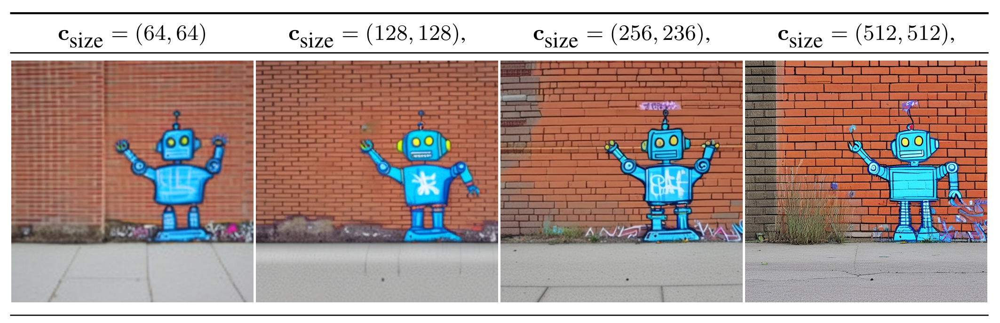
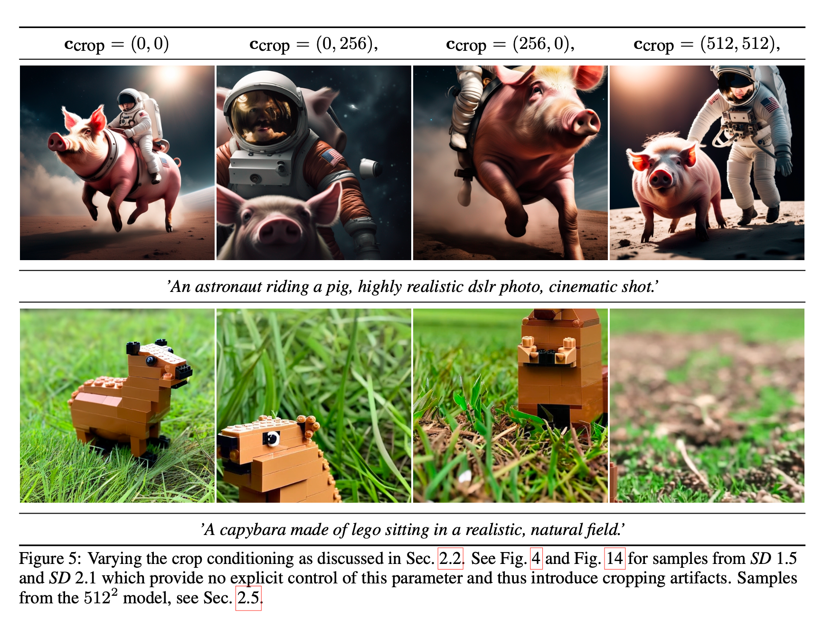
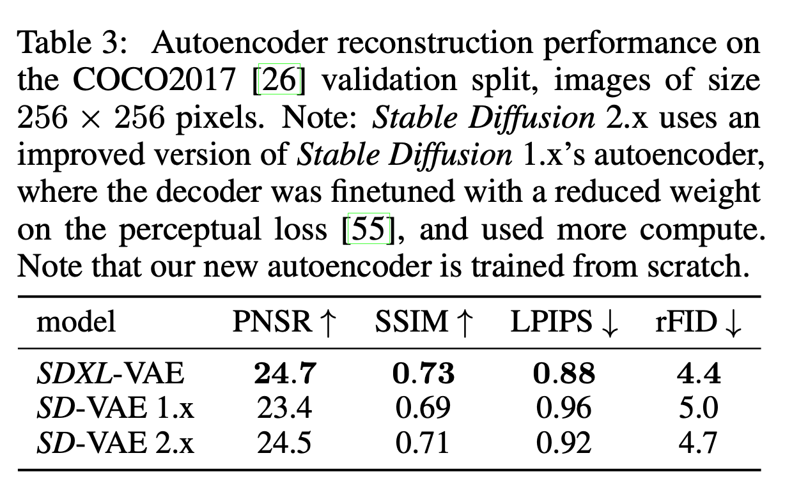

# Stable Diffusion Series
## VQ-GAN

- Year: 2020 Dec - 2022 Jan
- Paper:
  - [Taming Transformers for High-Resolution Image Synthesis](https://compvis.github.io/taming-transformers/)
- Repo: [taming-transformers](https://github.com/CompVis/taming-transformers)
- Organization: CompVis

Please refer to [VQ-GAN](../../chapter5_GAN/vq_gan.md) for more details.

## Stable Diffusion v0

- Year: Dec 2021 -Nov 2022
- Paper: [High-Resolution Image Synthesis with Latent Diffusion Models](https://arxiv.org/abs/2112.10752)
- Repo: [<https://github.com/Stability-AI/stablediffusion?tab=readme-ov-file>](https://github.com/CompVis/latent-diffusion)
- Organization: CompVis

Please refer to [LDM](../../chapter7_diffusion/ldm.md) for more details.

## Stable Diffusion v1

- Year
- Ideas
  - [High-Resolution Image Synthesis with Latent Diffusion Models](https://arxiv.org/abs/2112.10752)
  - [Classifier-Free Guidance Sampling](https://arxiv.org/pdf/2207.12598)
- Repo: [Stable_Diffusion_v1_Model_Card.md](https://github.com/CompVis/stable-diffusion/blob/main/Stable_Diffusion_v1_Model_Card.md)
- Organization: CompVis

### Summary

- **Architecture:**
  - A *latent diffusion model* that combines an autoencoder with a diffusion model operating in the autoencoder’s latent space.
  - **Image Encoding:** Images are downsampled by a factor of 8, converting an image from shape H x W x 3 to a latent representation of shape H/8 x W/8 x 4.
  - **Text Conditioning:** Uses a ViT-L/14 text encoder; its non-pooled output is integrated into the UNet backbone via cross-attention.

- **Training Objective:**
  - The model is trained to reconstruct the noise added to the latent representations, essentially predicting the noise in the latent space.

- **Training Data:**
  - Primarily trained on LAION-5B and various curated subsets, including:
    - *laion2B-en*
    - *laion-high-resolution* (for high-resolution images)
    - *laion-aesthetics v2 5+* (filtered for aesthetics and watermark probability)

- **Checkpoints Overview:**
  - **sd-v1-1.ckpt:**
    - 237k steps at 256x256 resolution (laion2B-en)
    - 194k steps at 512x512 resolution (laion-high-resolution)
  - **sd-v1-2.ckpt:**
    - Continued from v1-1; 515k steps at 512x512 using laion-aesthetics v2 5+ data.
  - **sd-v1-3.ckpt & sd-v1-4.ckpt:**
    - Both resumed from v1-2 with additional 10% text-conditioning drop to improve classifier-free guidance sampling.

- **Training Setup:**
  - **Hardware:** 32 x 8 x A100 GPUs
  - **Optimizer:** AdamW
  - **Batch Details:** Gradient accumulations and batch size set to a total of 2048 images per update
  - **Learning Rate:** Warmup to 0.0001 over 10,000 steps, then kept constant

### Difference between v0 and v1
The code is basically the same as Stable Diffusion v0, which is latent diffusion.

### Dataset
#### LAION-Aesthetics Dataset Summary

- **Overview:**
  - A curated subset of the larger LAION image-text dataset that emphasizes high-quality, visually appealing images.
  - Utilizes a deep learning–based aesthetic predictor to assign scores reflecting the perceived visual quality of each image.

- **Filtering Process:**
  - **Aesthetic Scoring:** Images are evaluated with the LAION-Aesthetics Predictor, and only those exceeding a certain score threshold (e.g., >5.0) are selected.
  - **Additional Filters:**
    - Ensures images have a minimum resolution (original size ≥ 512×512).
    - Applies a watermark probability filter to exclude images with a high likelihood of watermarks.

- **Purpose and Applications:**
  - Designed to serve as high-quality training data for generative models, such as Stable Diffusion.
  - Aims to improve the aesthetic quality of generated images by providing models with visually appealing training examples.

This dataset provided a smaller dataset with higher aesthetics scores, so that it may be used to fine-tune a model.

- 1,2B image-text pairs with predicted aesthetics scores of 4.5 or higher: [huggingface](https://huggingface.co/datasets/ChristophSchuhmann/improved_aesthetics_4.5plus)
- 939M image-text pairs with predicted aesthetics scores of 4.75 or higher: [huggingface](https://huggingface.co/datasets/ChristophSchuhmann/improved_aesthetics_4.75plus)
- 600M image-text pairs with predicted aesthetics scores of 5 or higher: [huggingface](https://huggingface.co/datasets/ChristophSchuhmann/improved_aesthetics_5)
- 12M image-text pairs with predicted aesthetics scores of 6 or higher: [huggingface](https://huggingface.co/datasets/ChristophSchuhmann/improved_aesthetics_6)
- 3M image-text pairs with predicted aesthetics scores of 6.25 or higher: [huggingface](https://huggingface.co/datasets/ChristophSchuhmann/improved_aesthetics_6.25)
- 625K image-text pairs with predicted aesthetics scores of 6.5 or higher: [huggingface](https://huggingface.co/datasets/ChristophSchuhmann/improved_aesthetics_6.5)

#### LAION-5B Dataset

- Massive Scale: Contains around 5 billion image-text pairs scraped from the internet.
- Diversity: Offers a broad spectrum of visual content and associated textual descriptions.
- Purpose: Designed to power large-scale machine learning and generative models, ensuring rich semantic variety.
- Open Access: Available for research and development, promoting transparency and innovation in
- Total size: 12 TB

## Stable Diffusion v2

- Year: Dec 2021 -Nov 2022
- Ideas:
  - /<https://arxiv.org/pdf/2204.06125>
  - <https://arxiv.org/pdf/2202.00512>
- repo: <https://github.com/Stability-AI/stablediffusion?tab=readme-ov-file>
- organization: Stability-AI

### Summary
Generated Image


Unchanged

1. VAE structure
2. Latent Diffusions Structure (text condition embedding changes)
3. Basic DDPM sampling (it has extra progressive sampling method)

The base model is still the latent diffusion. The main differences are:

1. Resolution. The original model is 512x512, we use 768x768 in the future.
2. Use the idea of progressive distillation for fast sampling
3. Use clip guided for text2image sampling

### Differences change details
> The code is still based on the original LDM repo
#### LatentDiffusion with condition processing
#### Image Embedding Condition
This used the image embedding as the condition to guide the generation

```py3 title="ImageEmbeddingConditionedLatentDiffusion"
class ImageEmbeddingConditionedLatentDiffusion(LatentDiffusion):
    def __init__(self, embedder_config, embedding_key="jpg", embedding_dropout=0.5,
                 freeze_embedder=True, noise_aug_config=None, *args, **kwargs):
        super().__init__(*args, **kwargs)
        self.embed_key = embedding_key
        self.embedding_dropout = embedding_dropout
        self._init_embedder(embedder_config, freeze_embedder)
        self._init_noise_aug(noise_aug_config)

    def _init_embedder(self, config, freeze=True):
        embedder = instantiate_from_config(config)
        if freeze:
            self.embedder = embedder.eval()
            self.embedder.train = disabled_train
            for param in self.embedder.parameters():
                param.requires_grad = False

    def _init_noise_aug(self, config):
        if config is not None:
            # use the KARLO schedule for noise augmentation on CLIP image embeddings
            noise_augmentor = instantiate_from_config(config)
            assert isinstance(noise_augmentor, nn.Module)
            noise_augmentor = noise_augmentor.eval()
            noise_augmentor.train = disabled_train
            self.noise_augmentor = noise_augmentor
        else:
            self.noise_augmentor = None

    def get_input(self, batch, k, cond_key=None, bs=None, **kwargs):
        outputs = LatentDiffusion.get_input(self, batch, k, bs=bs, **kwargs)
        z, c = outputs[0], outputs[1]
        img = batch[self.embed_key][:bs]
        img = rearrange(img, 'b h w c -> b c h w')
        c_adm = self.embedder(img)
        if self.noise_augmentor is not None:
            c_adm, noise_level_emb = self.noise_augmentor(c_adm)
            # assume this gives embeddings of noise levels
            c_adm = torch.cat((c_adm, noise_level_emb), 1)
        if self.training:
            c_adm = torch.bernoulli((1. - self.embedding_dropout) * torch.ones(c_adm.shape[0],
                                                                               device=c_adm.device)[:, None]) * c_adm
        all_conds = {"c_crossattn": [c], "c_adm": c_adm}
        noutputs = [z, all_conds]
        noutputs.extend(outputs[2:])
        return noutputs
```

Compared with previous LDM, it added another variable `c_adm` for the clip image embedding of the images. Please see [unCLIP](./dalle_series.md) for the details on taking CLIP image embedding as condition.

Refer to the code explanation of latent diffusion model [Latent Diffusion Model](../../chapter7_diffusion/ldm_handson.md), the `c_adm` is assigned to `y` and later will be added into the time embedding.

It also takes the embedding dropout such that the model is trained both with image embedding or not.

#### v-prediction

```py3 title="get_v"
def get_v(self, x, noise, t):
    return (
            extract_into_tensor(self.sqrt_alphas_cumprod, t, x.shape) * noise -
            extract_into_tensor(self.sqrt_one_minus_alphas_cumprod, t, x.shape) * x
    )

if self.parameterization == "x0":
    target = x_start
elif self.parameterization == "eps":
    target = noise
elif self.parameterization == "v":
    target = self.get_v(x_start, noise, t)
```

In many diffusion models, the forward process is defined as:

$$
 x_t = \sqrt{\bar{\alpha}_t}\, x_0 + \sqrt{1 - \bar{\alpha}_t}\, \varepsilon, \quad \varepsilon \sim \mathcal{N}(0, I)
$$

For v-prediction, we reparameterize the process by defining a new variable $v$ as:

$$
 v = \sqrt{\bar{\alpha}_t}\, \varepsilon - \sqrt{1 - \bar{\alpha}_t}\, x_0
$$

This formulation offers certain benefits in terms of training stability and sample quality. With $v$ predicted by the model, one can later recover either the noise $\varepsilon$ or the original image $x_0$ via:

- Recovering $x_0$:

$$
x_0 = \sqrt{\bar{\alpha}_t}\, x_t - \sqrt{1 - \bar{\alpha}_t}\, v
$$

- Recovering $\varepsilon$:

$$
 \varepsilon = \sqrt{1 - \bar{\alpha}_t}\, x_t + \sqrt{\bar{\alpha}_t}\, v
$$

Different
### Other Types of Conditions
In the main latent diffusion condition process block, all the concat conditions will follow the process

```py3 title="concat condition processing"
        assert exists(self.concat_keys)
        c_cat = list()
        for ck in self.concat_keys:
            cc = rearrange(batch[ck], 'b h w c -> b c h w').to(memory_format=torch.contiguous_format).float()
            if bs is not None:
                cc = cc[:bs]
                cc = cc.to(self.device)
            bchw = z.shape
            if ck != self.masked_image_key:
                cc = torch.nn.functional.interpolate(cc, size=bchw[-2:])
            else:
                cc = self.get_first_stage_encoding(self.encode_first_stage(cc))
            c_cat.append(cc)
        c_cat = torch.cat(c_cat, dim=1)
        all_conds = {"c_concat": [c_cat], "c_crossattn": [c]}
        if return_first_stage_outputs:
            return z, all_conds, x, xrec, xc
        return z, all_conds
```

If the concat condition is not of the same shape, it will be interpolated into the same shape with the image shape.
Recall the steps in the Latent Diffusion forward step, the concat condition will be concatenated together with the input $z$ as the start of the diffusion model.

#### Low resolution condition
=== "LatentUpscaleDiffusion"
    ```py3 title='LatentUpscaleDiffusion'
            x_low = batch[self.low_scale_key][:bs]
            x_low = rearrange(x_low, 'b h w c -> b c h w')
            x_low = x_low.to(memory_format=torch.contiguous_format).float()
            zx, noise_level = self.low_scale_model(x_low)
            if self.noise_level_key is not None:
                # get noise level from batch instead, e.g. when extracting a custom noise level for bsr
                raise NotImplementedError('TODO')
            all_conds = {"c_concat": [zx], "c_crossattn": [c], "c_adm": noise_level}
    ```

=== "LatentUpscaleFinetuneDiffusion"
    ```py3 title='Low Res Condition'
        @torch.no_grad()
        def get_input(self, batch, k, cond_key=None, bs=None, return_first_stage_outputs=False):
            # note: restricted to non-trainable encoders currently
            assert not self.cond_stage_trainable, 'trainable cond stages not yet supported for upscaling-ft'
            z, c, x, xrec, xc = super().get_input(batch, self.first_stage_key, return_first_stage_outputs=True,
                                                  force_c_encode=True, return_original_cond=True, bs=bs)
            assert exists(self.concat_keys)
            assert len(self.concat_keys) == 1
            # optionally make spatial noise_level here
            c_cat = list()
            noise_level = None
            for ck in self.concat_keys:
                cc = batch[ck]
                cc = rearrange(cc, 'b h w c -> b c h w')
                if exists(self.reshuffle_patch_size):
                    assert isinstance(self.reshuffle_patch_size, int)
                    cc = rearrange(cc, 'b c (p1 h) (p2 w) -> b (p1 p2 c) h w',
                                  p1=self.reshuffle_patch_size, p2=self.reshuffle_patch_size)
                if bs is not None:
                    cc = cc[:bs]
                    cc = cc.to(self.device)
                if exists(self.low_scale_model) and ck == self.low_scale_key:
                    cc, noise_level = self.low_scale_model(cc)
                c_cat.append(cc)
            c_cat = torch.cat(c_cat, dim=1)
            if exists(noise_level):
                all_conds = {"c_concat": [c_cat], "c_crossattn": [c], "c_adm": noise_level}
            else:
                all_conds = {"c_concat": [c_cat], "c_crossattn": [c]}
            if return_first_stage_outputs:
                return z, all_conds, x, xrec, xc
            return z, all_conds
    ```

The low resolution condition is considered as the concat condition and will later be concatenated with the input $z$. Also, the condition is combined with noise to match the diffusion steps in case it provides too much clear information for the model.

#### Depth Condition

The MiDaSInference module is used for predicting depth information from a single RGB image, using the MiDaS model. The MiDaS model is a monocular depth estimation model, which is trained on multiple datasets and has strong cross-domain generalization capabilities. It can generate relative depth maps for images, which are commonly used in 3D reconstruction, augmented reality, and other computer vision tasks. For more details, refer to the open-source implementation of the project.

With the help from the MiDaSInference, we can convert the image into depth, thus used in the diffusion model to train depth2image model.

```py3 title="depth condition"
        c_cat = list()
        for ck in self.concat_keys:
            cc = batch[ck]
            if bs is not None:
                cc = cc[:bs]
                cc = cc.to(self.device)
            cc = self.depth_model(cc)
            cc = torch.nn.functional.interpolate(
                cc,
                size=z.shape[2:],
                mode="bicubic",
                align_corners=False,
            )

            depth_min, depth_max = torch.amin(cc, dim=[1, 2, 3], keepdim=True), torch.amax(cc, dim=[1, 2, 3],
                                                                                           keepdim=True)
            cc = 2. * (cc - depth_min) / (depth_max - depth_min + 0.001) - 1.
            c_cat.append(cc)
        c_cat = torch.cat(c_cat, dim=1)
        all_conds = {"c_concat": [c_cat], "c_crossattn": [c]}
```

It processes the condition the same way as the low-res condition
#### Inpaint Condition

```py3 title="Inpaint Condition"
        c_cat = list()
        for ck in self.concat_keys:
            cc = rearrange(batch[ck], 'b h w c -> b c h w').to(memory_format=torch.contiguous_format).float()
            if bs is not None:
                cc = cc[:bs]
                cc = cc.to(self.device)
            bchw = z.shape
            if ck != self.masked_image_key:
                cc = torch.nn.functional.interpolate(cc, size=bchw[-2:])
            else:
                cc = self.get_first_stage_encoding(self.encode_first_stage(cc))
            c_cat.append(cc)
        c_cat = torch.cat(c_cat, dim=1)
```

The concat keys are `["mask", "masked_image"]` which provide the masked image and the masks.

- The mask will be resized to the same size as the input $z$
- The masked_image will be encoded by the same encoder as the target image.

## Stable Diffusion SDXL


- repo: <https://github.com/Stability-AI/generative-models>
- paper: /<https://arxiv.org/pdf/2307.01952>
- date: 2023 July
- Main changes
  - Three times large UNet
  - Second text encoder
  - novel conditioning schemes
  - train on multiple aspect ratios
  - refinement model to improve the visual fidelity

### Architecture

Participants were asked to choose their favorite image generation among four models, the results are shown above.

#### Network structure


- VAE:
  - VAE is almost the same, but it implemented a memory-efficient cross-attention, which used the package `xformers`

#### Condition on image size
   Previous training discarded images under 512 pixels which could discard a large portion of data, leading to a loss in performance and generalization.

   We provide the original (i.e., before any rescaling) height and width of the images as an additional conditioning to the model csize = (h-original, w-original). Each component is independently embedded using a Fourier feature encoding, and these encodings are concatenated into a single vector that we feed into the model by adding it to the timestep embedding.



#### Condition on cropping parameters

Random cropping during training could lead to incomplete generation like the following. So we put it in the condition and set ($c_top,c_left$) to be zeros to obtain object-centered samples. Further, we can tune the two parameters to simulate the amount of cropping during inference.



- Method:
    During data loading, we uniformly sample crop coordinates ctop and cleft (integers specifying the amount of pixels cropped from the top-left corner along the height and width axes, respectively) and feed them into the model as conditioning parameters via Fourier feature embeddings, similar to the size conditioning described above.

#### Condition on aspect ratio
    Most text2image models produce square images.
    - Training tricks:
      - Prepare different buckets of images, each bucket has the same shape, while the total number of pixels is approximately $1024^2$.
      - During training, a single batch comes from the same bucket, and we change the bucket for different steps in the training loop.
    - Condition tricks:
      - Similar to the size condition and crop-parameter condition, the target shape $(h_{target},w_{target})$ is embedded into a Fourier space.

#### Improved autoencoder

1. used ema in training
2. large batchsize 9-> 256
    
See more details for stable-diffusion xl in [stable diffusion xl](./stable_diffusion_xl.md)

## Stable Diffusion v3
> Scaling Rectified Flow Transformers for High-Resolution Image Synthesis

- Paper: <https://arxiv.org/pdf/2403.03206>
- Report: <https://stability.ai/news/stable-diffusion-3>
- Year: 2024 Mar
- Resources
  - stable diffusion 3 reading: <https://zhuanlan.zhihu.com/p/684068402?utm_source=chatgpt.com>
- Code:
  - [sd 3 inference code](https://github.com/Stability-AI/sd3-ref)
  - [Instruct Training script based on SD3](https://github.com/huggingface/diffusers/blob/main/examples/instruct_pix2pix/train_instruct_pix2pix_sdxl.py)
  - [Flexible PyTorch implementation of StableDiffusion-3 based on  diffusers](https://github.com/haoningwu3639/SimpleSDM-3)
  - [Stable Diffusion 3 Fintune Guide](https://stabilityai.notion.site/Stable-Diffusion-3-Medium-Fine-tuning-Tutorial-17f90df74bce4c62a295849f0dc8fb7e)

!!! note "study of sd3"
    See the paper reading in [Stable Diffusion v3](./stable_diffusion_3_reading.md)

## Stable Diffusion v3.5

- repo: <https://github.com/Stability-AI/sd3.5>

- Resources:
  - applications on stable diffusion: <https://github.com/awesome-stable-diffusion/awesome-stable-diffusion>
  - inference code: <https://github.com/Stability-AI/sd3.5>

- Unchanged
    1. VAE
    2. latent diffusion scheme
    3. prompt processing: all using the clip_l, clip_G, and T5
    4. $\sigma(t)$: use same scheduling
    5. euler: same euler sampling method, but sd3.5 has another sampler  "dpmpp_2m"
- Changes
    1. SD 3.5 added support for ControlNet
    2. Sampling: SD 3.5 version supports multiple samplers, such as "dpmpp_2m", "euler", etc., not just "euler". The default is "dpmpp_2m".
    3. Sampling: SD 3.5 version added support for SkipLayerCFGDenoiser.
    4. Config: SD 3.5 version changed the default steps from 50 to 40, and CFG_SCALE from 5 to 4.5.
    5. MM-DiT -> MM-DiTX

See more details of the implementation in [stable diffusion 3.5](./stable_diffusion_3_5_reading.md)
