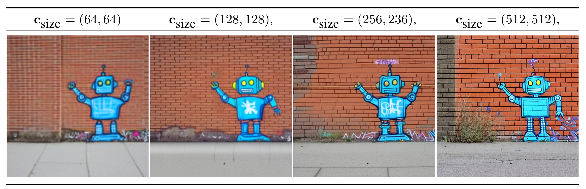
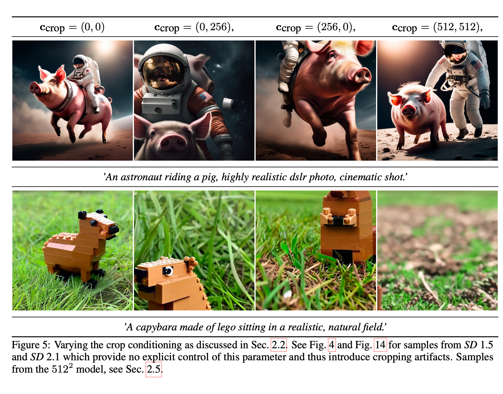
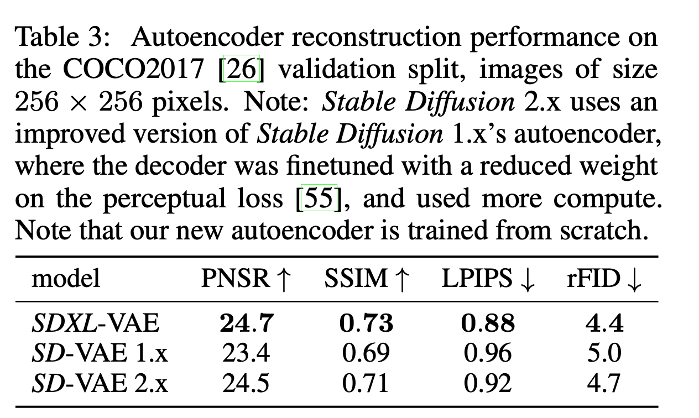

# Stable Diffusion SDXL


- repo: <https://github.com/Stability-AI/generative-models>
- paper: /<https://arxiv.org/pdf/2307.01952>
- date: 2023 July
- Main changes
  - Three times large UNet
  - Second text encoder
  - novel conditioning schemes
  - train on multiple aspect ratios
  - refinement model to improve the visual fidelity

## Architecture

Participants were asked to choose their favorite image generation among four models, the results are show above.

### Network stucture


- VAE:
  - VAE is almost the same, but it implemented a meomory Efficient Scross Attention, which used the package `xformers`

### Condition no image size
   Previous training discard images under 512 pixels which could discard large portion of data, lead to a loss in performance and generalization

   we provide the original (i.e., before any rescaling) height and width of the images as an additional conditioning to the model csize = (h-original,w-original). Each component is independently embedded using a Fourier feature encoding, and these encodings are concatenated into a single vector that we feed into the model by adding it to the timestep embedding



### Condition on cropping parameters

Random cropping during training coulde leads to incomplete generation like the following. So we put it in the condition and set ($c_top,c_left$) be zeros to obtained the object centered samples. Further, we can tune the two parameters to simulate the amount of cropping during inference.



- Method
    During dataloading, we uniformly sample crop coordinates ctop and cleft (integers specifying the amount of pixels cropped from the top-left corner along the height and width axes, respectively) and feed them into the model as conditioning parameters via Fourier feature embeddings, similar to the size conditioning described above

### Condition on aspect ratio
    Most text2image models produces saure images.
    - Trainig tricks
      - Prepare different bukets of images, each bucket has the same shape, while the total number of pixels is approximaly $1024^2$.
      - During training, single batch comes from same bucket, and change the bucket for different step in the training loop
    - Condition tricks
      - similar to the size condition and crop-parameter condition, the target shape $(h_{target},w_{target})$ is embedded into a Fourier space

### Improved autoencoder
    1. used ema in training
    2. large batchsize 9-> 256
    

## Experiment

### **Final Model (SDXL) Training Overview:**

- SDXL is trained using a multi-stage procedure.
- It uses the autoencoder described in Sec. 2.4.
- A discrete-time diffusion schedule with 1000 steps [14, 45] is employed.

### **Stage 1 – Base Model Pretraining:**

- Pretrain a base model (see Tab. 1) on an internal dataset.
- The dataset’s height and width distribution is visualized in Fig. 2.
- Training is performed for 600,000 optimization steps.
- Images are at a resolution of 256×256 pixels.
- A batch size of 2048 is used.
- Size- and crop-conditioning is applied as described in Sec. 2.2.

### **Stage 2 – Continued Training on Higher Resolution:**

- Continue training on images resized to 512×512 pixels.
- Training is performed for an additional 200,000 optimization steps.

### **Stage 3 – Multi-Aspect Training:**

- Utilize multi-aspect training (Sec. 2.3) combined with an offset-noise level of 0.05 [11, 25].
- Train the model on images with different aspect ratios (Sec. 2.3, App. I) covering an approximate area of 1024×1024 pixels.

### **Optional Refinement Stage**
    

#### **Observed Issue:**

- The base model sometimes produces samples with low local quality

#### **Solution to Improve Sample Quality:**

- **Training a Separate Refinement Model:**
  - A separate latent diffusion model (LDM) is trained in the same latent space.
  - This refinement LDM is specialized on high-quality, high-resolution data.
  - It employs a noising-denoising process as introduced by SDEdit [28].
  - The refinement model is specialized on the first 200 discrete noise scales (following [1]).

#### **Inference Process with Refinement:**

- Render latents from the base SDXL using the same text input.
- Directly diffuse and denoise these latents in the latent space with the refinement model
    
- **Optional Step:**
  - Although this refinement step is optional, it improves sample quality—especially for detailed backgrounds and human faces

## Limitation

- **Difficulty with Intricate Structures:**
  The model sometimes struggles with synthesizing fine details in complex structures (e.g., human hands) due to high variance and the challenge of extracting accurate 3D shape information.

- **Imperfect Photorealism:**
  While the generated images are very realistic, they may lack certain nuances such as subtle lighting effects or fine texture variations.

- **Biases in Training Data:**
  The heavy reliance on large-scale datasets can inadvertently introduce social and racial biases, which may be reflected in the generated outputs.

- **Concept Bleeding:**
  The model can sometimes merge or incorrectly bind attributes between distinct objects (e.g., mixing up the colors of a hat and gloves or an orange sunglass bleeding from an orange sweater).

- **Text Rendering Issues:**
  The model encounters challenges in rendering long, legible text, occasionally producing random characters or inconsistent text output.

## Codes
### Diffusoin Engine
The latent diffusion class is refactored compared with LDM.
There are seperate modules

1. model
2. denoiser
3. sampler
4. conditioner
5. scheduler
6. loss_fn
7. ema

Now let's check the training steps compared with stable diffusion v2
=== "encode_first_stage"
    ```py3
        def encode_first_stage(self, x):
            n_samples = default(self.en_and_decode_n_samples_a_time, x.shape[0])
            n_rounds = math.ceil(x.shape[0] / n_samples)
            all_out = []
            with torch.autocast("cuda", enabled=not self.disable_first_stage_autocast):
                for n in range(n_rounds):
                    out = self.first_stage_model.encode(
                        x[n * n_samples : (n + 1) * n_samples]
                    )
                    all_out.append(out)
            z = torch.cat(all_out, dim=0)
            z = self.scale_factor * z
            return z
    ```
    the difference is that the encoding split the batch into sub batches to save memory, which may due to the larger training batchsize

=== "forward"
    ```py3 title="forward"
        def shared_step(self, batch: Dict) -> Any:
            x = self.get_input(batch)
            x = self.encode_first_stage(x)
            batch["global_step"] = self.global_step
            loss, loss_dict = self(x, batch)
            return loss, loss_dict
    ```
    Exactly the same

=== "loss"

    ```yaml title='loss config'
        loss_fn_config:
        target: sgm.modules.diffusionmodules.loss.StandardDiffusionLoss
        params:
            loss_weighting_config:
            target: sgm.modules.diffusionmodules.loss_weighting.EpsWeighting
            sigma_sampler_config:
            target: sgm.modules.diffusionmodules.sigma_sampling.DiscreteSampling
            params:
                num_idx: 1000

                discretization_config:
                target: sgm.modules.diffusionmodules.discretizer.LegacyDDPMDiscretization
    ```
    the loss is defined seperately, we will lookinto the details in following sections
### Model

```
    network_config:
    target: sgm.modules.diffusionmodules.openaimodel.UNetModel
    params:
        use_checkpoint: True
        in_channels: 4
        out_channels: 4
        model_channels: 320
        attention_resolutions: [1, 2, 4]
        num_res_blocks: 2
        channel_mult: [1, 2, 4, 4]
        num_head_channels: 64
        num_classes: sequential
        adm_in_channels: 1792
        num_heads: 1
        transformer_depth: 1
        context_dim: 768
        spatial_transformer_attn_type: softmax-xformers
```

use the same vae structure compared with stable diffusion v2

### Denoise
=== "Config"
    ```yaml
    denoiser_config:
      target: sgm.modules.diffusionmodules.denoiser.DiscreteDenoiser
      params:
        num_idx: 1000
        scaling_config:
          target: sgm.modules.diffusionmodules.denoiser_scaling.EpsScaling
        discretization_config:
          target: sgm.modules.diffusionmodules.discretizer.LegacyDDPMDiscretization
    ```
    the module also contains two sub modeuls, denoiser scaling and discretizer

=== "DiscreteDenoiser"
    ```py3
    class DiscreteDenoiser(Denoiser):
    def __init__(
        self,
        scaling_config: Dict,
        num_idx: int,
        discretization_config: Dict,
        do_append_zero: bool = False,
        quantize_c_noise: bool = True,
        flip: bool = True,
    ):
        super().__init__(scaling_config)
        self.discretization: Discretization = instantiate_from_config(
            discretization_config
        )
        sigmas = self.discretization(num_idx, do_append_zero=do_append_zero, flip=flip)
        self.register_buffer("sigmas", sigmas)
        self.quantize_c_noise = quantize_c_noise
        self.num_idx = num_idx
    def sigma_to_idx(self, sigma: torch.Tensor) -> torch.Tensor:
        dists = sigma - self.sigmas[:, None]
        return dists.abs().argmin(dim=0).view(sigma.shape)
    def idx_to_sigma(self, idx: Union[torch.Tensor, int]) -> torch.Tensor:
        return self.sigmas[idx]
    def possibly_quantize_sigma(self, sigma: torch.Tensor) -> torch.Tensor:
        return self.idx_to_sigma(self.sigma_to_idx(sigma))
    def possibly_quantize_c_noise(self, c_noise: torch.Tensor) -> torch.Tensor:
        if self.quantize_c_noise:
            return self.sigma_to_idx(c_noise)
        else:
            return c_noise
    ```

    - **Purpose:**
      Quantizes continuous noise scales into a discrete set, facilitating controlled denoising.

    - **Key Methods:**

         - **sigma_to_idx:**
           Maps a continuous σ to the index of the closest discrete σ value:

           $$
           \text{index} = \arg\min_i \left| \sigma - \sigma_i \right|
           $$


         - **idx_to_sigma:**
           Returns the discrete σ corresponding to a given index.

         - **possibly_quantize_sigma:**
           Quantizes a continuous σ by mapping it to its nearest discrete value.

         - **possibly_quantize_c_noise:**
           Optionally quantizes the noise conditioning value (`c_noise`) based on a flag.
=== "discritilization"
    ```py3
    class LegacyDDPMDiscretization(Discretization):
        def **init**(
            self,
            linear_start=0.00085,
            linear_end=0.0120,
            num_timesteps=1000,
        ):
            super().**init**()
            self.num_timesteps = num_timesteps
            betas = make_beta_schedule(
                "linear", num_timesteps, linear_start=linear_start, linear_end=linear_end
            )
            alphas = 1.0 - betas
            self.alphas_cumprod = np.cumprod(alphas, axis=0)
            self.to_torch = partial(torch.tensor, dtype=torch.float32)
        def get_sigmas(self, n, device="cpu"):
            if n < self.num_timesteps:
                timesteps = generate_roughly_equally_spaced_steps(n, self.num_timesteps)
                alphas_cumprod = self.alphas_cumprod[timesteps]
            elif n == self.num_timesteps:
                alphas_cumprod = self.alphas_cumprod
            else:
                raise ValueError
            to_torch = partial(torch.tensor, dtype=torch.float32, device=device)
            sigmas = to_torch((1 - alphas_cumprod) / alphas_cumprod) ** 0.5
            return torch.flip(sigmas, (0,))
    ```

    - **Purpose:**
        Computes discrete noise scales (σ values) for a DDPM.

    - **Process & Formulas:**
        - **Beta Schedule:**
          Generates a sequence of βₜ values linearly spaced between `linear_start` and `linear_end` for t = 1,…,T.
        - **Alpha Calculation:**

          $$
          \alpha_t = 1 - \beta_t
          $$

        - **Cumulative Product:**

          $$
          \bar{\alpha}_t = \prod_{i=1}^{t} \alpha_i
          $$

        - **Sigma Calculation:**

          $$
          \sigma_t = \sqrt{\frac{1 - \bar{\alpha}_t}{\bar{\alpha}_t}}
          $$

        - The `get_sigmas` method selects σ values (optionally a subset) and flips them so that they go from high to low noise levels.
=== "Scaling"
    ```py3
    class EpsScaling:
        def __call__(
            self, sigma: torch.Tensor
        ) -> Tuple[torch.Tensor, torch.Tensor, torch.Tensor, torch.Tensor]:
            c_skip = torch.ones_like(sigma, device=sigma.device)
            c_out = -sigma
            c_in = 1 / (sigma**2 + 1.0) ** 0.5
            c_noise = sigma.clone()
            return c_skip, c_out, c_in, c_noise
    ```

    - **Purpose:**
      Provides scaling factors for different branches in the network based on a given noise scale σ.

    - **Scaling Factors & Formulas:**
        - **Skip Connection Factor:** $c_{\text{skip}} = 1$
        - **Output Factor:** $c_{\text{out}} = -\sigma$
        - **Input Factor:** $c_{\text{in}} = \frac{1}{\sqrt{\sigma^2 + 1}}$
        - **Noise Factor:** $c_{\text{noise}} = \sigma$

### Conditioner
=== "config"
    ```yaml
    conditioner_config:
      target: sgm.modules.GeneralConditioner
      params:
        emb_models:
          - is_trainable: False
            input_key: txt
            target: sgm.modules.encoders.modules.FrozenCLIPEmbedder
            params:
              layer: hidden
              layer_idx: 11
          - is_trainable: False
            input_key: txt
            target: sgm.modules.encoders.modules.FrozenOpenCLIPEmbedder2
            params:
              arch: ViT-bigG-14
              version: laion2b_s39b_b160k
              freeze: True
              layer: penultimate
              always_return_pooled: True
              legacy: False
          - is_trainable: False
            input_key: original_size_as_tuple
            target: sgm.modules.encoders.modules.ConcatTimestepEmbedderND
            params:
              outdim: 256
          - is_trainable: False
            input_key: crop_coords_top_left
            target: sgm.modules.encoders.modules.ConcatTimestepEmbedderND
            params:
              outdim: 256
          - is_trainable: False
            input_key: target_size_as_tuple
            target: sgm.modules.encoders.modules.ConcatTimestepEmbedderND
            params:
              outdim: 256
    ```
=== "code"
    ```py3
    class GeneralConditioner(nn.Module):
        OUTPUT_DIM2KEYS = {2: "vector", 3: "crossattn", 4: "concat"} # , 5: "concat"}
        KEY2CATDIM = {"vector": 1, "crossattn": 2, "concat": 1, "cond_view": 1, "cond_motion": 1}
        def __init__(self, emb_models: Union[List, ListConfig]):
            super().__init__()
            embedders = []
            for n, embconfig in enumerate(emb_models):
                embedder = instantiate_from_config(embconfig)
                assert isinstance(
                    embedder, AbstractEmbModel
                ), f"embedder model {embedder.__class__.__name__} has to inherit from AbstractEmbModel"
                embedder.is_trainable = embconfig.get("is_trainable", False)
                embedder.ucg_rate = embconfig.get("ucg_rate", 0.0)
                if not embedder.is_trainable:
                    embedder.train = disabled_train
                    for param in embedder.parameters():
                        param.requires_grad = False
                    embedder.eval()
                print(
                    f"Initialized embedder #{n}: {embedder.__class__.__name__} "
                    f"with {count_params(embedder, False)} params. Trainable: {embedder.is_trainable}"
                )
                if "input_key" in embconfig:
                    embedder.input_key = embconfig["input_key"]
                elif "input_keys" in embconfig:
                    embedder.input_keys = embconfig["input_keys"]
                else:
                    raise KeyError(
                        f"need either 'input_key' or 'input_keys' for embedder {embedder.__class__.__name__}"
                    )
                embedder.legacy_ucg_val = embconfig.get("legacy_ucg_value", None)
                if embedder.legacy_ucg_val is not None:
                    embedder.ucg_prng = np.random.RandomState()
                embedders.append(embedder)
            self.embedders = nn.ModuleList(embedders)
        def possibly_get_ucg_val(self, embedder: AbstractEmbModel, batch: Dict) -> Dict:
            assert embedder.legacy_ucg_val is not None
            p = embedder.ucg_rate
            val = embedder.legacy_ucg_val
            for i in range(len(batch[embedder.input_key])):
                if embedder.ucg_prng.choice(2, p=[1 - p, p]):
                    batch[embedder.input_key][i] = val
            return batch
        def forward(
            self, batch: Dict, force_zero_embeddings: Optional[List] = None
        ) -> Dict:
            output = dict()
            if force_zero_embeddings is None:
                force_zero_embeddings = []
            for embedder in self.embedders:
                embedding_context = nullcontext if embedder.is_trainable else torch.no_grad
                with embedding_context():
                    if hasattr(embedder, "input_key") and (embedder.input_key is not None):
                        if embedder.legacy_ucg_val is not None:
                            batch = self.possibly_get_ucg_val(embedder, batch)
                        emb_out = embedder(batch[embedder.input_key])
                    elif hasattr(embedder, "input_keys"):
                        emb_out = embedder(*[batch[k] for k in embedder.input_keys])
                assert isinstance(
                    emb_out, (torch.Tensor, list, tuple)
                ), f"encoder outputs must be tensors or a sequence, but got {type(emb_out)}"
                if not isinstance(emb_out, (list, tuple)):
                    emb_out = [emb_out]
                for emb in emb_out:
                    if embedder.input_key in ["cond_view", "cond_motion"]:
                        out_key = embedder.input_key
                    else:
                        out_key = self.OUTPUT_DIM2KEYS[emb.dim()]
                    if embedder.ucg_rate > 0.0 and embedder.legacy_ucg_val is None:
                        emb = (
                            expand_dims_like(
                                torch.bernoulli(
                                    (1.0 - embedder.ucg_rate)
                                    * torch.ones(emb.shape[0], device=emb.device)
                                ),
                                emb,
                            )
                            * emb
                        )
                    if (
                        hasattr(embedder, "input_key")
                        and embedder.input_key in force_zero_embeddings
                    ):
                        emb = torch.zeros_like(emb)
                    if out_key in output:
                        output[out_key] = torch.cat(
                            (output[out_key], emb), self.KEY2CATDIM[out_key]
                        )
                    else:
                        output[out_key] = emb
            return output
        def get_unconditional_conditioning(
            self,
            batch_c: Dict,
            batch_uc: Optional[Dict] = None,
            force_uc_zero_embeddings: Optional[List[str]] = None,
            force_cond_zero_embeddings: Optional[List[str]] = None,
        ):
            if force_uc_zero_embeddings is None:
                force_uc_zero_embeddings = []
            ucg_rates = list()
            for embedder in self.embedders:
                ucg_rates.append(embedder.ucg_rate)
                embedder.ucg_rate = 0.0
            c = self(batch_c, force_cond_zero_embeddings)
            uc = self(batch_c if batch_uc is None else batch_uc, force_uc_zero_embeddings)
            for embedder, rate in zip(self.embedders, ucg_rates):
                embedder.ucg_rate = rate
            return c, uc
    ```
    Convet the original input to the embeding with different embedding model. Have three different kind of conditoin types.
    1. vector: similar to time embedding
    2. crossattn: similar to text embedding which is a sequence
    3. concat: shape of [B,C,H,W] that can concat with original input like the depth, low-res, and masked image condition
=== "txt embedder 1"
    ```python3 title="FrozenCLIPEmbedder"
    class FrozenCLIPEmbedder(AbstractEmbModel):
        LAYERS = ["last", "pooled", "hidden"]
        def __init__(
            self,
            version="openai/clip-vit-large-patch14",
            device="cuda",
            max_length=77,
            freeze=True,
            layer="last",
            layer_idx=None,
            always_return_pooled=False,
        ):  # clip-vit-base-patch32
            super().__init__()
            assert layer in self.LAYERS
            self.tokenizer = CLIPTokenizer.from_pretrained(version)
            self.transformer = CLIPTextModel.from_pretrained(version)
            self.device = device
            self.max_length = max_length
            if freeze:
                self.freeze()
            self.layer = layer
            self.layer_idx = layer_idx
            self.return_pooled = always_return_pooled
            if layer == "hidden":
                assert layer_idx is not None
                assert 0 <= abs(layer_idx) <= 12
        @autocast
        def forward(self, text):
            batch_encoding = self.tokenizer(
                text,
                truncation=True,
                max_length=self.max_length,
                return_length=True,
                return_overflowing_tokens=False,
                padding="max_length",
                return_tensors="pt",
            )
            tokens = batch_encoding["input_ids"].to(self.device)
            outputs = self.transformer(
                input_ids=tokens, output_hidden_states=self.layer == "hidden"
            )
            if self.layer == "last":
                z = outputs.last_hidden_state
            elif self.layer == "pooled":
                z = outputs.pooler_output[:, None, :]
            else:
                z = outputs.hidden_states[self.layer_idx]
            if self.return_pooled:
                return z, outputs.pooler_output
            return z
    ```
    It provides three different embedding reresentation
    1. last hidder state: [B,S,D]
    2. pooled hidden state: [B,D]
    3. hidden stage correspoding to given layer index: [B,S,D]
    In this model, it uses the 11-th  layer
=== "txt embedder 2"
    ```py3
    class FrozenOpenCLIPEmbedder2(AbstractEmbModel):
        LAYERS = ["pooled", "last", "penultimate"]
        def **init**(
            self,
            arch="ViT-H-14",
            version="laion2b_s32b_b79k",
            device="cuda",
            max_length=77,
            freeze=True,
            layer="last",
            always_return_pooled=False,
            legacy=True,
        ):
            super().**init**()
            assert layer in self.LAYERS
            model,_, _= open_clip.create_model_and_transforms(
                arch,
                device=torch.device("cpu"),
                pretrained=version,
            )
            del model.visual
            self.model = model
            self.device = device
            self.max_length = max_length
            self.return_pooled = always_return_pooled
            if freeze:
                self.freeze()
            self.layer = layer
            if self.layer == "last":
                self.layer_idx = 0
            elif self.layer == "penultimate":
                self.layer_idx = 1
            else:
                raise NotImplementedError()
            self.legacy = legacy
        @autocast
        def forward(self, text):
            tokens = open_clip.tokenize(text)
            z = self.encode_with_transformer(tokens.to(self.device))
            if not self.return_pooled and self.legacy:
                return z
            if self.return_pooled:
                assert not self.legacy
                return z[self.layer], z["pooled"]
            return z[self.layer]
        def encode_with_transformer(self, text):
            x = self.model.token_embedding(text)  # [batch_size, n_ctx, d_model]
            x = x + self.model.positional_embedding
            x = x.permute(1, 0, 2)  # NLD -> LND
            x = self.text_transformer_forward(x, attn_mask=self.model.attn_mask)
            if self.legacy:
                x = x[self.layer]
                x = self.model.ln_final(x)
                return x
            else:
                # x is a dict and will stay a dict
                o = x["last"]
                o = self.model.ln_final(o)
                pooled = self.pool(o, text)
                x["pooled"] = pooled
                return x
        def pool(self, x, text):
            # take features from the eot embedding (eot_token is the highest number in each sequence)
            x = (
                x[torch.arange(x.shape[0]), text.argmax(dim=-1)]
                @ self.model.text_projection
            )
            return x
        def text_transformer_forward(self, x: torch.Tensor, attn_mask=None):
            outputs = {}
            for i, r in enumerate(self.model.transformer.resblocks):
                if i == len(self.model.transformer.resblocks) - 1:
                    outputs["penultimate"] = x.permute(1, 0, 2)  # LND -> NLD
                if (
                    self.model.transformer.grad_checkpointing
                    and not torch.jit.is_scripting()
                ):
                    x = checkpoint(r, x, attn_mask)
                else:
                    x = r(x, attn_mask=attn_mask)
            outputs["last"] = x.permute(1, 0, 2)  # LND -> NLD
            return outputs
    ```
    In this model, it used ViT-bigG-14. It also supports three different types of embedding. Here it chosed 'penultimate', (second last) layer and returned pooled hidden state.
    If returned pool is true, this embedder will output two hidden stages: origina one and pooled one, and this two will be treated differently.
    pooled embedding will be treated as vector embedding same as the process of time step embedding.
    Original hidden stage will be treated as sequential embedding which fed into the U-Net through the cross-attention.

=== "concat timesstep embedder"
    ```py3
    class ConcatTimestepEmbedderND(AbstractEmbModel):
        """embeds each dimension independently and concatenates them"""
        def __init__(self, outdim):
            super().__init__()
            self.timestep = Timestep(outdim)
            self.outdim = outdim
        def forward(self, x):
            if x.ndim == 1:
                x = x[:, None]
            assert len(x.shape) == 2
            b, dims = x.shape[0], x.shape[1]
            x = rearrange(x, "b d -> (b d)")
            emb = self.timestep(x)
            emb = rearrange(emb, "(b d) d2 -> b (d d2)", b=b, d=dims, d2=self.outdim)
            return emb
    ```
    this embedding handles the 'scalar' conditions including the class label, time step, cropping parameter, original image size, target image size

=== "Time Embedding"
    ```py3
    def timestep_embedding(timesteps, dim, max_period=10000, repeat_only=False):
        """
        Create sinusoidal timestep embeddings.
        :param timesteps: a 1-D Tensor of N indices, one per batch element.
                        These may be fractional.
        :param dim: the dimension of the output.
        :param max_period: controls the minimum frequency of the embeddings.
        :return: an [N x dim] Tensor of positional embeddings.
        """
        if not repeat_only:
            half = dim // 2
            freqs = torch.exp(
                -math.log(max_period)
                * torch.arange(start=0, end=half, dtype=torch.float32)
                / half
            ).to(device=timesteps.device)
            args = timesteps[:, None].float() * freqs[None]
            embedding = torch.cat([torch.cos(args), torch.sin(args)], dim=-1)
            if dim % 2:
                embedding = torch.cat(
                    [embedding, torch.zeros_like(embedding[:, :1])], dim=-1
                )
        else:
            embedding = repeat(timesteps, "b -> b d", d=dim)
        return embedding
    ```
    Here are the formulas expressed in mathematical notation using the English exp and log functions:

    1. **Frequency Calculation:**
        Let

        $$
        H = \left\lfloor \frac{D}{2} \right\rfloor,
        $$

        where \( D \) is the embedding dimension. For each index \( i \) (with \( 0 \le i < H \)), define the frequency as:

        $$
        \omega_i = \exp\!\left(-\frac{i}{H} \cdot \log(\text{max\_period})\right) = \text{max\_period}^{-\frac{i}{H}}.
        $$


    2. **Angle Computation:**
    For a given time step \( t \), compute:

    $$
    \theta_{t,i} = t \cdot \omega_i.
    $$


    3. **Embedding Vector:**
    The embedding for time step \( t \) is then given by:

    $$
    \mathbf{e}(t) = \Bigl[\cos\bigl(\theta_{t,0}\bigr),\, \cos\bigl(\theta_{t,1}\bigr),\, \dots,\, \cos\bigl(\theta_{t,H-1}\bigr),\, \sin\bigl(\theta_{t,0}\bigr),\, \sin\bigl(\theta_{t,1}\bigr),\, \dots,\, \sin\bigl(\theta_{t,H-1}\bigr)\Bigr].
    $$

    If \( D \) is odd, append one extra zero to reach the dimension \( D \).

    4. **Alternate Case (repeat_only):**
    If the `repeat_only` flag is set to true, then the embedding is simply:

    $$
    \mathbf{e}(t) = \underbrace{[t,\, t,\, \dots,\, t]}_{D\text{ times}}.
    $$


### StandardDiffusionLoss

> here is the code from the repo, but it seems not belong to the one use in sd-xl.

```py3
class StandardDiffusionLoss(nn.Module):
    def __init__(
        self,
        sigma_sampler_config: dict,
        loss_weighting_config: dict,
        loss_type: str = "l2",
        offset_noise_level: float = 0.0,
        batch2model_keys: Optional[Union[str, List[str]]] = None,
    ):
        super().__init__()
        assert loss_type in ["l2", "l1", "lpips"]
        self.sigma_sampler = instantiate_from_config(sigma_sampler_config)
        self.loss_weighting = instantiate_from_config(loss_weighting_config)
        self.loss_type = loss_type
        self.offset_noise_level = offset_noise_level
        if loss_type == "lpips":
            self.lpips = LPIPS().eval()
        if not batch2model_keys:
            batch2model_keys = []
        if isinstance(batch2model_keys, str):
            batch2model_keys = [batch2model_keys]
        self.batch2model_keys = set(batch2model_keys)
    def get_noised_input(
        self, sigmas_bc: torch.Tensor, noise: torch.Tensor, input: torch.Tensor
    ) -> torch.Tensor:
        noised_input = input + noise * sigmas_bc
        return noised_input
    def forward(
        self,
        network: nn.Module,
        denoiser: Denoiser,
        conditioner: GeneralConditioner,
        input: torch.Tensor,
        batch: Dict,
    ) -> torch.Tensor:
        cond = conditioner(batch)
        return self._forward(network, denoiser, cond, input, batch)
    def _forward(
        self,
        network: nn.Module,
        denoiser: Denoiser,
        cond: Dict,
        input: torch.Tensor,
        batch: Dict,
    ) -> Tuple[torch.Tensor, Dict]:
        additional_model_inputs = {
            key: batch[key] for key in self.batch2model_keys.intersection(batch)
        }
        sigmas = self.sigma_sampler(input.shape[0]).to(input)
        noise = torch.randn_like(input)
        if self.offset_noise_level > 0.0:
            offset_shape = (
                (input.shape[0], 1, input.shape[2])
                if self.n_frames is not None
                else (input.shape[0], input.shape[1])
            )
            noise = noise + self.offset_noise_level * append_dims(
                torch.randn(offset_shape, device=input.device),
                input.ndim,
            )
        sigmas_bc = append_dims(sigmas, input.ndim)
        noised_input = self.get_noised_input(sigmas_bc, noise, input)

        model_output = denoiser(
            network, noised_input, sigmas, cond, **additional_model_inputs
        )
        w = append_dims(self.loss_weighting(sigmas), input.ndim)
        return self.get_loss(model_output, input, w)
    def get_loss(self, model_output, target, w):
        if self.loss_type == "l2":
            return torch.mean(
                (w * (model_output - target) ** 2).reshape(target.shape[0], -1), 1
            )
        elif self.loss_type == "l1":
            return torch.mean(
                (w * (model_output - target).abs()).reshape(target.shape[0], -1), 1
            )
        elif self.loss_type == "lpips":
            loss = self.lpips(model_output, target).reshape(-1)
            return loss
        else:
            raise NotImplementedError(f"Unknown loss type {self.loss_type}")
```

Fot the EDM training, the sampling of sigma is continuous class

```py3
EDMSampling:
    def __init__(self, p_mean=-1.2, p_std=1.2):
        self.p_mean = p_mean
        self.p_std = p_std
    def __call__(self, n_samples, rand=None):
        log_sigma = self.p_mean + self.p_std * default(rand, torch.randn((n_samples,)))
        return log_sigma.exp()
```

One thing need to mention in the code, the forward process

$$x_t =x_0 +\sigma_t \epsilon$$


And different from the previous versoin, the network predicted the original input but not the noise.
