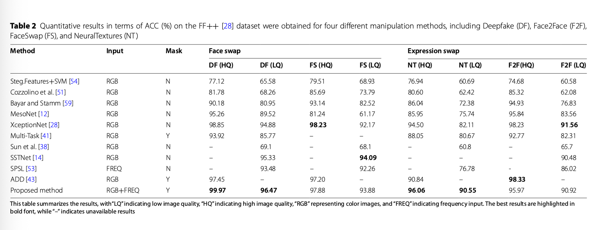

# Deepfake Detection
## Review
### An Analysis of Recent Advances in Deepfake Image Detection in an Evolving Threat Landscape

- author: 2024
- url: <https://arxiv.org/pdf/2404.16212>
- Sifat Muhammad Abdullah

- fully synthetic images created using generative models are considered
- partial synthetic images are not considered in this paper

#### Introduction

1. Current SOTA methods:
    - ture statistics [13]
    - finding imperfections in the frequency spectrum [12]
    - local patches [17]

2. Threat
    - Emergence of lightweight methods that allow users to customize large generative models
        Previously, generate images from few of generative models by GAN or diffusion
        Today, more than 3000 variants of generative models in platform like Huggingface, Civitai
    - Use foundation model fine-tuning to fool deepfake detection models
3. Contirbution
    - critical analysis on the trianing and evaluation methods in current SOTA
    - performance on user-customized generative models
    - create adversarial samples with foundation model without adversary noise

#### Generative models

1. Stable Difussion
2. StyleClip

#### Defense Models

1. UnivCLIP (2023): first one that use foundation model to detect deepfake
2. DE-FAKE: augment the image’s embedding along with an embedding of the text prompt. The intuition is that real images usually have more information than their respective captions, whereas fake images generated from prompts only show content that is specific to that prompt. Achieve **90.9%** on DALL·E 2 images
3. DCT: frequency domain provides discriminatory features for deepfake detection. Logscaled version of the DCT features. DCT achieves 97.7% and 73% accuracy on images generated by GAN and Diffusion model,
4. Patch-Forensics: searching for artifacts in local patches of the image provides more generalizable patterns for detection
5. GramNet: texture statistics of fake images (e.g., face content) are significantly different from real images.
6. Resynthesis: generating testing images based on different auxiliary tasks (super-resolution, denoising and colorization)
7. CNN-F: CNN-based generators leave detectable fingerprints. Highlights that the detector needs to be trained only on images from a single CNN-based generator to generalize across different fake sources
8. MesoNet: Originally designed to detect deepfake videos. microscopic (中观层面) features of real images are more diverse than those of fake images compared with macroscopic or microscopic features. Inception module has better performance than usual convolutional modules.

| Defense           | SD Precision | SD Recall | SD F1  | StyleCLIP Precision | StyleCLIP Recall | StyleCLIP F1 |
|------------------|--------------|-----------|--------|----------------------|------------------|--------------|
| UnivCLIP         | 90.20        | 93.90     | 92.01  | 93.79                | 92.20            | 92.99        |
| DE-FAKE          | 93.82        | 94.20     | 94.01  | 74.41                | 78.80            | 76.54        |
| DCT              | 100          | 88.80     | 94.07  | 100                  | 99.60            | 99.80        |
| Patch-Forensics  | -            | -         | -      | 91.76                | 91.30            | 91.53        |
| Gram-Net         | 99.99        | 99.10     | 99.55  | 99.99                | 99.60            | 99.80        |
| Resynthesis      | 85.39        | 86.50     | 85.94  | 98.80                | 98.70            | 98.75        |
| CNN-F            | 99.41        | 83.80     | 90.94  | 99.90                | 97.10            | 98.48        |
| MesoNet          | 99.99        | 98.00     | 98.98  | 96.70                | 99.50            | 98.08        |

#### current limitations

1. lack control of the content and quality of training data: real and fake images should be consistent in content and quality
2. Lack adversary attack
3. Prior work only focused only on limited content types, e.g., faces, animals, bedrooms, and buildings

#### findings
FM: full fintune model
user-cutomized models: use full fituning or the Lora finetuning to train new models

1. All models have performance degradation on user-cutomized models
2. Soly relay on foundation model's feature is not enough to have generalization on deepfake detection
3. Frequency domain show the best generalization performance
4. CNN-based model has the worst generalization performance
5. Content-agnostic features can help boost generalization performance for deepfake detection.
6. Combining domain-specific features (i.e., features known to identify imperfections in fake images) with features from a foundation model
    improves generalization. Cimbine the DCT features with the foundation model feature achieves the best performance
7. adversary attack: attacker has a realistic photo, and manipulate the photo by the text prompt like 'a smilling face'.
    - How to do adversary attack:
        1. First, train three surrogate deepfake classifiers using dataset with fake images from current generator and real images from public datasets
        2. Second, adversary train the generator again the surroage deepfake classifiers for each deceptive image which can be detected by current deepfake detection model (the testing model, not the surrogate model) with looss:
            - classification loss
            - perception loss from vgg pretrained network in imagenet
        For each image, it takes 39 seconds to generate an adversarial image using dgx A100

    
    For each surrogate model, the adversary attack will leads to the performance drop ($\Delta R$)
8. Defense based on the frequency features is the weakest against adversary attack
9. Defense using foundation model is the strongest against adversary attack
10. Defense with stronger foundation model is more robust against adversary attack
11. Adversary training can improve the robustness of adversary attack

    

## Deepfake Image Detection
### FSBI


- year: 2024 Jun
- author: Ahmed Abul Hasnanaath
- instituiton: Information and Computer Science Department, King Fahd University of Petroleum and Minerals
- code: at <https://github.com/gufranSabri/FSBI>
- main contribution
    1. data synthetic methods: SBI methods generate more various fake images for training
    2. use discrete wavelet transform to extract features from images

#### SBI (self blended image)

Give an iamge, it first do augmentations including

- RGB and HSV jitters
- contrast and brightness jitters
- downsampling
- translation
For single image, it do two different random augmentations and produces $I_t$ and $I_s$.

Secondly, it detect the landmark on $I_s$ using some landmark detection model and produce the face mask with the convex hull of the detected landmarks. After applying the gaussian and dilation on the face mask, it will produce $M$.
Lastly, it combine the $I_s$ and $I_t$ with the mask according to the formula

$$I_{SBI} = I_s \cdot M + I_t \cdot (1 - M)$$


Here $M$ is the gray tensor in range [0, 1]. The edge of the mask could be smoothed by gaussian and dilation to produce continuous self blending image.

#### Frequency Feature Generator
It first split the image into R,G,B channel seperately
Secondly, it calculate the wavelet coefficients of each channel
Last, it resize the coefficients to the same size and stack them together

### DE-FAKE

- zeyang sha
- salesforce research
- 2023 Jan
- main contribution
    1. proposed three questions
        1. whether the fake image be distinguished
        2. can we attribute the fake images to their sources (which model generated the image)
        3. what kind of prompt is more likely to generate authentic images

#### Detection method
Train a binary classifier on the images generated by one text2image model and then evaludate on the images generated by other models. Two types of detector

1. Image only detector: accepts only image as input
2. Hybrid detector: accepts both image and its prompt as input

##### Image only detector

1. dataset
    - random sample 20k images from MSCOCO, treat as real images
    - use stable diffusion model to generate another 20k images, treat as fake images with the prompt
2. network
    - resnet18
    - binary output

##### Hybrid detector

1. dataset
    Same construction as image only detector
2. network
    - pretrained clip model to extract both image and text embedding and concat them together, followed by 2-layer MLP
3. captions
    - Use the captions of the image if it is provided by the dataset
    - Otherwise, use BLIP model to generate captions for queried images

Questions:

- Cause image only detector use resnet18, why not use more powerful model? or use same model as hybrid detector to compare their performance fairly

Results

Hybird detector can obtain much better performance than image only detector
#### Fake Image Attribute (Generator source identification)
The goal is to predict which generator is used to generate the image
To train such model, we first generate the iamges from different text2image models (3 models, SD, LD, and GLIDE)
Network construction is similar to the previous section but now their are four classes

- 0: real
- 1: SD
- 2: LD
- 3: GLIDE

Results

|                                   | MSCOCO | Flickr30k |
|-----------------------------------|--------|-----------|
| Image-Only                        | 0.864  | 0.863     |
| Hybrid (natural prompts)          | 0.936  | 0.933     |
| Hybrid (generated prompts)        | 0.903  | 0.892     |

#### Prompt analysis
Analysis which kind of prompt would has more likely to pass the deepfake detection
##### Semantic Analysis

- **Topic-based Grouping**:
  - Used MSCOCO's 80 predefined topics to group prompts
  - Measured proportion of fake images misclassified as real by topic
  - Results: "skis," "snowboard," and animal-related topics produced most realistic fakes

- **Embedding Cluster Analysis**:
  - Used BERT-based sentence transformer for prompt embeddings
  - Applied DBSCAN clustering for semantic grouping
  - Finding: "person"-related prompts generated most realistic fakes
  - "Skis" and "snowboard" topics effective because they often included people

- **Typical Prompts Analysis**:
  - Extracted top 5 most realistic and most fake-looking prompts
  - Finding: Detailed object descriptions (4/5 top realistic prompts) outperformed environment descriptions (4/5 top fake-looking prompts)

##### Structural Analysis

- **Prompt Length**:
  - Tested 5,000 random MSCOCO prompts with Stable Diffusion
  - Finding: 25-75 word prompts generated most realistic images
  - Very short or long prompts performed worse

- **Noun Proportion**:
  - Used NLTK to analyze noun ratio in prompts
  - Finding: No significant correlation between noun proportion and image realism

### Mastering Deepfake Detection: A Cutting-edge Approach to Distinguish GAN and Diffusion-model Images


- <https://dl.acm.org/doi/pdf/10.1145/3652027>
- University of Catania
- LUCA GUARNERA
- 2024


- AttGAN: <https://github.com/LynnHo/AttGAN-Tensorflow>
- CycleGAN: <https://github.com/junyanz/pytorch-CycleGANand-pix2pix>
- GDWCT: <https://github.com/WonwoongCho/GDWCT>
- IMLE: <https://github.com/zth667/Diverse-ImageSynthesis-from-Semantic-Layout>
- ProGAN: <https://github.com/tkarras/progressive_growing_of_gans>
- StarGAN: <https://github.com/wkentaro/StarGAN>
- StarGAN-v2: <https://github.com/clovaai/stargan-v2>
- StyleGAN: <https://github.com/NVlabs/stylegan>
- StyleGAN2: <https://github.com/NVlabs/stylegan2>
- DALL-E 2: <https://github.com/lucidrains/DALLE2pytorch>
- GLIDE: <https://github.com/openai/glide-text2im>
- Latent Diffusion: <https://github.com/CompVis/latent-diffusion>
- Stable Diffusion: <https://github.com/CompVis/stable-diffusion>


- in the spetral space, “real” class has the  isotropic behavior

### Leveraging Frequency Analysis for Deep Fake Image Recognition


- <https://proceedings.mlr.press/v119/frank20a/frank20a.pdf>>
- Joel Frank
- Horst G¨ortz Institute for ITSecurity, Bochum, Germany
- 2020

- Upsampling will leads to spectral differences
    
- both upsampling and downsampling operations have recently been linked to compromising shift invariance in neural networks, i.e., they cause classifier predictions to vary dramatically due to a simple one-pixel shift in the input image (Azulay & Weiss, 2018). Recently, Zhang (2019)

## Partial Deepfake Image Detection
### SIDA: Social Media Image Deepfake Detection, Localization and Explanation with Large Multimodal Model

- Zhenglin Huang1
- <https://arxiv.org/pdf/2412.04292>
- University of Liverpool, UK

#### contribution

1. Social media Image Detection data Set (SID-Set)

2. SIDA


#### Training Objectives Summary

The SIDA model training involves three main loss components:

1. **Detection loss** (\(\mathcal{L}_{det}\)) – using CrossEntropy loss for detecting elements.
2. **Segmentation mask loss** (\(\mathcal{L}_{mask}\)) – a weighted combination of Binary Cross Entropy (BCE) loss and DICE loss:

   $$
   \mathcal{L}_{mask} = \lambda_{bce} \mathcal{L}_{BCE}(\hat{M}, M) + \lambda_{dice} \mathcal{L}_{DICE}(\hat{M}, M)
   $$


3. **Text generation loss** (\(\mathcal{L}_{txt}\)) – used in the fine-tuning phase with ground truth descriptions from 3,000 images:

   $$
   \mathcal{L}_{txt} = \mathcal{L}_{CE}(\hat{y}_{des}, y_{des})
   $$


The overall training loss during initial training:

$$
\mathcal{L} = \lambda_{det} \mathcal{L}_{det} + \lambda_{mask} \mathcal{L}_{mask}
$$


In the fine-tuning stage, the full loss function includes text generation:

$$
\mathcal{L}_{total} = \lambda_{det} \mathcal{L}_{det} + \lambda_{mask} \mathcal{L}_{mask} + \lambda_{txt} \mathcal{L}_{txt}
$$


Here, \(\lambda_{det}\), \(\lambda_{mask}\), and \(\lambda_{txt}\) are weighting factors used to balance the contributions of each loss term.

#### Results


### Detect Any Deepfakes: Segment Anything Meets Face Forgery Detection and Localization


- institution: xiamen university
- Yingxin Lai
- 2023 June
- proposed DADF (Detect Any Deepfakes)
- code: <https://github.com/laiyingxin2/DADF>

#### contribution
- finetune on segment anything for face forgery detection and localization
- reconstruction guided attention module is proposed
    1. Add gaussian noise to the original images
    2. Use differences of features from original images and the noised image to hiligh the differences as the attention.
        If it is high, means the part different from the forgery
    3. In this way, suppose the final feature only care about the real feature
    4. use L1 norm to calculate the difference between features from real images and the gaussian images (simulation of forgey)
    
    Results
    
#### Question
How much does the performance of the model improve after finetuning compared with train from scratch?

### Weakly-supervised deepfake localization in diffusion-generated images
- url: [text](https://openaccess.thecvf.com/content/WACV2024/papers/Tantaru_Weakly-Supervised_Deepfake_Localization_in_Diffusion-Generated_Images_WACV_2024_paper.pdf)
- code: [text](https://github.com/bit-ml/dolos)
- 2024
- institution: Bitdefender
- author: Dragos-Constaintin Tantaru
- contribution

以下是这段文字的结构化总结：


| 项目                         | 内容                                                                                     |
|----------------------------|------------------------------------------------------------------------------------------|
| **研究背景**                 | Denoising Diffusion Models（扩散模型）生成能力强，引发图像真实性担忧。现有检测方法多基于GAN，仅输出“真/假”标签。 |
| **核心问题**                 | 现有检测模型缺乏对**伪造区域的定位能力**，仅做二分类，信息不足。                                     |
| **研究目标**                 | 将任务转化为**弱监督定位问题**，输出图像中被篡改的区域图（localization map）。                       |
| **方法分类**                 | 三类方法：基于解释（explanations）、局部得分（local scores）、注意力机制（attention）。            |
| **统一比较方法**             | 所有方法使用相同的**Xception网络**架构，确保公平对比。                                          |
| **实验设计**                 | 构建多个控制变量的数据集，**单一改变生成器、监督方式或数据源**，以分析其对性能的影响。               |
| **主要发现**                 | 局部得分法性能最佳，对弱监督敏感性低，但对生成器/数据集变化更敏感。                                |
| **研究贡献**                 | 提供对弱监督伪造区域检测设计空间的系统分析，验证了该方法的可行性。                                 |

Different Sturcture of the detection and localization of deepfakes


#### 📊 四种伪造区域定位方法比较表

| 方法类型         | 方法名        | 主体结构       | 原理与机制                                                                 | 监督方式              | 本文改进 / 说明                                               |
|------------------|----------------|----------------|------------------------------------------------------------------------------|------------------------|----------------------------------------------------------------|
| 🧠 解释驱动类     | **GradCAM**    | Xception (block 11) | 用 GradCAM 在倒数第二层激活图上生成热图（定位解释）                              | 弱监督 / 全监督均可      | 添加全卷积层支持全监督训练，对 GradCAM 定量评估性能                         |
| 📦 局部评分类     | **Patches (Patch–Forensics)** | Truncated Xception (block 2) | 使用 `1×1` 卷积将中间特征映射到 patch-level 分数，训练时对 patch 单独监督            | 弱监督 / 全监督均可      | 原方法只展示可视化，本研究量化其定位效果；全监督时使用 mask 替代 image label |
| 🔍 注意力机制类   | **Attention**  | Xception + Learned Mask | 网络学习 attention mask，同时监督整体图像真假和 mask 的最大值与标签一致性              | 弱监督 / 全监督均可      | 将 L1 损失改为 binary cross-entropy，调参优化 λ，提升稳定性与性能               |
| 🎯 全监督上限对比 | **全监督版本** | 同上三种方法改写版 | 明确提供伪造区域 groundtruth mask，作为 upper bound 基线                              | 全监督                 | 每种方法按需修改支持 mask 监督训练                                  |


#### 📦 数据集构建概览

| 数据类型 | 数据来源 | 操作方法 | 数据量 | 用途说明 |
|----------|----------|----------|--------|-----------|
| ✅ **真实图像** | CelebA-HQ、FFHQ | 原始人脸图像 | 各 9k train / 900 val | 作为真实样本用于训练与测试 |
| ✅ **全图伪造** | Diffusion (P2 模型) | 使用预训练扩散模型生成完整图像 | 各 9k train / 1k val | 用于弱监督训练（Setup A） |
| ✅ **局部伪造** | CelebA-HQ、FFHQ | 使用不同方法进行面部部位修补（眼睛、嘴、鼻等） | 多达 30k train / 8.5k test | 用于弱/强监督训练与评估（Setup B/C） |

---

##### 🧪 局部伪造方法细节

| 方法 | 原理 | 模型 | 备注 |
|------|------|------|------|
| **Repaint–P2** | 在像素空间用扩散模型按 mask 修补 | 基于 P2 模型 | 是主测试集，提供 ground truth mask |
| **Repaint–LDM** | 在**latent 空间**执行扩散修补 | 基于 LDM 模型 | 潜在空间修复效果更自然，更难定位 |
| **LaMa** | Fourier 卷积进行区域修补 | 自动编码器结构 | 传统图像修补方法，易于训练 |
| **Pluralistic** | 条件 VAE + 对抗训练 | GAN 结构 | 多样性强的修补输出，视觉真实感高 |

---

##### 🧰 修补区域来源与处理

- **CelebA-HQ 使用 CelebAMask-HQ 提供的人脸部位标签（如眼、嘴、鼻）**
- **FFHQ 使用预训练 face segmentation 模型生成 mask**
- 小部位区域如眼睛、嘴部会随机膨胀 1–15 像素以增加变异性

---

##### 🧪 三种训练设置（监督等级）

| Setup | 监督类型 | 数据来源 | 特点 |
|-------|----------|----------|------|
| **A** | 仅图像级标签，全图伪造 | P2 模型生成 | 假图完全伪造 |
| **B** | 仅图像级标签，局部伪造 | Repaint–P2 | 输入标签“假”，但部分区域仍为真 |
| **C** | 强监督，提供 mask | Repaint–P2 | mask 作为 ground truth，用于评估上限 |

---

##### ✅ 数据构建目标与优势

1. **控制变量设计**：通过改变 *generator、监督类型、数据源* 中单一因素，系统研究性能影响。
2. **多生成器对比**：允许测试模型在训练-测试分布不一致下的泛化能力。
3. **大规模高质量数据**：共构建出超过 **12.5 万张图像**，包含多种篡改类型和方法。

##### 📈 关键实验结果
- Patches 方法表现最稳定，在所有 Setup 下都优于 GradCAM 和 Attention。
- 模型在弱监督下仍可学习到有效的局部伪造区域（尤其是 Patches）。
- 模型对 生成器变化最敏感，对监督类型变化更鲁棒。
- 对 LDM 生成图像的定位性能显著下降，因其潜空间修补能“隐藏痕迹”。
- 跨数据集（CelebA ↔ FFHQ）或跨生成器泛化能力显著下降。

Works that tackle localization rely on local noise fingerprint
patterns [21, 33, 40, 64], attention mechanisms [12, 13, 42]
or self-consistency checks [2, 27]. Very recent, concurrent
works proposed a forensic framework for general manipula-
tion localization [21] and a hierarchical fine-grained formu-
lation for image forgery detection [22].
### Multi‑attention‑based approach for deepfake face and expression swap detection and localization


- paper: https://link.springer.com/content/pdf/10.1186/s13640-023-00614-z.pdf
- author: Saima Waseem
- institution: Universiti Teknologi Malaysia, Johor, Malaysia
- 2023
- code: <https://github.com/saimawaseem/Multi-Attention-Based-Approach-for-Deepfake-Face-and-Expression-Swap-Detection-and-Localization>
#### 🧠 **主要内容概述**

该论文提出了一种**基于多重注意力机制的多任务学习框架**，用于**检测和定位人脸篡改的深度伪造（deepfake）图像**，尤其是两种典型伪造形式：

- **Face swap（身份替换）**
- **Expression swap（表情替换/重演）**

该方法融合了**空间域（spatial domain）和频率域（frequency domain）特征**，通过引入**注意力机制**，提升伪造检测的泛化能力，并能生成伪造区域的定位图。

---

#### 🚀 **核心贡献**

1. **提出了多重注意力机制的U-Net网络结构**：
   - 引入**spatial-channel Attention Block（scAB）**，在编码器和解码器之间动态强调伪造区域的重要性。
   - 在解码器的每个跳跃连接中集成了注意力模块，提升定位精度。

2. **联合使用频域和空间域信息**：
   - 使用**FFT变换提取频率特征**，与局部化的空间特征融合，提升检测鲁棒性。
   - 采用**Bilinear Pooling**方法进行特征融合，提高表达能力。

3. **多任务学习结构：检测 + 定位**：
   - 同时优化**分类任务（是否伪造）**和**定位任务（伪造区域）**。
   - 使用**回归损失（L1/L2）**进行伪造区域学习，比传统分割损失（如Dice、Focal）更有效。

4. **强泛化能力**：
   - 在多个基准数据集（FF++, DFDC-P, CelebDF, DFD）上进行**跨数据集实验**。
   - 表现优于或媲美现有SOTA模型，尤其在视频压缩严重时，仍保持高准确率。

5. **代码开源，便于复现和拓展**：
   - GitHub地址：https://github.com/saimawaseem/Multi-Attention-Based-Approach-for-Deepfake-Face-and-Expression-Swap-Detection-and-Localization

---

#### 📊 实验亮点

- **内数据集测试**：在FF++数据集上，准确率可达 99.97%（C23），96.47%（C40）。
- **跨数据集测试**：在DFDC-P上AUC为 **79.10%**，相比MaDD提升超过10%。
- **定位性能**：在FaceSwap数据集上mIoU达 **70.04%**，优于多任务模型如ADD和Multi-Task。

这篇文章在训练过程中采用了一些**标准方法**配合**特别设计的数据处理和增强策略**，以提升模型的泛化能力和鲁棒性。以下是详细总结：

---

#### 🏗️ 模型训练流程

###### ✅ **1. 输入数据格式与构造**
训练模型时使用的是一个**多输入结构的数据元组**：

```
H = (Ai, Bi, Di, yi)
```

含义如下：

- `Ai`：RGB图像（224×224，3通道），原始/伪造人脸图像。
- `Bi`：参考mask，用于定位伪造区域，区分：
  - face swap（整张脸为伪造区域）
  - expression swap（仅面部表情区域为伪造）
- `Di`：对`Ai`进行**FFT频率变换后得到的频域图**。
- `yi`：标签（0表示真实，1表示伪造）

---

###### 🔍 2. 特殊的数据预处理与增强

文章特别强调了**防止模型过拟合人脸身份特征**的问题，因此使用以下数据增强手段：

| 数据增强方法          | 目的                                                         |
|-----------------------|--------------------------------------------------------------|
| 水平翻转 (flip)       | 增加样本多样性                                               |
| 旋转 (rotate)         | 增加视角变化，提高空间鲁棒性                                 |
| 对比度调整 (contrast) | 增强对不同图像质量的适应性                                   |
| 添加高斯噪声          | 模拟视频压缩或图像劣化，提高对压缩伪造的识别能力            |
| 图像压缩模拟 (JPEG)   | 模拟真实社交平台上传/压缩后的伪造内容，提高模型泛化能力      |

---

##### ⚙️ 3. 模型架构与优化细节

- **主干网络**：ResNet + Residual U-Net
- **检测分支**：输入频域特征，提取深度特征后加入注意力模块
- **定位分支**：使用 scAB（spatial-channel attention block）模块提取定位信息
- **融合方式**：使用 Bilinear Pooling 将频率与空间特征进行融合


| 参数               | 值                         |
|--------------------|----------------------------|
| Optimizer          | Adam                       |
| 初始学习率         | 1e-4                       |
| β1 / β2            | 0.9 / 0.999                |
| Batch size         | 16                         |
| 调整策略           | 30个epoch不提升则LR × 0.1 |
| 输入图像尺寸       | 224 × 224                  |

---

##### 📉 4. 损失函数设计

采用多任务损失函数组合：

```math
L_comb = ρ_class * L_class + ρ_localize * L_localize
```

- `L_class`：二分类交叉熵，用于检测真实 vs 伪造
- `L_localize`：用于伪造区域定位，尝试过 Dice/Focal，但 **L1/L2（回归损失）表现最好**

> 权重参数 `ρ_class = ρ_localize = 1`，说明两个任务同等重要。

##### ✅ 小结：训练关键点

1. **空间 + 频域输入**：显著提高泛化能力，特别是在压缩严重的视频中。
2. **伪造区域mask引导的定位训练**：提供细粒度监督。
3. **多种增强手段**：防止模型只学会身份特征，提升对不同数据集的适应能力。
4. **注意力机制辅助学习**：让模型更聚焦于关键伪造区域。



## Q&A

1. Does stable/flux VAE decoder has its own features to distinguish from real images?


