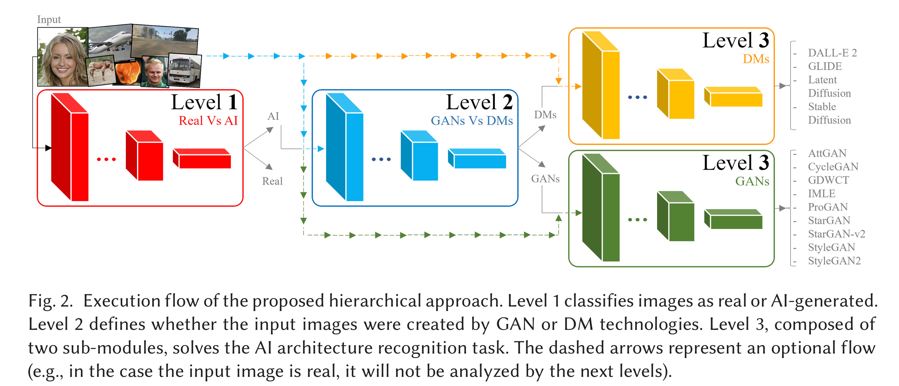
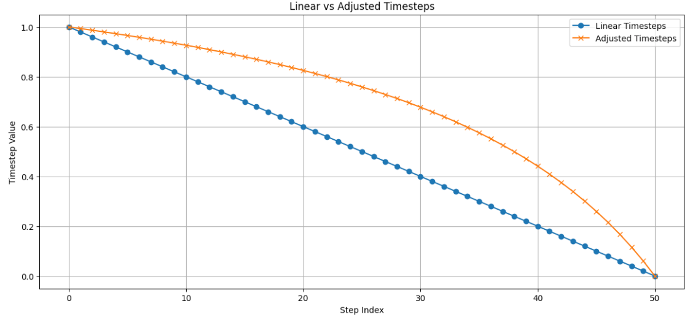
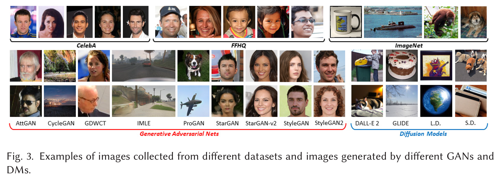
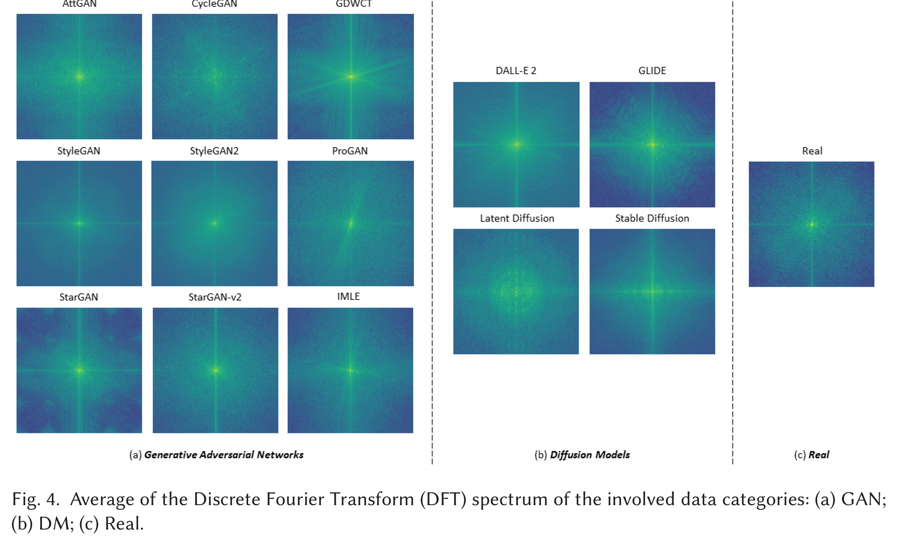
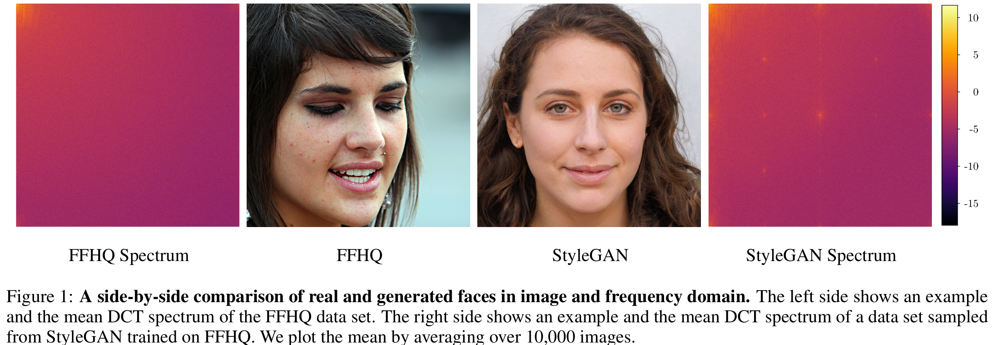
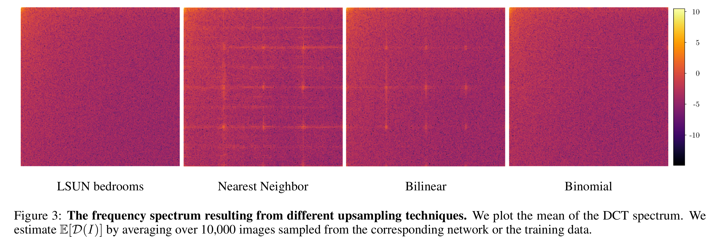
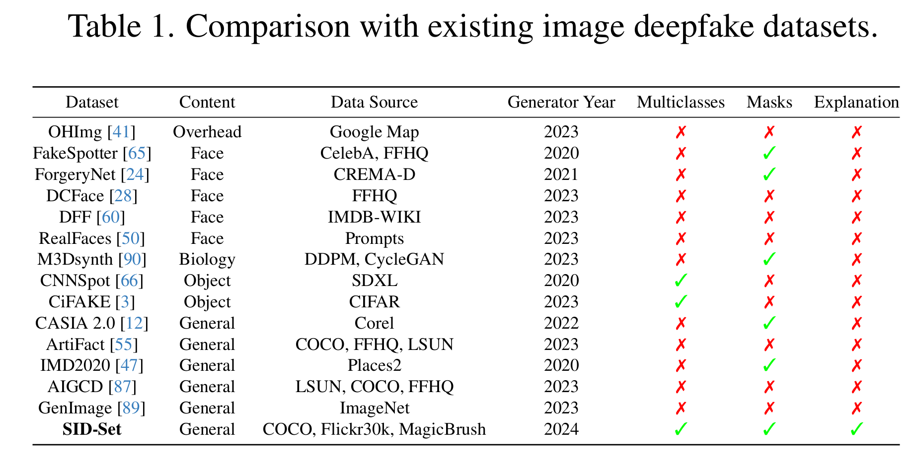
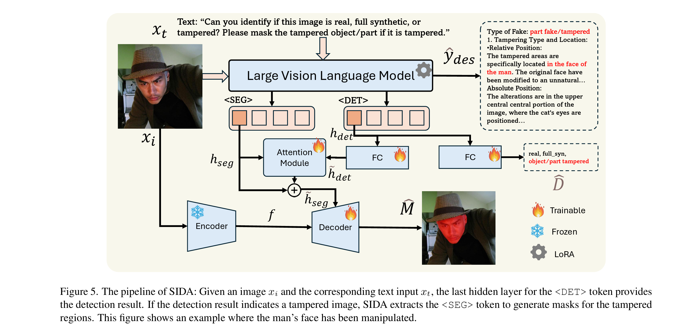
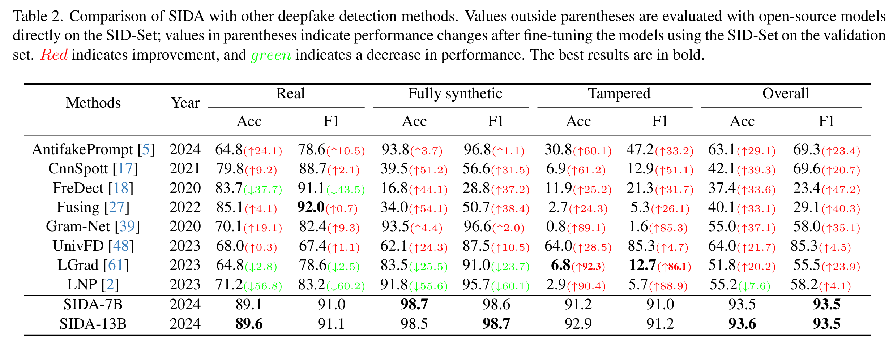

# Deepfake Detection
## Review
### An Analysis of Recent Advances in Deepfake Image Detection in an Evolving Threat Landscape

- author: 2024
- url: <https://arxiv.org/pdf/2404.16212>
- Sifat Muhammad Abdullah

- fully synthetic images created using generative models are considered
- partial synthetic images are not considered in this paper

#### Introduction

1. Current SOTA methods:
    - ture statistics [13]
    - finding imperfections in the frequency spectrum [12]
    - local patches [17]

2. Threat
    - Emergence of lightweight methods that allow users to customize large generative models
        Previously, generate images from few of generative models by GAN or diffusion
        Today, more than 3000 variants of generative models in platform like Huggingface, Civitai
    - Use foundation model fine-tuning to fool deepfake detection models
3. Contirbution
    - critical analysis on the trianing and evaluation methods in current SOTA
    - performance on user-customized generative models
    - create adversarial samples with foundation model without adversary noise

#### Generative models

1. Stable Difussion
2. StyleClip

#### Defense Models

1. UnivCLIP (2023): first one that use foundation model to detect deepfake
2. DE-FAKE: augment the image’s embedding along with an embedding of the text prompt. The intuition is that real images usually have more information than their respective captions, whereas fake images generated from prompts only show content that is specific to that prompt. Achieve **90.9%** on DALL·E 2 images
3. DCT: frequency domain provides discriminatory features for deepfake detection. Logscaled version of the DCT features. DCT achieves 97.7% and 73% accuracy on images generated by GAN and Diffusion model,
4. Patch-Forensics: searching for artifacts in local patches of the image provides more generalizable patterns for detection
5. GramNet: texture statistics of fake images (e.g., face content) are significantly different from real images.
6. Resynthesis: generating testing images based on different auxiliary tasks (super-resolution, denoising and colorization)
7. CNN-F: CNN-based generators leave detectable fingerprints. Highlights that the detector needs to be trained only on images from a single CNN-based generator to generalize across different fake sources
8. MesoNet: Originally designed to detect deepfake videos. microscopic (中观层面) features of real images are more diverse than those of fake images compared with macroscopic or microscopic features. Inception module has better performance than usual convolutional modules.

| Defense           | SD Precision | SD Recall | SD F1  | StyleCLIP Precision | StyleCLIP Recall | StyleCLIP F1 |
|------------------|--------------|-----------|--------|----------------------|------------------|--------------|
| UnivCLIP         | 90.20        | 93.90     | 92.01  | 93.79                | 92.20            | 92.99        |
| DE-FAKE          | 93.82        | 94.20     | 94.01  | 74.41                | 78.80            | 76.54        |
| DCT              | 100          | 88.80     | 94.07  | 100                  | 99.60            | 99.80        |
| Patch-Forensics  | -            | -         | -      | 91.76                | 91.30            | 91.53        |
| Gram-Net         | 99.99        | 99.10     | 99.55  | 99.99                | 99.60            | 99.80        |
| Resynthesis      | 85.39        | 86.50     | 85.94  | 98.80                | 98.70            | 98.75        |
| CNN-F            | 99.41        | 83.80     | 90.94  | 99.90                | 97.10            | 98.48        |
| MesoNet          | 99.99        | 98.00     | 98.98  | 96.70                | 99.50            | 98.08        |

#### current limitations

1. lack control of the content and quality of training data: real and fake images should be consistent in content and quality
2. Lack adversary attack
3. Prior work only focused only on limited content types, e.g., faces, animals, bedrooms, and buildings

#### findings
FM: full fintune model
user-cutomized models: use full fituning or the Lora finetuning to train new models

1. All models have performance degradation on user-cutomized models
2. Soly relay on foundation model's feature is not enough to have generalization on deepfake detection
3. Frequency domain show the best generalization performance
4. CNN-based model has the worst generalization performance
5. Content-agnostic features can help boost generalization performance for deepfake detection.
6. Combining domain-specific features (i.e., features known to identify imperfections in fake images) with features from a foundation model
    improves generalization. Cimbine the DCT features with the foundation model feature achieves the best performance
7. adversary attack: attacker has a realistic photo, and manipulate the photo by the text prompt like 'a smilling face'

## Deepfake Image Detection

### Mastering Deepfake Detection: A Cutting-edge Approach to Distinguish GAN and Diffusion-model Images

- <https://dl.acm.org/doi/pdf/10.1145/3652027>
- University of Catania
- LUCA GUARNERA
- 2024

- AttGAN: <https://github.com/LynnHo/AttGAN-Tensorflow>
- CycleGAN: <https://github.com/junyanz/pytorch-CycleGANand-pix2pix>
- GDWCT: <https://github.com/WonwoongCho/GDWCT>
- IMLE: <https://github.com/zth667/Diverse-ImageSynthesis-from-Semantic-Layout>
- ProGAN: <https://github.com/tkarras/progressive_growing_of_gans>
- StarGAN: <https://github.com/wkentaro/StarGAN>
- StarGAN-v2: <https://github.com/clovaai/stargan-v2>
- StyleGAN: <https://github.com/NVlabs/stylegan>
- StyleGAN2: <https://github.com/NVlabs/stylegan2>
- DALL-E 2: <https://github.com/lucidrains/DALLE2pytorch>
- GLIDE: <https://github.com/openai/glide-text2im>
- Latent Diffusion: <https://github.com/CompVis/latent-diffusion>
- Stable Diffusion: <https://github.com/CompVis/stable-diffusion>

- in the spetral space, “real” class has the  isotropic behavior

### Leveraging Frequency Analysis for Deep Fake Image Recognition

- <https://proceedings.mlr.press/v119/frank20a/frank20a.pdf>>
- Joel Frank
- Horst G¨ortz Institute for ITSecurity, Bochum, Germany
- 2020

### contribution

- Upsampling will leads to spectral differences
    
- both upsampling and downsampling operations have recently been linked to compromising shift invariance in neural networks, i.e., they cause classifier predictions to vary dramatically due to a simple one-pixel shift in the input image (Azulay & Weiss, 2018). Recently, Zhang (2019)

## partial Deepfake Image Detection
### SIDA: Social Media Image Deepfake Detection, Localization and Explanation with Large Multimodal Model

- Zhenglin Huang1
- <https://arxiv.org/pdf/2412.04292>
- University of Liverpool, UK

### contribution

1. Social media Image Detection data Set (SID-Set)

2. SIDA

### Training Objectives Summary

The SIDA model training involves three main loss components:

1. **Detection loss** (\(\mathcal{L}_{det}\)) – using CrossEntropy loss for detecting elements.
2. **Segmentation mask loss** (\(\mathcal{L}_{mask}\)) – a weighted combination of Binary Cross Entropy (BCE) loss and DICE loss:

   $$
   \mathcal{L}_{mask} = \lambda_{bce} \mathcal{L}_{BCE}(\hat{M}, M) + \lambda_{dice} \mathcal{L}_{DICE}(\hat{M}, M)
   $$

3. **Text generation loss** (\(\mathcal{L}_{txt}\)) – used in the fine-tuning phase with ground truth descriptions from 3,000 images:

   $$
   \mathcal{L}_{txt} = \mathcal{L}_{CE}(\hat{y}_{des}, y_{des})
   $$

The overall training loss during initial training:

$$
\mathcal{L} = \lambda_{det} \mathcal{L}_{det} + \lambda_{mask} \mathcal{L}_{mask}
$$

In the fine-tuning stage, the full loss function includes text generation:

$$
\mathcal{L}_{total} = \lambda_{det} \mathcal{L}_{det} + \lambda_{mask} \mathcal{L}_{mask} + \lambda_{txt} \mathcal{L}_{txt}
$$

Here, \(\lambda_{det}\), \(\lambda_{mask}\), and \(\lambda_{txt}\) are weighting factors used to balance the contributions of each loss term.

### Results

## Q&A

1. Does stable/flux VAE decoder has its own features to distinguish from real images?
