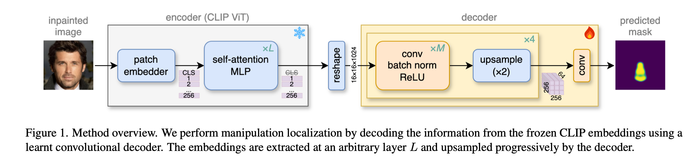

# DeCLIP: Decoding CLIP representations for deepfake localization

- **作者**：Stefan Smeu
- **年份**：2024
- **机构**：Bitdefender
- **论文链接**：[arXiv](https://arxiv.org/abs/2406.00000)
- **代码链接**：[GitHub](https://github.com/bit-ml/DeCLIP)

---

## 主要贡献

1. **首次将CLIP特征用于deepfake定位**，不仅仅是检测。
2. 提出**卷积解码器**，将低分辨率CLIP特征解码为像素级掩码。
3. 在多种生成方法、OOD场景下表现出强泛化能力，尤其在LDM数据训练时。
4. 在Dolos（人脸）、COCO-SD（通用物体）等数据集上均表现优异。

---

## 关键组件

| 组件            | 说明                                                         |
|-----------------|--------------------------------------------------------------|
| Backbone        | CLIP ViT-L/14 和 ResNet-50                                   |
| Decoder         | 卷积解码器，4/12/20子块，20子块效果最佳                      |
| Feature Layer   | ViT: Layer 21最优（OOD），ResNet: Layer 3最优（OOD）         |
| Training Obj.   | Binary cross-entropy，监督掩码预测                           |

---

## 方法原理与实现细节

- 利用CLIP主干（ViT/ResNet）提取多层特征，卷积解码为像素级掩码。
- 多backbone融合提升定位精度和泛化能力。
- LDM-inpainted数据增强提升跨生成器泛化。
- 损失函数：BCE损失，回归像素级掩码。
- 

---

## 训练与实验设置

- **数据集**：
  - Dolos（人脸局部修补，LaMa/Pluralistic/P2/LDM）
  - COCO-SD（MS COCO图像，Stable Diffusion修补）
  - AutoSplice（OOD评估，DALLE-2伪造）
- **ID/OOD配置**：
  - ID（In-Domain）：训练和测试用同一生成器（如train on P2, test on P2）
  - OOD（Out-of-Domain）：训练和测试用不同生成器（如train on P2, test on LaMa）
  - 共16种训练-测试组合（4生成器×4生成器），4组ID，12组OOD
- **评估方式**：
  - IoU（Intersection over Union）衡量预测掩码与真实掩码重合度
  - 统计ID IoU（同域平均）、OOD IoU（异域平均）
- **示例配置表**：

| Train / Test | LDM        | P2         | LaMa       | Pluralistic |
|--------------|------------|------------|------------|-------------|
| **LDM**      | ID         | OOD        | OOD        | OOD         |
| **P2**       | OOD        | ID         | OOD        | OOD         |
| **LaMa**     | OOD        | OOD        | ID         | OOD         |
| **Pluralistic** | OOD     | OOD        | OOD        | ID          |

---

## 性能对比

| Model                        | ID IoU (%) | OOD IoU (%) |
|------------------------------|------------|-------------|
| Patch Forensics (baseline)   | 69.3       | 20.4        |
| CLIP-linear (baseline)       | 36.2       | 18.5        |
| **DeCLIP (ViT-L/14+ResNet-50)** | 73.8   | **34.7**    |
| PSCC-Net                     | 81.0       | 21.6        |

> DeCLIP在OOD场景下取得SOTA泛化性能，同时保持强ID性能。

---

## 主要发现

- CLIP线性探针（linear probe）对局部伪造无效，尤其在OOD下。
- LDM-inpainted数据提升泛化能力，因VAE上采样引入全局指纹。
- ViT与ResNet特征融合提升ID与OOD性能。
- DeCLIP在多生成器、多数据集、OOD场景下均表现优异。

---

## 迁移启示与总结

- 基础模型特征（如CLIP）可迁移到像素级定位任务，适合多生成器、多场景伪造检测。
- 多backbone融合、LDM-inpainted数据增强机制值得在其他分割/检测任务中借鉴。
