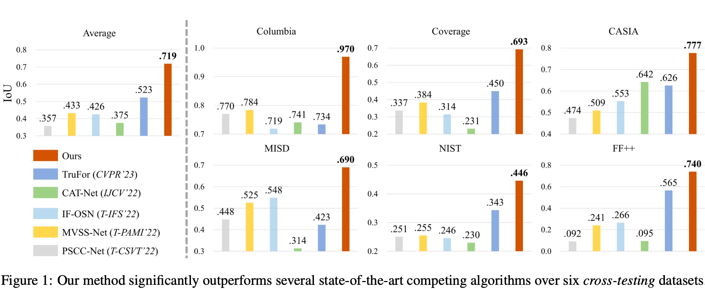
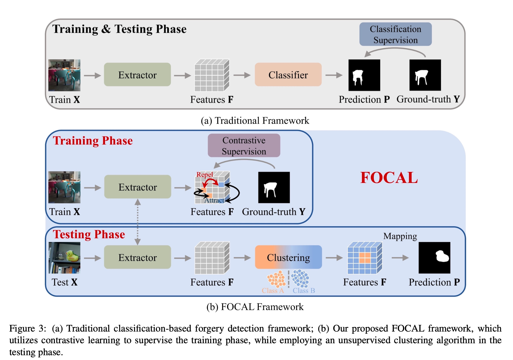

# Rethinking Image Forgery Detection via Contrastive Learning and Unsupervised Clustering (FOCAL)

- **作者**：Haiwei Wu, Yiming Chen, Jiantao Zhou
- **年份**：2023
- **机构**：University of Macau
- **论文链接**：[arXiv](https://arxiv.org/abs/2308.09307)
- **代码链接**：[GitHub](https://github.com/HighwayWu/FOCAL)





#### 主要贡献
1. **重新定义问题**
   指出“伪造/原始”标签只在单幅图像内部具有相对意义，传统分类范式把跨图像像素混进同一类会削弱特征判别力。
2. **FOCAL 框架**
   - **像素级对比学习**：用改进 InfoNCE（$L_{\text{InfoNCE}++}$）在单图像尺度上对特征进行正负对比；每幅图像单独累计损失，避免 batch 内冲突。
   - **在线无监督聚类**：测试阶段使用 HDBSCAN 直接把特征划分为伪造/原始，无需训练分类器。
   - **特征级融合**：支持多 backbone（HRNet、ViT）拼接，无需再训练即可进一步提升性能。
3. **性能大幅领先**
   在六个公开数据集（Coverage、Columbia、CASIA、MISD、NIST、FF++）上平均 IoU 提升 19.6%，最高单集 +24.3% IoU，相比 TruFor、MVSS‑Net 等 SOTA 有显著优势。
4. **稳健性**
   对 JPEG 压缩、Gaussian blur、OSN 传输等失真表现出最小性能衰减（≤0.2% F1）。

---

#### 方法概述（FOCAL 流程）
```text
输入图像 → 特征提取器（HRNet / ViT …）
        ↘︎ GT 伪造掩码 → 像素级对比学习 (训练时)
训练后：
特征 → HDBSCAN 聚类 → 二值伪造掩码
(可选) 多模型特征 Concatenate → 同步聚类
```
**什么叫“像素级学习”？**

> 在 FOCAL 里，它的核心思想是：**把每一个像素都当成一条训练样本，而不是把整张图像当成一个整体**。这样网络学到的特征会细到每个点，能更精准地区分伪造区域和真实区域。

---

##### 通俗类比
- **整图级学习**：好比老师只给你一张全班合照，让你判断「这张照片是不是伪造」。
- **像素级学习**：老师把照片切成了几十万个拼图块（每个像素），要求你给**每一块**贴标签：「这一块是原图还是被 P 过」。这样你必须学会观察局部的光照、纹理、噪声等细节。

---

#### 在 FOCAL 中具体怎么做？

1. **拿到伪造掩码**
   - 训练数据里，每张图配有像素级标签：白色 = 伪造，黑色 = 原始。

2. **提取特征**
   - 图像通过 backbone（HRNet / ViT）后得到特征图 $F$，大小约 $256 \times 256$，等于把原图每 $4 \times 4$ 像素汇成一个「小方块特征」。每个方块仍代表一个局部像素区域。

3. **对比学习（Contrastive Learning）**
   - 对特征图 *逐像素* 展平，形成「字典」$\{q, k^+, k^-\}$。
     * $q$：当前要学习的像素特征。
     * $k^+$：与 $q$ 在同一类别（同一张图里同为伪造或同为真实）的像素特征，都是"好朋友"。
     * $k^-$：另一类别的像素特征，是"对手"。
   - 改进的 InfoNCE 损失让网络：
     * **拉近** $q$ 与所有 $k^+$（好朋友距离变短）
     * **推远** $q$ 与所有 $k^-$（对手距离变远）
   - **关键细节**："一张图一算"——只在同一张图内部做对比，避免把别的图片的伪造像素误当成正样本。

4. **为什么有效？**
   - 每张图的伪造区域往往只有一种风格（同一次编辑产生），这种"局域一致性"恰好符合像素级对比学习的正样本定义。
   - 不同图之间的拍摄设备、压缩方式差异很大，如果把它们混起来学，网络会被噪声干扰。

下面给出 **FOCAL** 在推理阶段如何产出伪造区域 mask 的完整流程与示例代码（PyTorch + hdbscan）。思路非常直白：**先用主干网络提特征 → 再用无监督聚类把特征分两堆 → 最小那堆视为伪造 → 还原成掩码并上采样回原图大小**。

---
#### inference 阶段

##### 前置准备

```python
import torch
import torch.nn.functional as F
import hdbscan                  # pip install hdbscan
from torchvision import transforms
from PIL import Image
```

* **backbone**：加载训练完成的 HRNet / ViT 权重（只包含特征提取部分）。
* **输入尺寸**：与训练一致，例如 $1024 \times 1024$；推理时如果原图尺寸不同，需要等比例 resize。
* **device**：CPU 也能跑，但大图建议 GPU。

---

##### 推理步骤

###### 图像预处理
```python
img = Image.open('test.jpg').convert('RGB')
w0, h0 = img.size                         # 记录原始尺寸
to_tensor = transforms.Compose([
    transforms.Resize((1024, 1024)),
    transforms.ToTensor()
])
x = to_tensor(img).unsqueeze(0).to(device)  # shape: [1, 3, H, W]
```

###### 前向获得特征图
```python
with torch.no_grad():
    feat = backbone(x)     # 假设 HRNet 输出 [1, C, 256, 256]
feat = F.normalize(feat[0].permute(1, 2, 0), dim=-1)  # [256, 256, C] → L2 归一化
```

###### 展开为 $N \times C$
```python
flat = feat.reshape(-1, feat.shape[-1]).cpu().numpy()   # N = 256*256
```

###### HDBSCAN 聚类
```python
clusterer = hdbscan.HDBSCAN(min_cluster_size=500,     # 经验值，可调整
                            metric='euclidean',
                            gen_min_span_tree=False)
labels = clusterer.fit_predict(flat)                  # -1 表示噪声点
```

> **为何用 HDBSCAN？**
> - 自动决定簇数；遇到全真图时可能只输出 1 簇，避免错误报警。
> - 能把极少数离群点标为 -1（视作伪造的边缘噪声），有利于清理误报。

###### 把簇映射成「真 / 假」
```python
import numpy as np

# 把 -1 当成一个独立簇
labels[labels == -1] = labels.max() + 1
unique, counts = np.unique(labels, return_counts=True)

# 默认：样本最多的簇 = 原始 (pristine)，其余 = 伪造 (forged)
pristine_id = unique[np.argmax(counts)]
mask_small = (labels != pristine_id).astype(np.uint8)     # shape: [N]
mask_feat = mask_small.reshape(feat.shape[:2])            # [256, 256]
```

###### 上采样回原图大小
```python
mask = torch.tensor(mask_feat)[None, None, ...].float()   # [1,1,256,256]
mask = F.interpolate(mask, size=(h0, w0), mode='nearest') # → [1,1,h0,w0]
pred_mask = mask.squeeze().numpy().astype(np.uint8)       # 0 or 1
```

###### 可选后处理
- `scipy.ndimage.binary_opening` 去孤立噪声点
- `cv2.morphologyEx` 做膨胀 / 腐蚀
- 保留最大连通域 (如果你确信只有一块伪造)

---

#### 关键参数小贴士

| 参数 | 影响 | 常用设置 | 调整经验 |
|------|------|----------|---------|
| `min_cluster_size` | HDBSCAN 认为"一簇"最少样本数 | 300–1000 | 伪造区域通常较小，设得越大越不易误报 |
| `min_samples` | 密度阈值，影响 -1 噪声点数量 | 默认为 None ($\approx$ min_cluster_size) | 噪声点太多就略增此值 |
| 上采样方式 | 最近邻 / 双线性 | 最近邻 | 防止边缘被平滑 |

---

#### 一句话总结

> **推理=特征→聚类→重新着色**：提一次特征，聚一次 HDBSCAN，把最大簇标为「真」，其他全部涂成「假」，再还原尺寸即可获得伪造掩码。这样完全无需额外分类头，也避免了训练‑测试域差异导致的过拟合。

- **对比学习阶段**：
  - 将特征展平为字典 $\{q, k^+, k^-\}$，把同图像中 "原始" 像素全部视为正样本集合；改进损失同时考虑多正样本平均。
  - *Image-by-image* 损失让训练曲线更平滑、收敛更快（论文 Fig. 4）。

- **聚类阶段**：
  - HDBSCAN 自适应聚类数；默认将最大簇标记为"原始"，其余合并为"伪造"，对纯净图像可自动输出全零掩码，降低误报。


#### 值得借鉴的思想
| 设计点 | 可迁移启示 |
|---|---|
| **相对标签视角** | 在其他局部异常检测（图像复原、医学分割）中，可考虑"同图内相对"而非全局标签。 |
| **Image-level Contrastive** | 避免 batch 混杂导致的 label-to-feature 冲突；对多任务学习也可按样本分组计算对比损失。 |
| **无监督在线聚类** | 若测试域分布与训练差异大，用无参数模块替代分类头能提升泛化；可扩展到时序 / 语义分割。 |
| **后训练特征融合** | 模型蒸馏或集成之外，一步 Concatenate + 聚类即可增益，适合资源受限但想利用多 backbone 的场景。 |

---

#### 实验 & 统计摘要
| 数据集 | 传统最佳 IoU | **FOCAL (Fusion)** IoU | Δ |
|---|---|---|---|
| Coverage | 52.4% (TruFor) | **69.3%** | +16.9 |
| Columbia | 78.4% (MVSS †) | **97.0%** | +18.6 |
| CASIA | 64.2% (CAT-Net) | **77.7%** | +13.5 |
| MISD | 54.8% (MVSS) | **69.0%** | +14.2 |
| NIST | 34.3% (TruFor) | **44.6%** | +10.3 |
| FF++ | 56.5% (TruFor) | **74.0%** | +17.5 |

---

#### 快速引用格式
```bibtex
@article{wu2023focal,
  title     = {Rethinking Image Forgery Detection via Contrastive Learning and Unsupervised Clustering},
  author    = {Wu, Haiwei and Chen, Yiming and Zhou, Jiantao},
  journal   = {arXiv preprint arXiv:2308.09307},
  year      = {2023},
  note      = {Code: https://github.com/HighwayWu/FOCAL}
}
```

> **一句话总结**
> FOCAL 把"伪造检测"从二分类问题重塑为"图内对比 + 在线聚类"，用极简框架在跨域场景取得了领先且稳健的定位精度，是值得在其它视觉异常检测任务中尝试的思路。
