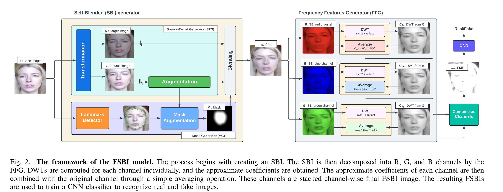

# FSBI: Self-Blended Images for Generalized Deepfake Detection (FSBI)

- **作者**：Ahmed Abul Hasnanaath
- **年份**：2024
- **机构**：King Fahd University of Petroleum and Minerals
- **论文链接**：[arXiv](https://arxiv.org/abs/2406.00000)
- **代码链接**：[GitHub](https://github.com/gufranSabri/FSBI)

---

## 论文背景与动机

深度伪造检测模型在遇到未知类型伪造时常常表现不佳。FSBI关注于提升检测模型的泛化能力，提出自混合图像（SBI）合成和小波频域特征，旨在生成多样化伪造样本并增强特征表达。

## 方法原理与实现细节

- **核心思想**：
  - 通过单图像两次不同增强，检测人脸关键点生成mask，融合两图生成SBI伪造样本。
  - 采用小波变换提取RGB三通道频域特征，提升对伪造的敏感性。
- **SBI（Self Blended Image）合成流程**：
  1. 对单张图像分别做两次不同的随机增强，增强方式包括：
     - RGB和HSV抖动
     - 对比度和亮度抖动
     - 下采样
     - 平移
     得到两张增强图像 $I_t$ 和 $I_s$。
  2. 在 $I_s$ 上用人脸关键点检测模型生成mask，取关键点凸包，经过高斯模糊和膨胀处理得到平滑mask $M$。
  3. 按如下公式融合两张图像：
     $$I_{SBI} = I_s \cdot M + I_t \cdot (1 - M)$$
     其中 $M$ 为[0,1]区间的灰度张量，边缘平滑。
- **频域特征生成**：
  1. 将图像分为R、G、B三个通道
  2. 分别对每个通道做小波变换，提取频域系数
  3. 将各通道系数resize到同一尺寸后拼接，作为最终频域特征输入检测器
- **网络结构**：
  - 输入为SBI合成图像，特征提取后送入分类器。
- **创新点**：
  - 自混合伪造样本生成，提升训练数据多样性。
  - 小波频域特征增强模型泛化能力。
- **损失函数**：
  - 采用常规分类损失。
- **流程图/结构图**：
  - 

## 实验设置与结果分析

- 在多种公开伪造数据集上训练和测试，评估跨伪造类型的检测能力。
- SBI样本和频域特征显著提升了模型对未知伪造的检测准确率。

## 主要贡献与不足

- **贡献**：
  - 提出自混合图像合成和小波频域特征，提升检测模型泛化能力。
- **不足**：
  - 对极端复杂伪造或极小区域伪造的检测仍有提升空间。

## 个人点评/启示

FSBI通过数据增强和频域特征提升了伪造检测的鲁棒性。自混合伪造和小波特征值得在其他视觉任务中借鉴。