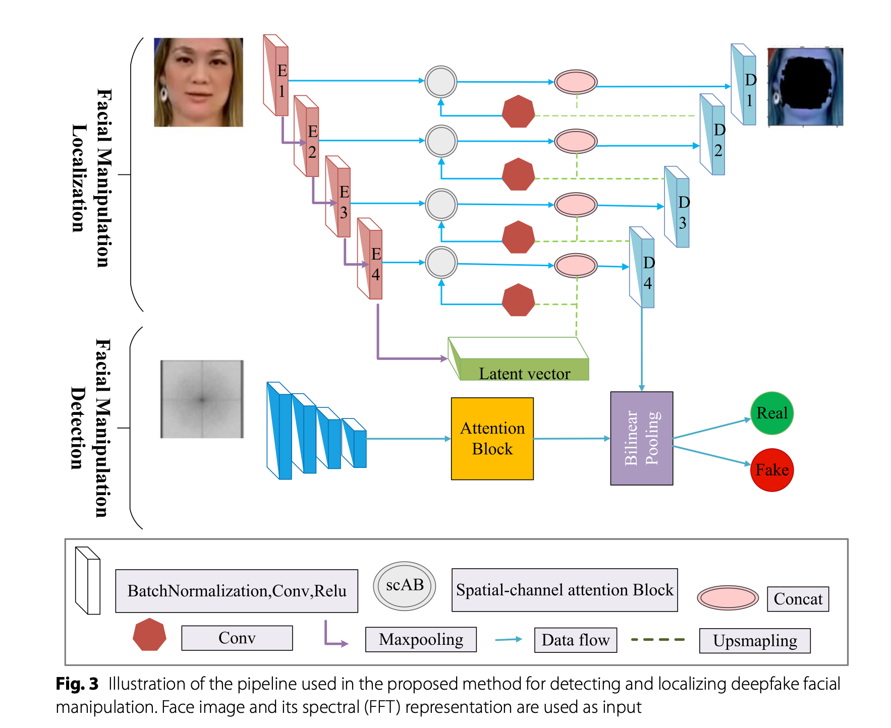

# Multi‑attention‑based approach for deepfake face and expression swap detection and localization

- **作者**：Saima Waseem
- **年份**：2023
- **机构**：Universiti Teknologi Malaysia, Johor, Malaysia
- **论文链接**：[Springer](https://link.springer.com/content/pdf/10.1186/s13640-023-00614-z.pdf)
- **代码链接**：[GitHub](https://github.com/saimawaseem/Multi-Attention-Based-Approach-for-Deepfake-Face-and-Expression-Swap-Detection-and-Localization)

---

## 论文背景与动机

深度伪造人脸和表情交换的检测与定位任务对模型的鲁棒性和跨数据集泛化能力提出了更高要求。该方法关注于融合空间和频域特征，通过多重注意力机制提升检测与定位性能。

- **两类伪造任务**：
  - Face swap（身份替换）
  - Expression swap（表情替换/重演）

---

## 方法原理与实现细节

- **核心思想**：
  - 设计多重注意力机制的U-Net结构，融合空间-通道注意力和频域特征。
  - 频域特征用FFT提取，Bilinear Pooling融合多模态特征。

| 组件         | 说明                                                                 |
|--------------|--------------------------------------------------------------------|
| 主干网络     | U-Net，编码器和解码器均嵌入空间-通道注意力模块（scAB）              |
| 频域特征     | 对输入图像做FFT，频域特征与空间特征在中间层融合                     |
| 融合方式     | Bilinear Pooling                                                    |
| 输入格式     | $H = (A_i, B_i, D_i, y_i)$，$A_i$为RGB图像，$B_i$为mask，$D_i$为FFT，$y_i$为标签 |
| 伪造类型     | Face swap（整脸mask），Expression swap（表情区域mask）              |

- **数据增强策略**：

| 增强方法         | 目的                                                         |
|------------------|--------------------------------------------------------------|
| 水平翻转         | 增加样本多样性                                               |
| 旋转             | 增加视角变化，提高空间鲁棒性                                 |
| 对比度调整       | 增强对不同图像质量的适应性                                   |
| 添加高斯噪声     | 模拟视频压缩或图像劣化，提高对压缩伪造的识别能力            |
| JPEG压缩模拟     | 模拟真实社交平台上传/压缩后的伪造内容，提高模型泛化能力      |

- **损失函数与权重**：

| 损失项         | 公式                                                         | 说明                       |
|----------------|--------------------------------------------------------------|----------------------------|
| 分类损失       | $L_{class}$：二分类交叉熵                                     | 检测真实/伪造              |
| 定位损失       | $L_{localize}$：L1/L2回归损失                                | 伪造区域定位，优于Dice/Focal|
| 总损失         | $L_{comb} = \rho_{class} L_{class} + \rho_{localize} L_{localize}$ | 权重$\rho_{class} = \rho_{localize} = 1$ |

- **训练与优化细节**：

| 参数           | 值                |
|----------------|-------------------|
| 主干网络       | ResNet + Residual U-Net |
| 优化器         | Adam              |
| 初始学习率     | 1e-4              |
| β1 / β2        | 0.9 / 0.999       |
| batch size     | 16                |
| 学习率调整策略 | 30个epoch不提升则LR×0.1 |
| 输入尺寸       | 224×224           |

- **可视化与流程图**：
  - 

---

## 实验设置与结果分析

| 实验类型         | 数据集/指标         | 结果/表现                          |
|------------------|--------------------|------------------------------------|
| 内数据集测试     | FF++ (C23/C40)     | 99.97% / 96.47%                    |
| 跨数据集测试     | DFDC-P (AUC)       | 79.10%，比MaDD高10%+               |
| 定位性能         | FaceSwap (mIoU)    | 70.04%，优于ADD/Multi-Task         |
| 消融实验         | -                  | 分析各注意力模块和损失设计贡献      |

---

## 主要贡献与不足

| 贡献                                                         | 不足                                   |
|--------------------------------------------------------------|----------------------------------------|
| 多重注意力U-Net结构和空间+频域融合，提升检测与定位性能       | 对极端复杂表情或极小伪造区域检测有限   |
| 多任务损失和多模态融合提升鲁棒性和泛化能力                   |                                        |

---

## 个人点评/启示

- 多重注意力和频域融合机制对提升跨模态检测任务有重要启发，适合迁移到其他视觉识别场景。
- 训练中多种增强手段和mask引导的定位训练值得在其他分割/检测任务中借鉴。