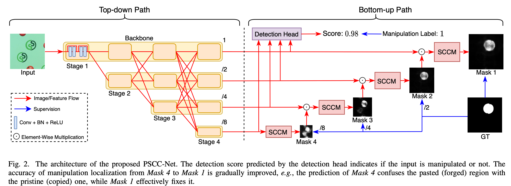
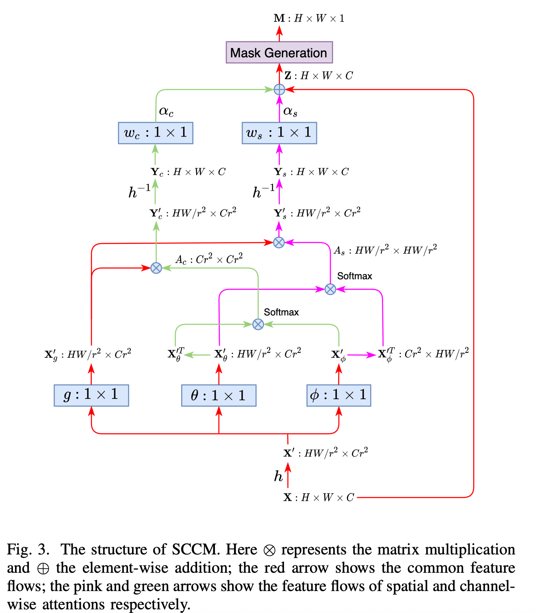

# Progressive Spatio-Channel Correlation Network for Image Manipulation Localization (PSCC-Net)

- **作者**：Xiaohong Liu
- **年份**：2022
- **机构**：Shanghai Jiao Tong University
- **论文链接**：[arXiv](https://arxiv.org/pdf/2103.10596)

---

## 论文背景与动机

图像篡改检测与定位任务中，如何精准分割伪造区域并提升跨数据集泛化能力是难点。PSCC-Net关注于空间-通道相关性建模和多尺度掩码预测，提出逐步细化伪造区域定位的网络结构。该方法旨在检测和定位图像篡改，包括拼接、复制-粘贴和对象移除等操作，通过结合空间和通道维度的相关性，以多尺度、逐步细化的方式生成篡改掩码，从而提高检测的准确性和鲁棒性。

---

## 方法原理与实现细节
- 

### 逐步机制（Progressive Mechanism）
- 采用从粗到细的多尺度掩码预测策略，每一层的掩码预测都基于前一层结果，逐步细化篡改区域定位，类似人类视觉聚焦过程。

### 空间-通道相关模块（SCCM）
- 在每个尺度上捕捉空间和通道维度的相关性。
- **空间分支**：提取像素间结构依赖，计算空间自相关矩阵：
  $$
  S = \text{softmax}(F_s^\top F_s)
  $$
- **通道分支**：捕捉特征通道间依赖，计算通道自相关矩阵：
  $$
  C = \text{softmax}(F_c F_c^\top)
  $$
- 两分支输出融合后与原始特征残差连接：
  $$
  F' = F + \lambda (F_{spatial} + F_{channel})
  $$
- 

#### SCCM原理关键词表
| 维度   | 操作                | 目的                     |
|--------|---------------------|--------------------------|
| 空间   | 自相关(pixel-pixel) | 提取上下文结构、边缘一致性 |
| 通道   | 自相关(channel-channel) | 强化语义维度特征         |
| 输出   | 加权融合、残差连接  | 保留原始特征并增强关键区域表达 |

### 轻量级设计与高效性
- 采用HRNetV2p-W18编码器，逐步机制保证高效，1080P图像可达53FPS，适用于实时应用场景。

#### Loss核心思想:Progressive Multi-scale Loss

#### 📌 损失函数组成

总损失为多尺度损失的加权和:

$$
\mathcal{L}_{total} = \sum_{i=1}^{S} \lambda_i \cdot \mathcal{L}_{i}
$$

其中:
- $S $ 表示尺度的总数(例如，4个阶段)
- $\mathcal{L}_i $是第 $i$个尺度的 loss(例如，BCE loss)
- $\lambda_i $是第 $i$个尺度的权重(一般从 coarse 到 fine，越细粒度的层权重越高)

每个尺度的损失 $\mathcal{L}_i$：

$$
\mathcal{L}_{i} = \frac{1}{N} \sum_{j=1}^{N} \left[ y_j \log(p_j) + (1 - y_j)\log(1 - p_j) \right]
$$

- $y_j$ 是 ground truth 掩码的像素值(0 或 1)
- $p_j$ 是模型在第 $i$个尺度预测的对应像素值

| 组成部分 | 描述 |
|----------|------|
| 多尺度预测 | 每个阶段生成一个掩码 |
| BCE Loss | 每个掩码与对应 ground truth 比较 |
| 加权求和 | 更高分辨率的阶段 loss 权重更高 |
| 优势 | 提高多尺度鲁棒性、从 coarse 到 fine 地优化 |

---

## 实验设置与结果分析

- **评估数据集**：Columbia、CASIA、NIST16、Coverage、IMD20等。
- **定位AUC**：

| 数据集       | 任务类型     | PSCC-Net 表现 | 对比方法(最好者) | 指标类型 |
|--------------|--------------|----------------|----------------------|----------|
| Columbia     | 拼接检测     | 98.7%          | SPAN: 96.7%          | AUC      |
| CASIA        | 拼接检测     | 87.5%          | SPAN: 83.8%          | AUC      |
| Coverage     | 拼接检测     | 97.6%          | SPAN: 94.7%          | AUC      |
| NIST16       | 多种篡改类型 | 88.7%          | SPAN: 84.0%          | AUC      |
| IMD20        | 多种篡改类型 | 89.3%          | SPAN: 85.1%          | AUC      |

- **速度**：1080P图像可达53FPS，远快于SPAM等方法。
- **可视化结果**：掩码边界更平滑、误报更少。
- **消融实验**：验证逐步机制和SCCM模块对性能提升的贡献。

## 主要贡献与不足

| 贡献                                                         | 不足                                   |
|--------------------------------------------------------------|----------------------------------------|
| 提出逐步细化机制和空间-通道相关性模块，提升定位精度和泛化能力 | 对极端复杂背景或极小伪造区域分割有限   |
| 轻量高效，适合实际部署                                       |                                        |

---

## 结论与可迁移启示

- 逐步细化机制（coarse-to-fine）和空间-通道相关性建模对提升定位任务有重要启发。
- 多尺度监督、轻量高效设计、注意力与相关性结合值得迁移到其他分割/检测场景。
- 只利用了空间信息，没有利用频域信息，也没有利用图片内一致性的信息，但这些信息可融合进该网络框架。

