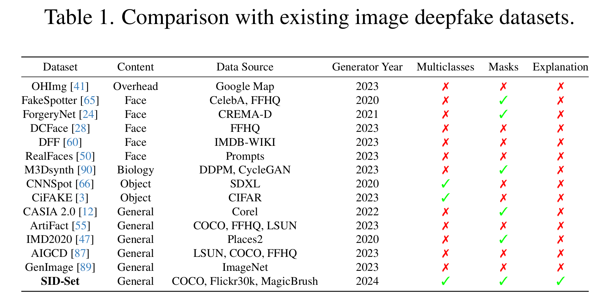
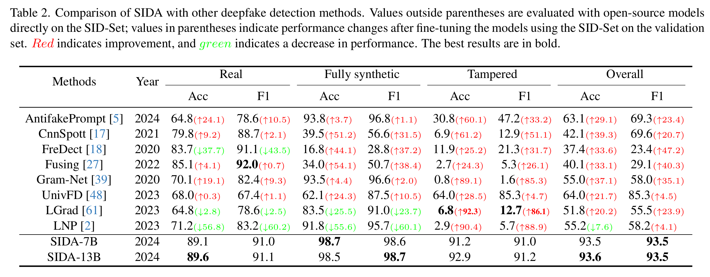

# SIDA: Social Media Image Deepfake Detection, Localization and Explanation with Large Multimodal Model (SIDA)

- **作者**：Zhenglin Huang
- **年份**：2024
- **机构**：University of Liverpool, UK
- **论文链接**：[arXiv](https://arxiv.org/pdf/2412.04292)

---

## 论文背景与动机

社交媒体图像伪造检测面临多模态、复杂场景和解释性需求。SIDA关注于多任务大模型的设计，兼顾检测、定位和文本解释能力，适应社交媒体多样化伪造场景。

---

## 方法原理与实现细节

- **核心思想**：
  - 设计多任务大模型，联合检测、分割掩码和文本生成三大任务。
  - 多模态特征融合，提升对复杂伪造的适应性。
- **网络结构**：
  - 主干为多模态Transformer，分支输出检测结果、像素级掩码和文本描述。
- **创新点**：
  - 多任务损失联合训练，兼顾检测、定位和解释。
  - 文本生成分支提升模型可解释性。
- **损失函数**：
  - 检测损失、分割掩码损失（BCE+Dice）、文本生成损失（交叉熵）。
  - 训练目标详细公式：
    - **Detection loss** ($\mathcal{L}_{det}$)：交叉熵损失。
    - **Segmentation mask loss** ($\mathcal{L}_{mask}$)：BCE与Dice加权：
      $$
      \mathcal{L}_{mask} = \lambda_{bce} \mathcal{L}_{BCE}(\hat{M}, M) + \lambda_{dice} \mathcal{L}_{DICE}(\hat{M}, M)
      $$
    - **Text generation loss** ($\mathcal{L}_{txt}$)：描述文本的交叉熵损失：
      $$
      \mathcal{L}_{txt} = \mathcal{L}_{CE}(\hat{y}_{des}, y_{des})
      $$
    - **总损失**：
      - 初始训练：
        $$
        \mathcal{L} = \lambda_{det} \mathcal{L}_{det} + \lambda_{mask} \mathcal{L}_{mask}
        $$
      - 微调阶段：
        $$
        \mathcal{L}_{total} = \lambda_{det} \mathcal{L}_{det} + \lambda_{mask} \mathcal{L}_{mask} + \lambda_{txt} \mathcal{L}_{txt}
        $$
    - 其中 $\lambda_{det}$、$\lambda_{mask}$、$\lambda_{txt}$ 为各损失项权重。
- **数据集**：
  - 构建了社交媒体图像伪造检测数据集（SID-Set），包含真实与多种伪造类型样本。
  - 
- **流程图/结构图**：
  - 

## 实验设置与结果分析

- 在社交媒体真实/伪造图像数据集上训练和测试。
- 评估检测、定位和文本解释三大任务的性能。
- 多任务训练显著提升了模型的泛化能力和解释性。
- 消融实验分析了多任务损失和多模态融合的贡献。
- **实验结果**：
  - 

## 主要贡献与不足

- **贡献**：
  - 提出多任务多模态大模型，兼顾检测、定位和解释。
  - 适配社交媒体复杂伪造场景。
- **不足**：
  - 多任务训练对数据和算力要求较高。

---

## 个人点评/启示

SIDA为多模态、多任务伪造检测提供了新范式。文本生成解释机制值得在其他安全场景推广。