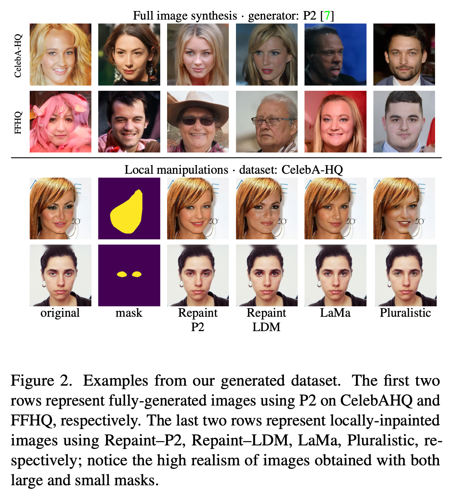

# Weakly-supervised deepfake localization in diffusion-generated images

- **作者**：Dragos-Constaintin Tantaru
- **年份**：2024
- **机构**：Bitdefender
- **论文链接**：[WACV 2024](https://openaccess.thecvf.com/content/WACV2024/papers/Tantaru_Weakly-Supervised_Deepfake_Localization_in_Diffusion-Generated_Images_WACV_2024_paper.pdf)
- **代码链接**：[GitHub](https://github.com/bit-ml/dolos)

---

## 论文背景与动机

Denoising Diffusion Models（扩散模型）生成能力强，带来图像真实性新威胁。现有检测方法多基于GAN，仅输出"真/假"标签，缺乏对伪造区域的定位能力。该论文将任务转化为弱监督定位问题，输出图像中被篡改的区域图（localization map），并系统分析弱监督伪造区域检测的设计空间。

---

## 方法原理与实现细节

- **方法分类与统一比较**：
  - 三类方法：基于解释（GradCAM）、局部得分（Patch-Forensics）、注意力机制（Attention）。
  - 所有方法统一采用Xception网络架构，确保公平对比。
  - 

- **详细方法表格**：

| 方法类型         | 方法名        | 主体结构       | 原理与机制                                                                 | 监督方式              | 本文改进 / 说明                                               |
|------------------|----------------|----------------|------------------------------------------------------------------------------|------------------------|----------------------------------------------------------------|
| 🧠 解释驱动类     | **GradCAM**    | Xception (block 11) | 用 GradCAM 在倒数第二层激活图上生成热图(定位解释)                              | 弱监督 / 全监督均可      | 添加全卷积层支持全监督训练，对 GradCAM 定量评估性能                         |
| 📦 局部评分类     | **Patches (Patch–Forensics)** | Truncated Xception (block 2) | 使用 `1×1` 卷积将中间特征映射到 patch-level 分数，训练时对 patch 单独监督            | 弱监督 / 全监督均可      | 原方法只展示可视化，本研究量化其定位效果；全监督时使用 mask 替代 image label |
| 🔍 注意力机制类   | **Attention**  | Xception + Learned Mask | 网络学习 attention mask，同时监督整体图像真假和 mask 的最大值与标签一致性              | 弱监督 / 全监督均可      | 将 L1 损失改为 binary cross-entropy，调参优化 λ，提升稳定性与性能               |
| 🎯 全监督上限对比 | **全监督版本** | 同上三种方法改写版 | 明确提供伪造区域 groundtruth mask，作为 upper bound 基线                              | 全监督                 | 每种方法按需修改支持 mask 监督训练                                  |

- **数据集构建与处理**：
  - 
  - **真实图像**：CelebA-HQ、FFHQ，原始人脸图像，各9k train/900 val。
  - **全图伪造**：Diffusion (P2模型)生成，9k train/1k val，用于弱监督训练(Setup A)。
  - **局部伪造**：CelebA-HQ、FFHQ，使用多种修补方法（Repaint–P2、Repaint–LDM、LaMa、Pluralistic）对面部部位修补，最多30k train/8.5k test，含ground truth mask。
  - **修补区域来源**：CelebA-HQ用CelebAMask-HQ标签，FFHQ用预训练分割模型生成mask，小部位区域随机膨胀1–15像素。
  - **三种训练设置**：
    - Setup A：仅图像级标签，全图伪造（P2生成），假图完全伪造。
    - Setup B：仅图像级标签，局部伪造（Repaint–P2），输入标签"假"，但部分区域为真。
    - Setup C：强监督，提供mask（Repaint–P2），mask为ground truth。
  - **控制变量设计**：单一改变生成器、监督方式或数据源，系统分析其对性能的影响。
  - **数据量**：总计超12.5万张图像，涵盖多种篡改类型和方法。

---

## 训练与损失设计

- **Patch-Forensics分支损失**：patch级交叉熵。
- **Attention分支损失**：BCE。
- **L1/L2回归损失**：
  $$
  \text{L1} = \frac{1}{n} \sum_{i,j} |M^{pred}_{i,j} - M^{gt}_{i,j}|
  $$
- **分类分支交叉熵损失**：用于 detection 准确率。
- **训练目标**：
  - 多任务损失组合：
    $$
    L_{comb} = \rho_{class} L_{class} + \rho_{localize} L_{localize}
    $$
  - $L_{class}$：二分类交叉熵（检测真/伪），$L_{localize}$：伪造区域定位（L1/L2回归损失优于Dice/Focal）。
  - 权重参数 $\rho_{class} = \rho_{localize} = 1$。

---

## 推理阶段与参数建议

- **推理流程**：
  1. 图像预处理与特征提取（Xception主干）
  2. Patch-Forensics/Attention分支输出伪造分数或mask
  3. HDBSCAN聚类（推荐min_cluster_size=300-1000）
  4. 最大簇视为"真"，其余为"伪造"，还原掩码
  5. 可选后处理：形态学操作、最大连通域筛选
- **代码示例**：
```python
import torch
import torch.nn.functional as F
import hdbscan
from torchvision import transforms
from PIL import Image
# ...见原文详细推理代码片段...

```
- **参数建议表**：

| 参数 | 影响 | 常用设置 | 调整经验 |
|------|------|----------|---------|
| min_cluster_size | HDBSCAN 认为"一簇"最少样本数 | 300–1000 | 伪造区域通常较小，设得越大越不易误报 |
| min_samples | 密度阈值，影响 -1 噪声点数量 | 默认为 None (≈ min_cluster_size) | 噪声点太多就略增此值 |
| 上采样方式 | 最近邻 / 双线性 | 最近邻 | 防止边缘被平滑 |

---

## 实验设置与结果分析

- 在多种扩散模型生成的伪造数据集上训练和测试。
- Patch-Forensics方法在所有设置下优于GradCAM和Attention。
- 弱监督下仍可学习到有效的局部伪造区域。
- LDM生成图像定位性能下降，跨数据集/生成器泛化能力下降。
- 
- 在 FaceForensics++、Celeb-DF、DFFD 等多个数据集上超越了现有方法。
- 具备高分辨率 fakeness map 输出、强鲁棒性（抗 JPEG 压缩、模糊、低分辨率、噪声等）、跨属性与跨 GAN 泛化能力。

---

## 主要发现与贡献

- 局部得分法性能最佳，对弱监督敏感性低，但对生成器/数据集变化更敏感。
- 提供对弱监督伪造区域检测设计空间的系统分析，验证了该方法的可行性。
- 构建高质量局部伪造数据集。
- 对极端复杂伪造或极小区域伪造的定位仍有提升空间。

---

## 方法迁移与启示

| 借鉴点 | 应用价值 |
|--------|----------|
| 利用上采样缺陷作为伪造纹理特征 | 可推广到所有基于 GAN 的生成图像检测中 |
| 灰度 fakeness map 表达更丰富 | 更适用于精细定位任务 |
| attention + face parsing | 利用语义信息指导特征提取，提升泛化性 |
| partial augmentation + clustering | 实用的跨域增强与迁移技巧 |
| 不依赖原始 GAN 结构 | 易于迁移到其它类型图像伪造检测 |

---

## 结论与可迁移启示

- 弱监督、patch级损失和Attention机制为低标注成本下的伪造定位提供了新思路。
- 控制变量设计和多生成器对比有助于分析模型泛化能力。
- 适合迁移到其他弱监督分割任务。