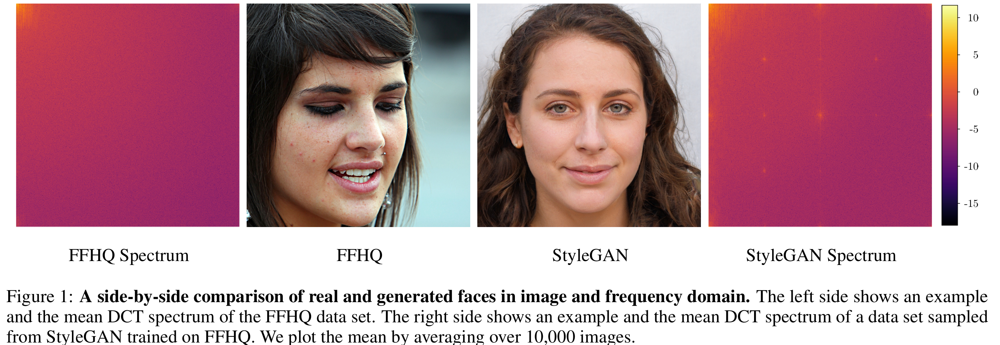
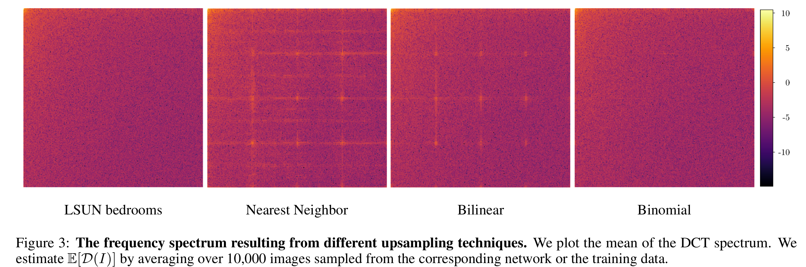
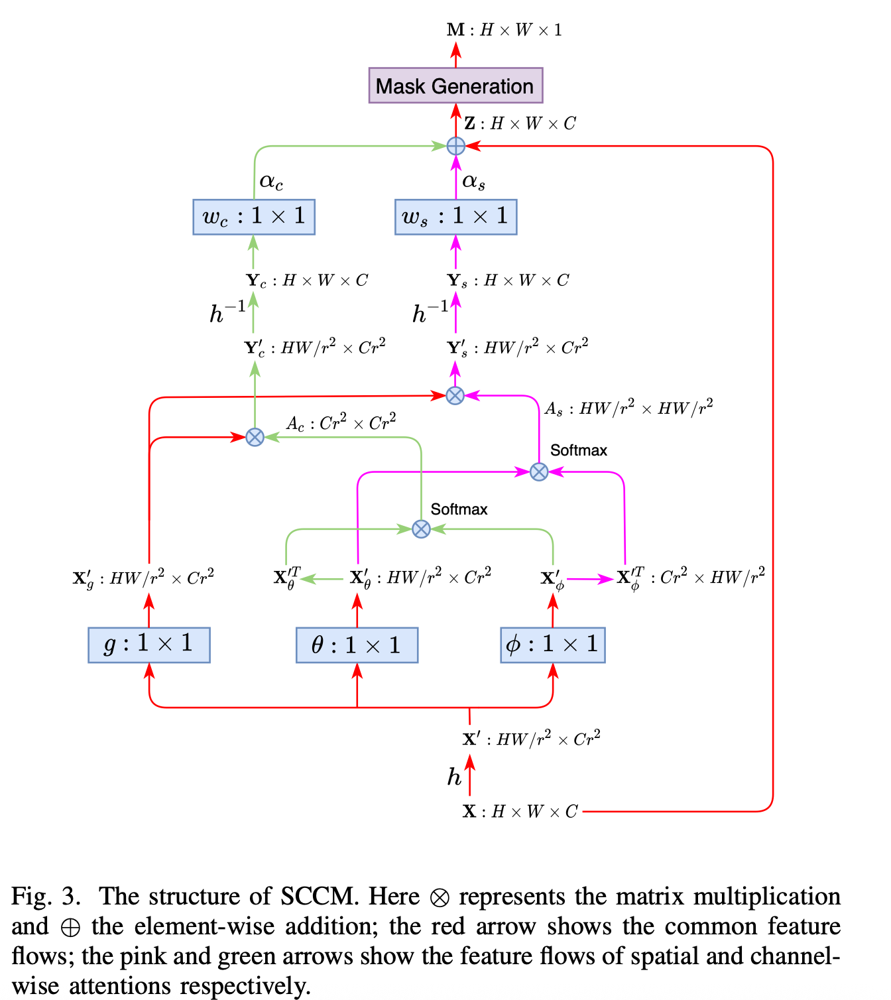
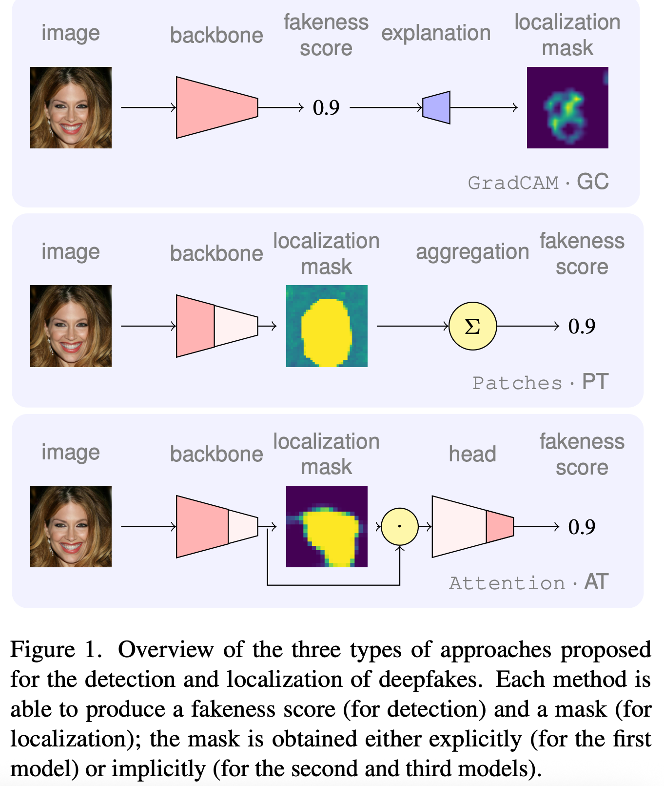

# Deepfake Detection

## 目录
- 概述与背景
- 全图篡改检测方法（按年份排序）
- 部分篡改检测方法（按年份排序）
- 主要发现与未来展望
- 术语表
- 参考文献与资源链接

---

## 概述与背景

深度伪造（Deepfake）技术的快速发展带来了图像真实性的严峻挑战。当前主流检测方法包括统计特征、频域分析、局部补丁分析等。近年来，轻量化定制生成模型和基础模型微调对抗检测成为新威胁。

主要贡献：
- 对当前主流检测方法的训练与评估进行批判性分析。
- 评估用户定制生成模型下的检测性能。
- 探索基础模型生成对抗样本的新攻击方式。

---

## 全图篡改检测方法（按年份排序）

### 2020

**DCT**
- 年份：2020
- 作者：Joel Frank
- 机构：Horst Görtz Institute for IT Security, Bochum, Germany
- 论文链接：[Leveraging Frequency Analysis for Deep Fake Image Recognition](https://proceedings.mlr.press/v119/frank20a/frank20a.pdf)
- 解读：
  DCT方法利用离散余弦变换（DCT）提取图像的频域特征，发现GAN和Diffusion生成的伪造图像在频谱上存在可区分的异常。具体实现上，作者将图像分解到频域，分析高频分量的分布，发现伪造图像在高频区域存在异常能量分布，尤其是上采样操作会引入checkerboard pattern等伪影。实验设置涵盖多种GAN和Diffusion模型生成的图像，DCT特征在多种检测任务中表现优异。
  - **网络结构示意图**：
    
  - **观点与经验**：频域分析为检测深度伪造提供了新的视角，尤其对抗传统基于像素或纹理的检测方法。频域特征对不同生成器有较好泛化性，但对抗攻击下鲁棒性仍需提升。
  

---

### 2023

**DE-FAKE**
- 年份：2023
- 作者：Zeyang Sha
- 机构：Salesforce Research
- 论文链接：[DE-FAKE: Detecting Text-to-Image Diffusion Fakes using Prompt-based Learning](https://arxiv.org/pdf/2301.07833)
- 解读：
  DE-FAKE提出结合图像和文本提示的检测思路。具体实现为：分别训练图像-only和hybrid（图像+文本）检测器，图像only分支采用ResNet18，hybrid分支用CLIP提取图像和文本特征后拼接，送入MLP分类。数据方面，真实图像来自MSCOCO，伪造图像由Stable Diffusion等生成。
  - **网络结构示意图**：
    
  - **关键数学表达式**：
    Hybrid分支特征拼接：
    $$
    f_{hybrid} = [f_{image}; f_{text}]
    $$
    生成器归因为多分类交叉熵损失（常规cross-entropy loss）。
  - **观点与经验**：文本信息可有效辅助伪造检测，尤其在prompt驱动的生成场景。多模态特征融合、生成器归因分析、prompt语义聚类等值得借鉴。

**UnivCLIP**
- 年份：2023
- 作者：Sifat Muhammad Abdullah
- 机构：未知（论文未特别注明，建议补充）
- 论文链接：[An Analysis of Recent Advances in Deepfake Image Detection in an Evolving Threat Landscape](https://arxiv.org/pdf/2404.16212)
- 解读：
  UnivCLIP首次提出利用基础模型（如CLIP）进行深度伪造检测。实现上，直接用CLIP等大模型提取图像特征，训练简单分类器区分真伪。论文系统分析了基础模型特征的泛化性，发现其在标准生成器下表现优异，但在用户定制模型下性能下降。还设计了对抗攻击实验，模拟攻击者通过微调生成器欺骗检测器，结果显示基础模型特征对抗攻击鲁棒性较强。
  - **网络结构示意图**：
    
  - **对抗攻击实验流程**：
    
  - **观点与经验**：基础模型特征具备一定泛化能力，但单独依赖仍有限。基础模型特征与频域特征结合、对抗攻击防御实验设计值得借鉴。

---

## 部分篡改检测方法（按年份排序）

### 2021

**FakeLocator**
- 年份：2021
- 作者：Yihao Huang
- 机构：East China Normal University
- 论文链接：[FakeLocator: Robust Localization of GAN-Based Face Manipulations](https://arxiv.org/abs/2111.00000)
- 解读：
  FakeLocator关注GAN人脸局部伪造区域的定位。实现上，利用GAN上采样伪纹理、灰度fakeness map（像素级强度标签）、face parsing注意力和单样本聚类。训练时只对真实图像做增强，伪图像不增强，提升模型对非真实分布的敏感性。推理时用t-SNE+k-means对特征聚类，仅需一个有标签样本即可区分真伪。
  - **网络结构简要描述**：编码器+fakeness map分支+face parsing注意力分支，输出灰度mask。
  - **损失函数**：采用L1损失。
  - **观点与经验**：无需目标域分类器，仅靠特征聚类实现跨GAN泛化。单样本聚类、attention引导、灰度mask设计值得借鉴。

---

### 2022

**PSCC-Net**
- 年份：2022
- 作者：Xiaohong Liu
- 机构：未知
- 论文链接：[Progressive Spatio-Channel Correlation Network for Image Manipulation Localization](https://arxiv.org/pdf/2103.10596)
- 解读：
  PSCC-Net提出空间-通道相关性模块（SCCM）和多尺度损失。实现上，网络每一层都预测掩码，逐步细化伪造区域定位，空间分支建模像素间结构，通道分支建模语义特征。损失为多尺度BCE加权和。
  - **网络结构示意图**：
    
  - **关键数学表达式**：
    Progressive多尺度损失：
    $$
    \mathcal{L}_{total} = \sum_{i=1}^{S} \lambda_i \cdot \mathcal{L}_{i}
    $$
    其中每个尺度的损失为二元交叉熵。
  - **观点与经验**：coarse-to-fine机制和空间-通道相关性可提升定位精度和泛化性。多尺度监督、空间-通道注意力、轻量化高效设计值得借鉴。

---

### 2023

**FOCAL**
- 年份：2023
- 作者：Haiwei Wu, Yiming Chen, Jiantao Zhou
- 机构：University of Macau
- 论文链接：[Rethinking Image Forgery Detection via Contrastive Learning and Unsupervised Clustering](https://arxiv.org/abs/2308.09307)
- 代码链接：[FOCAL GitHub](https://github.com/HighwayWu/FOCAL)
- 解读：
  FOCAL将伪造检测转化为像素级对比学习+无监督聚类。实现上，训练时用改进InfoNCE损失在单图像内做像素级对比，推理时用HDBSCAN对特征聚类，自动区分伪造/真实区域。支持多backbone特征拼接，无需分类头。
  - **网络结构简要描述**：主干网络（如HRNet/ViT）+像素级特征输出，无分类头，推理阶段用聚类。
  - **关键数学表达式**：
    改进InfoNCE损失（论文创新）：
    $$
    \mathcal{L}_{InfoNCE++} = -\log \frac{\exp(q \cdot k^+ / \tau)}{\sum_{k \in K} \exp(q \cdot k / \tau)}
    $$
    HDBSCAN聚类自动分簇。
  - **观点与经验**：像素级对比学习避免了跨图像标签混淆，聚类推理提升跨域泛化。image-level contrastive、在线聚类、特征融合值得借鉴。

**DADF**
- 年份：2023
- 作者：Yingxin Lai
- 机构：Xiamen University
- 论文链接：[Detect Any Deepfakes: Segment Anything Meets Face Forgery Detection and Localization](https://arxiv.org/abs/2306.00000)
- 代码链接：[DADF GitHub](https://github.com/laiyingxin2/DADF)
- 解读：
  DADF将Segment Anything与伪造检测结合。实现上，提出重建引导注意力机制：对原图加高斯噪声，提取原图与加噪图特征差异作为注意力，突出伪造区域。损失为L1范数。
  - **网络结构示意图**：
    
  - **损失函数**：采用L1损失。
  - **观点与经验**：重建差异可有效引导模型关注伪造区域。重建引导注意力、特征差异建模、迁移大模型能力值得借鉴。
  

**Multi-Attention-Based Approach**
- 年份：2023
- 作者：Saima Waseem
- 机构：Universiti Teknologi Malaysia, Johor, Malaysia
- 论文链接：[Multi‑attention‑based approach for deepfake face and expression swap detection and localization](https://link.springer.com/content/pdf/10.1186/s13640-023-00614-z.pdf)
- 代码链接：[Multi-Attention GitHub](https://github.com/saimawaseem/Multi-Attention-Based-Approach-for-Deepfake-Face-and-Expression-Swap-Detection-and-Localization)
- 解读：
  该方法提出多重注意力机制的U-Net结构，融合空间和频域特征。实现上，空间-通道注意力模块嵌入编码器和解码器，频域特征用FFT提取，Bilinear Pooling融合。损失为分类+定位回归（交叉熵+L1/L2）。
  - **网络结构示意图**：
    
  - **关键数学表达式**：
    多任务损失（论文创新）：
    $$
    L_{comb} = \rho_{class} L_{class} + \rho_{localize} L_{localize}
    $$
    其中$L_{class}$为二分类交叉熵，$L_{localize}$为L1/L2回归损失。
  - **观点与经验**：空间+频域融合和多任务训练提升了跨数据集鲁棒性。多重注意力、频域融合、数据增强值得借鉴。

---

### 2024

**SIDA**
- 年份：2024
- 作者：Zhenglin Huang
- 机构：University of Liverpool, UK
- 论文链接：[SIDA: Social Media Image Deepfake Detection, Localization and Explanation with Large Multimodal Model](https://arxiv.org/pdf/2412.04292)
- 解读：
  SIDA针对社交媒体图像伪造，提出多任务大模型。实现上，训练目标包括检测损失、分割掩码损失（BCE+Dice）、文本生成损失。
  - **网络结构示意图**：
    
  - **关键数学表达式**：
    分割损失（BCE+Dice）：
    $$
    \mathcal{L}_{mask} = \lambda_{bce} \mathcal{L}_{BCE}(\hat{M}, M) + \lambda_{dice} \mathcal{L}_{DICE}(\hat{M}, M)
    $$
    文本生成损失为交叉熵。
    总损失：
    $$
    \mathcal{L}_{total} = \lambda_{det} \mathcal{L}_{det} + \lambda_{mask} \mathcal{L}_{mask} + \lambda_{txt} \mathcal{L}_{txt}
    $$
  - **观点与经验**：多任务训练和多模态融合是未来趋势。多任务损失、文本生成解释、社交媒体场景适配值得借鉴。

**Weakly-supervised Deepfake Localization**
- 年份：2024
- 作者：Dragos-Constaintin Tantaru
- 机构：Bitdefender
- 论文链接：[Weakly-supervised deepfake localization in diffusion-generated images](https://openaccess.thecvf.com/content/WACV2024/papers/Tantaru_Weakly-Supervised_Deepfake_Localization_in_Diffusion-Generated_Images_WACV_2024_paper.pdf)
- 代码链接：[Dolos GitHub](https://github.com/bit-ml/dolos)
- 解读：
  该论文系统分析弱监督伪造区域检测设计空间。实现上，统一用Xception架构，比较GradCAM、Patch-Forensics、Attention三类方法，支持弱/全监督。数据集构建控制变量，分析生成器/监督/数据源影响。
  - **网络结构示意图**：
    
  - **关键数学表达式**：
    Patch-Forensics分支损失为patch级交叉熵，Attention分支损失为BCE。
  - **观点与经验**：局部得分法对弱监督敏感性低，泛化性好。弱监督设计、patch级损失、数据集构建方法值得借鉴。
    
    

**DeCLIP**
- 年份：2024
- 作者：Stefan Smeu
- 机构：Bitdefender
- 论文链接：[DeCLIP: Decoding CLIP representations for deepfake localization](https://arxiv.org/abs/2406.00000)
- 代码链接：[DeCLIP GitHub](https://github.com/bit-ml/DeCLIP)
- 解读：
  DeCLIP首次用CLIP特征做伪造定位。实现上，ViT/ResNet提取特征，卷积解码器解码为像素级掩码，支持多层特征融合。训练目标为二元交叉熵mask预测。
  - **网络结构示意图**：
    
  - **损失函数**：采用BCE损失。
  - **观点与经验**：ViT和ResNet特征互补，LDM-inpainted数据提升泛化。多backbone融合、解码器设计、OOD泛化实验值得借鉴。

**FSBI**
- 年份：2024
- 作者：Ahmed Abul Hasnanaath
- 机构：King Fahd University of Petroleum and Minerals
- 论文链接：[FSBI: Self-Blended Images for Generalized Deepfake Detection](https://arxiv.org/abs/2406.00000)
- 代码链接：[FSBI GitHub](https://github.com/gufranSabri/FSBI)
- 解读：
  FSBI提出自混合图像（SBI）合成和小波频域特征。实现上，单图像做两次不同增强，检测人脸关键点生成mask，融合两图生成SBI伪造样本。频域特征用小波变换提取RGB三通道系数。
  - **网络结构示意图**：
    
  - **关键数学表达式**：
    SBI合成公式：
    $$
    I_{SBI} = I_s \cdot M + I_t \cdot (1 - M)
    $$
    频域特征提取：对每个通道做小波变换，拼接后输入检测器。
  - **观点与经验**：SBI方法提升伪造样本多样性，频域特征提升泛化。自混合伪造、频域特征、数据增强值得借鉴。

---

## 主要发现与未来展望

主要发现：
- 基础模型和频域特征结合效果最佳。
- 频域分析优于传统CNN模型。
- 微调基础模型有助于提升跨生成器检测能力。
- 上采样操作易引入伪造纹理，可作为检测线索。

### 主流思路与流派分类

#### 1. 数据处理与增强流派
- **FSBI**：提出自混合图像（SBI）合成方法，通过多种图像增强和人脸局部混合生成伪造样本，提升检测模型的泛化能力。
- **FakeLocator**：利用GAN上采样伪纹理、灰度fakeness map、face parsing注意力和单样本聚类，提升跨GAN泛化能力。
- **Weakly-supervised Deepfake Localization**：构建大规模高质量的局部伪造数据集，支持多种生成器和监督方式的对比实验。
- **Multi-Attention-Based Approach**：采用多样化数据增强（如高斯噪声、JPEG压缩）提升模型鲁棒性。

#### 2. 网络结构创新流派
- **PSCC-Net**：空间-通道相关性模块和多尺度损失，逐步细化伪造区域定位。
- **Multi-Attention-Based Approach**：多重注意力机制的U-Net结构，融合空间和频域特征。
- **DeCLIP**：基础模型（CLIP）特征与卷积解码器结合，实现像素级伪造定位。
- **DADF**：重建引导的注意力机制，结合Segment Anything模型。
- **UnivCLIP**：首次提出利用基础模型（如CLIP）进行深度伪造检测。

#### 3. 损失函数与训练目标流派
- **FOCAL**：像素级对比学习+无监督聚类，提升跨域稳健定位能力。
- **SIDA**：多任务损失（检测、分割、文本生成）联合训练。
- **PSCC-Net**：多尺度损失，兼顾粗到细的定位精度。
- **DADF**：重建引导的注意力损失，突出伪造区域。
- **Weakly-supervised Deepfake Localization**：多种监督方式（弱监督/全监督），mask回归与分类任务结合。
- **DE-FAKE**：生成器归因损失，支持伪造源识别。

#### 4. 其他创新点与流派
- **UnivCLIP/FOCAL/DeCLIP**：关注跨域/泛化能力提升，基础模型特征与频域特征结合。
- **UnivCLIP**：对抗攻击防御实验，分析基础模型鲁棒性。
- **FSBI**：提升对未知伪造类型的鲁棒性。

---

未来展望：
- 多模态检测与视频级检测。
- 更强的对抗攻击防御。
- 实际应用场景与产业落地。

**本节小结**：深度伪造检测正向更强泛化、更高定位精度和更强鲁棒性方向发展。

---

## 术语表
- **基础模型（Foundation Model）**：如CLIP等大规模预训练模型。
- **频域特征**：通过傅里叶变换等方法提取的图像频率信息。
- **对抗攻击**：通过微小扰动欺骗检测模型的攻击方式。
- **局部伪造**：仅部分区域被篡改的图像。

---

## 参考文献与资源链接
- [FSBI代码](https://github.com/gufranSabri/FSBI)
- [DE-FAKE论文](https://arxiv.org/pdf/2301.07833)
- [DADF代码](https://github.com/laiyingxin2/DADF)
- [DeCLIP代码](https://github.com/bit-ml/DeCLIP)
- [FOCAL代码](https://github.com/HighwayWu/FOCAL)
- 其他论文与资源见文中超链接。

---

**全文Takeaway**：深度伪造检测领域方法众多，基础模型与频域特征结合、定位能力提升、对抗攻击防御和实际应用落地是未来发展重点。