# Diffusion Anomaly Detection
In this article, we will introduce the application of diffusion model sin the field of anomaly detection.

## Diffusion Models for Medical Anomaly Detection

- author: Julia Wolleb, University of Basel
- Year 2022 Oct
Main idea
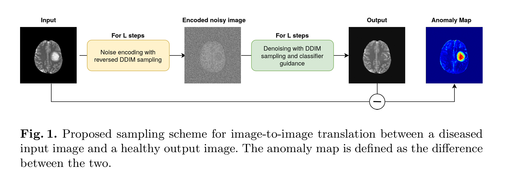
It do the $L$ forward noising steps, and then do $L$ denoising steps.

- Don't need the paired data
- Trained a classification network first
- In the denosing step, use guidance diffusion mode, with a gradient scale $s$ to control the classifier effects
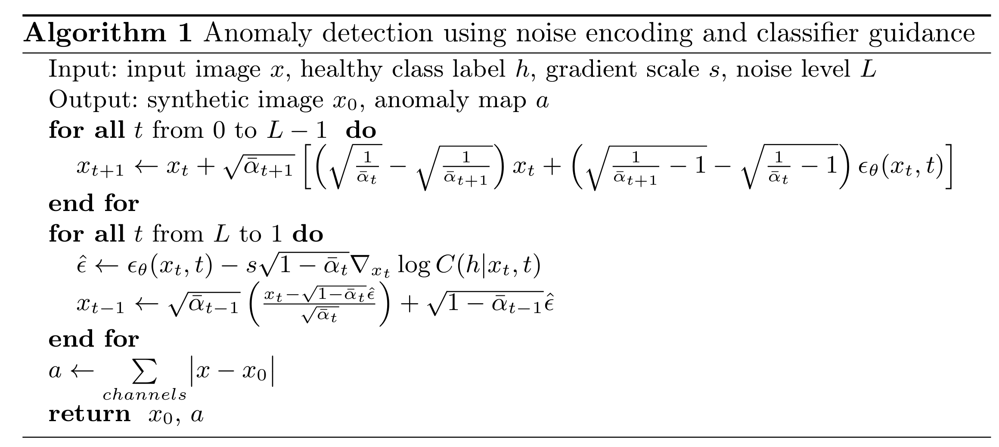
The gradient scale and the nosing step $L$ need to chosen properly, otherwise, could leads to in-accurate reconstruction.
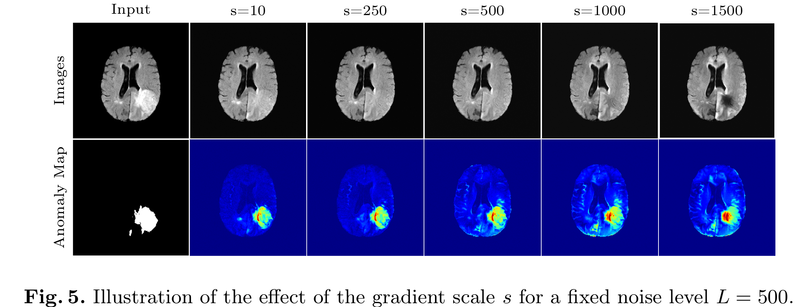
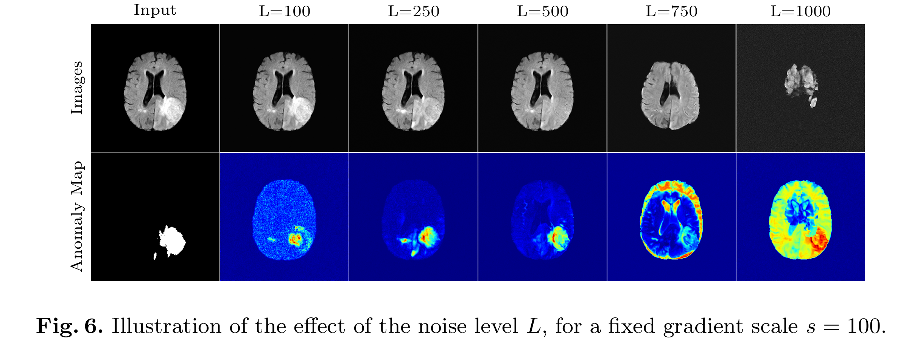

## AnoDDPM:Anomaly Detection with Denoising Diffusion Probabilistic Models using Simplex Noise

- author: Julian Wyatt， Durham University
- url: <https://openaccess.thecvf.com/content/CVPR2022W/NTIRE/papers/Wyatt_AnoDDPM_Anomaly_Detection_With_Denoising_Diffusion_Probabilistic_Models_Using_Simplex_CVPRW_2022_paper.pdf>
- year 2022
- code: <https://github.com/JulianWyatt/AnoDDPM>

Contribution

- trained on pure positive data: no anomaly data is used in the training
- partial diffusion: nosing the image to a fixed ratio, not to noising to pure noise
- AnoDDPM with simplex noise

Algorithm

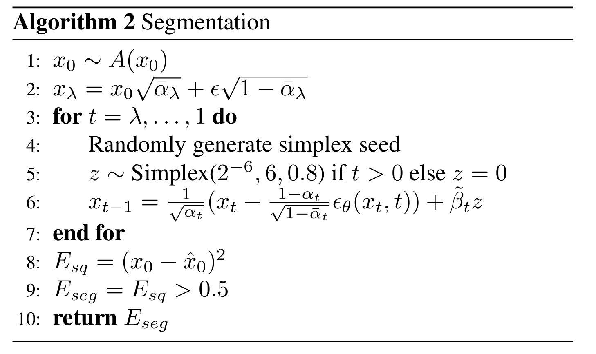

Results

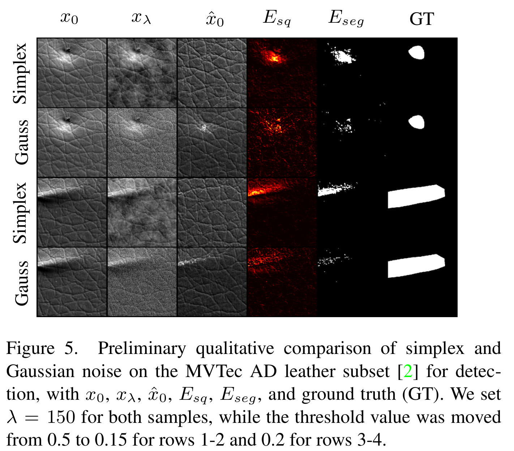
## Unsupervised Surface Anomaly Detection with Diffusion Probabilistic Model

- author: zhang xinyi, Xia Shutao
- institute: 清华大学深圳研究生院
- ICCV 2023: /<https://openaccess.thecvf.com/content/ICCV2023/papers/Zhang_Unsupervised_Surface_Anomaly_Detection_with_Diffusion_Probabilistic_Model_ICCV_2023_paper.pdf>

Current Problem

- Reconstruction is ill-conditioned, which means small variations in the input will lead to large variations
- given test sample might resemble several different norma (non-anomalous) patterns, rather than just one specific pattern. Example: In medical imaging, a normal brain scan may have multiple small variations due to different people’s anatomy, lighting, or imaging conditions. If the model only learns to reconstruct a single dominant pattern, it might misinterpret small variations as anomalies.

Framework

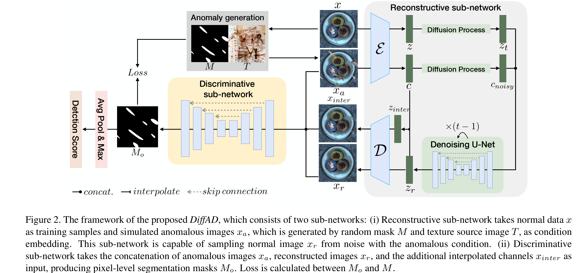

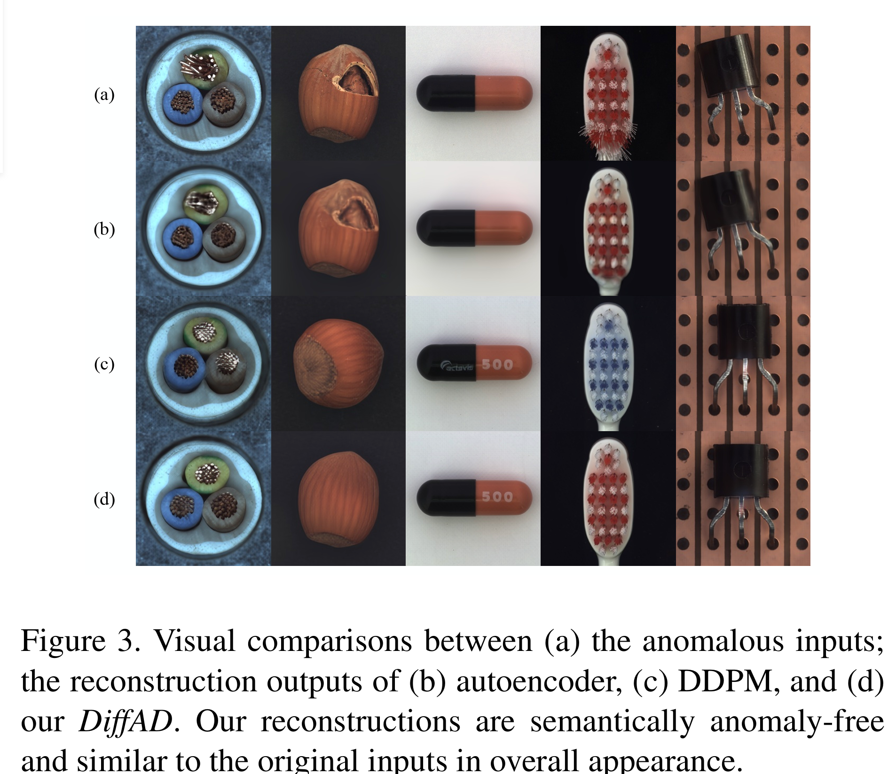

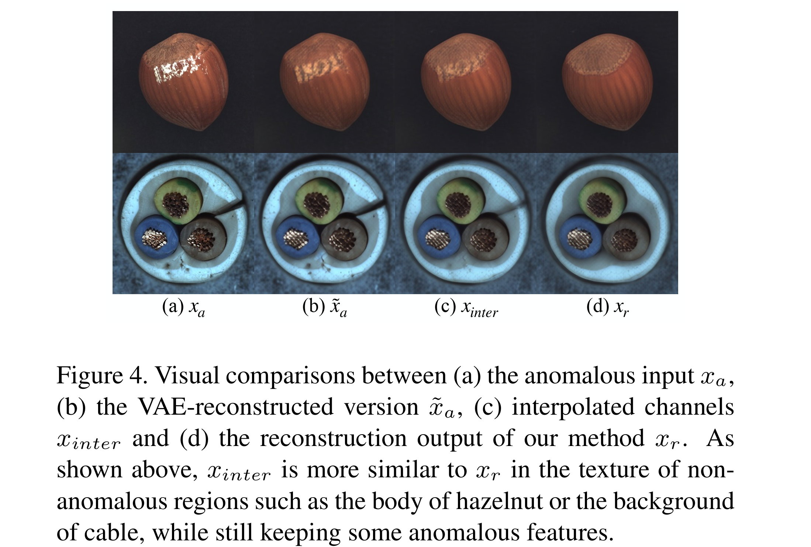

Training

- MVTec-AD datasets with mask annotations
- Need the paired normal and anormal data
  - dataset overview 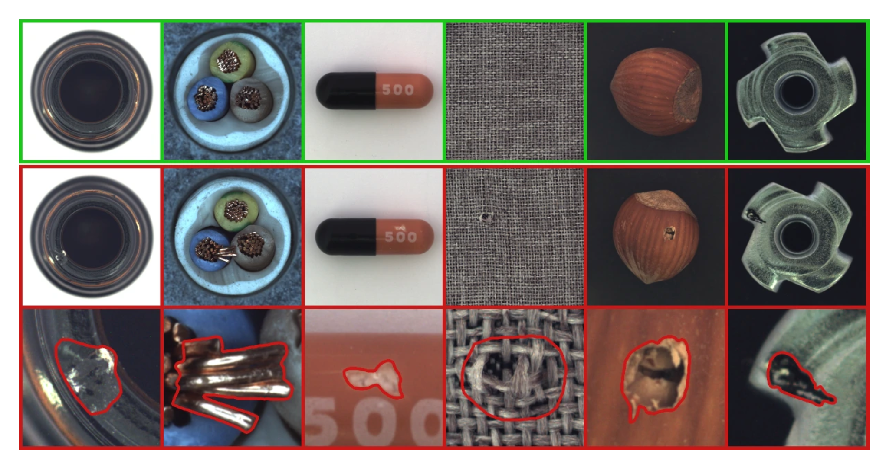
  - <https://www.mvtec.com/company/research/datasets/mvtec-ad>

## Fast Unsupervised Brain Anomaly Detection and Segmentation with Diffusion Models

- author: Walter H. L. Pinaya,
- institute: University College London
- MICCAI: 2022

灌水论文

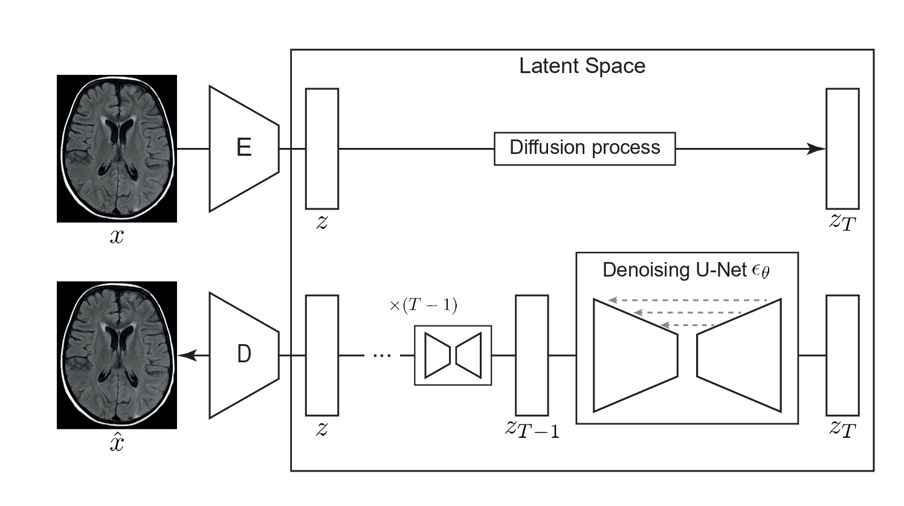
还是使用Latent Diffusion 的模式，对latent 加噪再去噪，从而重建原图。

## ON DIFFUSION MODELING FOR ANOMALY DETECTION

- ICLR 2024: <https://openreview.net/pdf?id=lR3rk7ysXz>
- author: Victor Livernoche
- institute: McGill University

DTE: Diffusion Time Estimation
估计了给定输入所需要的diffusion time的分布，（预测的时间不是一个值，是时间的分布),然后用众数或均值作为异常分数。

之前的diffusion 用来做异常检测效果都比较好，唯一的问题是计算量比较大。一般的DDPM anormal detection 是利用denoised reconstruction 和原始图片的距离，距离越大，越有可能是异常。

- 预测distance 和预测diffusion time 是否是一致的？
- 预测了扩散时间（或噪声方差）的后验分布？ 扩散时间指的是什么？

Contribution

- 逆扩散过程中，选择初始时间步（timestep）是任意的，但它会显著影响异常检测性能。经验结果表明，选择最大时间步的 25% 作为起始点可以获得较好的检测效果（详细消融实验见附录 A）。
??

## Unsupervised industrial anomaly detection with diffusion models✩
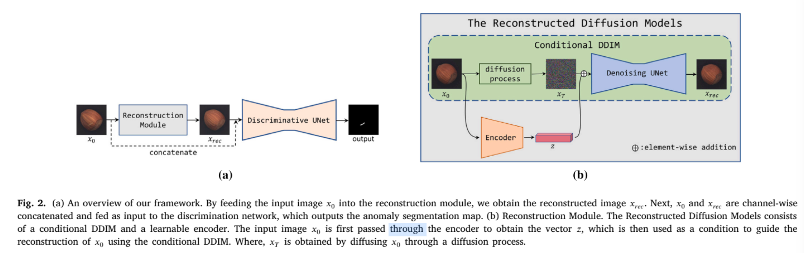

- paper: <https://drive.google.com/file/d/1cuVGoQo_K6JasrLoEVlfjj-sEXFQgxE0/view>
- author: XU haohao
- J. Vis. Commun. Image R. 97 (2023) 103983
- Contribution
  - use the feature embedding of the original image as a guidance in the reverse diffusion process
Results
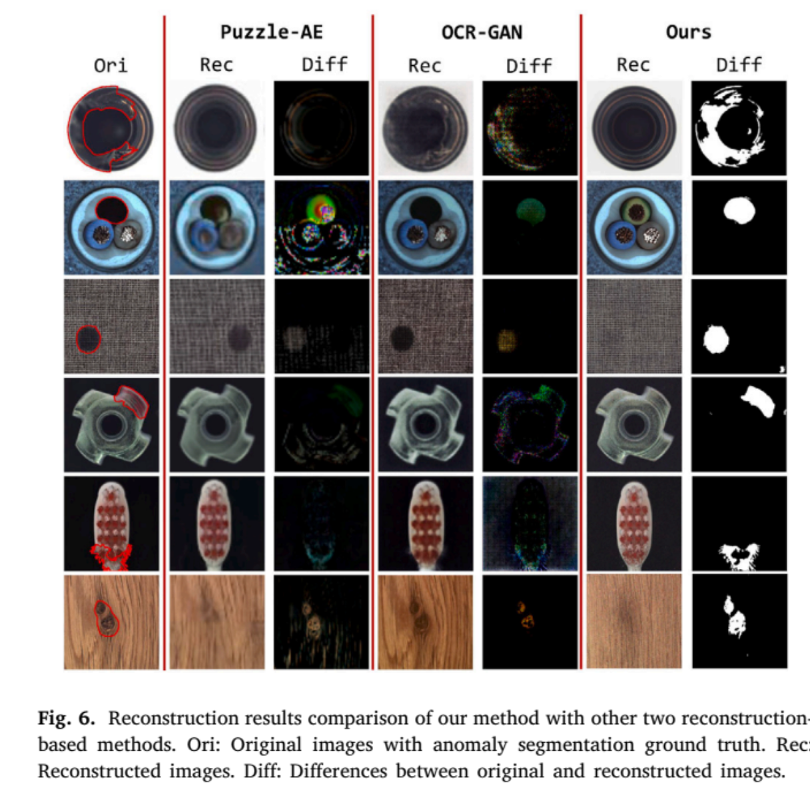

## Patched Diffusion Models for Unsupervised Anomaly Detection in Brain MRI

- code: <https://github.com/> FinnBehrendt/patched-Diffusion-Models-UAD
- Finn Behrendt: Hamburg University of Technology
- Proceedings of Machine Learning Research: 2023
Results
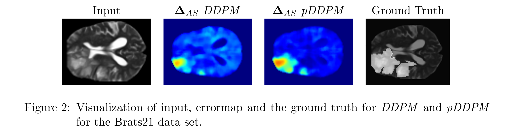
framework
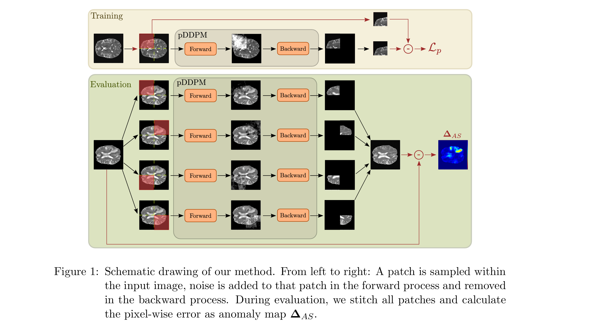

we apply the forward diffusion process only on a small part of the input image and use the whole, partly noised image in the backward process to recover the noised patch. At test time, we use the trained pDDPM to sequentially noise and denoise a sliding patch within the input image and then stitch the individual denoised patches to reconstruct the entire image

## Adversarially Robust Industrial Anomaly Detection Through Diffusion Model
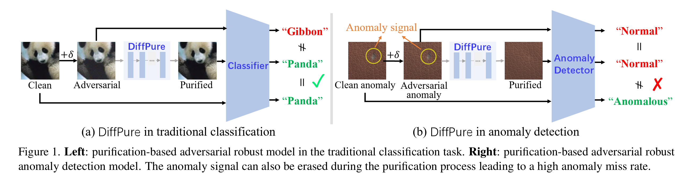

- author: Yuanpu Cao, Lu Lin, Jinghui Chen
- 2024 Aug
- 贡献:
  - 免疫对抗噪声并且同时检测异常

基于深度学习的工业异常检测模型在常用的基准数据集上已取得了极高的准确率。然而，由于对抗样本（adversarial examples）的存在，这些模型的鲁棒性（robustness） 可能并不理想，而对抗样本对深度异常检测器的实际部署构成了重大威胁。

近年来，研究表明扩散模型（diffusion models） 可以用于去除（purify）对抗噪声，从而构建对抗攻击鲁棒的分类器。然而，我们发现，在异常检测中直接应用这一策略（即在异常检测器前放置一个去噪器） 会导致较高的异常漏检率（high anomaly miss rate）。这是因为去噪过程不仅会消除对抗扰动，同时也会抹去异常信号，最终导致后续的异常检测器无法有效检测出异常样本。

为了解决这一问题，我们探索了同时执行异常检测和对抗去噪的可能性。我们提出了一种简单但有效的对抗鲁棒异常检测方法（Adversarially Robust Anomaly Detection, AdvRAD），该方法使扩散模型同时充当异常检测器和对抗噪声去除器。

### Projected Gradient Descent (PGD) Attack on Anomaly Detector
假设我们有一个已经训练好的异常检测模型 $A_\theta$。我们的目标是对异常样本增加一个很小的噪音，使得这个异常检测模型检测不出来。
这个跟GAN 的理念是一致的，不过GAN的检测器是在动态更新的，但是这里我们freeze 了这个异常检测器。

我们定义$L_\theta(x,y) = yA_\theta(x)$ where $y$ is the label, $y\in\{-1,1\}$, -1 dennotes the anomalous class and 1 indicates the normal class.
我们的目标是找到一个$x$ 使得$A_\theta$ 分类分错。

根据PGD，我们有一下的迭代过程
Here are the formulas extracted from the image:

$$
\mathbf{x}_{n+1} = P_{\mathbf{x},\epsilon}^{l_\infty} \left\{ \mathbf{x}_n + \alpha \cdot \text{sgn} \left( \nabla_{\mathbf{x}_n} L_{\theta} (\mathbf{x}_n, y) \right) \right\}
\quad (1)
$$

$$
\mathbf{x}_{n+1} = P_{\mathbf{x},\epsilon}^{l_2} \left\{ \mathbf{x}_n + \alpha \frac{\nabla_{\mathbf{x}_n} L_{\theta} (\mathbf{x}_n, y)}{\| \nabla_{\mathbf{x}_n} L_{\theta} (\mathbf{x}_n, y) \|} \right\}
\quad (2)
$$

These equations describe the **Projected Gradient Descent (PGD)** attack constrained under **\( L_{\infty} \)-norm** and **\( L_2 \)-norm**:

1. **\( L_{\infty} \)-norm PGD (Equation 1):**
   - The perturbation is applied in the **sign direction** of the gradient.
   - The step size is **fixed** (\(\alpha\)) and **independent of the gradient magnitude**.
   - The update is projected back into the valid \( L_{\infty} \)-bounded space.

2. **\( L_2 \)-norm PGD (Equation 2):**
   - The gradient is **normalized**, ensuring the perturbation remains in the **\( L_2 \)-ball**.
   - The perturbation is scaled by \(\alpha\) before applying the update.
   - Projection is applied to ensure the perturbation remains within the given \( L_2 \) constraint.

The symbol **\( P_{\mathbf{x},\epsilon}^{l_p} \)** in the equations represents the **projection operator** that ensures the perturbed sample remains within a predefined **\( L_p \)-norm** bounded constraint. In the context of **Projected Gradient Descent (PGD)** attacks, this projection ensures that the adversarial perturbation does not exceed a certain radius \( \epsilon \) in the specified norm space.

**Interpretation of \( P_{\mathbf{x},\epsilon}^{l_p} \):**

- \( P \) is the **projection function** that maps the updated adversarial example back into a valid set.
- \( \mathbf{x} \) is the **original input sample**.
- \( \epsilon \) is the **maximum allowable perturbation magnitude**.
- \( l_p \) refers to the **norm constraint type** (e.g., \( L_{\infty} \) or \( L_2 \)).

**1. \( L_{\infty} \)-norm projection \( P_{\mathbf{x},\epsilon}^{l_\infty} \)**

- Ensures that each individual feature perturbation does not exceed \( \epsilon \).
- Mathematically, it **clips** the perturbed input back into the valid range:

  $$
  P_{\mathbf{x},\epsilon}^{l_\infty} (\mathbf{x}') = \min (\max (\mathbf{x}', \mathbf{x} - \epsilon), \mathbf{x} + \epsilon)
  $$

  where \( \mathbf{x}' \) is the perturbed input before projection.

**2. \( L_2 \)-norm projection \( P_{\mathbf{x},\epsilon}^{l_2} \)**

- Ensures that the entire perturbation vector remains inside an **\( L_2 \)-ball** of radius \( \epsilon \).
- If the perturbation **exceeds** the allowed \( L_2 \)-norm, it is **scaled down** to fit within the constraint:

  $$
  P_{\mathbf{x},\epsilon}^{l_2} (\mathbf{x}') = \mathbf{x} + \frac{\mathbf{x}' - \mathbf{x}}{\max(1, \frac{\|\mathbf{x}' - \mathbf{x} \|_2}{\epsilon})}
  $$

  This ensures that:
  - If the perturbation is already within the \( L_2 \)-ball of radius \( \epsilon \), it remains unchanged.
  - If it **exceeds** \( \epsilon \), it is **scaled down** proportionally to fit within the constraint.

---

### **Summary**

- **\( P_{\mathbf{x},\epsilon}^{l_p} \)** ensures that adversarial perturbations remain within a specified \( L_p \)-norm ball.
- **\( L_{\infty} \)-norm projection**: Clips each feature independently.
- **\( L_2 \)-norm projection**: Scales the entire perturbation vector if necessary.

根据以上步骤迭代N次，得到最终的加噪样本，样本和原始的图片的误差 $||x_{N} -x||_p\leq N\epsilon$.
我们只要控制好$\epsilon$ 就可以使得加噪样本和原始样本误差足够小，升职肉眼不可识别。

Results

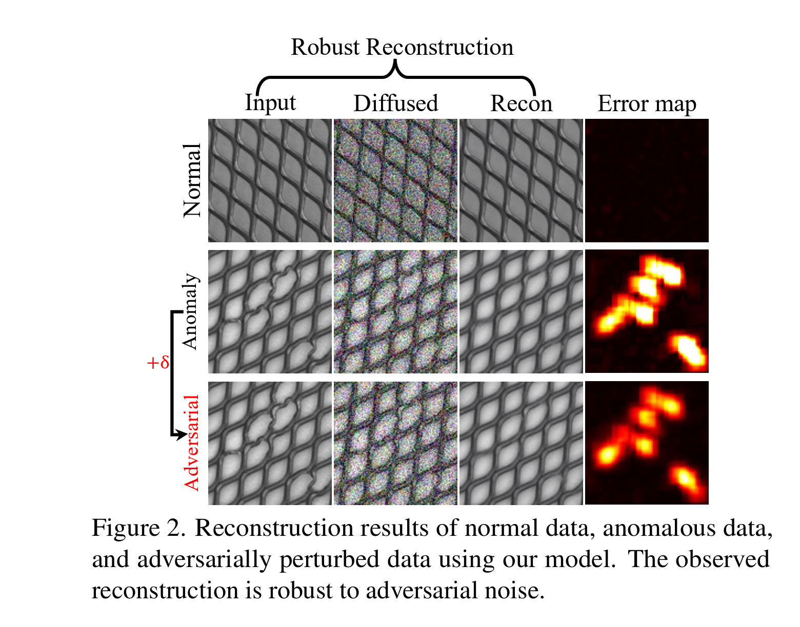

### one-shot denoising
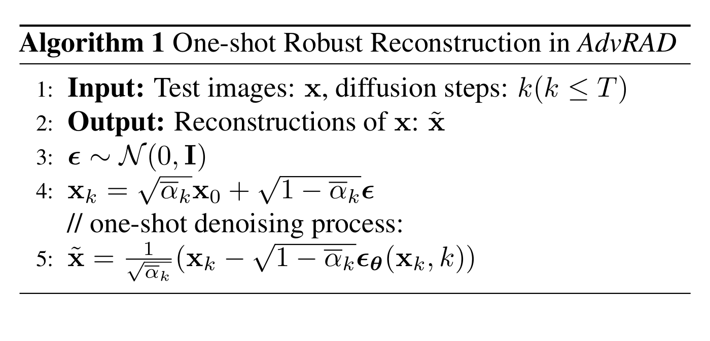
it is observed that single denoising step is good enough for anomaly detection.
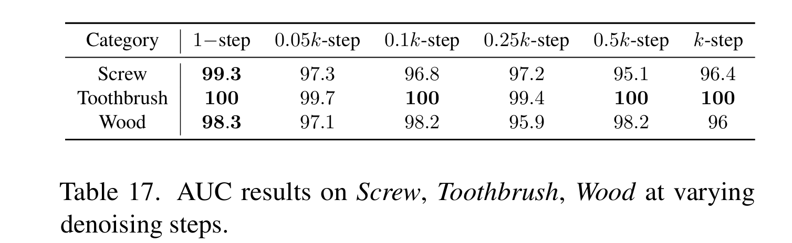
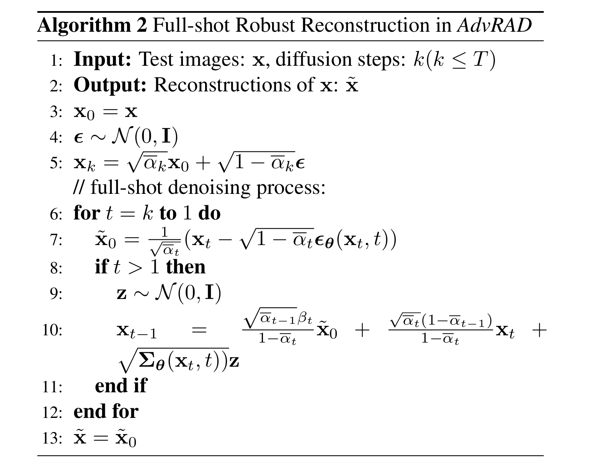

Anomally Score Calculation with the reconstriction error.

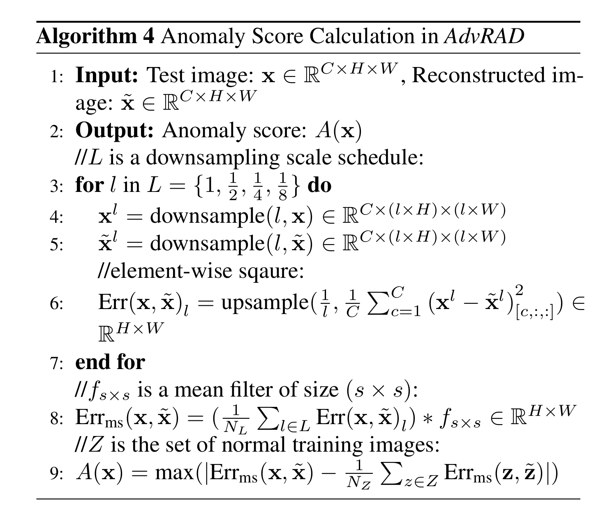

## GLAD: Towards Better Reconstruction with Global and Local Adaptive Diffusion Models for Unsupervised Anomaly Detection
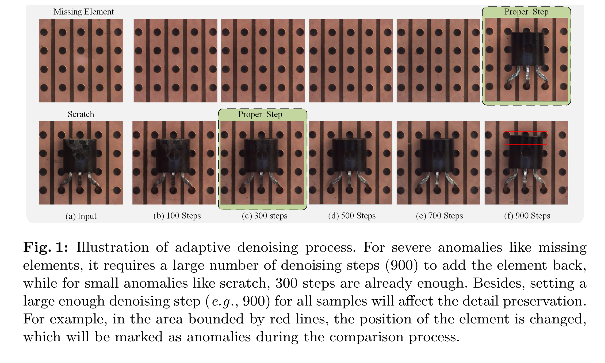
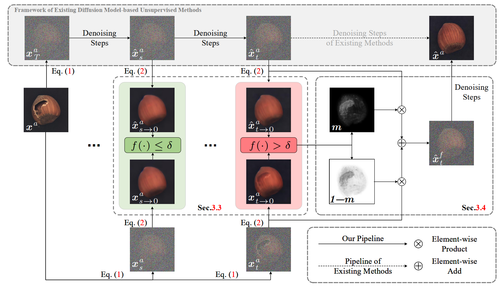

- Hang Yao1： Harbin Institide of Technology
- Sep 2024
- code: <https://github.com/hyao1/GLAD>.
- paper: <https://arxiv.org/pdf/2406.07487>

这篇论文的核心贡献在于提出了一种全局和局部自适应的扩散模型（GLAD），显著提升了无监督异常检测的重建质量与检测精度。其精髓可概括为以下三点：

**1. 全局自适应去噪步骤（Adaptive Denoising Steps, ADP）**

- **问题**：传统方法对所有样本采用固定去噪步骤，但不同异常（如缺失元素 vs. 划痕）的修复难度差异大，导致过高的步骤破坏正常区域细节，过低步骤无法修复异常。
- **解决方案**：通过评估重建样本与噪声输入的差异，动态预测每个样本的最优去噪步骤。例如，严重异常（如缺失）采用更多步骤，轻微异常（如划痕）减少步骤，平衡重建质量与细节保留。
- **效果**：避免“一刀切”策略，提升灵活性与效率，保留更多正常区域信息。

**2. 局部自适应特征融合（Spatial-Adaptive Feature Fusion, SAFF）**

- **问题**：异常区域的噪声预测偏离标准高斯分布，导致重建困难；传统方法对整图统一处理，无法区分正常与异常区域。
- **解决方案**：
  - **异常导向训练（ATP）**：引入合成异常样本训练扩散模型，使其能够预测非高斯噪声，增强异常区域的重建能力。
  - **特征融合**：基于异常掩码（由重建差异生成），融合正常区域的原图特征与异常区域的生成特征，保留正常细节的同时修复异常。
- **效果**：实现局部区域的针对性重建，减少异常残留，提升定位精度。

**3. 综合实验验证与新型数据集**

- **实验**：在MVTec-AD、MPDD、VisA及自建的PCB-Bank数据集上，GLAD在图像级异常检测（I-AUROC）和像素级定位（P-AUROC）指标上均超越SOTA方法，尤其在复杂场景（如PCB缺陷）表现突出。
- **创新数据**：整合PCB-Bank数据集，涵盖多种电路板缺陷类型，填补工业检测领域数据空白。
- **消融实验**：验证ADP、SAFF和ATP组件的必要性，例如ADP使P-AUROC提升0.5%，SAFF进一步优化细节保留。

### training details
#### 数据准备与合成异常生成

- **正常数据训练**：使用无异常的正常样本（如工业质检中的无缺陷产品图像）作为训练集，学习数据分布。
- **合成异常注入（ATP机制）**：
  为增强模型对异常区域的修复能力，在训练阶段主动生成**合成异常样本**：
  - 对正常图像随机添加噪声、遮挡或纹理扭曲，模拟真实异常（如划痕、缺失等）。
  - 通过这种方式迫使模型学习“异常→正常”的映射关系，提升对复杂缺陷的泛化能力。

#### 正向扩散过程（Forward Process）

- **逐步噪声添加**：
  对输入图像 \( x_0 \) 逐步添加高斯噪声，经过 \( T \) 步后得到纯噪声 \( x_T \sim \mathcal{N}(0, I) \)。
  - 每步噪声强度由预定义的调度策略（如线性或余弦调度）控制。
  - 传统扩散模型固定使用 \( T \) 步，但**GLAD通过自适应去噪步骤（ADP）动态调整**：
    - 训练时引入一个轻量级网络，根据当前样本的噪声残差预测最优去噪步数 \( t_{\text{adapt}} \leq T \)，而非固定步数。

#### 反向去噪过程（Reverse Process）与自适应训练

- **去噪网络架构**：
  使用U-Net等结构预测当前步的噪声 \( \epsilon_\theta(x_t, t) \)，目标是最小化预测噪声与真实噪声的差异。
  - **损失函数**：

    $$
    \mathcal{L}_{\text{base}} = \mathbb{E}_{x_0, t, \epsilon} \left[ \| \epsilon - \epsilon_\theta(x_t, t) \|^2 \right]
    $$

  - **自适应去噪步骤（ADP）训练**：
    在损失函数中增加对步长预测的约束，例如通过交叉熵或均方误差优化步长预测网络，使其输出与样本复杂度匹配的 \( t_{\text{adapt}} \)。

---

#### 局部自适应特征融合（SAFF）训练

- **异常掩码引导的特征融合**：
  - 在训练阶段，利用合成异常样本的已知缺陷位置生成二值掩码 \( M \)（1表示异常区域，0表示正常区域）。
  - **特征混合策略**：
    将U-Net解码器的输出特征与原始图像特征按掩码加权融合：
    \[
    x_{\text{recon}} = M \cdot x_{\text{gen}} + (1 - M) \cdot x_0
    \]
    其中 \( x_{\text{gen}} \) 为生成的特征，\( x_0 \) 为原始正常区域特征。
  - **目标**：强制模型仅在异常区域进行修复，保留正常区域的细节。

---

#### 端到端优化

- **联合训练**：
  将基础扩散损失 \( \mathcal{L}_{\text{base}} \)、自适应步长预测损失 \( \mathcal{L}_{\text{ADP}} \)、特征融合一致性损失 \( \mathcal{L}_{\text{SAFF}} \) 结合：

  $$
  \mathcal{L}_{\text{total}} = \mathcal{L}_{\text{base}} + \lambda_1 \mathcal{L}_{\text{ADP}} + \lambda_2 \mathcal{L}_{\text{SAFF}}
  $$

  - \( \lambda_1, \lambda_2 \) 为超参数，平衡不同任务的权重。
  - 通过反向传播同时优化噪声预测、步长自适应和特征融合模块。

---

#### 推理阶段的自适应调整

- **动态步长选择**：
  对测试样本，利用训练好的步长预测网络直接输出 \( t_{\text{adapt}} \)，避免固定步数导致的过修复或欠修复。
- **掩码生成与融合**：
  通过计算重建图像与原始输入的差异生成异常掩码 \( M \)，并应用SAFF进行局部修复。

在论文《GLAD: Towards Better Reconstruction with Global and Local Adaptive Diffusion Models for Unsupervised Anomaly Detection》中，**SAFF** 和 **ATP** 是两个核心组件，分别针对模型的**局部自适应重建能力**和**异常感知训练机制**进行优化。以下是它们的详细解释：

#### SAFF（Spatial-Adaptive Feature Fusion，空间自适应特征融合）
##### 目标
解决传统扩散模型在异常检测中**全局统一重建导致正常区域细节丢失**的问题，实现**局部区域的精细化修复**。

###### 机制

- **异常掩码生成**：
  在推理阶段，通过比较原始图像 \( x^a \) 和初步重建图像 \( \hat{x}^a \)，生成一个二值掩码 \( M \)，标记异常区域（\( M=1 \)）和正常区域（\( M=0 \)）。
  - 掩码生成公式：

    $$
    M^{(i,j)} = \begin{cases}
    1 & \text{if } \| x^a_{(i,j)} - \hat{x}^a_{(i,j)} \| > \tau \\
    0 & \text{otherwise}
    \end{cases}
    $$

    其中 \( \tau \) 为阈值，\( (i,j) \) 为像素坐标。

- **特征融合**：
  将原始图像的特征（保留正常区域）与重建图像的特征（修复异常区域）按掩码加权融合：
  \[
  x_{\text{final}} = M \cdot \hat{x}^a + (1 - M) \cdot x^a
  \]
  - **优势**：仅对异常区域进行修改，保留正常区域的原始细节，避免过度重建。

###### 示例
在工业质检中，若某电路板图像存在焊点缺失（异常区域）和完好的线路（正常区域），SAFF会仅修复焊点，而保持线路纹理不变。

##### ATP（Anomaly-oriented Training Paradigm，异常导向训练范式）
###### 目标
打破传统扩散模型仅预测标准高斯分布噪声的限制，使其能够处理**异常区域的非高斯噪声**，提升异常修复能力。

###### 机制

- **合成异常生成**：
  在训练阶段，对正常样本 \( x \) 主动注入人工异常（如遮挡、噪声、纹理扭曲），生成带合成异常的样本 \( x^a \)。
  - 例如：在正常图像中随机添加矩形遮挡或高斯噪声块。

- **广义扩散损失函数**：
  传统扩散模型的损失函数为预测噪声与真实噪声的均方误差（MSE）：

  $$
  \mathcal{L}_{\text{base}} = \mathbb{E}_{x,t,\epsilon} \left[ \| \epsilon - \epsilon_\theta(x_t, t) \|^2 \right]
  $$

  ATP将其扩展为：

  $$
  \mathcal{L}_{\text{ATP}} = \mathbb{E}_{x,x^a,t,\epsilon} \left[ \| \epsilon - \epsilon_\theta(x^a_t, t) + \frac{\sqrt{\alpha_t}}{\sqrt{1-\alpha_t}} (x^a - x) \|^2 \right]
  $$

  - **关键项**：\( \frac{\sqrt{\alpha_t}}{\sqrt{1-\alpha_t}} (x^a - x) \) 强制模型学习异常区域与正常区域的差异，预测非高斯噪声。

##### **SAFF与ATP的协同作用**

1. **训练阶段（ATP主导）**：
   - 通过合成异常数据，模型学会区分异常与正常区域的噪声分布。
   - 提升模型对异常区域的针对性修复能力。

2. **推理阶段（SAFF主导）**：
   - 利用训练得到的异常感知能力，生成初步重建结果。
   - 通过掩码融合保留正常区域，避免全局重建引入的误差。

##### **性能提升对比（以MVTec-AD数据集为例）**

| 方法               | P-AUROC (%) | PRO (%) | 参数量 (M) |
|--------------------|-------------|---------|------------|
| Baseline (无SAFF/ATP) | 97.1        | 89.3    | 120        |
| + ATP              | 97.8 (+0.7) | 91.5    | 120        |
| + SAFF             | 98.2 (+1.1) | 93.1    | 121        |
| GLAD (ATP+SAFF)    | **98.6**    | **95.3**| 121        |

---

## Unsupervised Anomaly Detection in Medical Images Using Masked Diffusion Model
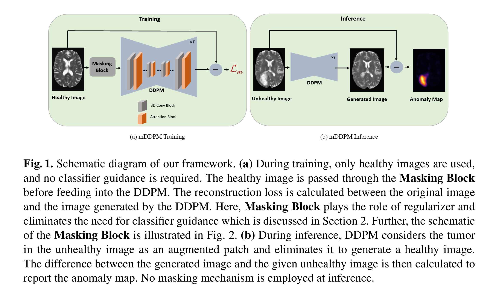

- author: Hasan Iqbal
- institute: Wayne State University
- year: 2023 Aug
- code: : <https://mddpm>. github.io/
- Main Contribution
  - use masking as the augmentation or regularization to the model. INcluding three diffeernt masking schemes
    - image masking: mask on  RGB image
    - masking in the Fourier transform
    - using cutmix to fusion the masked frequency and the masked image
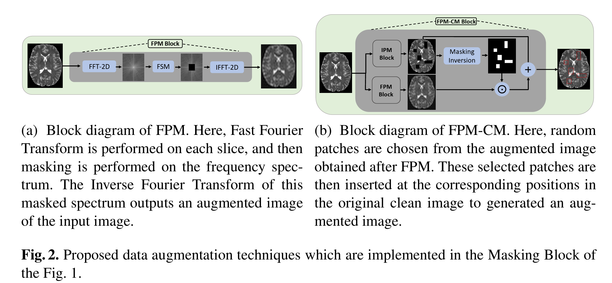

## TransFusion – A Transparency-Based Diffusion Model for Anomaly Detection

- author: Matic Fučka
- institude: University of Ljubljana
- ECCV:  20223 Nov
- code: <https://github.com/MaticFuc/ECCV_TransFusion>
- paper: <https://arxiv.org/pdf/2311.09999v2>

Idea

1. In the training, we have the original image, the anomaly artifacts and the mask for the anomaly. $\beta_t$ is the parameter to control the transparency of the anomaly.

Suppose $M$ is a binary mask, 1 indicate the anormal, 0 indicate the nomal.
$\bar{M}$ is the inverse of $M$.

$$I = \overline{M} \odot N + \beta (M\odot A) + (1-\beta)(M\odot N)$$

The idea of the paper is to recover the anomaly mask $M$ and the anomaly appearance $A$, which is hard to predict at once, but could be easier to gradualy increasing the transpatency $\beta$.

The transparency schedule is denoted as $\beta_0<\beta_1<\ldots,\beta_{T-1}< \beta_T$ with $\beta_0=0$ and $\beta_1=1$.

Then at each time step, the image is formulated as

$$
x_t = \overline{M_t} \odot n_t + \beta_t (M_t \odot \epsilon_t) + (1 - \beta_t)(M_t \odot n_t).
$$

$$
x_{t-1} = \overline{M_{t-1}} \odot n_{t-1} + \beta_{t-1}(M_{t-1} \odot \epsilon_{t-1}) + (1 - \beta_{t-1})(M_{t-1} \odot n_{t-1}).
$$

After substituting and rearranging, the transition equation is computed as:

$$\tag{a}
x_{t-1} = x_t - (\beta_t - \beta_{t-1})(M_t \odot \epsilon_t) + (\beta_t - \beta_{t-1})(M_t \odot n_t).
$$

In the training, the image $I$ is put into the diffusion model and the output is the predicted $M_t$, $\epsilon_t$ and $n_t$. Then take loss on it.

At the reverse steps, the initial mask $M$ is setting as zero. $x_{t-1}$ is predicted according to eq (a). $T$ start from 20. Eq (a) looks like that we increase the transparency (decrease the value of $\beta$) of anomaly by a content of $\beta_t - \beta_{t-1}$, and finnaly the $\beta$ leans to zero which corresponds the nomal image.
## DiffusionAD: Norm-guided One-step Denoising Diffusion for Anomaly Detection

- author: Hui Zhang
- Fudan University
- year: 2023 Nov
- paper: <https://arxiv.org/pdf/2303.08730>
- code: <https://github.com/HuiZhang0812/DiffusionAD>

- main contribution
  - one step denoising
  - norm guided paradigm to increase accuracy and reality

### preliminary

SDG（**Semantic Diffusion Guidance**）是一种结合**分类器指导**和**图像指导**的扩散模型改进技术，旨在通过引入参考图像（r）和类别标签（y）实现更灵活、多样化的生成控制。以下是其核心思想和技术细节：

#### 方法背景
扩散模型通过逐步去噪生成图像，传统分类器指导（Classifier Guidance）通过调整噪声预测偏向特定类别（如标签y），但可能限制生成多样性。SDG通过额外引入**参考图像r**，将类别与图像特征结合，扩展生成控制维度。

#### 核心公式与原理
SDG的关键是对噪声预测函数进行双重调整：
• **方程（4）**：传统分类器指导

  $$\epsilon_\Theta(x_t, y) = \epsilon_\Theta(x_t, t) - \sqrt{1-\alpha_t} w \nabla_{x_t} \log p(y|x_t)$$

  通过梯度$\nabla_{x_t} \log p(y|x_t)$引导生成结果偏向类别y，权重$w$控制类别影响强度。

• **方程（5）**：SDG的图像指导改进

  $$\epsilon_\Theta(x_t, t, r) = \epsilon_\Theta(x_t, t) - \sqrt{1-\alpha_t} w \nabla_{x_t} \text{sim}(x_t, r_t)$$

  引入参考图像$r_t$（通过扰动r得到），用相似性度量$\text{sim}(\cdot, \cdot)$（如结构相似性SSIM或特征相似性）计算$x_t$与$r_t$的关联性，梯度$\nabla_{x_t} \text{sim}(x_t, r_t)$引导生成结果与参考图像对齐。

#### 关键创新
• **双重引导机制**：
  同时利用**类别标签y**（语义控制）和**参考图像r**（视觉特征控制），生成结果既符合类别语义，又保留参考图像的关键属性（如构图、纹理）。

• **动态扰动参考图像**：
  $r_t$是参考图像r在不同扩散时间步$t$的扰动版本（如加噪或下采样），使生成过程在不同细节层次上与参考图像对齐。

• **参数w的灵活调节**：
  通过调整$w$，可自由平衡类别和参考图像的影响：
  • **增大w**：强调类别控制（结果更符合y，多样性降低）。
  • **减小w**：强调图像指导（结果更贴近r，多样性提高）。

### 应用场景
• **风格迁移**：参考图像提供风格（如油画效果），类别标签控制内容（如“猫”）。
• **可控生成**：在医疗成像中，参考图像提供解剖结构，类别标签指定病变类型。
• **多样性增强**：通过多组$(y, r)$组合生成多样化结果，避免模式坍塌。

### 优势总结
• **更精细的控制**：融合语义（y）与视觉（r）信息，超越单一类别标签的限制。
• **灵活性**：参数$w$提供生成结果在“多样性-可控性”之间的权衡。
• **兼容性**：可嵌入现有扩散模型框架（如DDPM、Stable Diffusion）。

### 核心思想

1. **噪声到正常重建（Noise-to-Norm）**
   • 通过扩散模型的前向过程对输入图像添加高斯噪声，破坏异常区域的特征，再通过反向去噪过程重建正常图像。异常区域因噪声扰动失去特征，被模型视为噪声并恢复为正常区域。
   • 优势：避免传统自编码器对异常区域的错误保留，实现更精确的无异常重建。

2. **一步去噪（One-Step Denoising）**
   • 传统扩散模型需多次迭代去噪（50-1000步），而DiffusionAD仅需单步预测噪声，直接重建图像，速度提升数百倍。
   • 公式：\(\hat{x}_0 = \frac{1}{\sqrt{\bar{\alpha}_t}} \left( x_t - \sqrt{1-\bar{\alpha}_t} \epsilon_\theta(x_t, t) \right)\)，通过单次推理实现快速重建。

3. **Norm-Guided范式**
   • 结合不同噪声尺度的优势：小噪声保留细节，大噪声消除语义级异常。通过大噪声尺度重建结果指导小噪声尺度的预测，提升重建质量。
   • 方法：使用大噪声重建结果作为条件，通过相似性度量（如均方误差）调整噪声预测，优化最终重建。

### 架构设计
• **重建子网络**：基于U-Net的扩散模型，预测噪声并生成无异常图像。
• **分割子网络**：U-Net结构，输入为原图与重建图的拼接，通过对比差异预测像素级异常分数。
• **联合训练**：结合噪声预测损失（\(\mathcal{L}_{noise}\)）和分割损失（\(\mathcal{L}_{mask}\)），优化模型整体性能。

### 实验与结果
• **数据集**：MVTec、VisA、DAGM、MPDD，涵盖纹理、结构、工业缺陷等多种异常类型。
• **指标**：图像级AUROC、像素级AUROC/PRO/AP。
• **性能**：
  • 在VisA上，图像AUROC达98.8%，较特征嵌入方法提升2.0%，生成模型方法提升3.3%。
  • 在MVTec上，像素AP达76.1%，显著优于传统方法（如DRAEM的68.4%）。
  • 推理速度达23.5 FPS，比迭代扩散模型快300倍，满足实时需求。
• **消融实验**：验证一步去噪和Norm-Guided机制的有效性，证明其对性能提升的关键作用。

### 创新点

1. **噪声到正常范式**：通过扩散模型实现高质量重建，克服传统生成模型的局限性。
2. **高效推理**：一步去噪大幅加速，兼顾速度与精度。
3. **多尺度引导**：Norm-Guided机制结合不同噪声尺度优势，提升复杂异常检测能力。

### data synthetic

#### 异常区域生成（Anomaly Region Generation）

- **Perlin噪声生成不规则掩码**：
  - 使用**Perlin噪声**（一种梯度噪声）生成随机、不规则的二值掩码（Mask），模拟真实缺陷的形态（如裂纹、划痕）。
  - Perlin噪声的优势：生成自然的不规则形状，避免机械化的几何模式（如矩形或圆形），更贴近工业场景中的真实缺陷。

- **物体前景约束**：
  - 将生成的噪声掩码与**物体前景掩码**（通过分割获取）相乘，确保异常仅出现在物体区域（如产品表面），而非背景或无意义区域。
  - 例如，在电路板检测中，缺陷只会出现在电路区域，而非空白背景。

#### 视觉不一致外观合成（Inconsistent Appearance Synthesis）

- **异常纹理来源**：
  - **自增强正常样本**：通过旋转、颜色变换、噪声注入等对正常样本进行增强，生成局部异常纹理。
  - **外部纹理库（DTD数据集）**：引入Describing Textures Dataset（DTD）中的多样化纹理（如锈迹、污渍），增强异常多样性。

- **融合策略**：
  - 通过公式合成异常图像：

    $$
    S = \beta (M \odot N) + (1-\beta)(M \odot A) + \bar{M} \odot N
    $$

    - \(M\)：异常区域掩码（由Perlin噪声生成）。
    - \(N\)：原始正常图像。
    - \(A\)：异常纹理（来自自增强或DTD）。
    - \(\beta\)：混合系数（控制正常与异常区域的透明度融合，通常取0~0.5）。
    - \(\bar{M}\)：掩码的反转（保留正常区域）。
  - **β的作用**：调节异常区域的“突兀性”。较小的β使异常更明显，较大的β使异常更隐蔽，模拟不同程度的缺陷。

#### 合成示例解析（以图5为例）

1. **输入正常图像（N）**：如无缺陷的工业零件图像。
2. **生成掩码（M）**：通过Perlin噪声生成随机形状的异常区域（如斑点、裂缝）。
3. **提取异常纹理（A）**：从DTD中选择类似“划痕”或“腐蚀”的纹理，或对正常图像局部扭曲。
4. **融合生成异常图像（S）**：将异常纹理A与正常图像N在掩码M区域内混合，保留其他区域正常。

### inference
选取两个时间点 $t_s <t_b$。 对原图$x_0$进行加噪, 得到

$$
x_{t_s} = x_0 \sqrt{\bar{\alpha}_{t_s}} + \epsilon \sqrt{1-\bar{\alpha}_{t_s}} $$

$$
x_{t_b} = x_0 \sqrt{\bar{\alpha}_{t_b}} + \epsilon \sqrt{1-\bar{\alpha}_{t_b}} $$

$x_{t_b}$ 添加的噪音更大一些。

然后用训练的diffusion 模型进行噪音的预测, 得到

$\epsilon_\theta(x_{t_s}， t_s)$ 和$\epsilon_\theta(x_{t_b},t_b)$

利用一步去噪预测

$$x_{0_b} = \frac{1}{\sqrt{\bar{\alpha}_t}}(x_{t_b} - \sqrt{1-\bar{\alpha_{t_b}}}\epsilon_\theta( x_{t_b},t_b)$$

然后用$x_{0_b}$ 作为reference image 去引导$x_s$的去噪过程。
