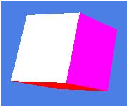

# 术语表（Terminology）
>
> 所有术语会被根据已有内容自动生成
>
## 图形学术语

### [Artifacts]

Artifacts是图形学上的一个**概念**，或者说是一个梗，表示了一切在图形学上的**错误**，异常，不希望看到的结果，看上去不对的效果以及各种**瑕疵**。

### [Aliasing Artifacts]

采样而导致的走样（Aliasing Artifacts）会导致很多现象，比如：

- 锯齿（Jaggies，对空间进行采样）
- 摩尔纹（Moire，对图像进行采样）
- 转轮效应（一块转轮上产生视觉上的不同转速，对时间进行采样）

## 信号处理术语

### 带限信号

频谱（傅里叶变换）在某个频率范围内有限的信号，即存在最高频率B，使得所有高于B的频率分量为零。

### 奈奎斯特频率

采样频率必须大于信号最高频率的两倍，这个最小采样频率称为奈奎斯特频率。

### 理想滤波器

频率响应在通带和阻带之间有突变，无过渡带的滤波器。与之相对的是实际滤波器，它存在过渡带和通带波纹。

## 示例图片

### 几何走样

### 渲染走样

## 缩写

### EBM
Energey Based Model, 能量模型
