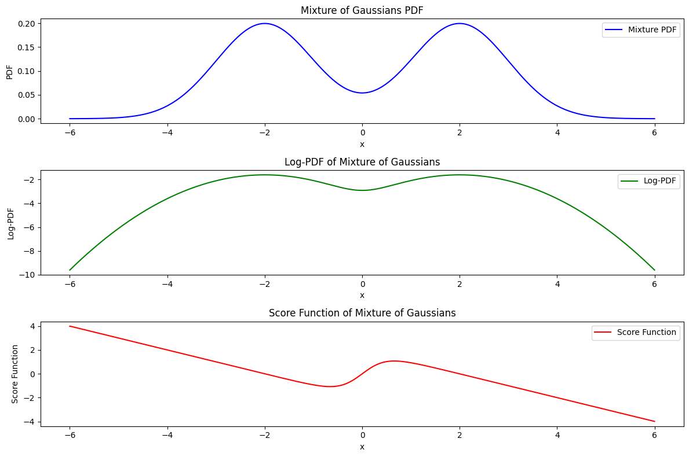
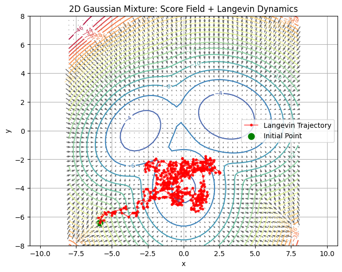

# Score Function

In the context of Langevin dynamics and the underlying Fokker-Planck equation, a key component is the gradient of the log-likelihood function \(\nabla_x \log p(x)\). This gradient is formally known as the **Stein's score function**, denoted by:

$$
s_\theta(x) \overset{\text{def}}{=} \nabla_x \log p_\theta(x).
$$

It's important to distinguish Stein's score function from the **ordinary score function**, defined as:

$$
s_x(\theta) \overset{\text{def}}{=} \nabla_\theta \log p_\theta(x).
$$

The ordinary score function is the gradient with respect to the parameter $\theta$ of the log-likelihood, commonly used in maximum likelihood estimation. In contrast, Stein's score function is the gradient with respect to the data point $x$, utilized in Langevin dynamics. Despite the naming conventions, in diffusion literature, Stein's score function is often simply referred to as the score function, and we will adopt this terminology here.

In the context of contrastive divergence (CD), the ordinary score function is used to directly calculate the derivative of $p_\theta$ and update the network parameters.

In score matching methods, Stein's score function is employed, where the loss is defined as the divergence between the gradient of the learned score function and the true gradient of the log-likelihood function.

Suppose $p_\theta$ is a mixture of two Gaussian distributions in one and two dimensions. We can visualize the score function of $p_\theta$ in the following figures:

In two dimensions, the score function can be visualized as a vector field of the log-likelihood function. The arrow direction represents the gradient, and the arrow length indicates the gradient's magnitude. By employing Langevin dynamics, we can randomly choose a point and follow the arrows to sample from the log-likelihood function, ultimately tracing the trajectory of Langevin dynamics. In physics, the score function is analogous to "drift," indicating how diffusion particles should flow towards the lowest energy state.

### Reference
- code about the score function of gaussian mixture: experiment/score_function_gaussian.ipynb

