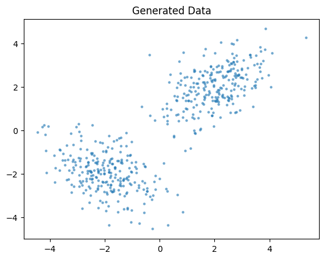
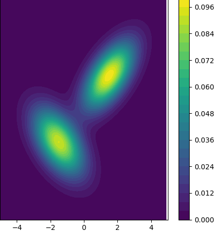
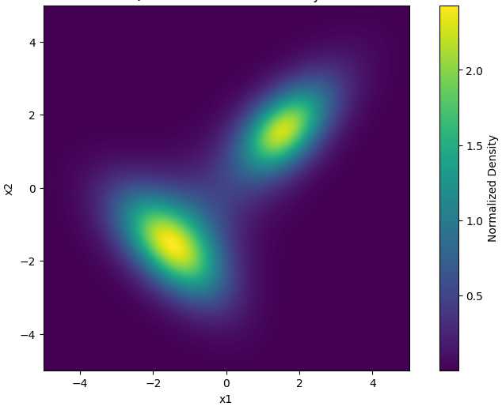

# Score matching

Score Matching 是一种估计概率分布的密度模型的方法，最早由 Aapo Hyvärinen 在 2005 年提出。它的主要目标是通过直接拟合数据的概率密度梯度（也称为 score function）来避免对归一化因子（partition function）的显式计算。以下是对 Score Matching 方法的总结：

**核心思想**

- 设 $p(x)$ 是数据的真实分布，模型分布为 $q_\theta(x)$。

- Score Matching 的目标是使模型的 score function $\nabla_x \log q_\theta(x)$ 尽可能接近数据分布的 score function $\nabla_x \log p(x)$

- 换句话说，优化目标是最小化以下目标函数：

$$
 J(\theta) = \frac{1}{2} \mathbb{E}_{p(x)} \left[ \| \nabla_x \log q_\theta(x) - \nabla_x \log p(x) \|^2 \right].
$$

总体来说，在EBM和SBM (energy based model and score based model) 中,score matching 都可以使用。在EBM中，函数是一个标量，表示能量，能量低的地方表示概率高，稳定区域。在SBM中，函数是一个向量，表示 score function，score 表示能量或者密度变化的剧烈程度和方向，随着score 的负方向，会到达能量低的区域。score matching 在这两种模型中都有自然的扩展，即可以拟合非常复杂的density function或者其score function。

对于score matching, 它也有不同的实现方法。

- explicite score matching
- sliced score matching
- denosing score matching

## Explicit Score-Matching

### 显式分数匹配（ESM）的直观思想

ESM 的核心目标是训练一个模型 $ s_\theta(x) $，使其预测的梯度尽可能接近真实的 score function。为此，ESM 直接定义一个损失函数：

$$
\mathcal{L}(\theta) = \mathbb{E}_{x \sim p(x)} \left[ \| s_\theta(x) - \nabla_x \log p(x) \|^2 \right]
$$

但问题在于：**真实分布 $p(x)$ 未知**，因此无法直接计算真实的梯度。
**解决方案**：先用 **核密度估计（KDE）** 近似 $p(x)$，再用 KDE 的结果训练模型。

---

### **Step 1：用核密度估计（KDE）近似数据分布**
KDE 是一种非参数方法，通过数据点周围的“平滑小山丘”（核函数）叠加来估计分布。例如，对于数据点 $ \{x_1, x_2, ..., x_N\} $，KDE 的公式为：

$$
\hat{p}(x) = \frac{1}{N} \sum_{i=1}^N K_h(x - x_i)
$$

其中 $ K_h $ 是核函数（如高斯核），$ h $ 是控制平滑度的带宽参数。

**高斯核的直观解释**：每个数据点 $ x_i $ 周围生成一个钟形曲线，所有曲线叠加形成整体分布。

---

### **Step 2：计算 KDE 的梯度**
为了得到 score function，需计算 $ \nabla_x \log \hat{p}(x) $。以高斯核为例：

1. 计算梯度的分子部分：

$$
\nabla_x \hat{p}(x) = \frac{1}{N} \sum_{i=1}^N K_h(x - x_i) \cdot \left(-\frac{x - x_i}{h^2}\right)
$$

2. 计算梯度：

$$
\nabla_x \log \hat{p}(x) = \frac{\nabla_x \hat{p}(x)}{\hat{p}(x)}
$$

**物理意义**：梯度方向指向周围数据点的加权平均位置。

### **Step 3：训练模型拟合梯度**
定义一个模型（如神经网络） $ s_\theta(x) $，输入数据点 $ x $，输出预测的梯度。损失函数为：

$$
\mathcal{L}(\theta) \approx \frac{1}{N} \sum_{i=1}^N \| s_\theta(x_i) - \nabla_x \log \hat{p}(x_i) \|^2
$$

**训练过程**：

1. 对每个数据点 $ x_i $，用 KDE 计算其梯度 $ \nabla_x \log \hat{p}(x_i) $。
2. 用梯度下降法优化模型参数 $ \theta $，使预测值逼近 KDE 的梯度。

### **为什么需要改进？**
尽管方法直观，但存在两个主要问题：

1. **维度灾难**：KDE 在高维数据中效果差（计算量大且估计不准）。
2. **计算效率**：每个点的梯度计算需遍历所有数据，复杂度为 $ O(N) $。

### **改进方案**

1. **去噪分数匹配（DSM）**：
   直接向数据添加噪声（如高斯噪声），利用噪声分布的已知梯度间接训练模型，避免显式计算 $ p(x) $。

2. **降维预处理**：
   对高维数据使用 PCA 或自编码器降维，再在低维空间应用 KDE。

3. **Mini-batch 优化**：
   每次随机采样部分数据计算梯度，减少计算量。

### **总结与适用场景**

- **适用场景**：低维数据分布估计、生成模型预训练、小规模数据分析。
- **优势**：无需假设数据分布形式，直接通过数据学习梯度。
- **局限性**：高维数据效果受限，需结合 DSM 或降维技术。

通过 KDE 与显式分数匹配的结合，我们能够从有限的数据中“感知”概率分布的变化方向，为后续生成模型或异常检测任务奠定基础。尽管存在挑战，这一方法在低维场景中仍是一个简洁而强大的工具。

### 实验
我们用一个二维的混合高斯分布进行实验。

```python
def generate_data(num_samples=1000):
    # 生成两个高斯分布的混合数据
    mean1 = [2, 2]
    cov1 = [[1, 0.5], [0.5, 1]]
    data1 = np.random.multivariate_normal(mean1, cov1, num_samples//2)

    mean2 = [-2, -2]
    cov2 = [[1, -0.5], [-0.5, 1]]
    data2 = np.random.multivariate_normal(mean2, cov2, num_samples//2)

    return np.vstack([data1, data2])
```

根据以上的混合高斯分布生成的数据。

然后我们进行KDE，然后利用KDE去估计梯度。最后得到预测结果和真实梯度的可视化。


可以看到最终在高概率区域，分布是比较相似的，但是在低概率区域，分布相差较大。这个原因主要是因为低概率区域的数据量较少，KDE 估计的梯度可能会受到大量噪声的影响。 同时模型学出来的分布比KDE和原始分布更加接近。

## Implicit Score Matching

### 从Fisher散度到隐式分数匹配的推导

### 1. 定义Fisher散度
Fisher散度衡量两个概率分布 $ p(\mathbf{x}) $ 和 $ q(\mathbf{x}; \theta) $ 的分数差异：

$$
D_F(p \parallel q) = \mathbb{E}_{p(\mathbf{x})} \left[ \| \nabla_{\mathbf{x}} \log p(\mathbf{x}) - \nabla_{\mathbf{x}} \log q(\mathbf{x}; \theta) \|^2 \right].
$$

### 2. 展开平方项

将平方项展开为三部分：

$$
D_F = \underbrace{\mathbb{E}_{p} \left[ \| \nabla \log p \|^2 \right]}_{T_1} - 2 \underbrace{\mathbb{E}_{p} \left[ (\nabla \log p)^\top (\nabla \log q) \right]}_{T_2} + \underbrace{\mathbb{E}_{p} \left[ \| \nabla \log q \|^2 \right]}_{T_3}.
$$

### 3. 处理交叉项 $ T_2 $
交叉项

$$ T_2 = -2 \mathbb{E}_{p} \left[ (\nabla \log p)^\top (\nabla \log q) \right] $$

包含未知的 $\nabla \log p$，需通过分部积分消除依赖。

#### 分量为标量的推导
对每个维度 $ x_i $ 单独处理：

$$
T_2 = -2 \sum_{i=1}^d \mathbb{E}_{p} \left[ \partial_i \log p \cdot \partial_i \log q \right].
$$

应用分部积分公式：

$$
\int p(\mathbf{x}) \partial_i \log p \cdot \partial_i \log q \, d\mathbf{x} = -\int p(\mathbf{x}) \partial_i^2 \log q \, d\mathbf{x}.
$$

**关键假设**：概率密度在边界处衰减至零，即：

$$
\left. p(\mathbf{x}) \partial_i \log q \right|_{x_i \to \pm\infty} = 0.
$$

#### 合并所有维度
对每个分量积分后求和：

$$
T_2 = 2 \sum_{i=1}^d \mathbb{E}_{p} \left[ \partial_i^2 \log q \right] = 2 \mathbb{E}_{p} \left[ \text{tr}(\nabla_{\mathbf{x}}^2 \log q) \right],
$$

其中 $\text{tr}(\nabla_{\mathbf{x}}^2 \log q)$ 表示Hessian矩阵的迹。

### 4. 重组Fisher散度
将 $ T_1, T_2, T_3 $ 代入原式：

$$
D_F = \mathbb{E}_{p} \left[ \| \nabla \log p \|^2 \right] + \mathbb{E}_{p} \left[ \| \nabla \log q \|^2 + 2 \, \text{tr}(\nabla^2 \log q) \right].
$$

忽略常数项 $\mathbb{E}_{p} \left[ \| \nabla \log p \|^2 \right]$，优化目标简化为：

$$
\min_{\theta} \mathbb{E}_{p} \left[ \| \nabla \log q \|^2 + 2 \, \text{tr}(\nabla^2 \log q) \right].
$$

### 5. 标准化目标函数
引入缩放因子 $\frac{1}{2}$，得到隐式分数匹配目标函数：

$$
J(\theta) = \mathbb{E}_{p(\mathbf{x})} \left[ \frac{1}{2} \| \nabla_{\mathbf{x}} \log q(\mathbf{x}; \theta) \|^2 + \text{tr}(\nabla_{\mathbf{x}}^2 \log q(\mathbf{x}; \theta)) \right].
$$

### 6. 隐式性分析

- **显式匹配项**：$\frac{1}{2} \| \nabla \log q \|^2$ 直接约束分数模长。
- **隐式正则项**：$\text{tr}(\nabla^2 \log q)$ 通过二阶导数隐式约束分数方向，避免依赖 $ \nabla \log p $。

---

#### 7. 最终形式
隐式分数匹配的目标函数为：

$$
\boxed{J(\theta) = \mathbb{E}_{p(\mathbf{x})} \left[ \frac{1}{2} \| \nabla_{\mathbf{x}} \log q(\mathbf{x}; \theta) \|^2 + \text{tr}(\nabla_{\mathbf{x}}^2 \log q(\mathbf{x}; \theta)) \right]}.
$$

当然如果我们只关注score function 本身，而不需要知道原始的density function 或者说energy function, 那么问题就简化了，就不涉及到二阶导了。

Let $s_\theta(x) = \nabla_{\mathbf{x}} \log q(\mathbf{x}; \theta)$ be score function.

The implicit score matching loss can be approximated by Monte Carlo:

$$
J_{\text{ISM}}(\theta) \approx \frac{1}{M} \sum_{m=1}^{M} \sum_{i} \left( \partial_i \mathbf{s}_{\theta}(\mathbf{x}^{(m)}) + \frac{1}{2} \| \mathbf{s}_{\theta}(\mathbf{x}^{(m)}) \|^2 \right),
$$

where $\partial_i \mathbf{s}_{\theta}(\mathbf{x}^{(m)}) = \frac{\partial}{\partial x_i} [\mathbf{s}_{\theta}(\mathbf{x})]_i = \frac{\partial^2}{\partial x_i^2} \log p(\mathbf{x})$. If the model for the score function is realized by a deep neural network, the trace operator can be difficult to compute, hence making the implicit score matching not scalable [40].

**Refenrence**

- Aapo Hyv¨arinen. Estimation of non-normalized statistical models by score matching. Journal
of Machine Learning Research (JMLR), 6(24):695–709, 2005. <https://jmlr.org/papers/volume6/>
hyvarinen05a/hyvarinen05a.pdf

### experiment
We use a mixture of guassian distribution for testing. But the results is not good.




It turns out that the derivative maganitude is near 0, but the trace is almost - 0.0004.

- optimizatioin 1
add regularization of $E_x p_\theta(x)$.
Still not work, almost constant

- optimization 2
output energy function not the $p_\theta$, that is without a exponention.

## Siced score matching

- optimization3
Finally, it is because that the network used ReLU, which is not enough for modeling the complex density function. Here we
change to Swish function instead. Now the iteration is much more stable and output the correct estimation of the ground truth density function (un-normalized)



#### **核心思想**

**Sliced Score Matching（切片分数匹配）** 是一种用于高效估计数据分布梯度（score function）的方法，主要针对高维数据场景设计。其核心创新在于通过**随机投影技术**降低计算复杂度，避免直接计算高维Jacobian矩阵的迹（Trace），从而解决传统Implicit Score Matching的可扩展性问题。

直观的说，就是在任何的投影空间，两个function 能够近似，那么原本的两个function 也必然近似。这是一种比较重要的思想，可以在其他的问题中借鉴。同样的还有，如果两个function 的梯度处处相等，那么这两个function 也相等（差一个constant), 这些都是一种转化问题的技巧，值得学习。

#### **数学定义**

**1. Fisher 散度的定义**
Fisher 散度衡量真实分布 $p(x)$ 与模型分布 $q_\theta(x)$ 的 score function 之间的差异：

$$
\mathcal{D}_{\text{Fisher}}(p \| q_\theta) = \mathbb{E}_{p(x)} \left[ \| \nabla_x \log p(x) - \nabla_x \log q_\theta(x) \|^2 \right].
$$

最小化 Fisher 散度等价于让模型 score $\nabla_x \log q_\theta(x)$ 逼近真实 score $\nabla_x \log p(x)$。

通过 Stein 恒等式，ISM 将 Fisher 散度转化为以下目标函数：

$$
J_{\text{ISM}}(\theta) = \mathbb{E}_{p(x)} \left[ \operatorname{Tr}(\nabla_x \mathbf{s}_\theta(x)) + \frac{1}{2} \| \mathbf{s}_\theta(x) \|^2 \right],
$$

其中 $\mathbf{s}_\theta(x)$ 是模型预测的 score function。
**关键等式**：当 $\mathbf{s}_\theta(x) = \nabla_x \log p(x)$ 时，ISM 损失达到最小值，此时 $\mathcal{D}_{\text{Fisher}} = 0$。

**3. Sliced Score Matching 的动机**
ISM 的瓶颈在于计算 Jacobian 矩阵的迹 $\operatorname{Tr}(\nabla_x \mathbf{s}_\theta(x))$，其复杂度为 $O(d^2)$（$d$ 为数据维度）。
**核心思想**：利用随机投影技术将迹的计算复杂度降至 $O(d)$。

**4. 随机投影近似迹**

根据 Hutchinson 迹估计器，任意矩阵 $ A \in \mathbb{R}^{d \times d} $ 的迹可表示为：

$$
\operatorname{Tr}(A) = \mathbb{E}_{\mathbf{v} \sim \mathcal{N}(0, I)} \left[ \mathbf{v}^\top A \mathbf{v} \right],
$$

其中 $ \mathbf{v} $ 为标准正态分布的随机向量。
将此技术应用于 ISM 的迹项：

$$
\operatorname{Tr}(\nabla_x \mathbf{s}_\theta(x)) = \mathbb{E}_{\mathbf{v}} \left[ \mathbf{v}^\top \nabla_x \mathbf{s}_\theta(x) \mathbf{v} \right].
$$

**5. Sliced Score Matching 的目标函数**

将 ISM 的迹项替换为随机投影近似，得到 SSM 的目标函数：

$$
J_{\text{SSM}}(\theta) = \mathbb{E}_{p(x)} \mathbb{E}_{\mathbf{v}} \left[ \mathbf{v}^\top \nabla_x \mathbf{s}_\theta(x) \mathbf{v} + \frac{1}{2} \| \mathbf{s}_\theta(x) \|^2 \right].
$$

**蒙特卡洛近似**：通过采样少量投影方向 $ \{\mathbf{v}_k\}_{k=1}^K $ 估计期望值：

$$
J_{\text{SSM}}(\theta) \approx \frac{1}{N} \sum_{i=1}^N \left[ \frac{1}{K} \sum_{k=1}^K \mathbf{v}_k^\top \nabla_x \mathbf{s}_\theta(x_i) \mathbf{v}_k + \frac{1}{2} \| \mathbf{s}_\theta(x_i) \|^2 \right].
$$

---

**6. 等价性证明**

当投影方向数量 $K \to \infty $ 时，SSM 与 ISM 的目标函数等价：

$$
\lim_{K \to \infty} J_{\text{SSM}}(\theta) = J_{\text{ISM}}(\theta).
$$

因此，SSM 是 ISM 的高效近似，且在优化过程中等价于最小化 Fisher 散度。

**7. 总结**

- **从 Fisher 散度到 SSM** 的推导路径：

$$
\mathcal{D}_{\text{Fisher}} \xrightarrow{\text{Stein 恒等式}} J_{\text{ISM}} \xrightarrow{\text{随机投影近似}} J_{\text{SSM}}.
$$

- **SSM 的优势**：将计算复杂度从 $ O(d^2) $ 降低至 $ O(Kd) $，适用于高维数据（如图像、文本）。
- **适用场景**：生成模型（如扩散模型）、无需显式概率密度的梯度估计。

- **基础公式**
与传统Implicit Score Matching的损失函数类似，但引入随机投影向量 $ \mathbf{v} $：

$$
J_{\text{SSM}}(\theta) = \mathbb{E}_{p(\mathbf{x})} \mathbb{E}_{\mathbf{v} \sim \mathcal{N}(0,I)} \left[ \mathbf{v}^\top \nabla_{\mathbf{x}} \mathbf{s}_\theta(\mathbf{x}) \mathbf{v} + \frac{1}{2} \| \mathbf{s}_\theta(\mathbf{x}) \|^2 \right],
$$

其中：

- $\mathbf{v}$ 是服从标准正态分布的随机向量。

- $\mathbf{v}^\top \nabla_{\mathbf{x}} \mathbf{s}_\theta(\mathbf{x}) \mathbf{v}$ 表示Jacobian矩阵在随机方向 $\mathbf{v}$ 上的投影。

- **关键简化**
   通过随机投影，将计算全Jacobian矩阵的迹 $\operatorname{Tr}(\nabla_{\mathbf{x}}\mathbf{s}_\theta(\mathbf{x}))$ 转化为：

$$
\operatorname{Tr}(\nabla_{\mathbf{x}}\mathbf{s}_\theta(\mathbf{x})) = \mathbb{E}_{\mathbf{v}} \left[ \mathbf{v}^\top \nabla_{\mathbf{x}} \mathbf{s}_\theta(\mathbf{x}) \mathbf{v} \right].
$$

这一技巧将复杂度从 $O(d^2)$（直接计算Jacobian）降低到 $O(d)$（仅需计算向量-矩阵-向量乘积）。

#### **优势与意义**

1. **计算高效性**
   - 避免显式计算高维Jacobian矩阵，尤其适合深度神经网络等参数化模型。
   - 通过蒙特卡洛采样少量投影方向 $\mathbf{v}$，即可近似真实迹值。

2. **理论保证**
   - 在投影方向足够多时，损失函数与Implicit Score Matching等价。
   - 保留了梯度匹配的一致性，即最小化损失等价于匹配真实score function。

3. **适用场景**
   - 高维数据（如图像、文本）。
   - 生成模型（如扩散模型）、密度估计任务。

#### **示例说明**
假设数据维度 $d=1000$，直接计算Jacobian矩阵的迹需要 $10^6$ 次操作，而Sliced Score Matching仅需：

1. 采样随机向量 $\mathbf{v} \in \mathbb{R}^{1000}$。
2. 计算 $\mathbf{v}^\top \nabla_{\mathbf{x}} \mathbf{s}_\theta(\mathbf{x}) \mathbf{v}$，仅需 $O(1000)$ 次操作。
3. 对多个 $\mathbf{v}$ 取平均，近似迹值。

#### **对比其他方法**

| **方法**                | **计算复杂度** | **主要挑战**                     |
|-------------------------|----------------|----------------------------------|
| Explicit Score Matching | $O(d)$     | 依赖真实score function，通常未知  |
| Implicit Score Matching | $O(d^2)$   | 计算Jacobian迹的高复杂度          |
| Sliced Score Matching   | $O(d)$     | 需平衡投影方向数量与估计精度      |

---

#### **代码实现（伪代码）**

```python
import torch

def sliced_score_matching_loss(model, data, num_projections=10):
    """
    model: 预测score function的神经网络
    data: 输入数据样本
    num_projections: 随机投影方向的数量
    """
    scores = model(data)  # 模型预测的score [batch_size, d]
    loss = 0.5 * torch.mean(torch.sum(scores**2, dim=1))  # 1/2 ||s_θ(x)||^2

    for _ in range(num_projections):
        v = torch.randn_like(data)  # 随机投影向量 [batch_size, d]
        v.requires_grad_(True)

        # 计算 v^T ∇s_θ(x) v
        v_scores = torch.sum(v * scores, dim=1)  # [batch_size]
        jvp = torch.autograd.grad(
            outputs=v_scores, inputs=data,
            grad_outputs=torch.ones_like(v_scores),
            create_graph=True
        )[0]  # ∇(v^T s_θ(x)) = v^T ∇s_θ(x)
        trace_estimate = torch.sum(v * jvp, dim=1)  # v^T ∇s_θ(x) v

        loss += torch.mean(trace_estimate) / num_projections

    return loss
```

### experiment
We also tried with the mixture og gaussian distribution, it performs well.


See notebook on  **experiment/implicit_score_matching.ipynb**.

## Denoising Score Matching

Generative models aim to learn the underlying distribution of data, allowing us to generate new samples. **Denoising Score Matching (DSM)** is a powerful technique in this domain, leveraging noise to simplify training. In this blog, we'll break down DSM's intuition, math, training, and sampling, and extend it to multi-scale and continuous noise settings. We’ll emphasize *why* each step matters and *how* the pieces connect.

### 1. Intuition: Why Add Noise?
#### What is a "Score"?
The **score** of a probability distribution $p(x)$ is its gradient of the log-density:

$$ \nabla_x \log p(x)$$

Imagine you’re hiking on a landscape where valleys represent regions of high data density (e.g., realistic images). The score tells you the direction to move *uphill* toward higher density (i.e., toward realistic data).

#### Why Traditional Score Matching Fails
For high-dimensional data (e.g., images), most of the space is empty—data lies on a thin "manifold." Traditional score matching struggles because:

1. **Computational cost**: Estimating gradients in high dimensions is expensive.
2. **Sparse signals**: The score is undefined or noisy in empty regions far from the data manifold.

#### The Noise Solution
By adding Gaussian noise to data points, we "smooth" the distribution, filling empty regions with a blurry haze of noisy data. This makes the score easier to estimate everywhere. Think of it like turning a spiky mountain range into rolling hills—easier to navigate!

**Key Insight**:
Instead of learning $\nabla_x \log p(x)$ directly (hard!), learn to *denoise* perturbed data. The denoising direction aligns with the score of the *noise-augmented* distribution.

### 2. Derivation: Connecting Noise to the Score
#### Step 1: Define the Noisy Distribution
Corrupt a data point $ x $ with Gaussian noise:

$$ \tilde{x} = x + \epsilon, \quad \epsilon \sim \mathcal{N}(0, \sigma^2 I) $$

The conditional distribution is:

$$ q(\tilde{x}|x) = \mathcal{N}(x, \sigma^2 I) $$

thus,

$$
q_\sigma(\tilde{\mathbf{x}}) = \int q(\tilde{\mathbf{x}} \mid \mathbf{x}) p_{\text{data}}(\mathbf{x}) \, d\mathbf{x},
$$

where $q(\tilde{\mathbf{x}} \mid \mathbf{x}) = \mathcal{N}(\tilde{\mathbf{x}}; \mathbf{x}, \sigma^2 \mathbf{I})$ is a Gaussian distribution centered at $\mathbf{x}$ with variance $\sigma^2$. This represents a **convolution** of $p_{\text{data}}(\mathbf{x})$ with a Gaussian kernel.

#### 1. Small Noise $\sigma \to 0$

- **Behavior of $q(\tilde{\mathbf{x}} \mid \mathbf{x})$:**

  The Gaussian becomes a Dirac delta function:

$$
q_\sigma(\tilde{\mathbf{x}} \mid \mathbf{x}) \to \delta(\tilde{\mathbf{x}} - \mathbf{x}).
$$

- **Effect on $q(\tilde{\mathbf{x}})$:**

  The integral simplifies to $p_{\text{data}}(\tilde{\mathbf{x}})$, preserving the original distribution:

$$
q_\sigma(\tilde{\mathbf{x}}) \approx p_{\text{data}}(\tilde{\mathbf{x}}).
$$

- **Interpretation:** Minimal blurring; the perturbed distribution matches the original data distribution.

#### 2. Moderate Noise $\sigma > 0$

- **Behavior of $q(\tilde{\mathbf{x}} \mid \mathbf{x})$:**
  The Gaussian acts as a smoothing kernel with width proportional to $ \sigma $.

- **Effect on $q(\tilde{\mathbf{x}}) $:**

  The convolution introduces controlled blurring, creating a smoothed version of $p_{\text{data}}(\mathbf{x})$. Fine details are averaged, but the global structure remains recognizable.

- **Interpretation:** Useful for regularization or generating "softened" data samples.

#### 3. Large Noise $\sigma \to \infty $**

- **Behavior of $q_\sigma(\tilde{\mathbf{x}} \mid \mathbf{x})$:**
  The Gaussian becomes extremely wide and flat, approximating a uniform distribution over the domain.

- **Effect on $q_\sigma(\tilde{\mathbf{x}})$:**

  The integral averages $p_{\text{data}}(\mathbf{x})$ over a large region, erasing fine structure. If $p_{\text{data}}(\mathbf{x})$ is bounded, $q(\tilde{\mathbf{x}})$ approaches a uniform distribution; otherwise, it becomes a broad Gaussian.

- **Interpretation:** Severe distortion; the original distribution is lost.

#### Step 2: Score of the Noisy Distribution
The score of $q(\tilde{x}|x)$ is:

$$\nabla_{\tilde{x}} \log q(\tilde{x}|x) = \frac{x - \tilde{x}}{\sigma^2}$$

**Why?**
For a Gaussian $ \mathcal{N}(x, \sigma^2 I) $, the gradient of the log-density with respect to $ \tilde{x} $ points toward the mean $ x $. The term $ (x - \tilde{x})/\sigma^2 $ is the "denoising direction" that corrects $ \tilde{x} $ back to $ x $.

#### Step 3: The DSM Objective
Train a model $ s_\theta(\tilde{x}) $ to match this score:

$$ J(\theta) = \mathbb{E}_{q(\tilde{x},x)}\left[ \| s_\theta(\tilde{x}) - \frac{x - \tilde{x}}{\sigma^2} \|^2 \right] $$

**Why This Works**:

Minimizing this loss forces $s_\theta(\tilde{x})$ to approximate $\nabla_{\tilde{x}} \log q(\tilde{x})$, the score of the *marginal* noisy distribution $ q(\tilde{x}) = \int q(\tilde{x}|x)p_{\text{data}}(x)dx$,  which has been proved in the above section.
As illustrated above, this is equivalent to learning the score of the *true* data distribution $p_{\text{data}}(x)$ as $\sigma \to 0$.

### 3. Training Process: Step-by-Step
#### Step 1: Add Noise to Data
For each clean data point $ x $, generate a noisy version:

$$ \tilde{x} = x + \epsilon, \quad \epsilon \sim \mathcal{N}(0, \sigma^2 I) $$

**Why Add Noise?**

- Creates "easier" training examples by spreading data into empty regions.
- Teaches the model to handle perturbations, improving robustness.

#### Step 2: Compute the Loss

The DSM loss simplifies to:

$$ \mathcal{L} = \frac{1}{N} \sum_{i=1}^N \| s_\theta(\tilde{x}_i) - \frac{x_i - \tilde{x}_i}{\sigma^2} \|^2 $$

**Interpretation**:

The model learns to predict the vector $(x_i - \tilde{x}_i)/\sigma^2$, which points from the noisy sample $\tilde{x}_i$ back to the clean $x_i$. This is equivalent to estimating the score of the noisy distribution.

#### Step 3: Gradient Descent

Update model parameters $\theta$ to minimize $\mathcal{L}$.


**Practical Tip**:

Scale the loss by $ \sigma^2 $ to balance learning across noise levels (critical for multi-scale training).

**多尺度 sigmas (σ schedules)**

- 为了增强模型的鲁棒性，可以为噪声设置一系列值，从较小的噪声到较大的噪声，形成一个**噪声尺度** 。

- **公式** : 通常构造一个对数间隔的序列，例如：

$$
\sigma_i = \sigma_{\text{min}} \times \left(\frac{\sigma_{\text{max}}}{\sigma_{\text{min}}}\right)^{i / (N-1)}
$$

    - `σ_min`: 最小噪声强度。

    - `σ_max`: 最大噪声强度。

    - `N`: 噪声尺度的数量。

- **常用设置** :
  - 对于图像数据，`σ_min` 通常是 `0.01` 或 `0.05`。

  - `σ_max` 通常取 `0.5` 或 `1.0`。

  - `N` 的典型值为 `10` 到 `50`。

- **优点** : 多尺度噪声更适合复杂分布，可以建模从低噪声到高噪声的各种情况。

- **缺点** : 训练和实现更复杂，需要动态调整噪声水平。

### 4. Sampling with Langevin Dynamics
Once trained, we use **Langevin dynamics** to generate samples by "walking" along the learned score.

#### The Update Rule

$$ x_{t+1} = x_t + \epsilon \cdot s_\theta(x_t) + \sqrt{2\epsilon} \cdot z_t, \quad z_t \sim \mathcal{N}(0, I) $$

**Breaking It Down**:

1. **Score term $\epsilon \cdot s_\theta(x_t)$**: Guides $ x_t $ toward high-density regions (denoising).
2. **Noise term $\sqrt{2\epsilon} \cdot z_t**: Adds randomness to escape local minima and explore the distribution.

**Why This Works**:
Langevin dynamics is a Markov Chain Monte Carlo (MCMC) method that uses the score to perform gradient ascent on $\log p(x)$. The noise ensures ergodicity, allowing the chain to converge to the true distribution.

#### Analogy
Imagine rolling a marble on a bumpy surface (the data landscape). The score tilts the surface to guide the marble toward valleys (data points), while the noise gives it occasional kicks to explore new areas.

### 5. Multi-Scale Noise Training

#### Why Multiple Noise Scales?

**Key Challenges in Training SBMs/EBMs**

- **Undefined Score Function Off the Data Manifold** : Under the manifold hypothesis, data resides on a low-dimensional manifold embedded in a high-dimensional ambient space. The score function $ \nabla_x \log p(x) $, which requires gradients to be defined everywhere in the ambient space, becomes ill-defined outside the manifold.

   **Problem**: Score estimation fails in regions irrelevant to the data, destabilizing training and generation.

   **Implication**: Score estimation fails in regions irrelevant to the data, destabilizing training and generation.

- **Sparse Data in Low-Density Regions**

   **Problem**: Real-world datasets often lack sufficient samples in low-density areas (e.g., transitions between classes or rare features). This sparsity makes it difficult to reliably estimate the score function in these regions.

   **Implication**: Poor score approximation leads to artifacts, mode collapse, or unrealistic interpolations.

- **Degradation of Mixing Distribution Coefficients**

   **Problem**: In near-zero density regions (e.g., far from the manifold), the coefficients (weights) of the mixing distribution—used to model complex data—vanish or become negligible.

   **Implication**: The model loses expressive power in these regions, exacerbating mode collapse and limiting diversity in generated samples.

We use multi-scale noise pertubation could help address these challenges.

Real-world data (e.g., images) has structure at multiple resolutions:

- **Low noise (small $\sigma$)**: Captures fine details (e.g., textures).
- **High noise (large $\sigma$)**: Captures coarse structure (e.g., shapes).

Training with a single $ \sigma $ limits the model’s ability to generalize across scales.

#### Training Process

1. **Noise Sampling**: For each batch, randomly pick $ \sigma_i $ from a set $\{\sigma_1, ..., \sigma_L\}$.
2. **Loss Adjustment**: Scale the loss by $ \sigma_i^2 $ to prevent larger $ \sigma $ from dominating:

$$ \mathcal{L} = \frac{1}{L} \sum_{i=1}^L \mathbb{E}\left[ \sigma_i^2 \| s_\theta(\tilde{x}, \sigma_i) - \frac{x - \tilde{x}}{\sigma_i^2} \|^2 \right] $$

#### Sampling

Use a decreasing sequence $\sigma_1 > \sigma_2 > ... > \sigma_L$ during Langevin dynamics:

1. Start with high noise to capture coarse structure.
2. Gradually reduce noise to refine details.

**Analogy**:
Like sketching a painting—first outline shapes (high noise), then add details (low noise).

### 6. Continuous Noise Levels

#### Why Go Continuous?

Discrete noise scales are rigid and computationally costly for large $ L $. A continuous approach:

- Smoothly interpolates between noise levels.
- Connects to differential equations for efficient sampling.

#### Training

1. **Noise Sampling**: Sample $t \sim \mathcal{U}(0,1)$, compute $\sigma(t)$ (e.g., $\sigma(t) = \sigma_{\text{min}} + t(\sigma_{\text{max}} - \sigma_{\text{min}})$).

2. **Condition the Model**: Feed $ t $ to $s_\theta$ via time embeddings (e.g., sinusoidal features).

#### Sampling with Stochastic Differential Equations (SDEs)

The continuous noise process can be described as an SDE:

$$ dx = s_\theta(x, t) dt + \sqrt{2\sigma(t)} dw $$

**Intuition**:
This generalizes Langevin dynamics to infinitesimal steps. The term $s_\theta(x,t)dt$ is the deterministic drift (denoising), and $\sqrt{2\sigma(t)}dw$ is stochastic diffusion (noise).

**Solving the SDE**:
Use numerical solvers like Euler-Maruyama:

$$ x_{t+1} = x_t + s_\theta(x_t, t) \Delta t + \sqrt{2\sigma(t) \Delta t} \, z_t $$

This is equivalent to Langevin dynamics with time-dependent noise.

### 7. Why Does DSM Work? A Unified View

1. **Avoids Density Estimation**: Models gradients instead of $p(x)$, bypassing normalization constraints.
2. **Exploits Noise**: Smoothens the data manifold, making score estimation tractable.
3. **Connects to Diffusion Models**: DSM is the backbone of diffusion models (e.g., DDPM, Score-SDE), where noise addition/removal is formalized across timesteps.

**Comparison to GANs/VAEs**:

- **No adversarial training**: More stable than GANs.
- **No latent space bottlenecks**: Richer expressivity than VAEs.

### Conclusion

Denoising Score Matching elegantly bridges noise and geometry to learn data distributions. By progressively corrupting and denoising data, it captures multi-scale structure and enables efficient sampling via SDEs. This framework powers cutting-edge generative models, offering flexibility, stability, and scalability.

**Further Reading**:

- [Score Matching](https://www.jmlr.org/papers/volume6/hyvarinen05a/hyvarinen05a.pdf) (Hyvärinen, 2005)
- [Denoising Score Matching](https://www.iro.umontreal.ca/~vincentp/Publications/denoising_score_matching_AISTATS2011.pdf) (Vincent, 2011)
- [Score-Based SDEs](https://arxiv.org/abs/2011.13456) (Song et al., 2021)
- [Generative Modeling by Estimating Gradients of the Data Distribution](https://arxiv.org/pdf/1907.05600) (YangSong, 2019)
