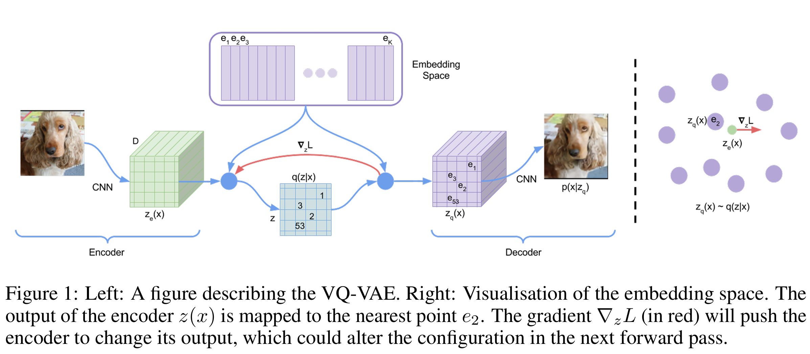
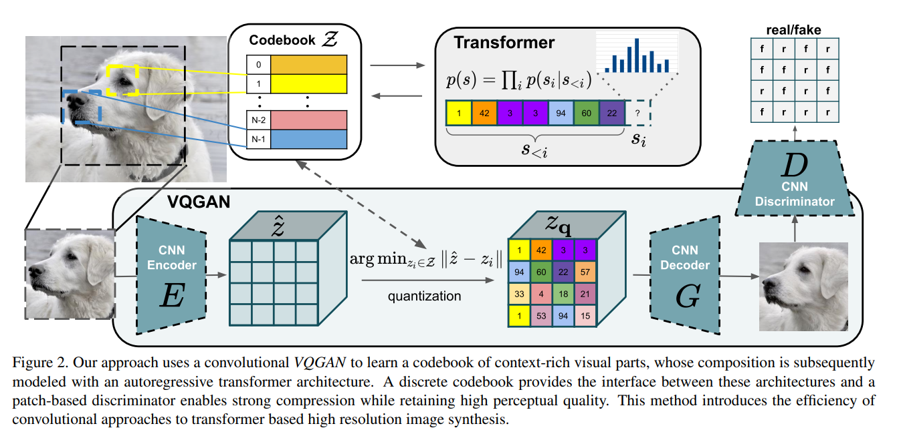

# Understanding VQ-GAN: A Powerful Approach to High-Quality Image Synthesis

## Introduction
Vector Quantized Generative Adversarial Network (**VQ-GAN**) is an advanced generative model that builds upon **VQ-VAE** by incorporating adversarial training and perceptual loss. This allows it to generate high-resolution, photo-realistic images while maintaining compact and meaningful latent representations. In this blog, we will explore how VQ-GAN works, why it surpasses VQ-VAE, and its key insights.

## Why VQ-GAN?
### Limitations of VQ-VAE



VQ-VAE efficiently compresses data into a discrete latent space but has several drawbacks:

- Blurred reconstructions: The decoder in VQ-VAE often produces oversmoothed images due to reliance on mean squared error (MSE) loss.
- Lack of fine details: It does not explicitly optimize for perceptual quality, causing small textures and details to be lost.
- Autoregressive bottleneck: Many implementations rely on autoregressive priors (e.g., PixelCNN), which are computationally expensive.

### VQ-GAN's Improvements

VQ-GAN enhances VQ-VAE with the following key features:

- Adversarial training: By introducing a discriminator (GAN-style training), VQ-GAN produces sharper and more realistic images.
- Perceptual loss: Instead of relying solely on MSE, it uses perceptual loss (from a pre-trained network) to improve visual fidelity.
- Efficient Latent Representations: Unlike PixelCNN priors, VQ-GAN leverages transformers for improved context modeling, leading to faster and more efficient generation.

## How VQ-GAN Works
### Quantization Process (Similar to VQ-VAE)

- The input image is encoded into a **latent space** using a convolutional encoder.
- The encoded features are discretized using a **vector quantization (VQ) layer**, mapping each feature to a learned codebook entry.
- The decoder reconstructs the image from the quantized representation.

### Adversarial Training

- A discriminator is introduced, following the **GAN framework**, to distinguish real images from generated ones.
- The generator (decoder) is trained to fool the discriminator, improving image sharpness and realism.

### Perceptual & Reconstruction Loss

- Instead of purely optimizing for pixel-wise loss (MSE), VQ-GAN incorporates a perceptual loss computed using a pre-trained deep network (e.g., VGG) to ensure structural coherence.
- The final objective function combines:
  - Reconstruction loss (ensuring faithful reconstructions)
  - GAN loss (encouraging realism)
  - Perceptual loss (maintaining perceptual consistency)

### Loss Function Comparison: VQ-VAE vs. VQ-GAN
#### VQ-VAE Loss Function

$$ L_{VQ-VAE} = \| x - \hat{x} \|^2 + \| sg(E(x)) - z \|^2 + \beta \| sg(z) - E(x) \|^2 $$

Where:

- \( x \) is the input image, \( \hat{x} \) is the reconstructed image.
- \( E(x) \) is the encoder output.
- \( z \) is the quantized latent vector.
- The first term represents the reconstruction loss, while the second and third terms encourage commitment to the learned codebook.

#### VQ-GAN Loss Function

$$ L_{VQ-GAN} = L_{VQ-VAE} + \lambda L_{GAN} $$

The additional GAN loss is defined as

$$
L_{GAN}(\{E, G, \mathcal{Z}\}, D) = \mathbb{E}[\log D(x) + \log(1 - D(G(z_q(x))))]
$$

where:

- \( z_q(x) \) is the quantized latent representation of the input \( x \).
- \( G(z_q(x)) \) represents the reconstructed/generated image from the quantized latent representation.
- \( D(x) \) is the discriminator's probability that the real image \( x \) is real.
- \( D(G(z_q(x))) \) is the discriminator's probability that the generated image is real.

The adaptive weight $\lambda$

$$
\lambda = \frac{\nabla_{G_L} [\mathcal{L}_{rec}]}{\nabla_{G_L} [\mathcal{L}_{GAN}] + \delta}
$$

This formula describes the computation of the adaptive weight \( \lambda \), which balances the perceptual reconstruction loss and the adversarial loss.

Moreover, to enhance perceptual quality, the reconstruction loss is replaced with the perceptual loss.

The **perceptual reconstruction loss** in VQ-GAN is designed to improve the quality of generated images by ensuring they preserve high-level semantic features from the original input. Instead of relying solely on pixel-wise losses like MSE (which often lead to blurriness), perceptual loss leverages a pre-trained deep network (such as VGG) to compare feature activations between the original and reconstructed images.

**Perceptual Reconstruction Loss Formula**

$$
\mathcal{L}_{rec} = \mathbb{E}_{x \sim p(x)} \left[ \| x - G(z_q(x)) \|^2 + \sum_{l} \lambda_l \| \phi_l(x) - \phi_l(G(z_q(x))) \|^2 \right]
$$

Where:

- \( x \) is the original image.
- \( G(z_q(x)) \) is the reconstructed/generated image from the quantized latent representation.
- \( \| x - G(z_q(x)) \|^2 \) is the pixel-wise reconstruction loss (MSE).
- \( \phi_l(\cdot) \) represents the feature maps extracted from the \( l \)-th layer of a pre-trained deep network (e.g., VGG-19).
- \( \lambda_l \) is a weighting factor for each feature layer contribution.
- The second term ensures that the generated image maintains perceptual similarity to the original image in feature space rather than just pixel space.

This loss helps VQ-GAN produce sharper and more visually appealing images compared to traditional autoencoders.

By integrating adversarial and perceptual losses, VQ-GAN improves image sharpness and realism compared to VQ-VAE.

### Transformer-based Prior

- Unlike VQ-VAE, which often relies on PixelCNN priors, VQ-GAN uses **transformers** to model long-range dependencies in the latent space.
- This allows for more coherent and meaningful latent space representation, enhancing image synthesis quality.

#### Sliding Attention Window

- Instead of computing self-attention across the entire sequence, a **fixed-size attention window** is used.
- The attention window slides across the sequence, allowing each token to attend only to nearby tokens while gradually incorporating long-range dependencies.
- This reduces computational complexity from **O(N²)** to **O(NW)**, where \( W \) is the window size.
- Sliding window attention ensures that local consistency is preserved while enabling efficient global information flow.

#### Training Process for Autoregressive Token Prediction

The Transformer models the probability distribution over latent tokens autoregressively:

$$
p(z_q) = \prod_{i} p(z_i | z_{<i}, c)
$$

where \( c \) represents optional conditioning information.

The loss function for training the Transformer is:

$$
L_{trans} = - \sum_{i=1}^{N} \log p_{\theta} (z_i | z_{<i}, c)
$$

This ensures that the Transformer learns to predict the next token in the sequence given previous tokens and any conditional information.

#### Conditional Transformer Training
The Transformer can be trained to perform **conditional inference** using different types of conditioning signals:

##### Class-Conditional Generation

- A class label is embedded and concatenated with latent tokens:
  $$
  \{c, z_1, z_2, ..., z_N\}
  $$
- The Transformer learns to generate latent tokens consistent with the given class label.

##### Text-to-Image Generation

- Text embeddings (from CLIP or other models) are used as conditional inputs:

  $$
  c = \text{CLIP}(text)
  $$

- The Transformer generates latent tokens aligned with the text prompt.

##### Segmentation or Sketch-Based Generation

- Segmentation maps or sketches are encoded into feature embeddings and used as conditions:
  $$
  c = E_{seg}(segmentation) \quad \text{or} \quad c = E_{sketch}(sketch)
  $$
- The Transformer learns to generate latent tokens that conform to the provided structure.

##### Image Inpainting (Partial Image Completion)

- Missing tokens are inferred while attending to known pixels:
  $$
  p(z_q | c) = \prod_{i=1}^{N} p(z_i | z_{<i}, c)
  $$
- The model fills in missing details using **masked attention**.

#### Inference Process: Unconditional & Conditional Generation

##### Unconditional Generation

- The Transformer randomly initializes the first token \( z_0 \) and generates the rest autoregressively:

  $$
  z_1 \sim p(z_1 | z_0), \quad z_2 \sim p(z_2 | z_0, z_1), ..., z_N \sim p(z_N | z_{<N})
  $$

- The latent tokens are reshaped into a 2D grid and decoded into an image.

##### Conditional Generation

- The Transformer incorporates conditioning signals (class, text, segmentation, sketch, or partial images) to guide latent token prediction:
  $$
  p(z_q | c) = \prod_{i=1}^{N} p(z_i | z_{<i}, c)
  $$
- The final latent tokens are decoded into an image consistent with the condition.

## Conditioned Synthesis with VQ-GAN

- **Text-to-Image Synthesis**: By combining VQ-GAN with **CLIP** or transformers, it can generate images conditioned on text descriptions, making it suitable for creative AI applications.
- **Class-Conditional Image Generation**: By feeding class labels into the latent space alongside encoded images, VQ-GAN can generate class-specific images.
- **Image-to-Image Translation**: VQ-GAN can be conditioned on specific inputs (such as edge maps, sketches, or low-resolution images) to generate high-fidelity versions.
- **Latent Code Conditioning**: Fine-tuning the learned codebook enables the model to generate samples conditioned on specific feature embeddings, allowing user-defined controls over the generation process.

## Key Insights

- Balance Between Compression & Fidelity
VQ-GAN achieves **high compression rates** while retaining fine details, unlike traditional autoencoders that tend to over-smooth outputs.

- GANs Improve High-Frequency Details
The **adversarial loss** significantly enhances the reconstruction of textures, details, and structures, leading to more realistic images compared to VQ-VAE.

- Transformers as a Strong Prior
Replacing **autoregressive models** like PixelCNN with **transformers** allows VQ-GAN to generate images more efficiently and with greater coherence.

- Versatile Applications
VQ-GAN is widely used in:

- **High-resolution image synthesis**
- **Text-to-image generation** (when combined with CLIP or transformers)
- **Neural compression** (efficient latent representation for storage and transmission)
- **Creative AI applications** (e.g., AI-driven art)

## Codes

### VectorQuantizer

```python
class VectorQuantizer(nn.Module):
    def __init__(self, n_e, e_dim, beta):
        super(VectorQuantizer, self).__init__()
        self.n_e = n_e
        self.e_dim = e_dim
        self.beta = beta

        self.embedding = nn.Embedding(self.n_e, self.e_dim)
        self.embedding.weight.data.uniform_(-1.0 / self.n_e, 1.0 / self.n_e)


    def forward(self, z):
        z = z.permute(0, 2, 3, 1).contiguous()
        z_flattened = z.view(-1, self.e_dim)
        # distances from z to embeddings e_j (z - e)^2 = z^2 + e^2 - 2 e * z

        d = torch.sum(z_flattened ** 2, dim=1, keepdim=True) + \
            torch.sum(self.embedding.weight**2, dim=1) - 2 * \
            torch.matmul(z_flattened, self.embedding.weight.t())

        # find closest encodings
        min_encoding_indices = torch.argmin(d, dim=1).unsqueeze(1)

        min_encodings = torch.zeros(
            min_encoding_indices.shape[0], self.n_e).to(z)
        min_encodings.scatter_(1, min_encoding_indices, 1)

        z_q = torch.matmul(min_encodings, self.embedding.weight).view(z.shape)

        # compute loss for embedding
        loss = torch.mean((z_q.detach()-z)**2) + self.beta * \
            torch.mean((z_q - z.detach()) ** 2)

        # preserve gradients
        z_q = z + (z_q - z).detach()

        # perplexity
        e_mean = torch.mean(min_encodings, dim=0)
        perplexity = torch.exp(-torch.sum(e_mean * torch.log(e_mean + 1e-10)))

        # reshape back to match original input shape
        z_q = z_q.permute(0, 3, 1, 2).contiguous()

        return z_q, loss, (perplexity, min_encodings, min_encoding_indices)
```

Here we can see how we copy the gradient from $z_e$ to $z_q$.

## Conclusion

VQ-GAN represents a significant leap over VQ-VAE by combining **vector quantization, GANs, and transformers** to achieve superior image synthesis. It maintains high compression efficiency while ensuring visually compelling results. With applications in generative art, neural compression, and AI-powered creativity, VQ-GAN is a pivotal model in modern generative AI research.
