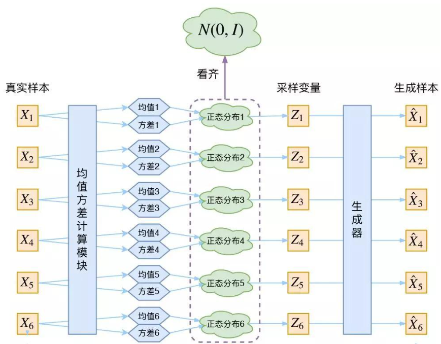

# 基础理论

## 生成模型可以根据其目标和方法分类：

| 模型类别 | 目标 | 典型模型 | 应用领域 |
| --- | --- | --- | --- |
| GAN | 最小化最小分布距离 | GAN DCGAN、StyleGAN、BigGAN |图像生成 |
| 隐变量模型 | 最大化对数似然 | VAE, PixelVAE | 图像生成、序列生成 |
| 概率密度估计 | 最大化对数似然 | Normalizing Flow, Energy-Based Models | 密度估计、图像生成 |
|逐步最大似然估计模型|逐步最大化对数似然| DDPM、Latent Diffusion Models (LDM) | 图像生成、补全、超分辨率 |
|自回归模型|最大化条件对数似然|自回归模型|图像生成、补全、超分辨率 |
| 几何/物理约束模型 | 最小化重建误差 | NeRF, DeepSDF | 三维建模、视点合成 |
| 规则/统计生成模型 | 基于规则或经验 | Procedural Generation, SMOTE | 数据增强、生成纹理 |
| 离散生成模型 | 离散最大似然估计 | GPT, Transformer | 文本生成、代码生成 |
| 稀疏/压缩生成模型 | 稀疏表示或压缩后重建 | Sparse Coding, Autoencoders | 特征提取、数据压缩 |
| 混合生成模型 | 结合多个生成目标 | VAE-GAN, Diffusion-GAN | 图像生成、高质量数据生成 |

主要生成任务使用的方法

| 数据类型 | 常用方法 | 特点 | 典型模型 |
| --- | --- | --- | --- |
| 图像生成 | GAN、扩散模型、VAE、自回归模型 | 生成质量高，适合单帧图像生成，多样性和控制性视模型而定 | StyleGAN、DDPM、PixelCNN |
| 语音生成 | 自回归模型、谱图生成、GAN、扩散模型 | 高保真语音生成，常结合声码器完成端到端生成 | WaveNet、Tacotron、HiFi-GAN、DiffWave |
| 视频生成 | GAN、自回归模型、扩散模型、混合模型 | 视频生成需要考虑时间一致性，模型更复杂，生成质量依赖于时间和空间的建模能力 | MoCoGAN、VideoGPT、Video Diffusion Models |

接下来我们主要介绍在最小距离分布和最大似然估计的框架下，怎么统一解释不同的生成模型。同时最大似然估计是最小分布距离的一种特例，我们其实可以在”最小距离分布“这个统一的框架下来解释生成方法的原理。

记住这个公式，最大似然估计的表达式

$$
 \int_{x\sim p_{\text {data }}} p_{\text {data }}(x) \log p_{\theta}(x) d x
$$

从离散的角度，最大似然估计表示为

$$
 \sum_{x\sim p_{\text {data }}}  \log p_{\theta}(x)
$$

---

## 定理1. MLP 是最小化分布差异的特定形式

**证明**:
先说明结论：两个分布间的“距离”可以用不同的指标来衡量（如 KL 散度、Jensen-Shannon 散度、Wasserstein 距离等）。MLE 的目标是最小化 KL 散度：
$$
D_{\text{KL}}(p_{\text{data}} || p_\theta)
$$
因此，MLE 可以被认为是以 **KL 散度**  作为距离衡量标准的特例。
下面我们只要证明MLP目标等价于优化KL散度就行。

其中

$$D_{\mathrm{KL}}\left(p_{\text {data }} \| p_\theta\right)=\int p_{\text {data }}(x) \log \frac{p_{\text {data }}(x)}{p_\theta(x)} d x$$

展开为

$$D_{\mathrm{KL}}\left(p_{\text {data }} \| p_\theta\right)=\int p_{\text {data }}(x) \log p_{\text {data }}(x) d x-\int p_{\text {data }}(x) \log p_\theta(x) d x$$

第一项和$\theta$ 也就是模型无关，因此可以忽略。第二项和$\theta$有关，因此可以看成KL的目标。

另外MLE的原始定义为

$$
\theta^*=\arg \max_{\theta} L_{\theta}  \\
== \arg\max_{\theta} E_{x \sim p_{\text {data }}}[\log p_{\theta}(x)]\\
= \arg\min_{\theta} - \int p_{\text {data }}(x) \log p_{\theta}(x) d x
$$

---

从这个角度从新不同的生成模型，包括VAE, GAN, Diffusion等等，它们的目标都是最小化生成分布和原始数据分布的差异(距离)的最小化。

---
## 定理2：gan的优化目标等价最小化分布距离

GAN的目的是最小化分布差异，其中vanila GAN的目的是最小化两个分布之间的JSD散度, WGAN的目的是最小化连个分布之前的Wasserstein距离

**证明**：

---

**1. Vanilla GAN 的优化目标与 Jensen-Shannon 散度**

 **1.1 GAN 的优化目标**

  GAN 的目标函数由生成器 $G$ 和判别器 $D$ 的对抗博弈组成：$
 \min_G \max_D \mathbb{E}_{x \sim p_{\text{data}}} [\log D(x)] + \mathbb{E}_{z \sim p(z)} [\log (1 - D(G(z)))]
$

其中：

- $p_{\text{data}}(x)$：真实数据分布。

- $p_\theta(x) = G(z)$：生成分布。

**1.2 判别器的优化**

 对于固定的生成器 $G$，判别器 $D$ 的目标是最大化：$
 \mathcal{L}(D) = \mathbb{E}_{x \sim p_{\text{data}}} [\log D(x)] + \mathbb{E}_{x \sim p_\theta} [\log (1 - D(x))]
$

优化 $D(x)$：

假设 $D(x)$ 输出的值是 $D(x) \in [0, 1]$，对其求导并找到最优解 $D^*(x)$：$
 D^*(x) = \frac{p_{\text{data}}(x)}{p_{\text{data}}(x) + p_\theta(x)}
$
此时最优判别器 $D^*(x)$ 表示输入样本来自真实分布的概率。

**1.3 将最优判别器代入损失**

将 $D^*(x)$ 代入 GAN 的目标函数，得到生成器的优化目标：$
 \min_G \max_D \mathcal{L}(D) = \mathbb{E}_{x \sim p_{\text{data}}} \left[\log \frac{p_{\text{data}}(x)}{p_{\text{data}}(x) + p_\theta(x)} \right] + \mathbb{E}_{x \sim p_\theta} \left[\log \frac{p_\theta(x)}{p_{\text{data}}(x) + p_\theta(x)} \right]
$

化简：
$
 \mathcal{L}(G) = -\log(4) + 2 \cdot D_{\text{JS}}(p_{\text{data}} || p_\theta)
$
其中 $D_{\text{JS}}$ 是 **Jensen-Shannon 散度** ，定义为：$
 D_{\text{JS}}(p_{\text{data}} || p_\theta) = \frac{1}{2} D_{\text{KL}}(p_{\text{data}} || m) + \frac{1}{2} D_{\text{KL}}(p_\theta || m)
$
$m = \frac{1}{2}(p_{\text{data}} + p_\theta)$。**结论：**
Vanilla GAN 的优化目标是最小化生成分布和数据分布之间的 Jensen-Shannon 散度。

---

**2. WGAN 的优化目标与 Wasserstein 距离** **2.1 WGAN 的目标函数**

WGAN 的目标函数是：
$
 \mathcal{L}(G, D) = \min_G \max_{D \in \text{Lip-1}} \mathbb{E}_{x \sim p_{\text{data}}} [D(x)] - \mathbb{E}_{x \sim p_\theta} [D(x)]
$
**2.1 约束条件：**
- 判别器 $D(x)$ 不再输出概率，而是标量值。

- $D(x)$ 是 1-Lipschitz 连续函数，即满足 $|D(x_1) - D(x_2)| \leq \|x_1 - x_2\|$。

**2.2 Wasserstein 距离定义** Wasserstein 距离（$W_1$ 距离）定义为：$
 W_1(p_{\text{data}}, p_\theta) = \inf_{\gamma \in \Pi(p_{\text{data}}, p_\theta)} \mathbb{E}_{(x, y) \sim \gamma} [\|x - y\|]
$
其中 $\Pi(p_{\text{data}}, p_\theta)$ 是所有使边缘分布为 $p_{\text{data}}$ 和 $p_\theta$ 的联合分布。
根据 Kantorovich-Rubinstein 对偶性，Wasserstein 距离可以重写为：
$
 W_1(p_{\text{data}}, p_\theta) = \sup_{\|D\|_L \leq 1} \mathbb{E}_{x \sim p_{\text{data}}} [D(x)] - \mathbb{E}_{x \sim p_\theta} [D(x)]
$

**3. 总结**
- **Vanilla GAN：**  判别器 $D$ 输出的是概率，优化目标是最小化生成分布和真实分布的 Jensen-Shannon 散度（JSD）。

- **WGAN：**  判别器 $D$ 输出的是标量值，优化目标是最小化生成分布和真实分布的 Wasserstein 距离（$W_1$）。

- **两者的本质：**  都在通过不同的分布差异度量指标优化生成分布 $p_\theta(x)$ 逼近真实数据分布 $p_{\text{data}}(x)$。

**4. 备注**

在wgan 中为什么出现了Lipschitz 条件。这是因为 Kantorovich-Rubinstein 对偶性要求目标函数 $𝑓(𝑥)$ 是 1-Lipschitz 函数。如果没有这个条件，Wasserstein 距离无法通过对偶形式计算。
在 WGAN 中，判别器 D(x) 实际上是 f(x) 的实现，因此需要满足 Lipschitz 连续性，保证优化目标与 Wasserstein 距离的数学定义一致。

---
从另外一个角度说明：判别器$D$的作用可能不一致，但是D的loss 都表示了两个分布之间的距离，分别是JSD 散度和Wasserstein 距离。优化$D$ 的作用及时让这个Loss 尽量准确模拟出两个分布之间的距离。如果把这个loss $L_\theta(x,y)$ 作为一个函数看待,它在训练过程中学习的就是两个分布之间的距离的近似。

当然在上面的分析中，我们是知道了GAN的实现，然后证明了它的作用。

理论上我们衡量两个分布之间的距离有不同的选择，那在"GAN"的设计中，我们就可以根据不同的距离选择可以让我们去设计不同的D和D的loss。

那么假设我们想要用KL 散度去衡量两个分布之间的距离，那是不是可以设计出相应的loss。
答案是肯定的，

我们可以推导出对特定散度的优化近似于
$\min _\theta \max _\omega F(\theta, \omega)=\mathbb{E}_{x \sim P}\left[T_\omega(x)\right]-\mathbb{E}_{x \sim Q_\theta}\left[f^*\left(T_\omega(x)\right)\right]$.

从而KL散度对应的loss 则为
$$E_{x\sim P}\left[\log D(x)\right]-E_{x\sim Q_\theta}\left[\log D(x)\right]$$

参考这个论文 https://arxiv.org/pdf/1606.00709 了解更多散度对应的loss

### 广泛含义上的分布之间的衡量设计

| 距离衡量方法 | GAN 类型 | 优势 | 劣势 | 论文链接 |
| --- | --- | --- | --- | --- |
| Jensen-Shannon 散度 | Vanilla GAN | 理论基础清晰，目标明确 | 梯度消失，模式崩溃 | [Generative Adversarial Nets](https://arxiv.org/abs/1406.2661) |
| Wasserstein 距离 | WGAN | 更稳定的训练过程，有意义的梯度 | 计算代价高，需强制 Lipschitz 条件 | [Wasserstein GAN](https://arxiv.org/abs/1701.07875) |
| f-散度 | f-GAN | 灵活的散度选择，适应不同任务需求 | 需选择合适的 f-散度 | [f-GAN: Training Generative Neural Samplers using Variational Divergence Minimization](https://arxiv.org/abs/1606.00709) |
| MMD（最大均值差异） | MMD-GAN | 核函数灵活，高维数据表现优越 | 核函数选择影响性能 | [MMD GAN: Towards Deeper Understanding of Moment Matching Network](https://arxiv.org/abs/1705.08584) |
| Sliced Wasserstein 距离 | Sliced-WGAN | 改善高维数据的训练稳定性 | 需要选择适当的投影方向 | [Max-Sliced Wasserstein Distance and Its Use for GANs](https://openaccess.thecvf.com/content_CVPR_2019/papers/Deshpande_Max-Sliced_Wasserstein_Distance_and_Its_Use_for_GANs_CVPR_2019_paper.pdf) |
| Sobolev 距离 | Sobolev GAN | 放宽 Lipschitz 条件，提高训练灵活性 | 理论复杂性增加 | [Towards Generalized Implementation of Wasserstein Distance in GANs](https://arxiv.org/abs/2012.03420) |

---

## 定理3: VAE 是对最大似然的下界的优化，近似最大似然估计
证明

1. 连续分布的最大似然估计目标

对于观测数据的概率分布 $p_{\text{data}}(x)$，最大似然估计的目标是最大化数据分布下模型 $p_\theta(x)$ 的对数似然：$
 \int_{x \sim p_{\text{data}}} p_{\text{data}}(x) \log p_\theta(x) \, dx
$

这里我们需要找到一种办法去表达或者近似 $p_\theta(x)$。 这是关键的一部分。 对于隐变量生成模型而言，会有一个$z$ 和$X$的对应关系，

我们可以写成 $p_\theta(x) = \int p_\theta(x, z) \, dz$ 包含对隐变量 $z$ 的积分。再对$z$ 做一些假设，可能就会简化求解的过程。

2. 重写边缘似然

对于单个数据点 $x$，观测数据的边缘对数似然可以写为：$
 \log p_\theta(x) = \log \int p_\theta(x, z) \, dz
$
利用联合分布的分解 $p_\theta(x, z) = p_\theta(x \mid z) p(z)$，我们有：$
 \log p_\theta(x) = \log \int p_\theta(x \mid z) p(z) \, dz
$
直接优化这个目标通常很困难，因为积分 $\int p_\theta(x \mid z)p(z) dz$ 对于高维 $z$ 不可解析。

3. 引入变分分布 $q_\phi(z \mid x)$为了解决积分不可解析的问题

引入一个近似后验分布 $q_\phi(z \mid x)$，用于近似真实后验 $p_\theta(z \mid x)$。我们可以通过以下分解重新表示$\log p_\theta(x)$：

$$
 \log p_\theta(x) = \mathbb{E}_{q_\phi(z \mid x)} \left[ \log \frac{p_\theta(x, z)}{q_\phi(z \mid x)} \right] + \mathrm{KL}(q_\phi(z \mid x) \| p_\theta(z \mid x))
$$

其中：

- 第一项是变分下界（Evidence Lower Bound, ELBO），我们可以优化它来间接优化 $\log p_\theta(x)$。

- 第二项是 KL 散度，表示近似后验 $q_\phi(z \mid x)$ 与真实后验 $p_\theta(z \mid x)$ 的差距。

由于 KL 散度总是非负：$\mathrm{KL}(q_\phi(z \mid x) \| p_\theta(z \mid x)) \geq 0$，所以：$\log p_\theta(x) \geq \mathcal{L}(\theta, \phi; x)$, 其中$L$ 表示变分下界,也就是 ELBO，为上式的第一项。

4. . 变分下界（ELBO, 设为 $ \mathcal{L}$）的分解

变分下界的具体形式为：

$$
 \mathcal{L}(\theta, \phi; x) = \mathbb{E}_{q_\phi(z \mid x)} \left[ \log p_\theta(x, z) - \log q_\phi(z \mid x) \right]
$$

进一步分解联合概率 $p_\theta(x, z) = p_\theta(x \mid z)p(z)$，得到：

$$
 \mathcal{L}(\theta, \phi; x) = \mathbb{E}_{q_\phi(z \mid x)} \left[ \log p_\theta(x \mid z) \right] - \mathrm{KL}(q_\phi(z \mid x) \| p(z))
$$

- **第一项**  $\mathbb{E}_{q_\phi(z \mid x)} [\log p_\theta(x \mid z)]$：重构误差（Reconstruction Error），鼓励生成器能够生成接近真实数据 $x$ 的分布。 这个没法直接计算。如果用蒙特卡洛采样的话，也需要有 $p_\theta(z|x)$的值，但是这个值也是不可解析的。 因此在原始的论文里，假设 $p_\theta(z|x)$是一个高斯分布，这样就可以计算。

  如果我们假设 $p_\theta(x|z)$ 是高斯分布：$
  p_\theta(x|z) = \mathcal{N}(\hat{x}, \sigma^2 I),
  $
  其中 $\hat{x}$ 是解码器生成的均值，$\sigma^2$ 是固定方差。
  对数似然展开：

  $$
  \log p_\theta(x|z) = \log \mathcal{N}(x; \hat{x}, \sigma^2 I) = -\frac{1}{2} \left( \frac{\|x - \hat{x}\|^2}{\sigma^2} + d \log(2\pi\sigma^2) \right),
  $$
  其中 $d$ 是 $x$ 的维度。

  重构误差等价于负对数似然，忽略常数项后为：

  $$
  \mathbb{E}_{q_\phi(z|x)}[-\log p_\theta(x|z)] \propto \mathbb{E}_{q_\phi(z|x)}[\|x - \hat{x}\|^2].
  $$

  3. 重建误差简化为 $|x - \hat{x}|$** 在具体实现中，通常假设方差 $\sigma^2 = 1$ 且重建误差仅考虑均值估计，此时：**

  $$
  \mathbb{E}_{q_\phi(z|x)}[\|x - \hat{x}\|^2] \approx \|x - \hat{x}\|^2,
  $$

  对应的差项为 $|x - \hat{x}|$ 或其平方形式。

  当然如果我们假设 $p_\theta(x|z)$ 是属于其他分布，那就会导出不同的重构误差。更进一步，对于任意一个重建差的度量，其实都对应着一个$p_\theta(x|z)$, 这个可以由度量函数去构建一个密度函数。
  具体，查看 [VAE: introduction](../chapter2_VAE/2.1introduction.md)

- **第二项**  $\mathrm{KL}(q_\phi(z \mid x) \| p(z))$：正则化项，约束 $q_\phi(z \mid x)$ 的分布接近先验 $p(z)$。

5. 最终形式（VAE 损失函数）
为了优化上述目标，我们需要进行采样 $z \sim q_\phi(z \mid x)$。为了解决采样过程中不可微的问题，使用 **重参数化技巧（Reparameterization Trick）** ：将 $q_\phi(z \mid x)$ 定义为高斯分布 $\mathcal{N}(\mu_\phi(x), \sigma_\phi(x)^2)$，通过如下方式采样：$
 z = \mu_\phi(x) + \sigma_\phi(x) \odot \epsilon, \quad \epsilon \sim \mathcal{N}(0, I)
$

最终，VAE 的损失函数可以表示为：

$$
 \mathcal{L}(\theta, \phi; x) = \mathbb{E}_{z \sim q_\phi(z \mid x)} [\log p_\theta(x \mid z)] - \mathrm{KL}(q_\phi(z \mid x) \| p(z))
$$

这对应于：

1. **重构误差** ：通过生成分布 $p_\theta(x \mid z)$ 学习如何生成数据。

2. **KL 散度正则化** ：约束潜变量分布。

优化该目标，即实现从最大似然估计到 VAE 的转化。

从这里我们也能看到，VAE和通常的神经网络构造不一样，它预测的时一个分布，不管编码器还是解码器，预测的都是一个分布。更精确得来说，最初的VAE 编码器预测的时高斯分布的mean 和variance， 解码器预测的时高斯分布的mean。但在实际应用时，我们使用VAE 进行重建时，直接使用的就是这个mean，因此忽略掉了其实decoder 也是本质上预测的是mean.

实际的VAE过程

从这里我们可以看到，对于VAE而言，第一项的计算是等价于重建loss 的，关键是第二项需要怎么设计。不同的设计可能就以为着不同的方法。

这里我们列举了一系列对第二项计算的改进方法

| 方法 | 描述 | 优点 | 缺点 | 适用场景 |
| --- | --- | --- | --- | --- |
| 标准高斯 VAE | 假设 $q_\phi(z \mid x)$为高斯分布，编码器输出均值和方差。 | 简单高效，可解析计算 KL 散度。 | 表达能力有限，无法处理复杂分布。 | 常规任务，数据分布简单。 |
| 高斯混合 VAE | 假设 $q_\phi(z \mid x)$ 是混合高斯分布（多个高斯成分）。 | 能够捕捉多模态分布，更适合复杂数据分布。 | 增加计算复杂度，需要估计更多参数。 | 多模态数据建模，例如聚类或分类任务。 |
| 正态化流 VAE | 用一系列可逆变换构造 $q_\phi(z \mid x)$，提高后验分布的灵活性。 | 后验分布更灵活，适合复杂分布建模。 | 增加计算复杂度，需要设计合理的流模型。 | 高维复杂分布的表示和建模。 |
| 离散 VAE | 假设潜变量是离散变量，用 Gumbel-Softmax 技巧实现可微优化。 | 适合离散潜变量空间（如分类或文本生成）。 | 无法捕捉连续分布的细节，对温度参数$\tau$敏感。 | 离散数据生成或分类任务。 |
| 能量模型 VAE | 用能量函数定义 $q_\phi(z \mid x)$,如$q_\phi(z \mid x) \propto \exp(-E_\phi(x, z))$，并通过 MCMC 采样。 | 非参数化，能够灵活建模复杂分布。 | 采样效率较低，计算成本较高。 | 高度复杂或未知分布建模。 |
| 对抗式 VAE (AAE) | 用 GAN 的对抗学习替代 KL 散度正则化，判别器用于匹配 $q_\phi(z)$ 和 $p(z)$。 | 不需要显式计算 KL 散度，适合复杂分布。 | 对抗训练可能不稳定，需要精心调试。 | 复杂数据分布生成任务。 |
| β-VAE | 在 VAE 损失中增加 KL 散度的权重 $1\beta > 1$，强调潜变量的压缩性和解耦性。 | 提高潜变量的表示质量，更适合表征学习任务。 | 可能导致重构性能下降，平衡重构和正则化较难。 | 表征学习，特征解耦（如生成 disentangled 表示）。 |
| 层次化 VAE | 引入多个层次的潜变量，例如 $z_1 \sim q_\phi(z_1 \mid x), z_2 \sim q_\phi(z_2 \mid z_1) $，捕捉分布的层次特性。 | 能够更好地表示复杂数据分布的层次关系。 | 增加模型复杂度，训练更困难。 | 高维复杂数据，例如图像或自然语言处理任务。 |

## normalize flow （NF）
如果映射是可逆的，那么我们就可以直接计算出生成样本的密度函数(分布), 这个时候直接优化最大似然就行了。

归一化流（Normalizing Flow）是一种概率密度估计方法，其核心思想是通过一系列可逆的变换，将一个复杂分布映射到一个简单分布（通常是标准正态分布），这些变换是由具有可微参数的函数定义的，因此可以通过最大似然估计对模型进行训练。以下是从最大似然的角度详细解释归一化流的原理：

### 最大似然估计

1. **目标：通过最大似然估计复杂分布的概率密度** 给定一个数据集 $\{x_1, x_2, \dots, x_N\}$，我们希望拟合一个概率分布 $p_X(x)$ 来描述数据的生成过程。通过最大似然估计（MLE)),目标是最大化模型分布对数据的对数似然：$\mathcal{L} = \sum_{i=1}^N \log p_X(x_i)$.

由于直接建模 $p_X(x)$ 可能非常复杂，归一化流通过变换将复杂分布 $p_X(x)$ 映射到一个简单的分布（如正态分布）。

2. **可逆变换与变化公式** 归一化流假设数据 $x$ 可以通过一系列可逆变换 $f$ 从一个简单的分布 $p_Z(z)$ 中生成：$
 x = f(z), \quad z = f^{-1}(x),
$
其中 $z$ 是潜在空间中的表示，其概率密度为 $p_Z(z)$。根据概率变化公式，$x$ 的概率密度可以通过变换的雅可比行列式计算为：$
 p_X(x) = p_Z(z) \left| \det \frac{\partial f^{-1}}{\partial x} \right|,
$

或者等价地：
$
 \log p_X(x) = \log p_Z(z) - \log \left| \det \frac{\partial f(x)}{\partial x} \right|.
$
这里 $\det \frac{\partial f(x)}{\partial x}$ 是变换 $f$ 的雅可比矩阵的行列式。

---

3. **最大似然估计** 为了最大化对数似然 $\mathcal{L}$，需要计算每个数据点 $x$ 的对数密度：
1. **计算潜在变量 $z$：**
利用 $z = f^{-1}(x)$，将输入数据 $x$ 映射到潜在空间。

2. **计算简单分布 $p_Z(z)$：**
简单分布通常选择为标准正态分布 $\mathcal{N}(0, I)$，因此 $\log p_Z(z)$ 可以直接通过 $z$ 的值计算。

3. **计算雅可比行列式：**
变换 $f(x)$ 必须设计成易于计算其雅可比行列式 $\det \frac{\partial f(x)}{\partial x}$。

最终，通过优化参数，最大化以下对数似然：
$
 \log p_X(x) = \log p_Z(f^{-1}(x)) - \log \left| \det \frac{\partial f(x)}{\partial x} \right|.
$

---

4. **设计归一化流的变换** 为了有效训练归一化流，变换 $f$ 通常需要满足以下要求：
- **可逆性** ：确保 $f$ 和 $f^{-1}$ 易于计算。

- **雅可比行列式高效计算** ：使得 $\det \frac{\partial f(x)}{\partial x}$ 的计算成本较低。

常用的变换包括：

1. **Affine Coupling Layer** ：只对部分变量进行变换，简化雅可比行列式的计算。

2. **Spline Flows** ：基于分段函数的流，能够捕获更多复杂性。

3. **RealNVP**  和 **Glow** ：利用特定的结构设计高效的变换。

### Loss 的公式直观拆解

在归一化流中，对数似然可以写为：
$$
 \log p_X(x) = \log p_Z(f^{-1}(x)) - \log \left| \det \frac{\partial f(x)}{\partial x} \right|.
$$
训练的目标是**最大化这个对数似然** ，即最小化负对数似然（Negative Log-Likelihood, NLL）：

$$
 \text{Loss} = -\mathbb{E}_{x \sim p_X} \left[ \log p_Z(f^{-1}(x)) - \log \left| \det \frac{\partial f(x)}{\partial x} \right| \right].
$$

从直观角度，Loss 的两个部分可以理解为：

1. **潜在空间的负对数密度** （$-\log p_Z(f^{-1}(x))$）：
  - 这个项表示数据点 $x$ 映射到潜在空间的点 $z = f^{-1}(x)$ 在简单分布 $p_Z(z)$ 上的概率密度。

  - 直观上，越高的密度表示 $x$ 被模型解释得越好，Loss 越小。

  - 目标是让数据点 $z$ 更接近简单分布的高密度区域（如标准正态分布的中心）。

2. **变换复杂性的代价** （$-\log \left| \det \frac{\partial f(x)}{\partial x} \right|$）：
  - 这个项量化了变换 $f$ 的复杂性，特别是变换如何拉伸或压缩空间。

  - 直观上，如果变换需要对数据进行大范围的扭曲或拉伸来匹配数据分布，雅可比行列式会较大，导致这个项的值增加，从而损失增大。

  - 目标是让变换 $f$ 尽量简单，同时能有效匹配数据分布。

---

### 用日常比喻直观理解

可以将 Loss 的两个部分类比为：

1. **适配数据的过程** ：
  - 想象你有一块布（简单分布），需要将它拉伸和折叠（变换）以完全覆盖一个复杂的地形（数据分布）。

  - 布的每个部分越接近目标地形的实际形状（即概率密度高的区域），就说明你越贴合目标，第一项的 Loss 越小。

2. **拉伸布的复杂性** ：
  - 如果需要对布进行非常复杂的变形，布会变得更紧或更松（对应雅可比行列式的变化），这会增加第二项的 Loss。

最终，Loss 就是这两者的加权总成本：既希望布能很好地覆盖地形，又希望变形的过程不要过于复杂。

实际实现的时候，normalize flow 可以设计为可逆映射的复合。

## Refenrence:
- [normalize flow](https://chatgpt.com/c/6788e69d-7f1c-8001-a4e2-f6c8abda90db)
- [Diffusion 综述阅读笔记](https://www.cnblogs.com/Meloniala/p/18285101)