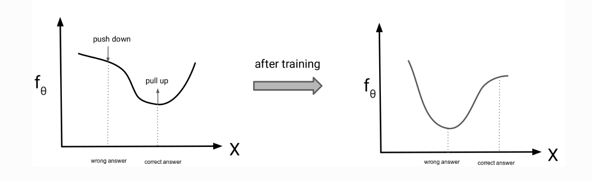

# 对比散度（CD）方法详解：从理论推导到直观理解

## 引言
在训练能量模型（如受限玻尔兹曼机，RBM）时，**配分函数**的计算一直是一个核心难题。传统的最大似然估计需要计算配分函数的梯度，但在高维空间中这一过程几乎不可行。
2002年，Geoffrey Hinton提出 **对比散度（Contrastive Divergence, CD** 方法，通过巧妙的近似策略，绕过了配分函数的显式计算，成为训练能量模型的里程碑式工作。
本文将深入解析CD的数学原理、直观解释及其实际应用。

## 1.问题背景：能量模型与配分函数
能量模型通过能量函数 $ E_\theta(x) $ 定义概率分布：

$$
p_\theta(x) = \frac{e^{-E_\theta(x)}}{Z(\theta)}, \quad Z(\theta) = \int e^{-E_\theta(x)} dx,
$$

其中 $ Z(\theta) $ 是配分函数。训练目标是最大化数据的对数似然：

$$
\mathcal{L}(\theta) = E_{x\sim p_{\text{data}}(x)}[\log p_\theta(x_i)]
$$

配分函数的梯度可通过对能量函数求导得到：

$$
\begin{aligned}
\nabla_\theta \log Z(\theta)
&= \frac{1}{Z(\theta)} \nabla_\theta Z(\theta) \\
&= \frac{1}{Z(\theta)} \int \nabla_\theta e^{-E_\theta(x)} dx \\
&= \frac{1}{Z(\theta)} \int -e^{-E_\theta(x)} \nabla_\theta E_\theta(x) dx \\
&= -\mathbb{E}_{p_\theta(x)} \left[ \nabla_\theta E_\theta(x) \right].
\end{aligned}
$$

将对数似然的梯度分解为数据项和模型项：
$$
\begin{aligned}
\nabla_\theta \mathcal{L}(\theta)
&= \mathbb{E}_{p_{\text{data}}(x)} \left[ \nabla_\theta \log p_\theta(x) \right] \\
&= \mathbb{E}_{p_{\text{data}}(x)} \left[ -\nabla_\theta E_\theta(x) - \nabla_\theta \log Z(\theta) \right] \\
&= -\mathbb{E}_{p_{\text{data}}(x)} \left[ \nabla_\theta E_\theta(x) \right] + \mathbb{E}_{p_\theta(x)} \left[ \nabla_\theta E_\theta(x) \right].
\end{aligned}
$$
其中：
- **第一项**：数据分布的期望，直接计算训练样本的梯度。
- **第二项**：模型分布的期望，传统方法需MCMC采样，CD通过短链采样近似。

**梯度计算难题**：
对数似然的梯度为：
$$
\nabla_\theta \mathcal{L}(\theta) = -\mathbb{E}_{p_{\text{data}}} [\nabla_\theta E_\theta(x)] + \mathbb{E}_{p_\theta(x)} [\nabla_\theta E_\theta(x)].
$$
其中第二项 $ \mathbb{E}_{p_\theta(x)}[\cdot] $ 需要从模型分布中采样，但传统MCMC方法因高维空间收敛慢而不可行。

## 2. CD的核心思想
### 2.1. 直观解释

CD的核心思想是**用少量MCMC步骤生成近似样本**，替代传统方法中的完全收敛链：
- **从数据分布启动链**：用训练样本 $ x_{\text{data}} $ 初始化MCMC链，而非随机噪声。
- **短链采样**：仅运行 $ k $ 步（通常 $ k=1 $）MCMC（如Gibbs采样）生成负样本 $ x_{\text{CD\_k}} $。
- **梯度近似**：用 $ x_{\text{CD\_k}} $ 近似模型分布的期望，计算梯度更新参数。

**为什么有效？**
- 数据分布靠近模型分布，短链即可逼近目标分布。
- 避免了长链MCMC的高计算成本。

## 3. 数学推导

### 3.1  目标函数与梯度

最大化对数似然等价于最小化KL散度：

$$
D_{\text{KL}}(p_{\text{data}} \| p_\theta) = \mathbb{E}_{p_{\text{data}}} [\log p_{\text{data}}(x) - \log p_\theta(x)].
$$

其梯度为：

$$
\nabla_\theta D_{\text{KL}} = -\mathbb{E}_{p_{\text{data}}} [\nabla_\theta \log p_\theta(x)] + \mathbb{E}_{p_\theta(x)} [\nabla_\theta \log p_\theta(x)].
$$

### 3.2. CD的核心策略

**直接用短链MCMC采样近似模型分布的期望**：
- **步骤**：
  1. 从训练数据样本 $x_{\text{data}}$ 启动马尔可夫链。
  2. 运行 $k$ 步MCMC（如Gibbs采样）生成样本 $x_{\text{CD\_k}}$。
  3. 用这些样本的均值近似 $\mathbb{E}_{p_\theta(x)}[\cdot]$，即：

     $$
     \mathbb{E}_{p_\theta(x)} [\nabla_\theta E_\theta(x)] \approx \frac{1}{B} \sum_{i=1}^B \nabla_\theta E_\theta(x_{\text{CD\_k}}^{(i)}).
     $$

### 3.3. 参数更新规则的简化

梯度公式简化为：

$$
\nabla_\theta \mathcal{L}(\theta) \approx -\mathbb{E}_{p_{\text{data}}} [\nabla_\theta E_\theta(x)] + \frac{1}{B} \sum_{i=1}^B \nabla_\theta E_\theta(x_{\text{CD\_k}}^{(i)}).
$$

参数更新方向为：

$$
\Delta \theta \propto -\nabla_\theta E_\theta(x_{\text{data}}) + \nabla_\theta E_\theta(x_{\text{CD\_k}}).
$$

### 3.4. 等价损失函数的定义
CD的等价损失函数可表示为：
$$
\mathcal{L}_{\text{CD}} = \mathbb{E}_{p_{\text{data}}} [E_\theta(x)] - \mathbb{E}_{p_{\theta}^{(k)}} [E_\theta(x)],
$$
其中：
- **第一项**：真实数据样本 \( x \sim p_{\text{data}} \) 的平均能量。
- **第二项**：从数据分布启动 \( k \) 步MCMC（如Gibbs采样）生成的样本 \( x_{\text{CD\_k}} \sim p_{\theta}^{(k)} \) 的平均能量。
- **优化目标**：最小化 \( \mathcal{L}_{\text{CD}} \)，即降低真实数据的能量，同时提高生成数据的能量。
- **作用**：降低真实样本的能量，使其更可能被模型生成。提高生成样本的能量，使其远离当前模型分布。

### 3.5. 短链采样的合理性
- **热启动**：从数据点启动MCMC链，起点靠近高概率区域，少量步骤即可逼近模型分布。
- **局部探索**：短链主要调整样本的局部结构（如纹理细节），而非全局模式。

### 3.6. 与传统MCMC的对比
| **方法**       | **初始状态** | **链长** | **计算成本** |
|----------------|--------------|----------|--------------|
| **传统MCMC**   | 随机噪声     | 长（收敛）| 高           |
| **CD**         | 训练数据     | 短（$ k=1 $） | 低           |

---

## 4. 应用与变种
### 4.1. 在RBM中的实现
- **Gibbs采样步骤**：
  1. 正向传播：计算隐层概率 $ p(h \mid v_{\text{data}}) $，采样 $ h_0 $。
  2. 反向重构：计算可见层概率 $ p(v \mid h_0) $，采样 $ v_1 $。
- **参数更新**：
  $$
  \Delta w_{ij} \propto v_{\text{data},i} h_{0,j} - v_{1,i} h_{1,j}.
  $$

### 4.2 改进方法
- **Persistent CD (PCD)**：跨批次保留MCMC链状态，提升采样效率（Tijmen Tieleman, 2008）。
- **Fast CD**：结合动量、自适应学习率加速训练。

---

## 5. 优缺点分析
### **优点**
- **高效**：避免长链MCMC，计算成本低。
- **实用**：在RBM等模型中表现优异，推动了深度学习复兴。

### **缺点**
- **有偏估计**：短链未收敛到平稳分布，梯度不准确。
- **模式坍塌风险**：可能遗漏低概率区域。

---

## 6. 总结
对比散度（CD）通过**有限步MCMC采样**和**数据分布热启动**的策略，解决了能量模型训练的配分函数难题。尽管存在理论偏差，其实用性和高效性使其成为生成模型训练的基石之一。从RBM到现代深度生成模型，CD的思想仍在持续影响无监督学习的发展。

**参考文献**：
Hinton, G. E. (2002). Training products of experts by minimizing contrastive divergence. *Neural Computation*, 14(8), 1771–1800.