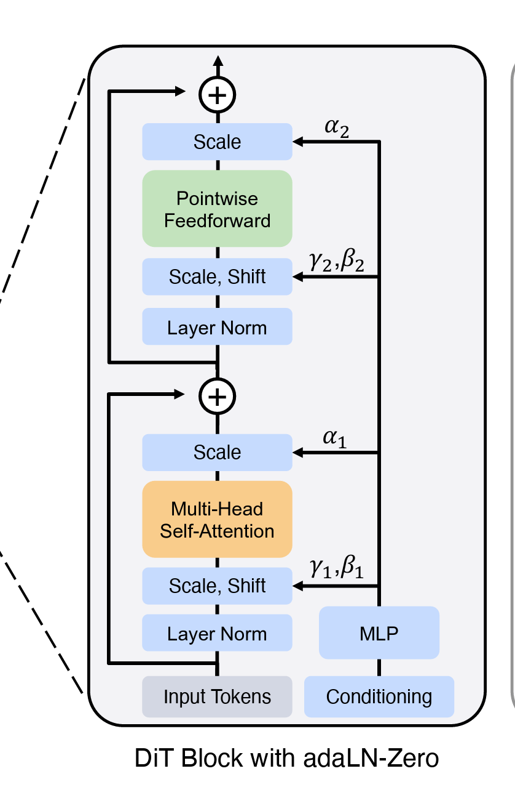
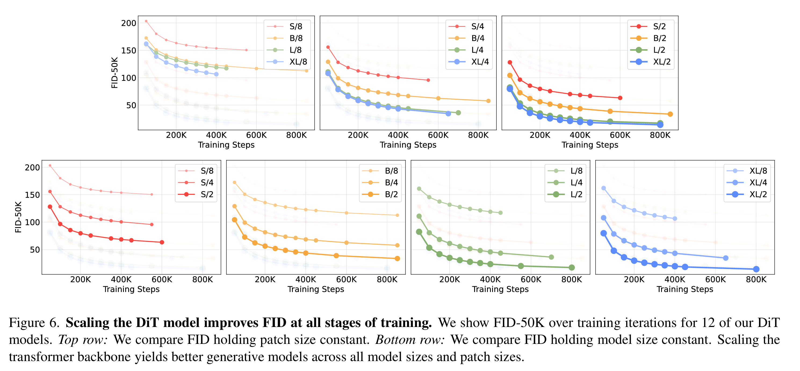
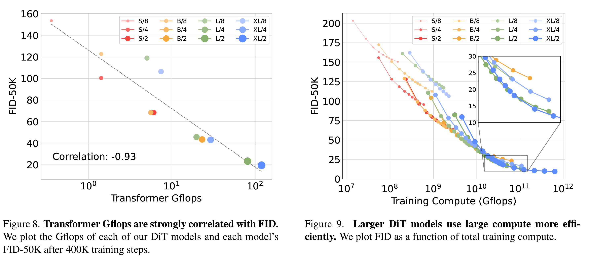
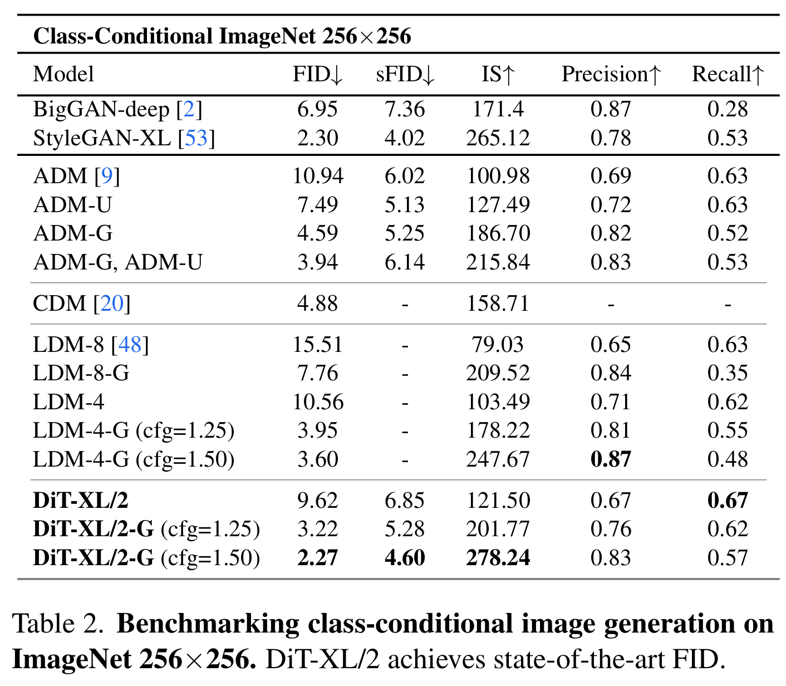
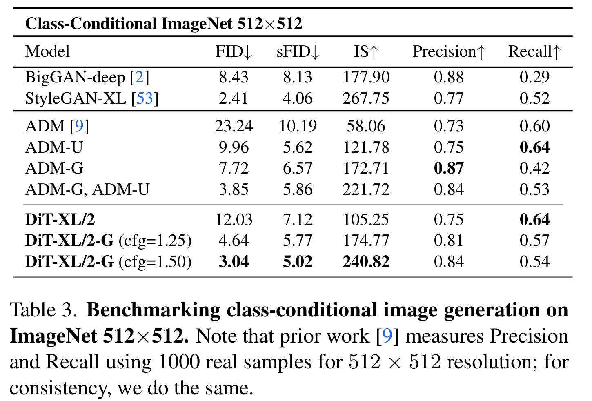

# Scalable Diffusion Models with Transformers (DiT)

- Year 2023 Mar
- Author:
  - 威廉·皮布尔斯（William Peebles）
    - DiT model (UC Berkely)
    - SORA project (open ai)
  - 谢赛宁（Saining Xie）
    - DiT model (New York University)
    - ResNeXt
    - Cambrian-1 with Yan Lecun
- Main contribution
  - replace the U-Net backbone with transformers
  - Analyze the scalability properties
- repo: <https://github.com/facebookresearch/DiT/tree/main>


## Diffusion Transformer Design

!!! note ""
    The transformer diffusion is also trained with the latent diffusion model. Thus the transformer diffusion is desinged on the latent space.

### Patchify

- convert spatial input into a sequence of $T$ tokens
- suppose the input size if [64, 64, 4], $p=16$, then for each $16\times16$ sqaure, we flatten into the single token with a linear embedding layer. totally, we obtained $64\times 64 / (p^2) = 16$ tokens. The output shape should be [16,d]
- In the design, the patchsize  $p$ is regarded as a parameter

We can use the conv2d to do the patchify, then we can use the flatten and transpose to reshape the output.

```py3
import torch
import torch.nn as nn
# Define the patch size
patch_size = 16
# Create a convolutional layer to extract patches
# The number of output channels (embedding_dim) is a hyperparameter
embedding_dim = 768  # Example embedding dimension
patchify = nn.Conv2d(
    in_channels=4,       # Number of input channels
    out_channels=embedding_dim,  # Embedding dimension
    kernel_size=patch_size,      # Size of each patch
    stride=patch_size            # Stride to ensure non-overlapping patches
)
# Example input tensor with shape (batch_size, channels, height, width)
batch_size = 8  # Example batch size
input_tensor = torch.randn(batch_size, 4, 64, 64)  # Random input tensor
# Apply the patchify operation
patches = patchify(input_tensor)  # Shape: (batch_size, embedding_dim, 4, 4)
# Reshape patches to (batch_size, num_patches, embedding_dim)
# Here, num_patches = (64 / 16) * (64 / 16) = 4 * 4 = 16
patches = patches.flatten(2)  # Shape: (batch_size, embedding_dim, num_patches)
patches = patches.transpose(1, 2)  # Shape: (batch_size, num_patches, embedding_dim)
print(patches.shape)  # Output: torch.Size([batch_size, 16, 768])
```

### positional encoding
Similar to the normal sine-cosine positional encoding, we can also use the conv2d to do the positional encoding.

```py3
import torch
import torch.nn as nn
import math

class PositionalEncoding(nn.Module):
    def __init__(self, d_model, max_len=5000):
        super(PositionalEncoding, self).__init__()
        # Create a matrix of shape (max_len, d_model) to hold the positional encodings
        pe = torch.zeros(max_len, d_model)
        # Position indices (0, 1, 2, ..., max_len-1)
        position = torch.arange(0, max_len, dtype=torch.float).unsqueeze(1)
        # Compute the div_term for the exponential function
        div_term = torch.exp(torch.arange(0, d_model, 2).float() * (-math.log(10000.0) / d_model))
        # Apply sine to even indices in the array; 2i
        pe[:, 0::2] = torch.sin(position * div_term)
        # Apply cosine to odd indices in the array; 2i+1
        pe[:, 1::2] = torch.cos(position * div_term)
        # Add a batch dimension
        pe = pe.unsqueeze(0)
        # Register pe as a buffer to prevent it from being considered a model parameter
        self.register_buffer('pe', pe)

    def forward(self, x):
        # Add positional encoding to the input tensor
        x = x + self.pe[:, :x.size(1), :]
        return x
```

In transformer models, positional encoding is used to inject information about the position of tokens in a sequence, since the model itself doesn't inherently capture positional information. A common method is to use sinusoidal functions to generate these encodings. The formulas for sine and cosine positional encodings are as follows:

For a given position \( \text{pos} \) and embedding dimension \( i \):

- When \( i \) is even:

$$ \text{PE}(\text{pos}, i) = \sin\left(\frac{\text{pos}}{10000^{\frac{i}{d_{\text{model}}}}}\right) $$


- When \( i \) is odd:

$$\text{PE}(\text{pos}, i) = \cos\left(\frac{\text{pos}}{10000^{\frac{i}{d_{\text{model}}}}}\right) $$


Here, \( d_{\text{model}} \) represents the dimensionality of the model's embeddings. These functions use different frequencies to encode each dimension, allowing the model to distinguish between different positions in the sequence. This approach was introduced in the "Attention Is All You Need" paper.

<iframe width="560" height="315" src="https://www.youtube.com/embed/8DDDAT9JCu0" frameborder="0" allowfullscreen></iframe>

## Dit Block Design

The core is to design how to accept condition information like

- timestep $t$
- class label $c$
- guided text
- guided spatial information such as depth, etc.

To implement this, the paper design four different blocks to accept the condition
### In-context conditioning

Similar to the `cls` token in ViT, treat the embeddings of $t$ and $c$ as two additional tokens in the input sequence, which is

$$
[e_t, e_c, patch_1, patch_2, ...,patch_N]
$$


Then the input sequence is passed through a transformer encoder to extract context information.

### Cross Attenstion Block

Similar in the Latent Diffusion [latent diffusion handson](./ldm_handson.md)


The $t$ and $c$ are concated as lenght-two sequence, and act as $K$ and $V$ in the cross attention block as show in the above picture.

### Adaptive Layer Norm (adaLN)


Borrow idea from the style gan AdaIN

Here is a comparison of **Adaptive Layer Normalization (adaLN)** in **DiT** and **Adaptive Instance Normalization (AdaIN)** in **StyleGAN** in a tabular format:

| Feature            | **adaLN (DiT)** | **AdaIN (StyleGAN)** |
|--------------------|----------------|----------------------|
| **Purpose**       | Modulates transformer layers based on conditioning input (e.g., class labels, text embeddings). | Transfers style by aligning content feature statistics to match style feature statistics. |
| **Normalization Scope** | Normalizes across the entire layer (layer normalization). | Normalizes each feature channel independently per instance. (instance normalization) |
| **Mathematical Formula** | \( o_i = \gamma(y) \cdot \frac{x_i - \mu}{\sigma + \epsilon} + \beta(y) \) | \( o_i = \sigma(y) \cdot \frac{x_i - \mu(x)}{\sigma(x) + \epsilon} + \mu(y) \) |
| **Parameter Modulation** | \( \gamma \) and \( \beta \) are dynamically generated from a conditioning input \( y \). | \( \mu(y) \) and \( \sigma(y) \) are extracted from the style input \( y \). |
| **Dependency** | Learns conditioning through a neural network (e.g., MLP). | Uses statistics (mean & variance) directly from the style input. |
| **Application** | Used in transformer-based models like DiT to condition the model on auxiliary data (e.g., text, class labels). | Used in StyleGAN for style transfer and control of image synthesis. |

Here is the structure of AdaLN.

```py3
class DiTBlock(nn.Module):
    """
    A DiT block with adaptive layer norm zero (adaLN-Zero) conditioning.
    """
    def __init__(self, hidden_size, num_heads, mlp_ratio=4.0, **block_kwargs):
        super().__init__()
        self.norm1 = nn.LayerNorm(hidden_size, elementwise_affine=False, eps=1e-6)
        self.attn = Attention(hidden_size, num_heads=num_heads, qkv_bias=True, **block_kwargs)
        self.norm2 = nn.LayerNorm(hidden_size, elementwise_affine=False, eps=1e-6)
        mlp_hidden_dim = int(hidden_size * mlp_ratio)
        approx_gelu = lambda: nn.GELU(approximate="tanh")
        self.mlp = Mlp(in_features=hidden_size, hidden_features=mlp_hidden_dim, act_layer=approx_gelu, drop=0)
        self.adaLN_modulation = nn.Sequential(
            nn.SiLU(),
            nn.Linear(hidden_size, 6 * hidden_size, bias=True)
        )

    def forward(self, x, c):
        shift_msa, scale_msa, gate_msa, shift_mlp, scale_mlp, gate_mlp = self.adaLN_modulation(c).chunk(6, dim=1)
        x = x + gate_msa.unsqueeze(1) * self.attn(modulate(self.norm1(x), shift_msa, scale_msa))
        x = x + gate_mlp.unsqueeze(1) * self.mlp(modulate(self.norm2(x), shift_mlp, scale_mlp))
        return x
```



here `adaLN_modulation` predicts the parameters $\alpha_1$, $\alpha_2$, $\beta_1$, $\beta_2$, $\gamma_1$, $\gamma_2$.

The **DiTBlock with Adaptive Layer Norm Zero (adaLN-Zero)** can be mathematically represented by the following function:

$$
(S_{\text{MSA}}, \alpha_{\text{MSA}}, G_{\text{MSA}}, S_{\text{MLP}}, \alpha_{\text{MLP}}, G_{\text{MLP}}) = f_{\text{adaLN}}(C)
$$


- **Self attention**

$$
 X' = X + G_{\text{MSA}} \cdot \text{MSA} \left( \alpha_{\text{MSA}} \cdot \frac{X - \mu_X}{\sigma_X + \epsilon} + S_{\text{MSA}} \right)
$$


- **Feedforward (MLP) Update**

$$
 X'' = X' + G_{\text{MLP}} \cdot \text{MLP} \left( \alpha_{\text{MLP}} \cdot \frac{X' - \mu_{X'}}{\sigma_{X'} + \epsilon} + S_{\text{MLP}} \right)
$$


### adaLN Zero Initial
Assume that zero initial for residule network is benifitial, we add the parameter $scale$ to control the effects of adaLN. And at initial we initial all the parameters of linear layers to 0.

### Overall structure of DiT

```py3
  def forward(self, x, t, y):
        """
        Forward pass of DiT.
        x: (N, C, H, W) tensor of spatial inputs (images or latent representations of images)
        t: (N,) tensor of diffusion timesteps
        y: (N,) tensor of class labels
        """
        x = self.x_embedder(x) + self.pos_embed  # (N, T, D), where T = H * W / patch_size ** 2
        t = self.t_embedder(t)                   # (N, D)
        y = self.y_embedder(y, self.training)    # (N, D)
        c = t + y                                # (N, D)
        for block in self.blocks:
            x = block(x, c)                      # (N, T, D)
        x = self.final_layer(x, c)                # (N, T, patch_size ** 2 * out_channels)
        x = self.unpatchify(x)                   # (N, out_channels, H, W)
        return x
```

The stucture of DiT is quite simple.

1. patchfy the input $x$, which is shape [B,C,H,W]
2. position embedding of shape [B,T,D] on the patched tokens
3. class/label embedding of shape [B,D] on the patched tokens
4. combine time and class embedding $c = t+y$
5. go through the attention blocks
6. final layer that re-patchify
7. convert to original shaoe [B,C',H,W]

## Results

1. Large size improved FID
   
    
2. In samve computation cost, large model performs better
    

3. Sota

|||
|---|---|
