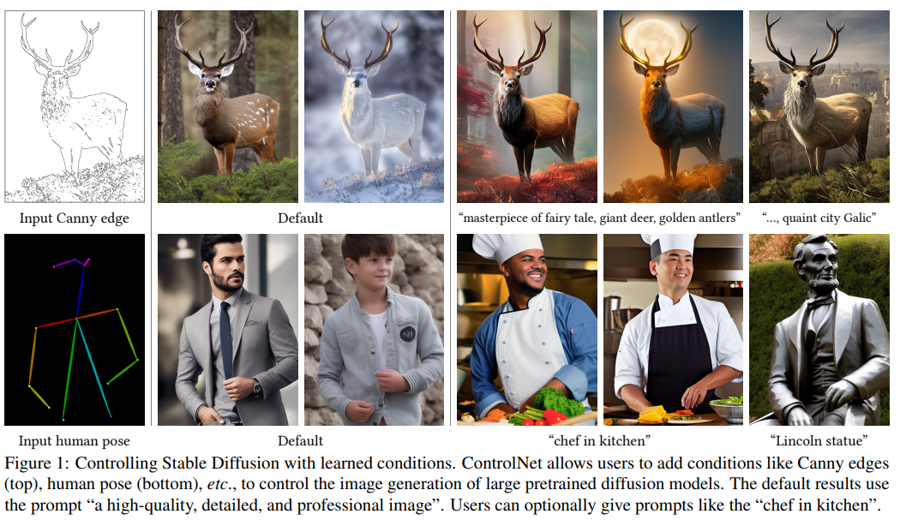
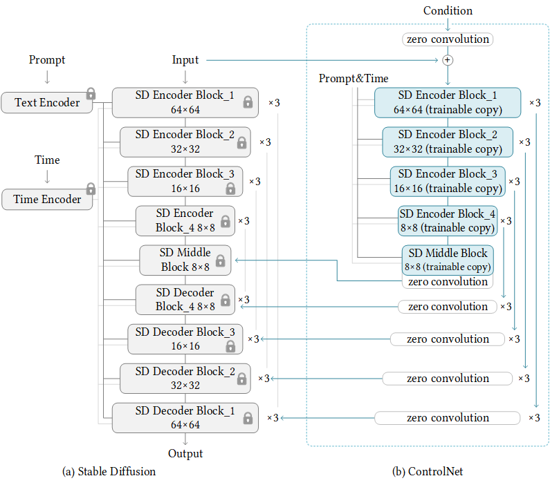
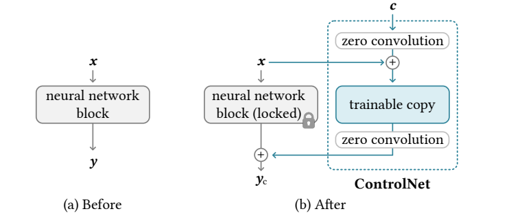
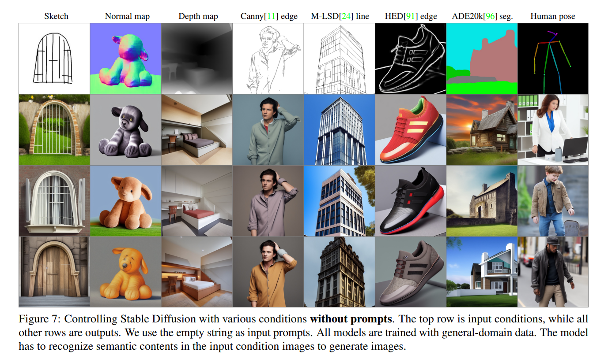

# ControlNet

- title: Adding Conditional Control to Text-to-Image Diffusion Models
- Lvmin Zhang, Anyi Rao, and Maneesh Agrawala
- organization: Stanford University
- year: 2023 Nov


ControlNet 是一种基于深度学习的图像生成控制框架，主要用于增强生成模型（如 **Stable Diffusion**）对生成过程的精确控制能力。它通过引入额外的条件输入（如边缘检测、人体姿势、深度图等），使用户能够更精细地指导生成模型输出符合特定结构或风格的图像。

以下是对 ControlNet 的详细介绍：


## 核心思想
ControlNet 的核心目标是通过引入外部条件约束，解决传统生成模型（如 Stable Diffusion）在生成过程中难以精确控制图像结构的问题。例如：
- **传统方法**：用户输入文本描述（如“一只猫坐在椅子上”），模型自由生成，但无法保证椅子形状、猫的姿势等细节。
- **ControlNet**：用户可额外提供一张线稿、深度图或人体姿势图，模型会严格遵循这些条件生成图像。

## 技术原理
### 网络结构
- **基础模型**：ControlNet 基于 Stable Diffusion 的 U-Net 架构，复制了原模型的编码器（Encoder）权重，形成一个“可训练副本”。
- **零卷积（Zero Convolution）**：通过初始化权重为零的卷积层，将条件输入与原始模型连接。训练初期，这些层不会影响原模型，逐步学习条件与生成结果的关系。
- **条件输入**：用户提供的额外条件（如边缘图、深度图等）通过 ControlNet 的编码器处理后，与原始模型的中间特征融合。



对于单个模块的结构.

### 训练过程
1. **冻结原模型**：保持 Stable Diffusion 的预训练权重不变。
2. **训练 ControlNet**：仅更新 ControlNet 部分的参数，学习如何将条件输入映射到生成图像的对应特征。
3. **损失函数**：通常使用像素级重建损失（如 L1/L2 Loss）或对抗损失（GAN Loss）。

## 主要应用场景
### 边缘检测控制
- **输入**：线稿图（如 Canny 边缘检测结果）。
- **应用**：生成与线稿结构一致的图像。
- **示例**：将手绘草图转换为逼真图像，同时保留原始结构。

### 人体姿势控制
- **输入**：人体关键点（如 OpenPose 检测结果）。
- **应用**：生成特定姿势的人物，适用于动画、游戏角色设计。

### 深度图控制
- **输入**：深度图（表示场景的3D结构）。
- **应用**：生成具有正确透视和层次感的3D场景。

### 语义分割控制
- **输入**：语义分割掩码（如不同颜色表示物体类别）。
- **应用**：生成符合语义布局的图像（如“天空在上，草地在下”）。

### 其他条件
- 涂鸦（Scribble）、霍夫变换线检测（HED）、法线图（Normal Map）等。



## 使用方式
### 安装与部署
- **依赖库**：通常与 Stable Diffusion 结合使用，依赖 PyTorch、Diffusers 等库。
- **模型下载**：Hugging Face 等平台提供预训练的 ControlNet 模型（如 `control_v11p_sd15_canny`）。

### 模型训练
- **自定义条件**：用户可基于特定任务训练自己的 ControlNet（需准备条件-图像对数据集）。
- **微调策略**：推荐使用小学习率，避免破坏原始模型的生成能力。

### 推理示例（伪代码）
```python
from diffusers import StableDiffusionControlNetPipeline, ControlNetModel
import torch

# 加载 ControlNet 和 Stable Diffusion
controlnet = ControlNetModel.from_pretrained("lllyasviel/sd-controlnet-canny")
pipe = StableDiffusionControlNetPipeline.from_pretrained("runwayml/stable-diffusion-v1-5", controlnet=controlnet)

# 输入条件和提示词
canny_edges = load_edge_image("sketch.png")  # 加载边缘图
prompt = "a futuristic city, digital art, highly detailed"

# 生成图像
image = pipe(prompt=prompt, image=canny_edges).images[0]
```

## 优势与局限性
### 优势
- **精细控制**：解决生成模型输出不可控的问题。
- **模块化设计**：可与多种预训练模型结合（如 Stable Diffusion 1.5/2.1）。
- **兼容性**：支持多种条件类型，灵活适应不同任务。

### 局限性
- **依赖条件质量**：输入的条件图需清晰准确，否则可能导致生成错误。
- **计算资源**：训练需要较大显存（通常需 24GB+ GPU）。
- **风格一致性**：某些复杂条件可能难以与文本提示完美融合。

## 社区与资源
- **官方代码库**：[GitHub - lllyasviel/ControlNet](https://github.com/lllyasviel/ControlNet)
- **预训练模型**：Hugging Face Hub 提供多种 ControlNet 变体。
- **在线演示**：可通过 Replicate、Google Colab 等平台体验。

## 总结
ControlNet 是生成式 AI 领域的重要创新，通过引入结构化条件输入，显著提升了生成模型的可控性。它在艺术创作、游戏开发、影视特效等领域具有广泛应用前景，尤其适合需要精确控制图像结构的场景。然而，其使用门槛较高，需结合具体需求选择合适的条件类型和训练策略。