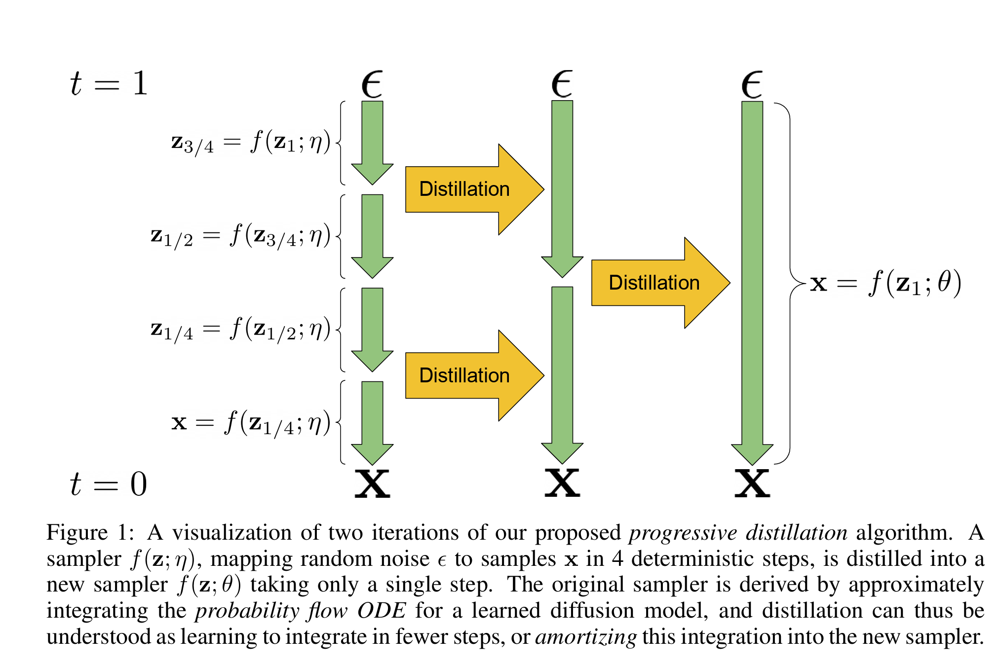
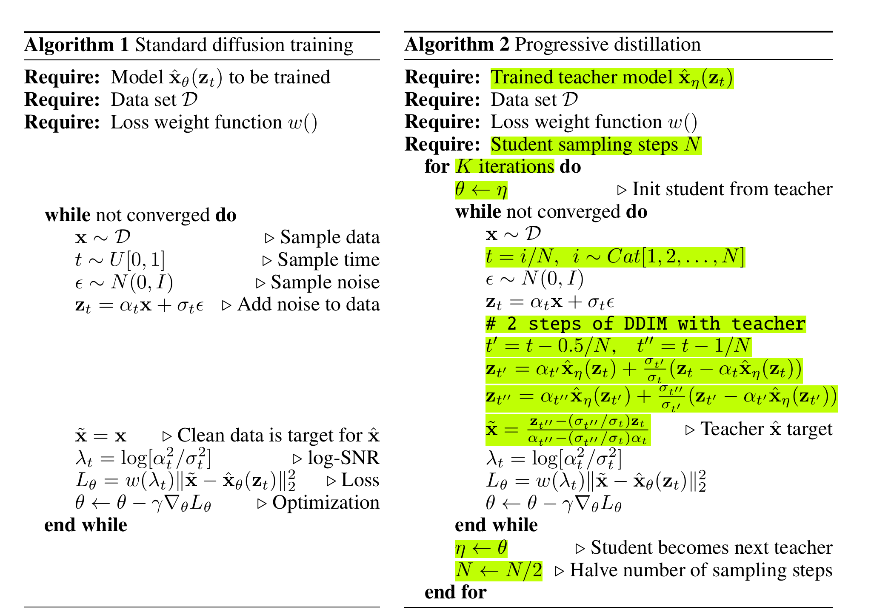

# Diffusion Model Variants
## SPeed up Sampling

### PROGRESSIVE DISTILLATION FOR FAST SAMPLING OF DIFFUSION MODELS

- paper: <https://arxiv.org/pdf/2202.00512>

- Author:

    !!! note "Tim Salimans"
        - **职业背景**：
              Tim Salimans 是知名的生成模型研究者，曾在 OpenAI 工作，对深度生成模型（如 GANs 和扩散模型）的训练和稳定性改进有重要贡献。他在多个影响深远的工作中担任核心角色，例如在改进 GAN 训练技术方面的工作（例如 “Improved Techniques for Training GANs”）中均有贡献。

        - **研究方向**：
            主要聚焦于深度生成模型、概率建模以及高效的神经网络训练方法。他的工作经常探索如何利用噪声、正则化以及先进的优化技巧来提升模型性能。

        - **学术与工业经历**：
            在加入 OpenAI 前，Tim Salimans 也曾在学术界或其他研究机构积累经验，其研究成果发表在机器学习和人工智能领域的重要会议和期刊上。关于他的详细教育背景和工作履历，可参考其公开的简历或个人主页（如有公开）。

    !!! note "Jonathan Ho"

        - **职业背景**：
            Jonathan Ho 是扩散模型领域的重要人物，以其在生成模型中的扩散过程研究而广为人知。他是《Denoising Diffusion Probabilistic Models》这篇开创性论文的第一作者，该论文奠定了基于扩散过程的生成模型方法的理论基础，并对后续工作产生了深远影响。

        - **研究方向**：
            主要专注于概率生成模型和扩散模型的理论与应用，探索如何通过逐步“去噪”的方式将简单的噪声分布转换为复杂的数据分布。他的工作帮助推动了扩散模型在图像生成等任务上的广泛应用。

        - **学术与机构背景**：
            根据论文署名和公开信息，Jonathan Ho 曾与包括 Pieter Abbeel 等知名学者合作，其论文发布时的机构背景（如加州大学伯克利分校的BAIR实验室或其他机构）为他在生成模型领域奠定了坚实的基础。更多详细的履历信息可参考其在论文中的作者信息或其公开的个人简介。

The main idea of this paper is two use teacher model to distill student model with fewer sampling steps.

Which is similar to the DDIM idea to device the total steps $N$ by half iteratively as illusrated as the following figure

The Algorithm states

**代码中的关键点：**

1. **教师-学生框架：**

- 初始教师模型经过多个采样步骤（例如 $T$ 步）生成数据。

- 学生模型被训练在更少的步数（例如 $T/2$ 步）内复现教师模型的采样行为。

2. **伪标签生成：**

- 对于每个训练样本，通过教师模型进行多步采样（这里一般模拟 2 步过程）获得伪目标（$x_{\text{teacher}}$）。

- 学生模型以更少的步数生成预测（$x_{\text{student}}$），然后通过损失函数逼近伪目标。

3. **逐步递减步数：**

- 每次完成蒸馏后，更新教师模型为当前学生模型，并将采样步数减半。

- 反复迭代，直到达到预设的少步采样目标，从而极大加快采样速度。

## References: [DDPM speed up methods](https://zhuanlan.zhihu.com/p/651180944)
