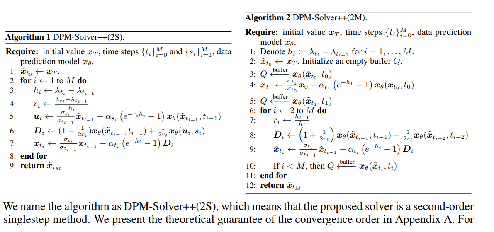
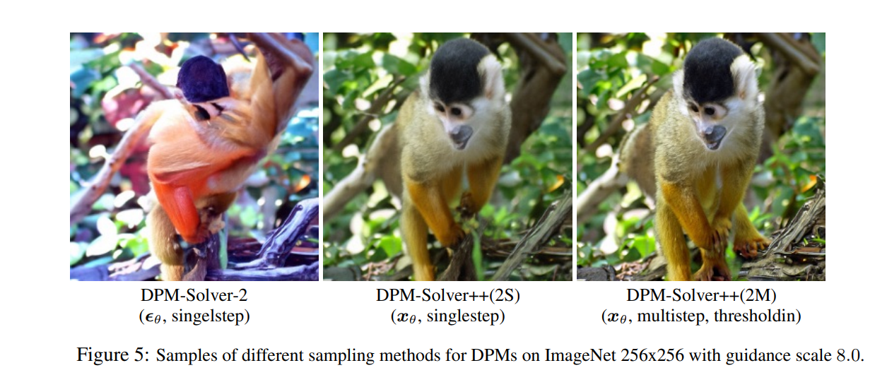
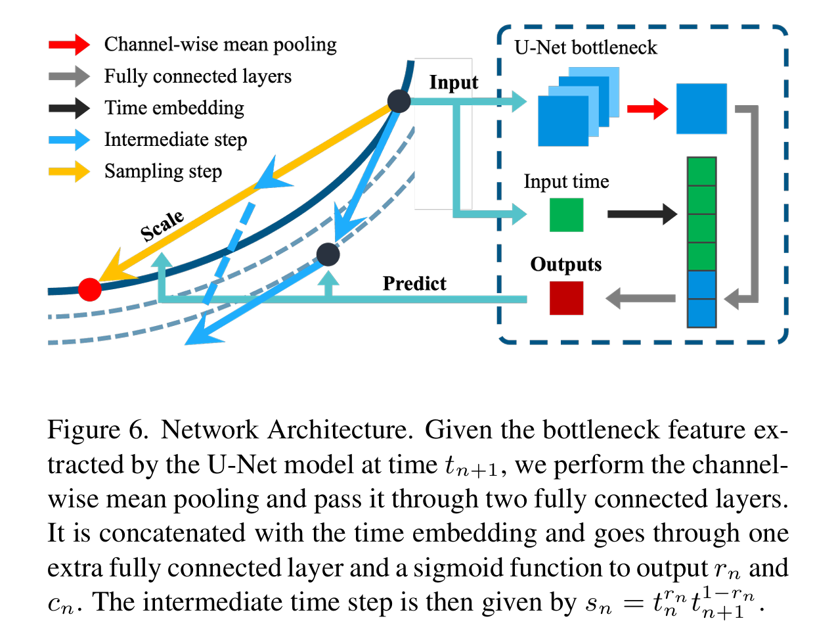

# Diffusion Solver

Before going to the deep details, let's check the preliminary in [Diffusion Unified Representation](../chapter7_diffusion/sde_diffusion_unified_representation.md)
## DPM solver

- paper: <https://arxiv.org/pdf/2206.00927>
- repo: <https://github.com/LuChengTHU/dpm-solver>
- author: 路橙（Cheng Lu）

  - 路橙现任 OpenAI 的技术成员，主要研究方向为大规模深度生成模型和强化学习算法。他于 2023 年 12 月在清华大学 TSAIL 团队获得计算机科学与技术博士学位，导师为朱军教授。在博士期间，他还与陈建飞和李崇轩密切合作。本科阶段，他于 2019 年 7 月获得清华大学计算机科学与技术学士学位。他的研究兴趣包括一致性模型、扩散模型、归一化流和能量基模型，以及它们在图像生成、3D 生成和强化学习中的应用。此外，他曾是清华大学合唱团的男低音歌手，并在 2019 年通过演唱著名爵士歌曲《Autumn Leaves》获得清华大学校园十大歌手比赛的冠军
- Key:
  - 提出 DPM-Solver，一种专门针对扩散常微分方程（ODEs）的高阶求解器，它通过解析计算线性部分并将解简化为神经网络的指数加权积分，大幅提升了Diffusion Probabilistic Models (DPMs) 的采样效率，在无需额外训练的情况下，将采样步骤减少至 10-20 次，并在多个数据集上实现 4× 至 16× 的加速。

Recall the Probability ODE

$$\tag{1}
\begin{aligned}
\frac{d x_t}{d t} &= f(t)x_t + \frac{g(t)^2}{2\sigma_t}\epsilon_\theta  \\
& = \frac{d \log \alpha_t}{dt} x_t + \left( \frac{\sigma_t d \log \sigma_t/\alpha_t}{dt} \right) \epsilon_\theta\\
& = \frac{d \log \alpha_t}{dt} x_t - \left( \frac{\sigma_t d \lambda_t}{2dt} \right) \epsilon_\theta\\
\end{aligned}
$$

Here $\lambda_t =\log \frac{\alpha_t^2}{\sigma_t^2}$ usually means the signal-to-noise ratio, SNR., is a monotanous decreasing function of t.

Here is our base ODE, we will use it to build our DPM Solver

值得注意的是  (1) is a semi-linear ODE, we can have a general solution formula

!!! thm "general solution of semi-linear ODE"

    The solution of (1) is of form

    $$\tag{2}
    \boxed{x_t=
    \exp\!\Bigl[\!\int_{s}^{t}f(\tau)\,d\tau\Bigr]\;x_s
    \;+\;
    \int_{s}^{t}
    \exp\!\Bigl[\!\int_{\tau}^{t}f(r)\,dr\Bigr]\,
    \frac{g^2(\tau)}{2\,\sigma_\tau}\,\epsilon_{\theta}\bigl(x_\tau,\tau\bigr)
    \,d\tau.}
    $$

!!! proof "proof of equation (2)"

    下面演示如何从

    $$
    \frac{dx}{dt}
    \;=\;
    f(t)\,x(t)
    \;+\;
    \frac{g^2(t)}{2\,\sigma_t}\,\epsilon_\theta\bigl(x(t),\,t\bigr),
    $$

    推导出所给的积分形式

    $$
    x_t
    \;=\;
    \exp\!\Bigl[\!\int_{s}^{\,t}f(\tau)\,d\tau\Bigr]\,
    x_s
    \;+\;
    \int_{s}^{t}
    \exp\!\Bigl[\!\int_{\tau}^{\,t}f(r)\,dr\Bigr]\,
    \frac{g^2(\tau)}{2\,\sigma_\tau}\,\epsilon_{\theta}\bigl(x_\tau,\tau\bigr)\,d\tau.
    $$

    为方便阅读，下文把 \(x(t)\) 在 \(t = s\) 时刻的值记为 \(x_s\)，在 \(t = t\) 时刻的值记为 \(x_t\)。

    #### 1. 写成一阶**线性**常微分方程

    原方程可视为

    $$
    x'(t) - f(t)\,x(t)
    \;=\;
    \frac{g^2(t)}{2\,\sigma_t}\,\epsilon_\theta\bigl(x(t),t\bigr).
    $$

    这是一个**非齐次一阶线性 ODE**，其中“非齐次项”为
    \(\tfrac{g^2(t)}{2\,\sigma_t}\,\epsilon_{\theta}\bigl(x(t),t\bigr)\)。

    #### 2. 乘以积分因子并取全导数

    **积分因子**(Integrating Factor) 取

    $$
    \mu(t)
    \;=\;
    \exp\!\Bigl[\,-\!\int_{s}^{\,t}f(u)\,du\Bigr].
    $$

    将上式两边同乘 \(\mu(t)\):

    $$
    \exp\!\Bigl(-\!\int_{s}^{\,t}f(u)\,du\Bigr)
    \,x'(t)
    \;-\;
    f(t)\,
    \exp\!\Bigl(-\!\int_{s}^{\,t}f(u)\,du\Bigr)\,
    x(t)
    \;=\;
    \exp\!\Bigl(-\!\int_{s}^{\,t}f(u)\,du\Bigr)\,
    \frac{g^2(t)}{2\,\sigma_t}\,\epsilon_\theta(x(t),t).
    $$

    左端恰好是对
    \(\displaystyle x(t)\,\mu(t)\)
    做时间导数的结果：

    $$
    \frac{d}{dt}
    \Bigl[
    x(t)\,
    \exp\!\Bigl(-\!\int_{s}^{\,t}f(u)\,du\Bigr)
    \Bigr].
    $$

    因此方程化为

    $$
    \frac{d}{dt}
    \Bigl[
    x(t)\,\mu(t)
    \Bigr]
    \;=\;
    \mu(t)\,\frac{g^2(t)}{2\,\sigma_t}\,\epsilon_\theta\bigl(x(t),t\bigr).
    $$

    #### 3. 在区间 \([s,t]\) 上积分

    对 \(t\) 从 \(s\) 到 \(t\) 积分：

    $$
    \bigl[\,
    x(\tau)\,\mu(\tau)
    \bigr]_{\,\tau=s}^{\,\tau=t}
    \;=\;
    \int_{s}^{t}
    \mu(\tau)\,\frac{g^2(\tau)}{2\,\sigma_\tau}\,\epsilon_\theta\bigl(x(\tau),\tau\bigr)
    \,d\tau.
    $$

    也就是

    $$
    x_t\,\mu(t)
    \;-\;
    x_s\,\mu(s)
    \;=\;
    \int_{s}^{t}
    \mu(\tau)\,
    \frac{g^2(\tau)}{2\,\sigma_\tau}\,
    \epsilon_\theta\bigl(x_\tau,\tau\bigr)\,d\tau.
    $$

    ##### 3.1. 代入

    $$\mu(s)=\exp\!\Bigl(-\!\int_{s}^{\,s} f(u)\,du\Bigr)=1$$

    显然 \(\int_{s}^{\,s}(\cdots)\,du=0\)，故 \(\mu(s)=e^0=1\)。因此

    $$
    x_t\,\mu(t)
    \;-\;
    x_s
    \;=\;
    \int_{s}^{t}
    \mu(\tau)\,
    \frac{g^2(\tau)}{2\,\sigma_\tau}\,
    \epsilon_\theta\bigl(x_\tau,\tau\bigr)\,d\tau.
    $$

    从而

    $$
    x_t\mu(t)=x_s+\int_{s}^{t}\mu(\tau)\frac{g^2(\tau)}{2\,\sigma_\tau}\epsilon_\theta\bigl(x_\tau,\tau\bigr)d\tau
    $$

    ##### 3.2. 还原 \(x_t\)

    回忆 \(\mu(t)=\exp\!\bigl[-\!\int_s^t f(u)\,du\bigr]\)，所以

    $$
    x_t= \exp\!\Bigl[\!\int_{s}^{\,t}f(u)\,du\Bigr]x_s+\int_{s}^{t}
    \exp\!\Bigl(\!\int_{s}^{\,t}f(u)\,du\Bigr)\,
    \mu(\tau)\,
    \frac{g^2(\tau)}{2\,\sigma_\tau}\,\epsilon_\theta(x_\tau,\tau)\,d\tau.
    $$

    但要注意，

    $$
    \exp\!\Bigl(\!\int_{s}^{\,t}f(u)\,du\Bigr)\,\mu(\tau)
    \;=\;
    \exp\!\Bigl(\!\int_{s}^{\,t}f(u)\,du\Bigr)
    \;\exp\!\Bigl(-\!\int_{s}^{\,\tau}f(u)\,du\Bigr),
    $$

    实际上我们更直接的做法是：分拆

    $$
    \int_{s}^{\,t}f(u)\,du
    \;=\;
    \int_{s}^{\,\tau}f(u)\,du
    \;+\;
    \int_{\tau}^{\,t}f(u)\,du,
    $$

    因而

    $$
    \exp\!\Bigl[\!\int_{s}^{\,t}f(u)\,du\Bigr]
    \;\exp\!\Bigl[-\!\int_{s}^{\,\tau}f(u)\,du\Bigr]
    \;=\;
    \exp\!\Bigl[\!\int_{\tau}^{\,t}f(u)\,du\Bigr].
    $$

    所以第二项在被乘以 \(\exp[\int_s^t f(u)\,du]\) 后，可以写成

    $$
    \int_{s}^{t}
    \exp\!\Bigl[\!\int_{\tau}^{\,t}f(r)\,dr\Bigr]\,
    \frac{g^2(\tau)}{2\,\sigma_\tau}\,\epsilon_\theta(x_\tau,\tau)
    \,d\tau.
    $$

    整理得到最后公式

    综上便得到了所需的积分形式解（在标准文献里也叫“Duhamel 原理”形式

    $$
    \boxed{x_t=
    \exp\!\Bigl[\!\int_{s}^{t}f(\tau)\,d\tau\Bigr]\;x_s
    \;+\;
    \int_{s}^{t}
    \exp\!\Bigl[\!\int_{\tau}^{t}f(r)\,dr\Bigr]\,
    \frac{g^2(\tau)}{2\,\sigma_\tau}\,\epsilon_{\theta}\bigl(x_\tau,\tau\bigr)
    \,d\tau.}
    $$

同时，我们带入方程(1), 得到

$$
x_t = \frac{\alpha_t}{\alpha_s} x_s -\frac{ \alpha_t }{2} \int_s^t \frac{d \lambda_\tau}{d\tau} \frac{\sigma_\tau}{\alpha_\tau} \epsilon_\theta\bigl(x_\tau,\tau\bigr)\,d\tau
$$

因为$\lambda_t$ 是单调递减的，它具有逆函数，然后我们进行变量替换

$$ t \rightarrow \lambda$$

我们有

$$d\lambda = \frac{d\lambda_t}{d t} dt$$

因此

!!! note "Exact Solution of Diffusion ODE"

    $$\tag{3}
    x_t =\frac{\alpha_t}{\alpha_s} x_s -\frac{ \alpha_t }{2} \int_{\lambda_s}^{\lambda_t} e^{-\frac{\lambda }{2}} \hat{\epsilon_\theta}\bigl(x_\lambda,t_\lambda\bigr)\,d\lambda
    $$

因此根据这个公式，我们可以得到线性部分的准确解，当然随机部分还是需要进行积分。但是它至少减少了一部分的误差项。同时我们也可以从另外一个角度理解，可以理解成 $\epsilon_\theta$ 的一个加权平均,而且是指数衰减的，$\lambda$ 越大，贡献越小。也就是$t$ 越大， $\lambda$ 越小，贡献越大.

### High Order Approximation

为了方便计算，接下来我们重新定义

$$\lambda_t = \log \frac{\alpha_t}{\sigma_t}$$

这样可以避免额外产生一个 $\frac{1}{2}$ 的系数影响。

对于第二项，忍让需要进行数值计算进行求解。为了得到高阶近似，可以用泰勒展开

它本质上是一个**“指数加权的泰勒展开”**，用来构造对

$$
\int_{\lambda_s}^{\lambda_t} e^{-\lambda}\,\hat{\epsilon}_\theta(\hat{x}_\lambda,\lambda)\,d\lambda
$$

的有限阶逼近，从而得到对\(x_t\)的相应展开。

#### 对\(\hat{\epsilon}_\theta(\hat{x}_\lambda,\lambda)\)做关于\(\lambda\)的泰勒展开

令\(\lambda_t>\lambda_s\)，并记\(h := \lambda_t - \lambda_s\)。将\(\hat{\epsilon}_\theta(\hat{x}_\lambda,\lambda)\)在\(\lambda=\lambda_s\)处展开到\(n\)阶，便有

$$
\hat{\epsilon}_\theta(\hat{x}_\lambda,\lambda)
\;=\;
\sum_{k=0}^n
\frac{(\lambda - \lambda_s)^k}{k!}\,
\hat{\epsilon}_\theta^{(k)}\bigl(\hat{x}_{\lambda_s}, \,\lambda_s\bigr)
\;+\;
O\bigl(h^{n+1}\bigr).
$$

这里\(\hat{\epsilon}_\theta^{(k)}\)表示对\(\lambda\)的第\(k\)阶导数；\(\hat{x}_{\lambda_s}\)指在\(\lambda_s\)处的相应状态(或近似)。

#### 将其带入\(\int e^{-\lambda}\,\hat{\epsilon}_\theta\,d\lambda\)并依次积分

把上述展开代入

$$\int_{\lambda_s}^{\lambda_t}e^{-\lambda}\,\hat{\epsilon}_\theta(\hat{x}_\lambda,\lambda)\,d\lambda$$

后，可将积分拆成一系列幂次项与\(e^{-\lambda}\)的乘积积分，再加上余项\(O(h^{n+2})\)。形式上类似

$$
\int_{\lambda_s}^{\lambda_t}
  e^{-\lambda}
  \sum_{k=0}^n
  \frac{(\lambda - \lambda_s)^k}{k!}\,
  \hat{\epsilon}_\theta^{(k)}(\cdot)
\,d\lambda
\;=\;
\sum_{k=0}^n
  \hat{\epsilon}_\theta^{(k)}(\cdot)
  \int_{0}^{h}
    e^{-\!(\lambda_s+\tau)}\,
    \frac{\tau^k}{k!}
  d\tau
\;+\;O(h^{n+2}).
$$

再根据具体问题(如文中方程 3.4)中的\(\sigma_t,\alpha_t\)等系数关系，将这些积分因子做适当整理，就得到

$$
\int_{\lambda_s}^{\lambda_t}
  e^{-\lambda}\,\hat{\epsilon}_\theta(\hat{x}_\lambda,\lambda)
\,d\lambda
\;=\;
\frac{\sigma_t}{\alpha_t}
\sum_{k=0}^n
h^{\,k+1}\,
\varphi_{k+1}(h)\,
\hat{\epsilon}_\theta^{(k)}\bigl(\hat{x}_{\lambda_s}, \,\lambda_s\bigr)
\;+\;
O\bigl(h^{n+2}\bigr),
$$

#### 定义\(\varphi_k\)函数以简化“指数‐多项式”积分

为了把

$$\displaystyle \int_0^h e^{-\!(\lambda_s+\tau)}\,\tau^k\,d\tau
$$

一类积分写得更紧凑，文中引入了一簇辅助函数\(\varphi_k(z)\)。它们满足某些初值与递推性质(见(B.2))，从而可得到闭形式，如

$$
\varphi_1(h)
= \frac{e^h - 1}{h},
\quad
\varphi_2(h)
= \frac{\,e^h - h - 1\,}{h^2},
\quad
\varphi_3(h)
= \frac{\,e^h - \tfrac{h^2}{2} - h - 1\,}{h^3},
$$

#### 得到\(x_t\)的展开

\(x_t\)由一项“齐次解”(\(\tfrac{\alpha_t}{\alpha_s}\,x_s\))和一项“非齐次积分”(\(\sigma_t\)-\(\alpha_t\)等系数乘上上面那个积分)组成。把对\(\hat{\epsilon}_\theta\)的近似积分结果带回去，即得到 (B.4) 处：

!!! note "High Order Expansion"

    $$\tag{4}
    x_t
    \;=\;
    \frac{\alpha_t}{\alpha_s}\,x_s
    \;-\;
    \sigma_t
    \sum_{k=0}^n
      h^{k+1}\,\varphi_{k+1}(h)\,
      \hat{\epsilon}_\theta^{(k)}\bigl(\hat{x}_{\lambda_s},\,\lambda_s\bigr)
    \;+\;
    O\bigl(h^{n+2}\bigr).
    $$

由此便构成了对方程(3)解的一个**有限阶逼近**。

下面给出文中式 (4)

$$
x_{t}
\;=\;
\frac{\alpha_{t}}{\alpha_{s}}\;x_{s}
\;-\;
\sigma_{t}
\sum_{k=0}^{n}
  h^{k+1}\,\varphi_{k+1}(h)\,
  \hat{\epsilon}_{\theta}^{(k)}\bigl(\hat{x}_{\lambda_{s}},\,\lambda_{s}\bigr)
\;+\;
O\bigl(h^{n+2}\bigr),
\quad
\text{其中 }h=\lambda_{t}-\lambda_{s},
$$

在 \(n=0,1,2\) 三种截断下的**显式形式**。这里

$$
\varphi_{1}(h) \;=\; \frac{e^{h}-1}{h},
\quad
\varphi_{2}(h) \;=\; \frac{\,e^{h}-h-1\,}{h^{2}},
\quad
\varphi_{3}(h) \;=\; \frac{\,e^{h}-\tfrac{h^{2}}{2}-h-1\,}{h^{3}},
$$

以及\(\hat{\epsilon}_{\theta}^{(k)}\) 表示 \(\lambda\) 的 \(k\) 阶导数在 \(\lambda=\lambda_s\) 处的值。

##### \(n=0\) 截断

只保留 \(k=0\) 项，则

$$
x_{t}
\;=\;
\frac{\alpha_{t}}{\alpha_{s}}\;x_{s}
\;-\;
\sigma_{t}
\Bigl[
  h^{1}\,\varphi_{1}(h)\,\hat{\epsilon}_{\theta}^{(0)}
\Bigr]
\;+\;
O\bigl(h^{2}\bigr).
$$

因为 \(\hat{\epsilon}_{\theta}^{(0)}=\hat{\epsilon}_{\theta}\bigl(\hat{x}_{\lambda_s},\lambda_s\bigr)\) 且
\(\,h\,\varphi_{1}(h)=e^{h}-1,\)
故

$$
\boxed{
x_{t}
\;=\;
\frac{\alpha_{t}}{\alpha_{s}}\;x_{s}
\;-\;
\sigma_{t}\,\Bigl(e^{h}-1\Bigr)\,\hat{\epsilon}_{\theta}\bigl(\hat{x}_{\lambda_s},\,\lambda_{s}\bigr)
\;+\;
O\bigl(h^{2}\bigr).
}
$$

##### \(n=1\) 截断

此时求和到 \(k=1\)，即包含 \(k=0\) 和 \(k=1\) 两项：

$$
x_{t}=\frac{\alpha_{t}}{\alpha_{s}}\;x_{s}
\;-\;
\sigma_{t}
\Bigl[
  h\,\varphi_{1}(h)\,\hat{\epsilon}_{\theta}^{(0)}
  \;+\;
  h^{2}\,\varphi_{2}(h)\,\hat{\epsilon}_{\theta}^{(1)}
\Bigr]
+\;
O\bigl(h^{3}\bigr).
$$

再将

$$
h\,\varphi_{1}(h)
= e^{h}-1,
\quad
h^{2}\,\varphi_{2}(h)
= e^{h}-h-1
$$

代回，则

$$
\boxed{
x_{t}
=\;
\frac{\alpha_{t}}{\alpha_{s}}\;x_{s}
\;-\;
\sigma_{t}
\Bigl[
  \bigl(e^{h}-1\bigr)\,
  \hat{\epsilon}_{\theta}^{(0)}
  \;+\;
  \bigl(e^{h}-h-1\bigr)\,
  \hat{\epsilon}_{\theta}^{(1)}
\Bigr]
\;+\;
O\bigl(h^{3}\bigr),
}
$$

其中

$$\hat{\epsilon}_{\theta}^{(1)}=\dfrac{d}{d\lambda}\hat{\epsilon}_{\theta}\bigl(\hat{x}_{\lambda},\lambda\bigr)\big|_{\lambda=\lambda_s}$$

###### \(n=2\) 截断

保留到 \(k=2\)，即 \(k=0,1,2\):

$$
x_{t}=\frac{\alpha_{t}}{\alpha_{s}}\;x_{s}\;-\;\sigma_{t}
\Bigl[
  h\,\varphi_{1}(h)\,\hat{\epsilon}_{\theta}^{(0)}
  \;+\;
  h^{2}\,\varphi_{2}(h)\,\hat{\epsilon}_{\theta}^{(1)}
  \;+\;
  h^{3}\,\varphi_{3}(h)\,\hat{\epsilon}_{\theta}^{(2)}
\Bigr]+\;O\bigl(h^{4}\bigr).
$$

再利用

$$
h^{3}\,\varphi_{3}(h)
= e^{h}\;-\;\frac{h^{2}}{2}\;-\;h\;-\;1,
$$

可写成

$$
\boxed{x_{t}=\;\frac{\alpha_{t}}{\alpha_{s}}\;x_{s}\;-\;\sigma_{t}\Bigl[
  \bigl(e^{h}-1\bigr)\,\hat{\epsilon}_{\theta}^{(0)}
  \;+\;
  \bigl(e^{h}-h-1\bigr)\,\hat{\epsilon}_{\theta}^{(1)}
  \;+\;
  \Bigl(e^{h}-\tfrac{h^{2}}{2}-h-1\Bigr)\,\hat{\epsilon}_{\theta}^{(2)}
\Bigr]\;+\;O\bigl(h^{4}\bigr).}
$$

但是真实情况下，我们并不能直接求高阶导数，而是用数值方法来近似计算。 当然从上面的公式我们可以直接得到二阶截断误差的数值方法。
### DPM Solver 1

$$
\begin{aligned}
x_{t} &= \frac{\alpha_t}{\alpha_s}x_s - \sigma_t1 (e^{h_t}-1)\epsilon_\theta(x_s,t_s)\\
    &= \frac{\alpha_t}{\alpha_s}x_s  - \alpha_t \left[ \frac{\sigma_s}{\alpha_s} - \frac{\sigma_t}{\alpha_t} \right] \epsilon_\theta(x_s,s)
\end{aligned}
$$

where

$$h_t=\lambda_t - \lambda_s =\log \frac{\alpha_t}{\sigma_t} - \log\frac{\alpha_s}{\sigma_s}$$

This formula is identical to the DDIM solution.

### DPM Solver 2
理论上来说， $n=1$的情况下，DPM solver 和ODE里的中点法是一模一样的，只是要对解析的线性部分单独处理。

我们先来看看中点法

#### 中点法

考虑常微分方程

$$
y'(t) = f(t, y(t)),\quad y(t_0)=y_0,
$$

其中点（midpoint）方法为

!!! note "中点法"

    $$
    y_{n+1} = y_n + h\,f\Big(t_n+\frac{h}{2},\,y_n+\frac{h}{2}\,f(t_n,y_n)\Big).
    $$

下面给出推导该方法局部截断误差阶数的过程。

##### 精确解的Taylor展开

对精确解\( y(t) \)在\( t=t_n \)处做Taylor展开，有

$$
y(t_n+h) = y(t_n) + h\,y'(t_n) + \frac{h^2}{2}\,y''(t_n) + \frac{h^3}{6}\,y'''(t_n) + O(h^4).
$$

注意到由于\( y'(t_n) = f(t_n, y(t_n)) \)且

$$
y''(t_n) = \frac{d}{dt}y'(t_n)=\frac{\partial f}{\partial t}(t_n, y(t_n)) + \frac{\partial f}{\partial y}(t_n, y(t_n))\,y'(t_n),
$$

我们有

$$
y(t_n+h) = y(t_n) + h\,f(t_n,y(t_n)) + \frac{h^2}{2}\Big[f_t(t_n,y(t_n)) + f_y(t_n,y(t_n))\,f(t_n,y(t_n))\Big] + O(h^3).
$$

##### 数值格式的展开

中点方法给出

$$
y_{n+1} = y_n + h\,f\left(t_n+\frac{h}{2},\,y_n+\frac{h}{2}\,f(t_n,y_n)\right).
$$

我们希望比较\( y_{n+1} \)与精确解\( y(t_n+h) \)的差异。首先对函数

$$
F(h)= f\left(t_n+\frac{h}{2},\,y_n+\frac{h}{2}\,f(t_n,y_n)\right)
$$

在\( h=0 \)处做Taylor展开。记 \( y_n = y(t_n) \) 且 \( f(t_n,y_n) = y'(t_n) \)，于是有

$$
\begin{aligned}
F(h) &= f\Big(t_n+\frac{h}{2},\,y(t_n)+\frac{h}{2}\,y'(t_n)\Big)\\
&= f(t_n,y(t_n)) + \frac{h}{2}\,f_t(t_n,y(t_n)) + \frac{h}{2}\,f_y(t_n,y(t_n))\,y'(t_n) + O(h^2)\\
&= f(t_n,y(t_n)) + \frac{h}{2}\Big[f_t(t_n,y(t_n)) + f_y(t_n,y(t_n))\,f(t_n,y(t_n))\Big] + O(h^2).
\end{aligned}
$$

代入中点方法表达式，有

$$
\begin{aligned}
y_{n+1} &= y(t_n) + h\,F(h)\\
&= y(t_n) + h\,f(t_n,y(t_n)) +\\
&\qquad \frac{h^2}{2}\Big[f_t(t_n,y(t_n)) + f_y(t_n,y(t_n))\,f(t_n,y(t_n))\Big] + O(h^3).
\end{aligned}
$$

##### 误差阶数分析

将精确解的Taylor展开与中点方法的展开对比：

- 精确解：

  $$
  y(t_n+h) = y(t_n) + h\,f(t_n,y(t_n)) + \frac{h^2}{2}\Big[f_t(t_n,y(t_n)) + f_y(t_n,y(t_n))\,f(t_n,y(t_n))\Big] + O(h^3).
  $$

- 数值解（中点方法）：

  $$
  y_{n+1} = y(t_n) + h\,f(t_n,y(t_n)) + \frac{h^2}{2}\Big[f_t(t_n,y(t_n)) + f_y(t_n,y(t_n))\,f(t_n,y(t_n))\Big] + O(h^3).
  $$

两者在前\( h^2 \)项完全一致，因此局部截断误差（local truncation error）为\( O(h^3) \)。由于全局误差通常比局部截断误差低一个阶数，所以全局误差为\( O(h^2) \)。

终点法也属于一种龙格库塔方法。

这里面我们并不能直接利用Runge Kutta, 因为线性部分是能计算的，所以要对龙格库塔方法做一定的适用性改进。

### DPM Solver 3

假设当前的为$x(\lambda)$, $\lambda$为自变量，$h$ 为步长。$r_1$ 和 $r_2$类似于龙格库塔方法中的系数。在本文中取值
为\( r_1 = \frac{1}{3},\,r_2 = \frac{1}{3} \).

我们从$\lambda$ 的角度重写DPM Solver-3 的迭代公式, 让它看起来更加清晰。

1. **第一阶段**

$$
\begin{aligned}
\hat{x}_{\lambda + r_1h}&\;=\;\frac{\alpha_{s_{\lambda + r_1 h}}}{\alpha_\lambda}\;x(\lambda)\;-\;
\sigma_{s_{\lambda + r_1 h}}\,\bigl(e^{\,r_1 h} - 1\bigr)\,\epsilon_\theta\bigl(x(\lambda),\,\lambda\bigr),\\
\hat{D}_1&=\frac{1}{r_1 h}\Bigl[\epsilon_\theta(\hat{x}_{\lambda + r_1h},\lambda + r_1 h) - \epsilon_\theta(x(\lambda),\lambda)\Bigr].
\end{aligned}
$$

1. **第二阶段**

$$
\begin{aligned}
\hat{x}_{\lambda + r_2 h}& = \frac{\alpha_{\lambda + r_2 h}}{\alpha_\lambda}\;x(\lambda)-\sigma_{s_{\lambda + r_2 h}}  \bigl(e^{\,r_2 h} - 1\bigr)\epsilon_\theta\bigl(x(\lambda),\,\lambda\bigr) -
\sigma_{s_{\lambda + r_2 h}}\,\bigl(e^{\,r_2 h} - r_2 h - 1\bigr)\hat{D}_1\\
\hat{D}_2 &=\frac{1}{r_2\,h}\Bigl[\epsilon_\theta(\hat{x}_{\lambda + r_2 h},\lambda + r_2 h) - \epsilon_\theta(x(\lambda),\lambda)\Bigr].
\end{aligned}
$$

1. **最终更新**

$$
x(\lambda + h)=\frac{\alpha_{\lambda + h}}{\alpha_{\lambda}}\;x(\lambda)- \sigma_{\lambda + h}\,\bigl(e^{\,h} - 1\bigr)\,\epsilon_\theta\bigl(x(\lambda),\lambda\bigr) - \sigma_{\lambda + h}\,\bigl(e^{\,h} -h- 1\bigr)\hat{D}_2.
$$

这里 我们可以把 $\hat{D}_1$ 和 $\hat{D}_2$ 看作是差分项，也就是

$$ \hat{D}_1 \approx  \frac{d}{d \lambda } \left[\epsilon_\theta(x(\lambda),\lambda) \right]_{\lambda = \lambda + r_1 h}$$

$$ \hat{D}_2 \approx  \frac{d}{d \lambda } \left[\epsilon_\theta(x(\lambda),\lambda) \right]_{\lambda = \lambda + r_2 h}$$

我们重新回顾一下泰勒展开

$$
\boxed{x_{t}=\;\frac{\alpha_{t}}{\alpha_{s}}\;x_{s}\;-\;\sigma_{t}\Bigl[
  \bigl(e^{h}-1\bigr)\,\hat{\epsilon}_{\theta}^{(0)}
  \;+\;
  \bigl(e^{h}-h-1\bigr)\,\hat{\epsilon}_{\theta}^{(1)}
  \;+\;
  \Bigl(e^{h}-\tfrac{h^{2}}{2}-h-1\Bigr)\,\hat{\epsilon}_{\theta}^{(2)}
\Bigr]\;+\;O\bigl(h^{4}\bigr).}
$$

从这个公式可以直观看到 $\hat{x}_{\lambda + r_1h}$ 是一阶展开，$\hat{x}_{\lambda + r_2h}$, 和 $\hat{x}_{\lambda + h}$ 都是二阶展开。

那么 $\hat{x}_{\lambda + r_1h}$ 的局部截断误差应该是 $O(h^2)$, 同理因为 $\hat{x}_{\lambda + r_2h}$的局部阶段误差是$O(h^3)$。虽然按找泰莱展开,
$\hat{x}_{\lambda + h}$ 也是 $o(h^3)$。 但是它可以背证明是 $O(h^4)$。这个是不太直观理解的。

要具体证明局部4阶误差，需要进行泰勒展开进一步证明.
## DPM Solver++

- author:
  - Cheng Lu†
  - Yuhao Zhou†
  - Fan Bao†
  - Jianfei Chen†∗
  - Chongxuan Li‡
  - Jun Zhu
- year: 2023 May
- THU

这篇文章主要解决的问题是高阶ODE求解器在**条件噪声预测**过程中的不稳定性。

**第一个挑战** 是 **较大的引导尺度（guidance scale）会导致高阶求解器的不稳定性**。如图 1 所示，在引导尺度 **s = 8.0** 且使用 **15 次函数评估** 的情况下，现有的高阶扩散 ODE 求解器（Lu et al., 2022；Zhang & Chen, 2022；Liu et al., 2022b）生成的图像质量较差，甚至比一阶 DDIM 更差。此外，随着求解器阶数的提高，生成样本的质量会进一步下降。

直观来看，较大的引导尺度可能会放大模型 **\(\tilde{\theta}\)** 在方程 (5) 中的输出和导数。而模型的导数会影响 ODE 求解器的收敛范围，放大的导数可能导致高阶求解器需要 **更小的步长** 才能收敛，因此高阶求解器的性能可能比一阶求解器更差。此外，高阶求解器依赖 **高阶导数**，而这些导数通常对放大效应更敏感，从而进一步缩小了收敛半径。

**第二个挑战** 是 **“训练-测试不匹配”（train-test mismatch）问题**（Saharia et al., 2022b）。数据通常位于一个 **有限区间** 内（例如图像数据在 \([-1, 1]\) 范围内）。然而，当引导尺度较大时，条件噪声预测模型 **\(\tilde{\theta}(x_t, t, c)\)** 会被推离真实噪声，这会导致最终收敛的解 **\(x_0\)** 超出数据的原始范围。在这种情况下，生成的图像会出现 **饱和（saturation）** 和 **不自然（unnatural）** 的问题（Saharia et al., 2022b）。

参考 [diffusion guidance](./sde_diffusion_guidance.md) 理解classifier free的逆向过程. 我们这里直接写出classifier free的逆向过程公式

该公式定义了**无分类器引导（Classifier-Free Guidance）**中用于**扩散概率模型（DPMs）**的**引导噪声预测模型** \(\tilde{\epsilon}_\theta(x_t, t, c)\)：

$$
\tilde{\epsilon}_\theta(x_t, t, c) := s \cdot \epsilon_\theta(x_t, t, c) + (1 - s) \cdot \epsilon_\theta(x_t, t, \varnothing).
$$

- 公式解释

  - \( x_t \)：时间 \( t \) 时刻的噪声潜变量。
  - \( c \)：条件信息（例如，在文本生成图像任务中，\( c \) 可能是文本提示）。
  - \( \varnothing \)：一个特殊占位符，表示**无条件模型**（即不使用条件信息）。
  - \( \epsilon_\theta(x_t, t, c) \)：模型在**条件信息 \( c \)** 下预测的噪声。
  - \( \epsilon_\theta(x_t, t, \varnothing) \)：**无条件模型**（不依赖 \( c \)）预测的噪声。
  - \( s \)：**引导尺度（guidance scale）**，用于控制条件模型对最终输出的影响程度。

- 直观理解

  该公式对**条件噪声预测**和**无条件噪声预测**进行**线性插值**。

  - 当 \( s = 1 \) 时，模型完全依赖条件信息进行预测。
  - 当 \( s > 1 \) 时，条件信息的影响被**放大**，可以提高生成质量，但如果 \( s \) 过大，可能会导致图像出现伪影（artifact）或不自然的结果。

为了增加ODE求解器对条件生成的稳定性，我们把预测噪声转为预测去噪后的图像，相对于噪声，去噪后的图像明显更加稳定。

我们重写Probability FLOW ODE 方程

$$ \frac{d x}{d t} = f(t) x + \frac{g^2(t)}{2\sigma_t}\epsilon_\theta (x,t), x_{T} \sim N(0, \sigma^2 I )$$

首先我们有

$$ x_t =\alpha_t x_0 + \sigma_t \epsilon$$

将 $\epsilon_\theta$ 替换为 $x_0$, 并且我们用$x_\theta$ 表示预测后的去噪图像， 我们可以得到

$$
\frac{\mathrm{d}x_t}{\mathrm{d}t}
\;=\;
\Bigl(f(t)\;+\;\tfrac{g^2(t)}{2\,\sigma_t^2}\Bigr)\,x_t
\;-\;\alpha_t\,\tfrac{g^2(t)}{2\,\sigma_t^2}\,x_{\theta}(x_t, t),
\quad
x_T \sim \mathcal{N}\bigl(0,\,\sigma^2 I\bigr).
$$

其中，系数：

$$
f(t) \;=\; \frac{\mathrm{d}\,\log \alpha_t}{\mathrm{d}t},
\quad
g^2(t) \;=\; \frac{\mathrm{d}\,\sigma_t^2}{\mathrm{d}t},
\quad
\sigma_t^2 \;\text{与}\;\alpha_t \;\text{的关系视具体调度而定。}
$$

类似于DPM solver, 我们对先行部分就行求解，得到

!!! note "ODE solution w.r.t $x_\theta$"

    $$
    x_t
    \;=\;
    \frac{\sigma_t}{\sigma_s}\,x_s
    \;+\;
    \alpha_t
    \int_{\lambda_s}^{\lambda_t}
    e^{\lambda}\,x_\theta\bigl(x_\lambda, \lambda\bigr)\,\mathrm{d}\lambda.
    $$

我们可以对它求导就行验证

$$
\begin{aligned}
\frac{\mathrm{d}x_t}{\mathrm{d}t}
&= \frac{\mathrm{d}x_s}{\mathrm{d}s}\,x_s
 \;+\; \frac{\mathrm{d}\lambda_s}{\mathrm{d}s}
      \int_{\lambda_s}^{\lambda_t}
         e^{\lambda}\,x_\theta\bigl(x,\lambda\bigr)\,\mathrm{d}\lambda
 \;+\; \frac{\mathrm{d}\lambda_t}{\mathrm{d}t}\,\sigma_t\,e^{\lambda_t}\,x_\theta\bigl(x_t,\lambda_t\bigr)
\\
&= \Bigl(f(t) \;+\; \tfrac{g^2(t)}{2\,\sigma_t^2}\Bigr)\,x_t
 \;-\; \alpha_t \,\tfrac{g^2(t)}{2\,\sigma_t^2}\,x_\theta\bigl(x_t,t\bigr).
\end{aligned}
$$

类似于SDK Solver, 我们进行泰勒展开，然后一阶或者二阶近似来做数值逼近。

!!! note "泰勒展开"

    $$
    \tilde{x}_{t} = \frac{\sigma_{t}}{\sigma_{s}} \tilde{x}_{s} + \sigma_{t} \sum_{n=0}^{k-1} x_{\theta}^{(n)} (\hat{x}_{s}, s) \int_{s}^{t} e^{\lambda} \frac{(\lambda - s)^n}{n!} d\lambda + O(h^{k+1}),
    $$

其中：

- \(\tilde{x}_{t}\) 是在时间 \(t\) 的估计值。

- \(\sigma_{t}\) 和 \(\sigma_{s}\) 是与时间相关的系数。

- \(x_{\theta}^{(n)}\) 是模型在 \(\hat{x}_{s}\) 和 \(s\) 处的第 \(n\) 阶导数。

- 积分项 \(\int_{s}^{t} e^{\lambda} \frac{(\lambda - s)^n}{n!} d\lambda\) 是用于近似高阶项的数值积分。

- \(O(h^{k+1})\) 表示高阶误差项，其中 \(h = t - s\) 是时间步长。

我们将对积分项求解，可以得到$k=1,2$时候的具体表达式

### 当 \(k=1\) 时

只保留 \(n=0\) 项，故有

$$
\sum_{n=0}^{0}
x_\theta^{(0)}\bigl(x_s,\,\lambda_s\bigr)
\int_{\lambda_s}^{\lambda_t}
e^\lambda\,\mathrm{d}\lambda
\;=\;
x_\theta^{(0)}\bigl(x_s,\,\lambda_s\bigr)
\bigl[\,
e^\lambda
\bigr]_{\lambda_s}^{\lambda_t}
\;=\;
x_\theta^{(0)}\bigl(x_s,\,\lambda_s\bigr)\,
\bigl(e^{\lambda_t} - e^{\lambda_s}\bigr).
$$

因此，一阶截断下的数值解为

!!! note "一阶展开"

    $$
    \begin{aligned}
    \tilde{x}_t
    &\;=\;
    \frac{\sigma_t}{\sigma_s}\,x_s
    \;+\;
    \sigma_t\,
    x_\theta\bigl(x_s,\,\lambda_s\bigr)\,
    \bigl(e^{\lambda_t} - e^{\lambda_s}\bigr)
    \;+\;
    O\bigl(h^2\bigr).\\
    & = \frac{\sigma_t}{\sigma_s}x_s - \alpha_t \bigl(e^{-h}-1 \bigr) x_\theta(x_s, \lambda_s) + O(h^2)
    \end{aligned}
    $$

### 当 \(k=2\) 时

保留 \(n=0\) 和 \(n=1\) 两项：

$$
\sum_{n=0}^{1}
x_\theta^{(n)}\bigl(x_s,\;\lambda_s\bigr)
\int_{\lambda_s}^{\lambda_t}
e^\lambda\,
\frac{\bigl(\lambda-\lambda_s\bigr)^n}{n!}
\,\mathrm{d}\lambda
\;=\;
\underbrace{
x_\theta^{(0)}(\cdot)\!\int e^\lambda \,\mathrm{d}\lambda
}_{n=0}
\;+\;
\underbrace{
x_\theta^{(1)}(\cdot)\!\int e^\lambda\,(\lambda-\lambda_s)\,\mathrm{d}\lambda
}_{n=1}.
$$

#### \(n=0\) 项

与上面 \(k=1\) 情形相同：

$$
x_\theta^{(0)}\bigl(x_s, \lambda_s\bigr)
\int_{\lambda_s}^{\lambda_t}
e^\lambda\,\mathrm{d}\lambda
\;=\;
x_\theta^{(0)}(\cdot)\,\bigl(e^{\lambda_t} - e^{\lambda_s}\bigr).
$$

#### \(n=1\) 项

$$
x_\theta^{(1)}\bigl(x_s, \lambda_s\bigr)
\int_{\lambda_s}^{\lambda_t}
e^\lambda\,(\lambda - \lambda_s)\,\mathrm{d}\lambda.
$$

计算该积分：

$$
\int e^\lambda\,(\lambda - a)\,\mathrm{d}\lambda
\;=\;
e^\lambda(\lambda - a) - \int e^\lambda\,\mathrm{d}\lambda
\;=\;
e^\lambda\bigl(\lambda - a - 1\bigr) + C.
$$

令 \(a = \lambda_s\)，则

$$
\int_{\lambda_s}^{\lambda_t}
e^\lambda\,(\lambda - \lambda_s)\,\mathrm{d}\lambda
\;=\;
\Bigl[
  e^\lambda\bigl(\lambda - \lambda_s - 1\bigr)
\Bigr]_{\lambda_s}^{\lambda_t}
\;=\;
e^{\lambda_t}\bigl((\lambda_t - \lambda_s) - 1\bigr)
\;-\;
e^{\lambda_s}\bigl((\lambda_s - \lambda_s) - 1\bigr)
\;=\;
e^{\lambda_t}\bigl(h - 1\bigr)
\;+\;
e^{\lambda_s}.
$$

其中 \(h = \lambda_t - \lambda_s\)。
于是该项为

$$
x_\theta^{(1)}\bigl(x_s, \lambda_s\bigr)
\Bigl\{
  e^{\lambda_t}(h - 1)
  \;+\;
  e^{\lambda_s}
\Bigr\}.
$$

#### 合并后得到二阶截断

$$
\tilde{x}_t
\;=\;
\frac{\sigma_t}{\sigma_s}\,x_s
\;+\;
\sigma_t
\Bigl[
  x_\theta^{(0)}\bigl(x_s,\;\lambda_s\bigr)\,\bigl(e^{\lambda_t} - e^{\lambda_s}\bigr)
  \;+\;
  x_\theta^{(1)}\bigl(x_s,\;\lambda_s\bigr)\,\Bigl(e^{\lambda_t}(h - 1) \;+\; e^{\lambda_s}\Bigr)
\Bigr]
\;+\;
O\bigl(h^3\bigr).
$$

- **\(k=1\)**：只保留对 \(x_\theta^{(0)}\) 的积分项，近似精度为 \(O(h^2)\)。
- **\(k=2\)**：额外引入 \(x_\theta^{(1)}\) 的贡献，近似精度提升至 \(O(h^3)\)。
- 更高阶时，会继续出现 \(\bigl(\lambda-\lambda_s\bigr)^n\) 的积分及 \(x_\theta^{(n)}\) 项，从而得到更高精度的数值逼近。

### 数值算法

对于 DPM-Solve++(2S), 每一步迭代需要一个中间步来做更高阶的近似。

DPM-Solver++(2S) 的原理就是把一个时间步拆成两次更新，通过在中间时刻和终点时刻分别评估 $x_0$并做二阶组合，来近似求解逆向 ODE。

给定已知的“状态” \(\tilde{x}_s\)（在时刻 \(s\))，我们要在一步内近似求解 \(\tilde{x}_t\)（在时刻 \(t\))。DPM-Solver++(2S) 将区间 \([s,t]\) 拆成两个子步：\([s,u]\) 和 \([u,t]\)。其更新公式可写成以下三步：

1. **第一子步：从 \(s\) 到 \(u\)**

   $$
   \tilde{x}_u
   \;=\;
   \frac{\sigma_u}{\sigma_s}\,\tilde{x}_s
   \;-\;
   \alpha_u\,\bigl(\,e^{-\,r\,h} \;-\; 1\bigr)\,
   x_0\!\bigl(\tilde{x}_s,\;s\bigr).
   $$

   - 直观上，这一步先对 \(\tilde{x}_s\) 做一个按系数 \(\sigma_u / \sigma_s\) 的缩放，然后根据数据预测 \(x_0(\tilde{x}_s,s)\) 做“去噪修正”。
   - 指数项 \(e^{-\,r\,h}\) 体现了在对数信噪比坐标下的退火过程。

2. **合并项 \(D\)**
   在第二子步之前，我们先构造一个综合漂移项 \(D\)，结合了时刻 \(s\) 与中间时刻 \(u\) 上对数据预测的评估：

   $$
   D
   \;=\;
   \Bigl[
     \tfrac{1}{2\,r}\,x_0\bigl(\tilde{x}_s,\,s\bigr)
     \;+\;
     \tfrac{1}{2\,(1-r)}\,x_0\bigl(\tilde{x}_u,\,u\bigr)
   \Bigr]
   \,\bigl(e^{-\,h} \;-\; 1\bigr).
   $$

   这一步类似二阶 Runge–Kutta 方法，会用“初值处”与“中间处”两次对 \(x_0\) 的采样，以提升整体精度。

3. **第二子步：从 \(u\) 到 \(t\)**
   将区间剩余部分的演化合并到一个公式里：

   $$
   \tilde{x}_t
   \;=\;
   e^{-\,h}\,\tilde{x}_s
   \;+\;
   D.
   $$

   最终得到在时刻 \(t\) 的状态 \(\tilde{x}_t\)。

$$
\boxed{\begin{aligned}
&1)\quad
\tilde{x}_u
\;=\;
\frac{\sigma_u}{\sigma_s}\,\tilde{x}_s
\;-\;
\alpha_u\,\bigl(e^{-\,r\,h} \;-\; 1\bigr)\,
x_0\bigl(\tilde{x}_s,\;s\bigr),
\\
&2)\quad
D
\;=\;
\Bigl[
  \tfrac{1}{2\,r}\,x_0\bigl(\tilde{x}_s,\;s\bigr)
  \;+\;
  \tfrac{1}{2\,(1-r)}\,x_0\bigl(\tilde{x}_u,\;u\bigr)
\Bigr]\,
\bigl(e^{-\,h} - 1\bigr),
\\
&3)\quad
\tilde{x}_t
\;=\;
e^{-\,h}\,\tilde{x}_s\;+\;D.\end{aligned}}
$$

其中 \(h = \lambda_t - \lambda_s\)，\(u = s + r\,(t - s)\)。只需一次“子步 + 修正”即可从 \(s\) 前进到 \(t\)。

而DPM Solver++(2M)则是利用上一步的步骤来近似中间步,从而节省计算量，使得每次只需要进行一侧forward.

$D$ 可以看作是一个插值，因为这个中间点在$t-$的前面，从而导致系数为负。

## AMED Solver

- paper: <https://openaccess.thecvf.com/content/CVPR2024/papers/Zhou_Fast_ODE-based_Sampling_for_Diffusion_Models_in_Around_5_Steps_CVPR_2024_paper.pdf>
- institute: 浙江大学区块链与数据安全国家重点实验室
- year: CVPR 2024
- code: <https://github.com/zjupi/diff-sampler>.

### Observation

- based on the geometric observation that each sampling trajectory almost lies in a two-dimensional subspace
- 目前的加速采样的方式分成两张
  1. 告诉数值ODE求解器，又进一步分成两种: single step and multiple step。 单步求解器只用当前步的信息，多步求解器使用历史信息。
  2. 蒸馏方法。蒸馏也需要大量数据

### 核心设计详解：AMED-Solver与AMED-Plugin

#### 几何洞察：采样轨迹的低维性
**关键观察**：扩散模型的采样轨迹在高维空间中近似位于二维子空间。

- **实验验证**：对多个数据集（如CIFAR-10、ImageNet）的采样轨迹进行PCA分析，发现前两个主成分可解释大部分方差（投影误差<8%）。
- **理论意义**：轨迹的低维性意味着复杂的高维动态可简化为二维平面内的方向调整，为设计高效求解器提供基础。

**对设计的影响**：

- 梯度方向可在低维空间内高效逼近，减少计算复杂度。
- 均值定理（Mean Value Theorem）的向量扩展成为可能，允许通过单一中间时间步的梯度近似积分路径。

#### AMED-Solver的设计原理
一般的， 扩散模型的SDE 为

$$dx  = f(x,t) dt + g(t) d w_t$$

它对应的 probability flow ODE 为

$$ dx = [f(x,t) - \frac{1}{2}g^2(t) \nabla_x \log p_t(x)]dt $$

现在考虑EDM 方法，也就是 $f(x,t) = 0$ $g(t) = \sqrt{2t}$, $\sigma(t) = t$, 在高斯noise condition 的条件下， 我们可以得到

$$s_\theta = \nabla_x \log p_t(x|x_0)=- \frac{\epsilon_\theta(x,t)}{t}$$

我们得到最终的PF-ODE

$$ dx = \epsilon_\theta(x,t) dt $$

逆采样的时候，选在 $x_{t_N}\sim N(0,T^2 I)$.

**目标**：通过预测中间时间步\(s_n\)和缩放因子\(c_n\)，直接学习最优梯度方向，最小化离散化误差。

**数学推导**：

- **ODE积分形式**：从时间步\(t_{n+1}\)到\(t_n\)的解为：

  $$
  x_{t_n} = x_{t_{n+1}} + \int_{t_{n+1}}^{t_n} \epsilon_\theta(x_t, t) dt
  $$

- **均值方向近似**：假设存在中间时间步\(s_n \in (t_n, t_{n+1})\)和缩放因子\(c_n\)，使得：
  

  $$
  \epsilon_\theta(x_{s_n}, s_n) \approx \frac{c_n}{t_n - t_{n+1}} \int_{t_{n+1}}^{t_n} \epsilon_\theta(x_t, t) dt
  $$

  从而近似解为：

  $$
  \tag{b}
  x_{t_n} \approx x_{t_{n+1}} + c_n (t_n - t_{n+1}) \epsilon_\theta(x_{s_n}, s_n)
  $$

!!! note "理论基础"
    不能证明函数的值域在二维空间里 中值定理还能成立，如果不能成立，那么这个算法的理论基础是不成立的。

**AMED predictor的设计**：

Given samples $y_{t_n}, y_{t_{n+1}}$ on the teacher trajectory and $x_{t_{n+1}}$ on the student trajectory, we try to minimize the distance of $x_{t_n}$  and  $y_{t_{n}}$ with $x_{t_n}$ is given in the above eq (b).

- **输入**：当前时间步\(t_{n+1}\)、目标时间步\(t_n\)，以及U-Net的瓶颈特征（Bottleneck Feature）\(h_{t_{n+1}}\)。
- **输出**：中间时间步\(s_n\)（通过\(s_n = t_n^{r_n} t_{n+1}^{1 - r_n}\),实际输出的是$r_n$参数化）和缩放因子\(c_n\)。
- **网络结构**：轻量级MLP（仅9K参数），包含两个全连接层和Sigmoid激活函数。
- **训练目标**：最小化学生轨迹与教师轨迹的L2距离，教师轨迹由高步数求解器生成（如DPM-Solver-2或iPNDM）。

---

#### AMED-Plugin的扩展机制
**核心思想**：将AMED的中间时间步预测与缩放因子学习作为插件，适配任意ODE求解器。

**实现步骤**：

1. **基础求解器选择**：如DPM-Solver++、iPNDM等。
2. **插入AMED预测**：在每个时间步\(t_{n+1} \to t_n\)中：
   - 使用AMED predictor预测\(s_n\)和\(c_n\)。
   - 按原求解器规则从\(t_{n+1}\)步进到\(s_n\)，再步进到\(t_n\)，并用\(c_n\)缩放梯度方向。
3. **总NFE计算**：每步额外增加一次U-Net评估，总NFE为\(2(N-1)\)。

**优势**：

- 提升现有求解器在低步数下的性能（如iPNDM + AMED-Plugin在5步内FID降低30-50%）。
- 无需修改原求解器结构，即插即用。

---

#### 优化技巧与实现细节
**Analytical First Step (AFS)**：

- **动机**：初始噪声\(x_{T}\)的梯度方向\(\epsilon_\theta(x_T, T)\)与\(x_T\)近似共线。
- **实现**：直接使用\(x_T\)作为第一步方向，省去一次NFE。
- **效果**：在极低NFE（如3-5步）时显著提升效率，对质量影响可忽略。

**时间调度（Time Schedule）适配**：

- 默认使用多项式调度（\(t_n^{1/\rho}\)插值，\(\rho=7\)），但对数SNR调度在部分求解器中表现更优。
- AMED-Plugin通过调整中间时间步\(s_n\)，部分缓解时间调度的敏感性。

**训练策略**：

- **教师轨迹生成**：使用高步数（如80步）求解器生成参考轨迹。
- **渐进式训练**：从\(t_N\)到\(t_1\)逐步训练，每个时间步独立优化AMED predictor。

---

#### 实验验证与性能优势
**数据集与指标**：

- **数据集**：CIFAR-10（32×32）、ImageNet 64×64、LSUN Bedroom（256×256）。
- **指标**：Fréchet Inception Distance (FID)，NFE=3/5/7/9。

**关键结果**：

- **AMED-Solver**：在5步内达到SOTA（CIFAR-10 FID=6.61，ImageNet FID=10.74）。
- **AMED-Plugin**：提升iPNDM在ImageNet 64×64上的FID从18.99→13.83（NFE=5）。
- **Stable Diffusion**：应用AMED-Plugin后，NFE=8时FID从21.33→18.92。

**对比分析**：

- **单步 vs 多步**：AMED-Solver在极低NFE下优于多步方法（如DPM-Solver++），因多步法依赖历史梯度，低步数时误差累积严重。
- **轻量训练**：AMED predictor训练仅需单GPU数小时，远低于蒸馏方法（需数天）。

---

#### 局限性与未来方向
**局限性**：

- **时间调度敏感性**：性能仍受时间调度影响，需进一步结合轨迹几何分析优化调度策略。
- **高分辨率挑战**：在512×512图像中，AFS可能引入轻微质量损失，需调整预测器结构。

**未来方向**：

- **动态时间调度**：结合轨迹曲率自适应调整时间步。
- **跨模型泛化**：探索AMED在视频生成、3D合成等任务的扩展。

## DPM-Solver-v3: Improved Diffusion ODE Solver with Empirical Model Statistics

- author: Kaiwen Zheng, Cheng Lu, Jianfei Chen, Jun Zhu
- NeurIPS: 2023 Oct
- institute: THU
- code: <https://github.com/thu-ml/DPM-Solver-v3>

这篇论文提出了DPM-Solver-v3，一种改进的扩散ODE求解器，通过引入经验模型统计量（EMS）优化参数化，显著提升了扩散模型的采样效率。以下是对论文核心内容的解读：

### **1. 研究背景与问题**

- **扩散模型挑战**：扩散模型生成高质量样本需数百次模型评估，导致采样效率低下。
- **现有方法局限**：现有加速方法（如DPM-Solver++）依赖固定的参数化（如噪声/数据预测），可能非最优，且在高引导尺度或少量步骤下表现不佳。

### **2. 核心贡献**

- **经验模型统计量（EMS）**：引入三个系数（lλ, sλ, bλ），通过最小化一阶离散误差的期望，动态调整ODE参数化，使非线性的敏感性降低。
- **改进的ODE形式化**：重新推导ODE解，结合EMS优化线性项、缩放项和偏置项，减少近似误差。
- **高阶求解器设计**：提出多步预测-校正框架，支持任意阶数，并引入伪阶方法和半校正器技术，提升少步骤和大引导尺度下的稳定性。

### **3. 关键方法**

- **EMS估计**：通过蒙特卡洛估计预训练模型的雅可比向量积，计算最优系数，适应不同噪声和数据分布。
- **局部与全局求解**：
  - **局部近似**：利用泰勒展开和有限差分估计高阶导数，保证局部截断误差的阶数。
  - **全局收敛**：结合多步缓存和预测-校正步骤，确保全局误差随步骤数收敛。
- **实用技术**：
  - **伪阶求解器**：在少步骤时仅用部分历史值估计导数，平衡精度与稳定性。
  - **半校正器**：在大引导尺度下，仅在时间前半段应用校正器，避免失真。

### **4. 实验结果**

- **无条件生成**：在CIFAR10和LSUN-Bedroom上，DPM-Solver-v3在5-10步时FID显著优于DPM-Solver++和UniPC（如CIFAR10上5步FID从23.71降至12.21）。
- **条件生成**：在ImageNet-256和Stable Diffusion上，MSE和视觉质量均提升，尤其在7.5引导尺度下，5步MSE降低至0.55。
- **效率提升**：相比之前方法，加速15-30%，且预计算EMS后无额外开销。

### **5. 理论分析**

- **局部无偏性**：证明在EMS优化下，局部误差期望为零。
- **全局收敛性**：多步预测-校正框架保证全局误差随步骤数呈多项式收敛。

### **6. 局限与展望**

- **实时性不足**：仍需10-20步生成，落后于蒸馏方法。
- **扩展方向**：探索时间步长调度设计，结合训练方法进一步加速。

### **总结**
DPM-Solver-v3通过理论驱动的参数化优化和高效求解器设计，在少步骤下显著提升扩散模型采样质量，为实际应用提供了更高效的推理方案。其核心思想是通过数据驱动的统计量动态调整ODE形式，平衡近似误差与计算效率，为后续研究提供了新方向。
