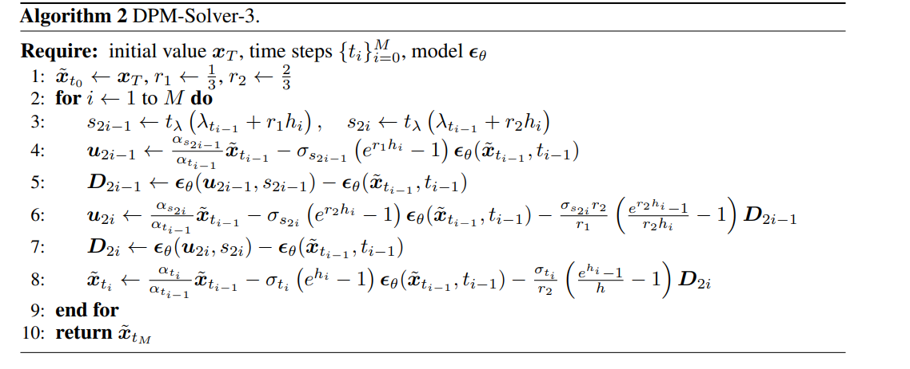
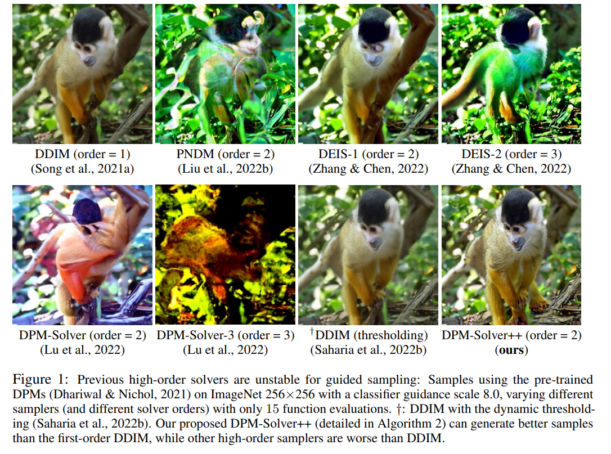
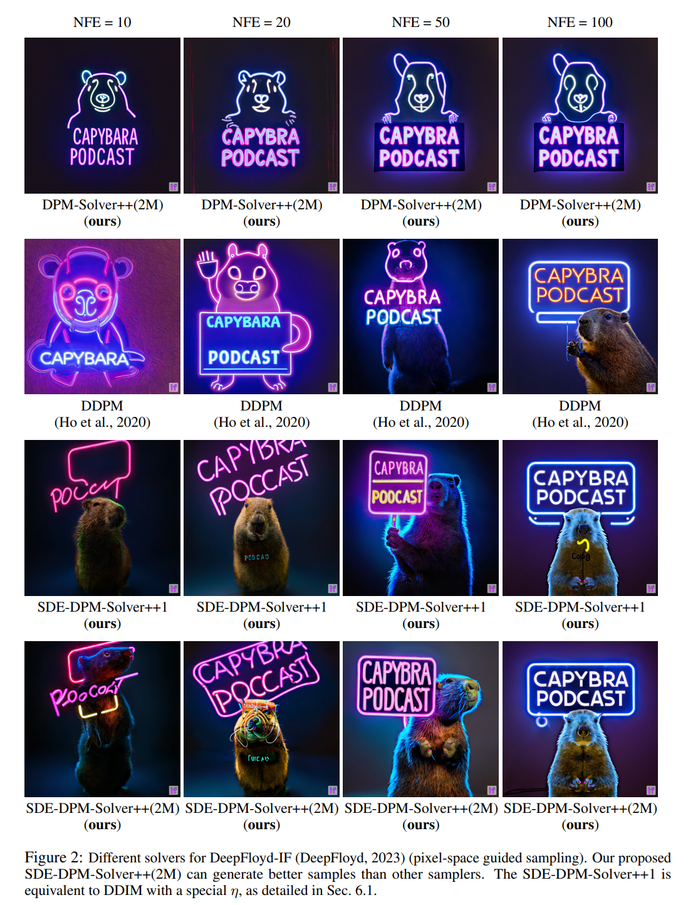

# Diffusion Solver

Before going to the deep details, let's check the preliminary in [Diffusion Unified Representation](../chapter7_diffusion/sde_diffusion_unified_representation.md)
## DPM solver

- paper: <https://arxiv.org/pdf/2206.00927>
- repo: <https://github.com/LuChengTHU/dpm-solver>
- author: 路橙（Cheng Lu）

  - 路橙现任 OpenAI 的技术成员，主要研究方向为大规模深度生成模型和强化学习算法。他于 2023 年 12 月在清华大学 TSAIL 团队获得计算机科学与技术博士学位，导师为朱军教授。在博士期间，他还与陈建飞和李崇轩密切合作。本科阶段，他于 2019 年 7 月获得清华大学计算机科学与技术学士学位。他的研究兴趣包括一致性模型、扩散模型、归一化流和能量基模型，以及它们在图像生成、3D 生成和强化学习中的应用。此外，他曾是清华大学合唱团的男低音歌手，并在 2019 年通过演唱著名爵士歌曲《Autumn Leaves》获得清华大学校园十大歌手比赛的冠军
- Key:
  - 提出 DPM-Solver，一种专门针对扩散常微分方程（ODEs）的高阶求解器，它通过解析计算线性部分并将解简化为神经网络的指数加权积分，大幅提升了Diffusion Probabilistic Models (DPMs) 的采样效率，在无需额外训练的情况下，将采样步骤减少至 10-20 次，并在多个数据集上实现 4× 至 16× 的加速。

Recall the Probability ODE

$$\tag{1}
\begin{aligned}
\frac{d x_t}{d t} &= f(t)x_t + \frac{g(t)^2}{2\sigma_t}\epsilon_\theta  \\
& = \frac{d \log \alpha_t}{dt} x_t + \left( \frac{\sigma_t d \log \sigma_t/\alpha_t}{dt} \right) \epsilon_\theta\\
& = \frac{d \log \alpha_t}{dt} x_t - \left( \frac{\sigma_t d \lambda_t}{2dt} \right) \epsilon_\theta\\
\end{aligned}
$$

Here $\lambda_t =\log \frac{\alpha_t^2}{\sigma_t^2}$ usually means the signal-to-noise ratio, SNR., is a monotanous decreasing function of t.

Here is our base ODE, we will use it to build our DPM Solver

值得注意的是  (1) is a semi-linear ODE, we can have a general solution formula

!!! thm "general solution of semi-linear ODE"

    The solution of (1) is of form

    $$\tag{2}
    \boxed{x_t=
    \exp\!\Bigl[\!\int_{s}^{t}f(\tau)\,d\tau\Bigr]\;x_s
    \;+\;
    \int_{s}^{t}
    \exp\!\Bigl[\!\int_{\tau}^{t}f(r)\,dr\Bigr]\,
    \frac{g^2(\tau)}{2\,\sigma_\tau}\,\epsilon_{\theta}\bigl(x_\tau,\tau\bigr)
    \,d\tau.}
    $$

!!! proof "proof of equation (2)"

    下面演示如何从

    $$
    \frac{dx}{dt}
    \;=\;
    f(t)\,x(t)
    \;+\;
    \frac{g^2(t)}{2\,\sigma_t}\,\epsilon_\theta\bigl(x(t),\,t\bigr),
    $$
    推导出所给的积分形式

    $$
    x_t
    \;=\;
    \exp\!\Bigl[\!\int_{s}^{\,t}f(\tau)\,d\tau\Bigr]\,
    x_s
    \;+\;
    \int_{s}^{t}
    \exp\!\Bigl[\!\int_{\tau}^{\,t}f(r)\,dr\Bigr]\,
    \frac{g^2(\tau)}{2\,\sigma_\tau}\,\epsilon_{\theta}\bigl(x_\tau,\tau\bigr)\,d\tau.
    $$
    为方便阅读，下文把 \(x(t)\) 在 \(t = s\) 时刻的值记为 \(x_s\)，在 \(t = t\) 时刻的值记为 \(x_t\)。

    #### 1. 写成一阶**线性**常微分方程

    原方程可视为
    $$
    x'(t) - f(t)\,x(t)
    \;=\;
    \frac{g^2(t)}{2\,\sigma_t}\,\epsilon_\theta\bigl(x(t),t\bigr).
    $$
    这是一个**非齐次一阶线性 ODE**，其中“非齐次项”为
    \(\tfrac{g^2(t)}{2\,\sigma_t}\,\epsilon_{\theta}\bigl(x(t),t\bigr)\)。

    #### 2. 乘以积分因子并取全导数

    **积分因子**(Integrating Factor) 取
    $$
    \mu(t)
    \;=\;
    \exp\!\Bigl[\,-\!\int_{s}^{\,t}f(u)\,du\Bigr].
    $$
    将上式两边同乘 \(\mu(t)\):

    $$
    \exp\!\Bigl(-\!\int_{s}^{\,t}f(u)\,du\Bigr)
    \,x'(t)
    \;-\;
    f(t)\,
    \exp\!\Bigl(-\!\int_{s}^{\,t}f(u)\,du\Bigr)\,
    x(t)
    \;=\;
    \exp\!\Bigl(-\!\int_{s}^{\,t}f(u)\,du\Bigr)\,
    \frac{g^2(t)}{2\,\sigma_t}\,\epsilon_\theta(x(t),t).
    $$
    左端恰好是对
    \(\displaystyle x(t)\,\mu(t)\)
    做时间导数的结果：
    $$
    \frac{d}{dt}
    \Bigl[
    x(t)\,
    \exp\!\Bigl(-\!\int_{s}^{\,t}f(u)\,du\Bigr)
    \Bigr].
    $$
    因此方程化为

    $$
    \frac{d}{dt}
    \Bigl[
    x(t)\,\mu(t)
    \Bigr]
    \;=\;
    \mu(t)\,\frac{g^2(t)}{2\,\sigma_t}\,\epsilon_\theta\bigl(x(t),t\bigr).
    $$

    #### 3. 在区间 \([s,t]\) 上积分

    对 \(t\) 从 \(s\) 到 \(t\) 积分：

    $$
    \bigl[\,
    x(\tau)\,\mu(\tau)
    \bigr]_{\,\tau=s}^{\,\tau=t}
    \;=\;
    \int_{s}^{t}
    \mu(\tau)\,\frac{g^2(\tau)}{2\,\sigma_\tau}\,\epsilon_\theta\bigl(x(\tau),\tau\bigr)
    \,d\tau.
    $$
    也就是
    $$
    x_t\,\mu(t)
    \;-\;
    x_s\,\mu(s)
    \;=\;
    \int_{s}^{t}
    \mu(\tau)\,
    \frac{g^2(\tau)}{2\,\sigma_\tau}\,
    \epsilon_\theta\bigl(x_\tau,\tau\bigr)\,d\tau.
    $$

    ##### 3.1. 代入

    $$\mu(s)=\exp\!\Bigl(-\!\int_{s}^{\,s} f(u)\,du\Bigr)=1$$

    显然 \(\int_{s}^{\,s}(\cdots)\,du=0\)，故 \(\mu(s)=e^0=1\)。因此

    $$
    x_t\,\mu(t)
    \;-\;
    x_s
    \;=\;
    \int_{s}^{t}
    \mu(\tau)\,
    \frac{g^2(\tau)}{2\,\sigma_\tau}\,
    \epsilon_\theta\bigl(x_\tau,\tau\bigr)\,d\tau.
    $$
    从而

    $$
    x_t\mu(t)=x_s+\int_{s}^{t}\mu(\tau)\frac{g^2(\tau)}{2\,\sigma_\tau}\epsilon_\theta\bigl(x_\tau,\tau\bigr)d\tau
    $$

    ##### 3.2. 还原 \(x_t\)

    回忆 \(\mu(t)=\exp\!\bigl[-\!\int_s^t f(u)\,du\bigr]\)，所以

    $$
    x_t= \exp\!\Bigl[\!\int_{s}^{\,t}f(u)\,du\Bigr]x_s+\int_{s}^{t}
    \exp\!\Bigl(\!\int_{s}^{\,t}f(u)\,du\Bigr)\,
    \mu(\tau)\,
    \frac{g^2(\tau)}{2\,\sigma_\tau}\,\epsilon_\theta(x_\tau,\tau)\,d\tau.
    $$

    但要注意，

    $$
    \exp\!\Bigl(\!\int_{s}^{\,t}f(u)\,du\Bigr)\,\mu(\tau)
    \;=\;
    \exp\!\Bigl(\!\int_{s}^{\,t}f(u)\,du\Bigr)
    \;\exp\!\Bigl(-\!\int_{s}^{\,\tau}f(u)\,du\Bigr),
    $$

    实际上我们更直接的做法是：分拆

    $$
    \int_{s}^{\,t}f(u)\,du
    \;=\;
    \int_{s}^{\,\tau}f(u)\,du
    \;+\;
    \int_{\tau}^{\,t}f(u)\,du,
    $$

    因而

    $$
    \exp\!\Bigl[\!\int_{s}^{\,t}f(u)\,du\Bigr]
    \;\exp\!\Bigl[-\!\int_{s}^{\,\tau}f(u)\,du\Bigr]
    \;=\;
    \exp\!\Bigl[\!\int_{\tau}^{\,t}f(u)\,du\Bigr].
    $$

    所以第二项在被乘以 \(\exp[\int_s^t f(u)\,du]\) 后，可以写成

    $$
    \int_{s}^{t}
    \exp\!\Bigl[\!\int_{\tau}^{\,t}f(r)\,dr\Bigr]\,
    \frac{g^2(\tau)}{2\,\sigma_\tau}\,\epsilon_\theta(x_\tau,\tau)
    \,d\tau.
    $$

    整理得到最后公式

    综上便得到了所需的积分形式解（在标准文献里也叫“Duhamel 原理”形式

    $$
    \boxed{x_t=
    \exp\!\Bigl[\!\int_{s}^{t}f(\tau)\,d\tau\Bigr]\;x_s
    \;+\;
    \int_{s}^{t}
    \exp\!\Bigl[\!\int_{\tau}^{t}f(r)\,dr\Bigr]\,
    \frac{g^2(\tau)}{2\,\sigma_\tau}\,\epsilon_{\theta}\bigl(x_\tau,\tau\bigr)
    \,d\tau.}
    $$

同时，我们带入方程(1), 得到

$$
x_t = \frac{\alpha_t}{\alpha_s} x_s -\frac{ \alpha_t }{2} \int_s^t \frac{d \lambda_\tau}{d\tau} \frac{\sigma_\tau}{\alpha_\tau} \epsilon_\theta\bigl(x_\tau,\tau\bigr)\,d\tau
$$

因为$\lambda_t$ 是单调递减的，它具有逆函数，然后我们进行变量替换

$$ t \rightarrow \lambda$$

我们有

$$d\lambda = \frac{d\lambda_t}{d t} dt$$

因此

!!! note "Exact Solution of Diffusion ODE"

    $$\tag{3}
    x_t =\frac{\alpha_t}{\alpha_s} x_s -\frac{ \alpha_t }{2} \int_{\lambda_s}^{\lambda_t} e^{-\frac{\lambda }{2}} \hat{\epsilon_\theta}\bigl(x_\lambda,t_\lambda\bigr)\,d\lambda
    $$

因此根据这个公式，我们可以得到线性部分的准确解，当然随机部分还是需要进行积分。但是它至少减少了一部分的误差项。同时我们也可以从另外一个角度理解，可以理解成 $\epsilon_\theta$ 的一个加权平均,而且是指数衰减的，$\lambda$ 越大，贡献越小。也就是$t$ 越大， $\lambda$ 越小，贡献越大.

### High Order Approximation

为了方便计算，接下来我们重新定义

$$\lambda_t = \log \frac{\alpha_t}{\sigma_t}$$

这样可以避免额外产生一个 $\frac{1}{2}$ 的系数影响。

对于第二项，忍让需要进行数值计算进行求解。为了得到高阶近似，可以用泰勒展开

它本质上是一个**“指数加权的泰勒展开”**，用来构造对

$$
\int_{\lambda_s}^{\lambda_t} e^{-\lambda}\,\hat{\epsilon}_\theta(\hat{x}_\lambda,\lambda)\,d\lambda
$$
的有限阶逼近，从而得到对\(x_t\)的相应展开。

#### 对\(\hat{\epsilon}_\theta(\hat{x}_\lambda,\lambda)\)做关于\(\lambda\)的泰勒展开

令\(\lambda_t>\lambda_s\)，并记\(h := \lambda_t - \lambda_s\)。将\(\hat{\epsilon}_\theta(\hat{x}_\lambda,\lambda)\)在\(\lambda=\lambda_s\)处展开到\(n\)阶，便有
$$
\hat{\epsilon}_\theta(\hat{x}_\lambda,\lambda)
\;=\;
\sum_{k=0}^n
\frac{(\lambda - \lambda_s)^k}{k!}\,
\hat{\epsilon}_\theta^{(k)}\bigl(\hat{x}_{\lambda_s}, \,\lambda_s\bigr)
\;+\;
O\bigl(h^{n+1}\bigr).
$$
这里\(\hat{\epsilon}_\theta^{(k)}\)表示对\(\lambda\)的第\(k\)阶导数；\(\hat{x}_{\lambda_s}\)指在\(\lambda_s\)处的相应状态(或近似)。

#### 将其带入\(\int e^{-\lambda}\,\hat{\epsilon}_\theta\,d\lambda\)并依次积分

把上述展开代入

$$\int_{\lambda_s}^{\lambda_t}e^{-\lambda}\,\hat{\epsilon}_\theta(\hat{x}_\lambda,\lambda)\,d\lambda$$

后，可将积分拆成一系列幂次项与\(e^{-\lambda}\)的乘积积分，再加上余项\(O(h^{n+2})\)。形式上类似

$$
\int_{\lambda_s}^{\lambda_t}
  e^{-\lambda}
  \sum_{k=0}^n
  \frac{(\lambda - \lambda_s)^k}{k!}\,
  \hat{\epsilon}_\theta^{(k)}(\cdot)
\,d\lambda
\;=\;
\sum_{k=0}^n
  \hat{\epsilon}_\theta^{(k)}(\cdot)
  \int_{0}^{h}
    e^{-\!(\lambda_s+\tau)}\,
    \frac{\tau^k}{k!}
  d\tau
\;+\;O(h^{n+2}).
$$

再根据具体问题(如文中方程 3.4)中的\(\sigma_t,\alpha_t\)等系数关系，将这些积分因子做适当整理，就得到

$$
\int_{\lambda_s}^{\lambda_t}
  e^{-\lambda}\,\hat{\epsilon}_\theta(\hat{x}_\lambda,\lambda)
\,d\lambda
\;=\;
\frac{\sigma_t}{\alpha_t}
\sum_{k=0}^n
h^{\,k+1}\,
\varphi_{k+1}(h)\,
\hat{\epsilon}_\theta^{(k)}\bigl(\hat{x}_{\lambda_s}, \,\lambda_s\bigr)
\;+\;
O\bigl(h^{n+2}\bigr),
$$

#### 定义\(\varphi_k\)函数以简化“指数‐多项式”积分

为了把

$$\displaystyle \int_0^h e^{-\!(\lambda_s+\tau)}\,\tau^k\,d\tau
$$

一类积分写得更紧凑，文中引入了一簇辅助函数\(\varphi_k(z)\)。它们满足某些初值与递推性质(见(B.2))，从而可得到闭形式，如

$$
\varphi_1(h)
= \frac{e^h - 1}{h},
\quad
\varphi_2(h)
= \frac{\,e^h - h - 1\,}{h^2},
\quad
\varphi_3(h)
= \frac{\,e^h - \tfrac{h^2}{2} - h - 1\,}{h^3},
$$

#### 得到\(x_t\)的展开

\(x_t\)由一项“齐次解”(\(\tfrac{\alpha_t}{\alpha_s}\,x_s\))和一项“非齐次积分”(\(\sigma_t\)-\(\alpha_t\)等系数乘上上面那个积分)组成。把对\(\hat{\epsilon}_\theta\)的近似积分结果带回去，即得到 (B.4) 处：

!!! note "High Order Expansion"

    $$\tag{4}
    x_t
    \;=\;
    \frac{\alpha_t}{\alpha_s}\,x_s
    \;-\;
    \sigma_t
    \sum_{k=0}^n
      h^{k+1}\,\varphi_{k+1}(h)\,
      \hat{\epsilon}_\theta^{(k)}\bigl(\hat{x}_{\lambda_s},\,\lambda_s\bigr)
    \;+\;
    O\bigl(h^{n+2}\bigr).
    $$

由此便构成了对方程(3)解的一个**有限阶逼近**。

下面给出文中式 (4)

$$
x_{t}
\;=\;
\frac{\alpha_{t}}{\alpha_{s}}\;x_{s}
\;-\;
\sigma_{t}
\sum_{k=0}^{n}
  h^{k+1}\,\varphi_{k+1}(h)\,
  \hat{\epsilon}_{\theta}^{(k)}\bigl(\hat{x}_{\lambda_{s}},\,\lambda_{s}\bigr)
\;+\;
O\bigl(h^{n+2}\bigr),
\quad
\text{其中 }h=\lambda_{t}-\lambda_{s},
$$

在 \(n=0,1,2\) 三种截断下的**显式形式**。这里

$$
\varphi_{1}(h) \;=\; \frac{e^{h}-1}{h},
\quad
\varphi_{2}(h) \;=\; \frac{\,e^{h}-h-1\,}{h^{2}},
\quad
\varphi_{3}(h) \;=\; \frac{\,e^{h}-\tfrac{h^{2}}{2}-h-1\,}{h^{3}},
$$

以及\(\hat{\epsilon}_{\theta}^{(k)}\) 表示 \(\lambda\) 的 \(k\) 阶导数在 \(\lambda=\lambda_s\) 处的值。

##### \(n=0\) 截断

只保留 \(k=0\) 项，则
$$
x_{t}
\;=\;
\frac{\alpha_{t}}{\alpha_{s}}\;x_{s}
\;-\;
\sigma_{t}
\Bigl[
  h^{1}\,\varphi_{1}(h)\,\hat{\epsilon}_{\theta}^{(0)}
\Bigr]
\;+\;
O\bigl(h^{2}\bigr).
$$

因为 \(\hat{\epsilon}_{\theta}^{(0)}=\hat{\epsilon}_{\theta}\bigl(\hat{x}_{\lambda_s},\lambda_s\bigr)\) 且
\(\,h\,\varphi_{1}(h)=e^{h}-1,\)
故

$$
\boxed{
x_{t}
\;=\;
\frac{\alpha_{t}}{\alpha_{s}}\;x_{s}
\;-\;
\sigma_{t}\,\Bigl(e^{h}-1\Bigr)\,\hat{\epsilon}_{\theta}\bigl(\hat{x}_{\lambda_s},\,\lambda_{s}\bigr)
\;+\;
O\bigl(h^{2}\bigr).
}
$$

##### \(n=1\) 截断

此时求和到 \(k=1\)，即包含 \(k=0\) 和 \(k=1\) 两项：

$$
x_{t}=\frac{\alpha_{t}}{\alpha_{s}}\;x_{s}
\;-\;
\sigma_{t}
\Bigl[
  h\,\varphi_{1}(h)\,\hat{\epsilon}_{\theta}^{(0)}
  \;+\;
  h^{2}\,\varphi_{2}(h)\,\hat{\epsilon}_{\theta}^{(1)}
\Bigr]
+\;
O\bigl(h^{3}\bigr).
$$

再将

$$
h\,\varphi_{1}(h)
= e^{h}-1,
\quad
h^{2}\,\varphi_{2}(h)
= e^{h}-h-1
$$

代回，则

$$
\boxed{
x_{t}
=\;
\frac{\alpha_{t}}{\alpha_{s}}\;x_{s}
\;-\;
\sigma_{t}
\Bigl[
  \bigl(e^{h}-1\bigr)\,
  \hat{\epsilon}_{\theta}^{(0)}
  \;+\;
  \bigl(e^{h}-h-1\bigr)\,
  \hat{\epsilon}_{\theta}^{(1)}
\Bigr]
\;+\;
O\bigl(h^{3}\bigr),
}
$$

其中

$$\hat{\epsilon}_{\theta}^{(1)}=\dfrac{d}{d\lambda}\hat{\epsilon}_{\theta}\bigl(\hat{x}_{\lambda},\lambda\bigr)\big|_{\lambda=\lambda_s}$$

###### \(n=2\) 截断

保留到 \(k=2\)，即 \(k=0,1,2\):

$$
x_{t}=\frac{\alpha_{t}}{\alpha_{s}}\;x_{s}\;-\;\sigma_{t}
\Bigl[
  h\,\varphi_{1}(h)\,\hat{\epsilon}_{\theta}^{(0)}
  \;+\;
  h^{2}\,\varphi_{2}(h)\,\hat{\epsilon}_{\theta}^{(1)}
  \;+\;
  h^{3}\,\varphi_{3}(h)\,\hat{\epsilon}_{\theta}^{(2)}
\Bigr]+\;O\bigl(h^{4}\bigr).
$$

再利用

$$
h^{3}\,\varphi_{3}(h)
= e^{h}\;-\;\frac{h^{2}}{2}\;-\;h\;-\;1,
$$

可写成

$$
\boxed{x_{t}=\;\frac{\alpha_{t}}{\alpha_{s}}\;x_{s}\;-\;\sigma_{t}\Bigl[
  \bigl(e^{h}-1\bigr)\,\hat{\epsilon}_{\theta}^{(0)}
  \;+\;
  \bigl(e^{h}-h-1\bigr)\,\hat{\epsilon}_{\theta}^{(1)}
  \;+\;
  \Bigl(e^{h}-\tfrac{h^{2}}{2}-h-1\Bigr)\,\hat{\epsilon}_{\theta}^{(2)}
\Bigr]\;+\;O\bigl(h^{4}\bigr).}
$$

但是真实情况下，我们并不能直接求高阶导数，而是用数值方法来近似计算。 当然从上面的公式我们可以直接得到二阶截断误差的数值方法。
### DPM Solver 1

$$
\begin{aligned}
x_{t} &= \frac{\alpha_t}{\alpha_s}x_s - \sigma_t1 (e^{h_t}-1)\epsilon_\theta(x_s,t_s)\\
    &= \frac{\alpha_t}{\alpha_s}x_s  - \alpha_t \left[ \frac{\sigma_s}{\alpha_s} - \frac{\sigma_t}{\alpha_t} \right] \epsilon_\theta(x_s,s)
\end{aligned}
$$

where

$$h_t=\lambda_t - \lambda_s =\log \frac{\alpha_t}{\sigma_t} - \log\frac{\alpha_s}{\sigma_s}$$

This formula is identical to the DDIM solution.

### DPM Solver 2
理论上来说， $n=1$的情况下，DPM solver 和ODE里的中点法是一模一样的，只是要对解析的线性部分单独处理。

我们先来看看中点法

#### 中点法

考虑常微分方程
$$
y'(t) = f(t, y(t)),\quad y(t_0)=y_0,
$$
其中点（midpoint）方法为

!!! note "中点法"

    $$
    y_{n+1} = y_n + h\,f\Big(t_n+\frac{h}{2},\,y_n+\frac{h}{2}\,f(t_n,y_n)\Big).
    $$

下面给出推导该方法局部截断误差阶数的过程。

##### 精确解的Taylor展开

对精确解\( y(t) \)在\( t=t_n \)处做Taylor展开，有
$$
y(t_n+h) = y(t_n) + h\,y'(t_n) + \frac{h^2}{2}\,y''(t_n) + \frac{h^3}{6}\,y'''(t_n) + O(h^4).
$$
注意到由于\( y'(t_n) = f(t_n, y(t_n)) \)且
$$
y''(t_n) = \frac{d}{dt}y'(t_n)=\frac{\partial f}{\partial t}(t_n, y(t_n)) + \frac{\partial f}{\partial y}(t_n, y(t_n))\,y'(t_n),
$$
我们有
$$
y(t_n+h) = y(t_n) + h\,f(t_n,y(t_n)) + \frac{h^2}{2}\Big[f_t(t_n,y(t_n)) + f_y(t_n,y(t_n))\,f(t_n,y(t_n))\Big] + O(h^3).
$$

##### 数值格式的展开

中点方法给出
$$
y_{n+1} = y_n + h\,f\left(t_n+\frac{h}{2},\,y_n+\frac{h}{2}\,f(t_n,y_n)\right).
$$
我们希望比较\( y_{n+1} \)与精确解\( y(t_n+h) \)的差异。首先对函数
$$
F(h)= f\left(t_n+\frac{h}{2},\,y_n+\frac{h}{2}\,f(t_n,y_n)\right)
$$
在\( h=0 \)处做Taylor展开。记 \( y_n = y(t_n) \) 且 \( f(t_n,y_n) = y'(t_n) \)，于是有

$$
\begin{aligned}
F(h) &= f\Big(t_n+\frac{h}{2},\,y(t_n)+\frac{h}{2}\,y'(t_n)\Big)\\
&= f(t_n,y(t_n)) + \frac{h}{2}\,f_t(t_n,y(t_n)) + \frac{h}{2}\,f_y(t_n,y(t_n))\,y'(t_n) + O(h^2)\\
&= f(t_n,y(t_n)) + \frac{h}{2}\Big[f_t(t_n,y(t_n)) + f_y(t_n,y(t_n))\,f(t_n,y(t_n))\Big] + O(h^2).
\end{aligned}
$$

代入中点方法表达式，有

$$
\begin{aligned}
y_{n+1} &= y(t_n) + h\,F(h)\\
&= y(t_n) + h\,f(t_n,y(t_n)) +\\
&\qquad \frac{h^2}{2}\Big[f_t(t_n,y(t_n)) + f_y(t_n,y(t_n))\,f(t_n,y(t_n))\Big] + O(h^3).
\end{aligned}
$$

##### 误差阶数分析

将精确解的Taylor展开与中点方法的展开对比：

- 精确解：
  $$
  y(t_n+h) = y(t_n) + h\,f(t_n,y(t_n)) + \frac{h^2}{2}\Big[f_t(t_n,y(t_n)) + f_y(t_n,y(t_n))\,f(t_n,y(t_n))\Big] + O(h^3).
  $$
- 数值解（中点方法）：
  $$
  y_{n+1} = y(t_n) + h\,f(t_n,y(t_n)) + \frac{h^2}{2}\Big[f_t(t_n,y(t_n)) + f_y(t_n,y(t_n))\,f(t_n,y(t_n))\Big] + O(h^3).
  $$

两者在前\( h^2 \)项完全一致，因此局部截断误差（local truncation error）为\( O(h^3) \)。由于全局误差通常比局部截断误差低一个阶数，所以全局误差为\( O(h^2) \)。

终点法也属于一种龙格库塔方法。

这里面我们并不能直接利用Runge Kutta, 因为线性部分是能计算的，所以要对龙格库塔方法做一定的适用性改进。

### DPM Solver 3

假设当前的为$x(\lambda)$, $\lambda$为自变量，$h$ 为步长。$r_1$ 和 $r_2$类似于龙格库塔方法中的系数。在本文中取值
为\( r_1 = \frac{1}{3},\,r_2 = \frac{1}{3} \).

我们从$\lambda$ 的角度重写DPM Solver-3 的迭代公式, 让它看起来更加清晰。

1. **第一阶段**

$$
\begin{aligned}
\hat{x}_{\lambda + r_1h}&\;=\;\frac{\alpha_{s_{\lambda + r_1 h}}}{\alpha_\lambda}\;x(\lambda)\;-\;
\sigma_{s_{\lambda + r_1 h}}\,\bigl(e^{\,r_1 h} - 1\bigr)\,\epsilon_\theta\bigl(x(\lambda),\,\lambda\bigr),\\
\hat{D}_1&=\frac{1}{r_1 h}\Bigl[\epsilon_\theta(\hat{x}_{\lambda + r_1h},\lambda + r_1 h) - \epsilon_\theta(x(\lambda),\lambda)\Bigr].
\end{aligned}
$$

1. **第二阶段**

$$
\begin{aligned}
\hat{x}_{\lambda + r_2 h}& = \frac{\alpha_{\lambda + r_2 h}}{\alpha_\lambda}\;x(\lambda)-\sigma_{s_{\lambda + r_2 h}}  \bigl(e^{\,r_2 h} - 1\bigr)\epsilon_\theta\bigl(x(\lambda),\,\lambda\bigr) -
\sigma_{s_{\lambda + r_2 h}}\,\bigl(e^{\,r_2 h} - r_2 h - 1\bigr)\hat{D}_1\\
\hat{D}_2 &=\frac{1}{r_2\,h}\Bigl[\epsilon_\theta(\hat{x}_{\lambda + r_2 h},\lambda + r_2 h) - \epsilon_\theta(x(\lambda),\lambda)\Bigr].
\end{aligned}
$$

1. **最终更新**

$$
x(\lambda + h)=\frac{\alpha_{\lambda + h}}{\alpha_{\lambda}}\;x(\lambda)- \sigma_{\lambda + h}\,\bigl(e^{\,h} - 1\bigr)\,\epsilon_\theta\bigl(x(\lambda),\lambda\bigr) - \sigma_{\lambda + h}\,\bigl(e^{\,h} -h- 1\bigr)\hat{D}_2.
$$
这里 我们可以把 $\hat{D}_1$ 和 $\hat{D}_2$ 看作是差分项，也就是

$$ \hat{D}_1 \approx  \frac{d}{d \lambda } \left[\epsilon_\theta(x(\lambda),\lambda) \right]_{\lambda = \lambda + r_1 h}$$

$$ \hat{D}_2 \approx  \frac{d}{d \lambda } \left[\epsilon_\theta(x(\lambda),\lambda) \right]_{\lambda = \lambda + r_2 h}$$

我们重新回顾一下泰勒展开

$$
\boxed{x_{t}=\;\frac{\alpha_{t}}{\alpha_{s}}\;x_{s}\;-\;\sigma_{t}\Bigl[
  \bigl(e^{h}-1\bigr)\,\hat{\epsilon}_{\theta}^{(0)}
  \;+\;
  \bigl(e^{h}-h-1\bigr)\,\hat{\epsilon}_{\theta}^{(1)}
  \;+\;
  \Bigl(e^{h}-\tfrac{h^{2}}{2}-h-1\Bigr)\,\hat{\epsilon}_{\theta}^{(2)}
\Bigr]\;+\;O\bigl(h^{4}\bigr).}
$$

从这个公式可以直观看到 $\hat{x}_{\lambda + r_1h}$ 是一阶展开，$\hat{x}_{\lambda + r_2h}$, 和 $\hat{x}_{\lambda + h}$ 都是二阶展开。

那么 $\hat{x}_{\lambda + r_1h}$ 的局部截断误差应该是 $O(h^2)$, 同理因为 $\hat{x}_{\lambda + r_2h}$的局部阶段误差是$O(h^3)$。虽然按找泰莱展开,
$\hat{x}_{\lambda + h}$ 也是 $o(h^3)$。 但是它可以背证明是 $O(h^4)$。这个是不太直观理解的。

要具体证明局部4阶误差，需要进行泰勒展开进一步证明.
## DPM Solver++

- author:
  - Cheng Lu†
  - Yuhao Zhou†
  - Fan Bao†
  - Jianfei Chen†∗
  - Chongxuan Li‡
  - Jun Zhu
- year: 2023 May
- THU

这篇文章主要解决的问题是高阶ODE求解器在**条件噪声预测**过程中的不稳定性。

**第一个挑战** 是 **较大的引导尺度（guidance scale）会导致高阶求解器的不稳定性**。如图 1 所示，在引导尺度 **s = 8.0** 且使用 **15 次函数评估** 的情况下，现有的高阶扩散 ODE 求解器（Lu et al., 2022；Zhang & Chen, 2022；Liu et al., 2022b）生成的图像质量较差，甚至比一阶 DDIM 更差。此外，随着求解器阶数的提高，生成样本的质量会进一步下降。

直观来看，较大的引导尺度可能会放大模型 **\(\tilde{\theta}\)** 在方程 (5) 中的输出和导数。而模型的导数会影响 ODE 求解器的收敛范围，放大的导数可能导致高阶求解器需要 **更小的步长** 才能收敛，因此高阶求解器的性能可能比一阶求解器更差。此外，高阶求解器依赖 **高阶导数**，而这些导数通常对放大效应更敏感，从而进一步缩小了收敛半径。

**第二个挑战** 是 **“训练-测试不匹配”（train-test mismatch）问题**（Saharia et al., 2022b）。数据通常位于一个 **有限区间** 内（例如图像数据在 \([-1, 1]\) 范围内）。然而，当引导尺度较大时，条件噪声预测模型 **\(\tilde{\theta}(x_t, t, c)\)** 会被推离真实噪声，这会导致最终收敛的解 **\(x_0\)** 超出数据的原始范围。在这种情况下，生成的图像会出现 **饱和（saturation）** 和 **不自然（unnatural）** 的问题（Saharia et al., 2022b）。

参考 [diffusion guidance](./sde_diffusion_guidance.md) 理解classifier free的逆向过程. 我们这里直接写出classifier free的逆向过程公式

该公式定义了**无分类器引导（Classifier-Free Guidance）**中用于**扩散概率模型（DPMs）**的**引导噪声预测模型** \(\tilde{\epsilon}_\theta(x_t, t, c)\)：

$$
\tilde{\epsilon}_\theta(x_t, t, c) := s \cdot \epsilon_\theta(x_t, t, c) + (1 - s) \cdot \epsilon_\theta(x_t, t, \varnothing).
$$

- 公式解释

  - \( x_t \)：时间 \( t \) 时刻的噪声潜变量。
  - \( c \)：条件信息（例如，在文本生成图像任务中，\( c \) 可能是文本提示）。
  - \( \varnothing \)：一个特殊占位符，表示**无条件模型**（即不使用条件信息）。
  - \( \epsilon_\theta(x_t, t, c) \)：模型在**条件信息 \( c \)** 下预测的噪声。
  - \( \epsilon_\theta(x_t, t, \varnothing) \)：**无条件模型**（不依赖 \( c \)）预测的噪声。
  - \( s \)：**引导尺度（guidance scale）**，用于控制条件模型对最终输出的影响程度。

- 直观理解

  该公式对**条件噪声预测**和**无条件噪声预测**进行**线性插值**。

  - 当 \( s = 1 \) 时，模型完全依赖条件信息进行预测。
  - 当 \( s > 1 \) 时，条件信息的影响被**放大**，可以提高生成质量，但如果 \( s \) 过大，可能会导致图像出现伪影（artifact）或不自然的结果。
