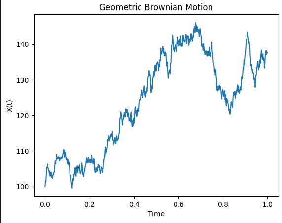
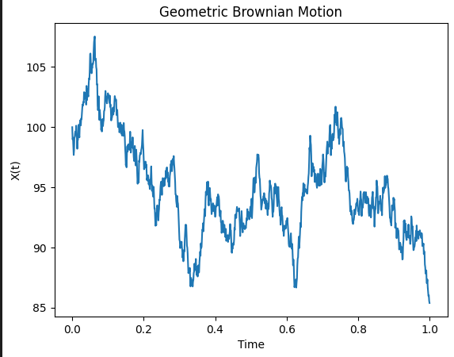

# SDE

Welcome to the world of **Stochastic Differential Equations (SDEs)**! If you’ve ever wondered how to model systems that involve randomness—like stock prices, particle motion, or population growth with unpredictable fluctuations—SDEs are the key. This blog will break down the basics, no advanced math required. Let’s dive in!

---

## **Prerequisites**
To follow along, you’ll need:

- Basic calculus (derivatives and integrals).
- Familiarity with ordinary differential equations (ODEs).
- A grasp of probability (random variables, mean, variance).

Don’t worry—we’ll keep things intuitive!

---

## **What Makes SDEs Different?**
Ordinary Differential Equations (ODEs) model deterministic systems, where the future is entirely predictable from the present (e.g., a swinging pendulum). **SDEs**, on the other hand, model systems with **randomness**. Think of them as ODEs with a “noise” term to account for uncertainty.

---

## **The Building Blocks of SDEs**

### 1. **Stochastic Processes**

A stochastic process is a collection of random variables evolving over time. The most famous example is **Brownian motion** (or *Wiener process*), which describes random movement, like pollen jiggling in water. Key properties:

- **Continuous paths** (no jumps).
- **Independent increments**: Future movements don’t depend on the past.
- **Normally distributed** changes: Over time $\Delta t$, the displacement $\Delta W \sim N(0, \Delta t)$.

that is

$$
W_t - W_s \sim \mathbf{N}(0, t-s) \quad \forall t>s
$$

<video width="320" height="240" controls>
  <source src="https://vdn3.vzuu.com/SD/a4669c08-2340-11eb-826e-be7830fcb65c.mp4?auth_key=1736996318-0-0-8ab5de9bde1ba841ab4f42b5ba1d3d47&bu=078babd7&c=avc.0.0&disable_local_cache=1&expiration=1736996318&f=mp4&pu=078babd7&v=tx" type="video/mp4">
</video>

### 2. **Structure of an SDE**

1. Difference Between ODEs and SDEs**

**Ordinary Differential Equations (ODEs)**

An ODE is an equation involving a function and its derivatives $\frac{dx}{dt} = f(x,t)$
where $x(t)$ is the unknown function, and $f(x,t)$ is a known deterministic function.Example:

**Exponential Growth**

$$
 \frac{dx}{dt} = \lambda x
$$

Solution:

$$x(t) = x_0 e^{\lambda t}$$

where $x_0$ is the initial condition.

**Stochastic Differential Equations (SDEs)**

An SDE extends an ODE by adding a **stochastic (random) component** :

$$
\frac{d x}{dt} = f(x,t) + g(x, t)\xi(t)
$$

Not that the above form is just a similar notion from ODE, which help to understand. In fact, cause the Brownian motion is nowhere differentiable.

#### **Standard formulation of SDE**

$$
 dX_t = f(X_t, t) dt + g(X_t, t) dW_t
$$

where:

- $dX_t$ represents the infinitesimal change in $X_t$.

- $f(X_t, t)dt$ is the **drift term** , describing deterministic motion.

- $g(X_t, t)dW_t$ is the **diffusion term** , incorporating randomness via a Wiener process $W_t$ (also called Brownian  motion).

By the random term, we know that the randomniness is independent of the $x$.

Example:
**Geometric Brownian Motion (GBM)**

$$
dX_t = \mu X_t dt + \sigma X_t dW_t
$$

used to model stock prices in the **Black-Scholes model** .

#### Why the Derivative Formulation of SDEs is Invalid

The equation

$$\frac{dx(t)}{dt} = f(t, \mathbf{x}) + g(t, \mathbf{x})\xi(t), \quad \text{where} \quad \xi(t) \sim \mathcal{N}(0, \mathbf{I})
$$

is mathematically problematic for defining a stochastic differential equation (SDE). Below are the key reasons:

##### 1. **White Noise as a Generalized Function**

- $\xi(t)$ represents "white noise," which is not a classical function but a generalized stochastic process.
- Rigorously, $\xi(t)$ is interpreted as the **formal derivative of a Wiener process** $W(t)$ (Brownian motion).
- However, $W(t)$ is nowhere differentiable with probability 1, so $\xi(t) = \frac{dW}{dt}$ does not exist in the classical sense.

##### 2. **Stochastic Integrals vs. Derivatives**

- SDEs are properly defined using **stochastic integrals** (Itô or Stratonovich), not derivatives.
- The standard SDE formulation is:
     $$dx(t) = f(t, \mathbf{x})dt + g(t, \mathbf{x})dW(t),$$
     where $dW(t)$ is the increment of a Wiener process.
- This avoids differentiating $W(t)$ and instead uses integration to handle its irregular paths.

##### 3. **Path Regularity**

- Solutions to SDEs are typically **nowhere differentiable** due to the roughness of $W(t)$.
- Writing $\frac{dx(t)}{dt}$ implicitly assumes $x(t)$ is differentiable, which contradicts the nature of stochastic processes driven by white noise.

##### Conclusion
The derivative form $\frac{dx(t)}{dt}$ is invalid for SDEs because:

1. White noise ($\xi(t)$) is not a classical function.
2. The rigorous framework requires stochastic integrals with $dW(t)$, not $\xi(t)dt$.
3. Solutions to SDEs lack the regularity needed for classical derivatives.

The standard SDE formulation resolves these issues by using differentials ($dx(t)$, $dW(t)$) instead of derivatives.

## **Solving SDEs: Why It’s Tricky**
In ODEs, you integrate to find solutions. But in SDEs, the noise term $dW_t$ isn’t smooth—it’s wildly erratic! Traditional calculus fails, so we use **stochastic calculus**. Two key tools:

1. **Itô’s Lemma**: A “chain rule” for stochastic processes.
2. **Itô Integral**: A way to integrate with respect to Brownian motion.

$$
\mathbf{x}(t, \omega) = \mathbf{x}_0 + \int_0^t f(s, \mathbf{x}(s, \omega)) ds + \int_0^t g(s, \mathbf{x}(s, \omega)) d\mathbf{w}(s, \omega)
$$

### What is the Itô Integral?
The Itô Integral is a way to integrate stochastic processes with respect to Brownian motion (a Wiener process, denoted $ W_t $). Formally, for a stochastic process $ H_t $ adapted to the filtration of $ W_t $, the Itô Integral is defined as:

$$
\int_{0}^{T} H_t \, dW_t = \lim_{\Delta t \to 0} \sum_{i=0}^{n-1} H_{t_i} (W_{t_{i+1}} - W_{t_i}),
$$

where the integrand $ H_t $ is evaluated at the **left endpoint** of each subinterval $[t_i, t_{i+1}]$. This "non-anticipating" property ensures the integral is a **martingale**.

### Key Properties

1. **Adaptedness**: $ H_t $ must depend only on information up to time $ t $.
2. **Itô Isometry**:

$$
\mathbb{E}\left[ \left( \int_{0}^{T} H_t \, dW_t \right)^2 \right] = \mathbb{E}\left[ \int_{0}^{T} H_t^2 \, dt \right].
$$

3. **Zero Mean**:

$$ \mathbb{E}\left[ \int_{0}^{T} H_t \, dW_t \right] = 0 $$

By the first part, we can solve it according to the method used in ODE, but the last term is tricky.

Classical integration fails because Brownian motion has **infinite total variation** but **finite quadratic variation**:

$$
\lim_{\Delta t \to 0} \sum_{i=0}^{n-1} |W_{t_{i+1}} - W_{t_i}|^2 = T.
$$

This irregularity forces a new calculus.

### Itô’s Lemma

#### The Stochastic Chain Rule

Itô’s Lemma is the stochastic counterpart to the chain rule in calculus. It allows us to differentiate functions of stochastic processes. Let $ X_t $ follow the Itô process:

$$
dX_t = \mu(t, X_t) dt + \sigma(t, X_t) dW_t.
$$

For a twice-differentiable function $ f(t, X_t) $, Itô’s Lemma states:

$$
df = \left( \frac{\partial f}{\partial t} + \mu \frac{\partial f}{\partial x} + \frac{1}{2} \sigma^2 \frac{\partial^2 f}{\partial x^2} \right) dt + \sigma \frac{\partial f}{\partial x} dW_t.
$$

#### Intuition Behind the Extra Term
The term $\frac{1}{2} \sigma^2 \frac{\partial^2 f}{\partial x^2}$ arises from the quadratic variation of $W_t$. In Taylor expansions, $(dW_t)^2 \approx dt$, which introduces a "correction" absent in classical calculus.

---

### Geometric Brownian Motion

Consider a stock price $ S_t $ modeled by:

$$
dS_t = \mu S_t dt + \sigma S_t dW_t.
$$

**Goal**: Find $d(\ln S_t)$.

Applying Itô’s Lemma with $f(t, S_t) = \ln S_t$:

1. Compute partial derivatives:
   - $\frac{\partial f}{\partial t} = 0$,
   - $\frac{\partial f}{\partial S} = \frac{1}{S}$,
   - $\frac{\partial^2 f}{\partial S^2} = -\frac{1}{S^2}$.

2. Substitute into Itô’s formula:

$$
d(\ln S_t) = \left( \mu - \frac{1}{2} \sigma^2 \right) dt + \sigma dW_t.
$$

Integrating this gives the solution:

$$
\ln S_t = \ln S_0 + \left( \mu - \frac{1}{2} \sigma^2 \right) t + \sigma W_t.
$$

### Analytical Solutions

For simple SDEs, explicit solutions exist.

**Example: Linear SDE**

$$
dX_t = \lambda X_t dt + \sigma dW_t
$$

Using **Itô's Lemma** , the solution is:

$$
X_t = X_0 e^{\lambda t} + \sigma \int_0^t e^{\lambda (t-s)} dW_s
$$

This solution includes a deterministic exponential growth term and a stochastic integral.

## Properties of the Wiener Process $W_t$ in the Itô Integral

The Itô integral is defined with respect to the **Wiener process** (or Brownian motion), denoted as $W_t$. This process is central to stochastic calculus due to its unique properties, which enable rigorous integration in noisy systems. Below are key properties of $W_t$ that underpin the Itô integral:

---

### 1. **Continuity of Paths**

- **Property**: $W_t$ is almost surely (a.s.) continuous.
- **Implication**: While $W_t$ has no jumps, its paths are nowhere differentiable, necessitating integral-based formulations (e.g., $\int H_t \, dW_t$) instead of derivatives.

---

### 2. **Independent Increments**

- **Property**: For $s < t$, the increment $W_t - W_s$ is independent of the history $\mathcal{F}_s$ (the filtration up to time $s$).
- **Mathematically**:

     $$
     W_t - W_s \perp \!\!\! \perp \mathcal{F}_s.
     $$

- **Implication**: Integrands in the Itô integral must be **adapted** (i.e., $H_t$ depends only on information up to $t$). This ensures no "peeking into the future."

---

### 3. **Gaussian Increments**

- **Property**: Increments $W_t - W_s$ follow a normal distribution:
     $$
     W_t - W_s \sim \mathcal{N}(0, t-s).
     $$
- **Implication**: The Itô integral inherits Gaussian structure, making it analytically tractable.

---

### 4. **Quadratic Variation**

- **Property**: The quadratic variation of $W_t$ over $[0, T]$ is $T$:
     $$
     \langle W \rangle_T = \lim_{\Delta t \to 0} \sum_{i=0}^{n-1} |W_{t_{i+1}} - W_{t_i}|^2 = T.
     $$
- **Heuristic Rule**: $(dW_t)^2 = dt$ in stochastic calculus.
- **Implication**: This drives the "extra term" in Itô’s Lemma (e.g., $\frac{1}{2} \sigma^2 \frac{\partial^2 f}{\partial x^2} dt$).

### 5. **Martingale Property**

- **Property**: $W_t$ is a martingale: $\mathbb{E}[W_t | \mathcal{F}_s] = W_s$ for $s < t$.
- **Extension**: The Itô integral $\int_0^t H_s \, dW_s$ is also a martingale if $H_t$ is adapted and square-integrable.
- **Implication**: No arbitrage in financial models, as future expectations are unbiased.

---

### 6. **Itô Isometry**

- **Property**: For adapted $H_t$,

$$
\mathbb{E}\left[ \left( \int_0^T H_t \, dW_t \right)^2 \right] = \mathbb{E}\left[ \int_0^T H_t^2 \, dt \right].
$$

- **Implication**: Provides a link between the $L^2$-norms of the integral and the integrand, critical for proving convergence.

---

### 7. **Zero Expectation**

- **Property**: The Itô integral has zero mean:

$$
\mathbb{E}\left[ \int_0^T H_t \, dW_t \right] = 0.
$$

- **Reason**: Martingale increments have zero expected value.

## Numerical Solutions of SDE

One thing need to note is that

$$dW_t \sim \sqrt{dt}$$

when using Talay expansion

### Euler-Maruyama Discretization

For a time step $\Delta t$, the numerical approximation is:

$$
 X_{t+\Delta t} = X_t + f(X_t, t) \Delta t + g(X_t, t) \Delta W_t
$$

where

$\Delta W_t \sim \mathcal{N}(0, \Delta t)$ is a normally distributed random variable.

```python
def euler_maruyama(f, g, X0, T, dt):
    N = int(T / dt)
    X = np.zeros(N + 1)
    t = np.linspace(0, T, N + 1)
    X[0] = X0

    for i in range(N):
        dW = np.sqrt(dt) * np.random.randn()
        X[i+1] = X[i] + f(X[i], t[i]) * dt + g(X[i], t[i]) * dW

    return t, X
```

**Pros & Cons**
✅ Simple and easy to implement
✅ Works well for small time steps
❌ Low accuracy (converges at order $O(\sqrt{\Delta t})$)
❌ Poor stability for stiff problems

---

### Milstein Method

The **Milstein method**  improves upon Euler-Maruyama by adding a higher-order correction term from Itô calculus.**Milstein Discretization**

$$
 X_{t+\Delta t} = X_t + f(X_t, t) \Delta t + g(X_t, t) \Delta W_t + \frac{1}{2} g(X_t, t) g'(X_t, t) \left((\Delta W_t)^2 - \Delta t \right)
$$

where $g'(X_t, t)$ is the derivative of $g(X_t, t)$.

```python
def milstein(f, g, X0, T, dt):
    N = int(T / dt)
    X = np.zeros(N + 1)
    t = np.linspace(0, T, N + 1)
    X[0] = X0

    for i in range(N):
        dW = np.sqrt(dt) * np.random.randn()
        g_prime = (g(X[i] + 1e-5, t[i]) - g(X[i], t[i])) / 1e-5  # Numerical derivative
        X[i+1] = X[i] + f(X[i], t[i]) * dt + g(X[i], t[i]) * dW + 0.5 * g(X[i], t[i]) * g_prime * (dW**2 - dt)

    return t, X
```

**Pros & Cons**
✅ Higher accuracy than Euler-Maruyama ($O(\Delta t)$)
✅ Useful when the diffusion term $g(X_t, t)$ is non-constant
❌ More complex to implement than Euler-Maruyama

### Proof of the iteration step

#### 1. The Goal
We want to approximate $X_{t_{n+1}}$ given $X_{t_n} = X_n$ for a small step $\Delta t = t_{n+1} - t_n$. We write

$$
 X_{t_{n+1}}
\;=\; X_{t_n} \;+\;\int_{t_n}^{t_{n+1}} f\bigl(X_{s},s\bigr)\,ds
\;+\;\int_{t_n}^{t_{n+1}} g\bigl(X_{s},s\bigr)\,dW_{s}.
$$

The Milstein scheme refines the simpler **Euler–Maruyama**  scheme by adding a correction term that captures more information about how $g(x)$ varies with $x$. This provides higher-order accuracy in a single Brownian dimension.

---

#### 2. Intuition via Local Expansion

##### 2.1. Breaking down the integrals

We have:

1. **Drift integral** :

$$ \int_{t_n}^{t_{n+1}} f\bigl(X_{s},s\bigr)\,ds$$

2. **Diffusion integral** :

$$\int_{t_n}^{t_{n+1}} g\bigl(X_{s},s\bigr)\,dW_{s}$$

Over a small step $\Delta t$, a first approximation uses $f(X_{s}, s) \approx f(X_n, t_n)$ and $g(X_{s}, s) \approx g(X_n, t_n)$.

 This yields:

$$
 \int_{t_n}^{t_{n+1}} f\bigl(X_{n}, t_n\bigr)\,ds
\;\approx\; f(X_{n}, t_n)\,\Delta t,
$$

$$
 \int_{t_n}^{t_{n+1}} g\bigl(X_{n}, t_n\bigr)\,dW_{s}
\;\approx\; g(X_{n}, t_n)\,\bigl(W_{t_{n+1}} - W_{t_n}\bigr)
\;=\; g(X_{n}, t_n)\,\Delta W_{n}.
$$

This is precisely the **Euler–Maruyama**  step. However, Euler–Maruyama does **not**  capture the effect of how $g$ changes when $X_s$ itself changes over the interval. Milstein’s idea is to expand $g(X_{s}, s)$ around $X_{n}$ and keep enough terms in the expansion so that the variance structure (Itô’s isometry) is better approximated.

##### 2.2. Local linearization of $g(x)$

Consider the diffusion function $g(x)$ at times $s \in [t_n, t_{n+1}]$. Over that short time, $X_s$ changes from $X_n$. We can do a Taylor expansion:

$$
 g\bigl(X_{s}\bigr)
\;\approx\;
g\bigl(X_{n}\bigr)
\;+\; \frac{\partial g}{\partial x}\bigl(X_{n}\bigr)\,\bigl(X_{s} - X_{n}\bigr),
$$

suppressing explicit time arguments for brevity and focusing on the dependence on $x$. Then:

$$
 \int_{t_n}^{t_{n+1}} g\bigl(X_{s}\bigr)\,dW_{s}
\;\approx\;
\int_{t_n}^{t_{n+1}} \Bigl[g(X_n)
\;+\; g'(X_n)\,\bigl(X_{s} - X_{n}\bigr)\Bigr]\,dW_{s}.
$$

The term $X_{s} - X_{n}$ can be approximated by the **leading-order**  contributions from the SDE:

$$
 X_{s} - X_{n}
\;\approx\;
\int_{t_n}^{s} f(X_{n}) \,du
\;+\;
\int_{t_n}^{s} g(X_{n}) \,dW_{u}
\;\approx\;
f(X_{n})\,(s - t_{n})
\;+\;
g(X_{n})\,(W_{s} - W_{t_n}).
$$

Hence,

$$
 g'(X_n)\,\bigl(X_{s} - X_{n}\bigr)
\;\approx\;
g'(X_n) \,\Bigl[ f(X_{n})\,(s - t_{n})
\;+\;
g(X_{n})\,\bigl(W_{s} - W_{t_n}\bigr) \Bigr].
$$

Substitute back inside the stochastic integral:

$$
 \int_{t_n}^{t_{n+1}} g\bigl(X_{s}\bigr)\,dW_{s}
\;\approx\;
\int_{t_n}^{t_{n+1}} g(X_n)\,dW_{s}
\;+\;
\int_{t_n}^{t_{n+1}}
g'(X_n)\,g(X_{n})\,\bigl(W_{s} - W_{t_n}\bigr)\,dW_{s}
\;+\;
\text{(terms involving \(\,f\))}.
$$

However, for the one-dimensional Milstein method **in the Itô sense** , the primary correction stems from

$$
 \int_{t_n}^{t_{n+1}}
g'(X_n)\,g(X_{n})\,\bigl(W_{s} - W_{t_n}\bigr)\,dW_{s},
$$

because the $\,f$-related terms contribute at a higher order in $\Delta t$.

##### 2.3. Evaluating the second stochastic integral

The integral
$$
 \int_{t_n}^{t_{n+1}} (W_{s} - W_{t_n})\,dW_{s}
$$

in the Itô sense is well-known to satisfy:

$$
 \int_{t_n}^{t_{n+1}} (W_{s} - W_{t_n})\,dW_{s}
\;=\;
\tfrac12 \Bigl[(W_{t_{n+1}} - W_{t_n})^2 - (t_{n+1} - t_n)\Bigr].
$$

This identity follows from an Itô integration by parts or can be seen from Itô’s formula applied to $\frac12 (W_s - W_{t_n})^2$.
Hence,

$$
 \int_{t_n}^{t_{n+1}}
g'(X_n)\,g(X_{n})\,\bigl(W_{s} - W_{t_n}\bigr)\,dW_{s}
\;=\;
g'(X_n)\,g(X_{n})
\;\times\;
\tfrac12 \Bigl[(\Delta W_{n})^2 - \Delta t\Bigr].
$$

Thus the **additional correction**  to the usual Euler–Maruyama term is:

$$
 \tfrac12\,g\bigl(X_{n}\bigr)\,\frac{\partial\,g\bigl(X_{n}\bigr)}{\partial x}
\bigl((\Delta W_{n})^2 - \Delta t \bigr).
$$

---

#### 3. Collecting All Terms
Putting everything together for a single step from $(t_n, X_n)$ to $(t_{n+1}, X_{n+1})$:

1. **Euler–Maruyama “drift”** :

$$
 f\bigl(X_{n}, t_n\bigr)\,\Delta t,
$$

2. **Euler–Maruyama “diffusion”** :

$$
 g\bigl(X_{n}, t_n\bigr)\,\Delta W_{n},
$$

3. **Milstein correction** :

$$
 \tfrac{1}{2}\,g\bigl(X_{n}, t_n\bigr)\,\frac{\partial\,g\bigl(X_{n}, t_n\bigr)}{\partial x}
\Bigl((\Delta W_{n})^2 - \Delta t\Bigr).
$$

Hence, the Milstein update is

$$
 \boxed{
X_{n+1}
= X_{n}
\;+\; f\bigl(X_{n}, t_n\bigr)\,\Delta t
\;+\; g\bigl(X_{n}, t_n\bigr)\,\Delta W_{n}
\;+\; \tfrac{1}{2}\,g\bigl(X_{n}, t_n\bigr)\,\frac{\partial\,g\bigl(X_{n}, t_n\bigr)}{\partial x}
\Bigl((\Delta W_{n})^2 - \Delta t\Bigr).
}
$$

##### 4. Key Points in the Derivation

- **Itô–Taylor expansion** : You can view Milstein’s method as keeping all terms up to order $\Delta t$ in an Itô–Taylor series expansion of the solution $X_{t+\Delta t}$ around $t$.

- **Quadratic variation** : In Itô calculus, $(\Delta W_n)^2 \approx \Delta t$. This leads to the specific form of the correction $\bigl((\Delta W_n)^2 - \Delta t\bigr)$.

- **One Brownian dimension** : In higher dimensions or with multiple Brownian motions, additional cross-terms appear, and the method’s generalization involves partial derivatives and a (possibly) more complex correction term.

### Runge-Kutta Methods for SDEs

Just like in ODEs, Runge-Kutta methods can be adapted for SDEs. However, their stochastic versions require modifications.

- **Stochastic Runge-Kutta (SRK) Methods:**  These include additional terms to handle randomness effectively.

- **Order-1.5 SRK Schemes:**  Higher-order convergence but computationally expensive.

```
def runge_kutta_sde(f, g, X0, T, dt):
    N = int(T / dt)
    X = np.zeros(N + 1)
    t = np.linspace(0, T, N + 1)
    X[0] = X0

    for i in range(N):
        dW = np.sqrt(dt) * np.random.randn()
        K1 = f(X[i], t[i]) * dt + g(X[i], t[i]) * dW
        K2 = f(X[i] + K1, t[i] + dt) * dt + g(X[i] + K1, t[i] + dt) * dW
        X[i+1] = X[i] + 0.5 * (K1 + K2)

    return t, X
```

✅ More accurate than Milstein
❌ Complex derivation and implementation

---

**4. Implicit Methods for Stiff SDEs**
When dealing with stiff SDEs (e.g., financial models with mean-reverting processes), explicit methods may require very small time steps. Implicit methods improve stability.

- **Implicit Euler Method:**

$$
 X_{t+\Delta t} = X_t + f(X_{t+\Delta t}, t+\Delta t) \Delta t + g(X_t, t) \Delta W_t
$$

```
def implicit_euler(f, g, X0, T, dt):
    N = int(T / dt)
    X = np.zeros(N + 1)
    t = np.linspace(0, T, N + 1)
    X[0] = X0

    for i in range(N):
        dW = np.sqrt(dt) * np.random.randn()
        def F(X_next):  # Implicit equation
            return X_next - X[i] - f(X_next, t[i] + dt) * dt - g(X[i], t[i]) * dW
        X[i+1] = fsolve(F, X[i])  # Solve for X_next

    return t, X
```

This requires solving an implicit equation at each step.
✅ Stable for stiff equations
❌ Requires solving nonlinear equations at each step

---

**Conclusion**

- **Euler-Maruyama** : Simple but low accuracy

- **Milstein** : Higher accuracy, useful when $$g(X_t, t)$$ is non-constant

- **Runge-Kutta for SDEs** : More accurate but complex

- **Implicit Methods** : Needed for stiff SDEs

**Summary**

| Method | Order of Convergence | Pros | Cons |
| --- | --- | --- | --- |
| Euler-Maruyama | $O(\sqrt{\Delta t})$ | Simple, easy to implement | Low accuracy |
| Milstein | $O(\Delta t)$ | More accurate than Euler-Maruyama | Requires derivative of g(x,t)g(x,t)g(x,t) |
| Runge-Kutta (SDE) | $O(\Delta t^{1.5})$ | High accuracy | Computationally expensive |
| Implicit Euler | $O(\Delta t)$ | Good for stiff problems | Needs a nonlinear solver |

---

### **Applications of SDEs**
SDEs are everywhere:

- **Finance**: Modeling stock prices (Black-Scholes equation).
- **Physics**: Describing thermal fluctuations.
- **Biology**: Population dynamics in random environments.
- **Engineering**: Signal processing with noise.

---

### **Simulating an SDE: A Hands-On Example**
Let’s simulate geometric Brownian motion in Python. We’ll use the **Euler-Maruyama method**, a numerical scheme for SDEs.

```python
import numpy as np
import matplotlib.pyplot as plt

# Parameters
mu = 0.1      # Drift
sigma = 0.2   # Volatility
X0 = 100      # Initial value
T = 1         # Time horizon
N = 1000      # Number of steps
dt = T / N    # Time step

# Initialize
t = np.linspace(0, T, N+1)
X = np.zeros(N+1)
X[0] = X0

# Simulate
for i in range(N):
    dW = np.random.normal(0, np.sqrt(dt))  # Brownian increment
    X[i+1] = X[i] + mu * X[i] * dt + sigma * X[i] * dW

# Plot
plt.plot(t, X)
plt.xlabel('Time')
plt.ylabel('X(t)')
plt.title('Geometric Brownian Motion')
plt.show()
```

Run this code to see a sample path of $x(t)$. Each run will give a different result due to randomness!





**Final Thoughts**

SDEs are a powerful tool for modeling uncertainty in dynamic systems. While the math can get deep (look up Itô calculus next!), the core idea is simple: combine deterministic trends with random noise.

Where to go from here:

- Explore famous SDEs like the Ornstein-Uhlenbeck process.

- Dive into stochastic calculus.

- Apply SDEs to real-world problems in your field.

Remember: The beauty of SDEs lies in their ability to embrace chaos. Happy modeling! 🎲

## refered book

- [AN INTRODUCTION TO STOCHASTIC DIFFERENTIAL EQUATIONS](https://www.cmor-faculty.rice.edu/~cox/stoch/SDE.course.pdf)

下图模拟了花粉(黄色)收到大量水分子的撞击进行随机的布朗运动的情形。

## reference

1. [AN INTRODUCTION TO STOCHASTIC DIFFERENTIAL EQUATIONS](https://www.cmor-faculty.rice.edu/~cox/stoch/SDE.course.pdf)
2. [扩散模型中布朗运动](https://zhuanlan.zhihu.com/p/38293827)
