# SDE

Welcome to the world of **Stochastic Differential Equations (SDEs)**! SDEs are a powerful tool for modeling systems that involve randomness, such as stock prices, particle motion, or population growth with unpredictable fluctuations. This article will break down the basics of SDEs in an intuitive and easy-to-understand way. Let's dive in!

---

## **Prerequisites**
To follow along, you'll need a basic understanding of:

- Calculus (derivatives and integrals).
- Ordinary differential equations (ODEs).
- Probability (random variables, mean, variance).

Don't worry if you're not an expert in these areas—we'll keep things simple and intuitive!

---

## **What Makes SDEs Different?**
Ordinary Differential Equations (ODEs) model deterministic systems, where the future is entirely predictable based on the present. In contrast, **SDEs (随机微分方程)** model systems with **randomness**. Think of SDEs as ODEs with an added 'noise' term to account for uncertainty.

## The Building Blocks of SDEs

### Stochastic Processes

A stochastic process is a collection of random variables that evolve over time. The most well-known example is **Brownian motion 布朗运动** (or *Wiener process维纳过程*), which describes random movement, such as pollen particles moving in water.

!!! def "Random Process"
    Let
    - \((\Omega, \mathcal{F}, P)\) be a probability space, where:
    - \(\Omega\) is the sample space,
    - \(\mathcal{F}\) is a \(\sigma\)-algebra on \(\Omega\),
    - \(P\) is a probability measure on \(\mathcal{F}\).

    - \(T\) be an index set (often representing time, e.g., \(T = [0,\infty)\)).

    - \((S, \mathcal{S})\) be a measurable space (typically, \(S = \mathbb{R}\) or \(\mathbb{R}^d\) with its Borel \(\sigma\)-algebra).

    A **stochastic process** is a collection (or family) of random variables
    $$
    \{X_t : t \in T\},
    $$
    where for each \(t \in T\), the mapping
    $$
    X_t : \Omega \to S
    $$
    is a random variable; that is, for every \(B \in \mathcal{S}\),
    $$
    X_t^{-1}(B) = \{\omega \in \Omega : X_t(\omega) \in B\} \in \mathcal{F}.
    $$

    Alternatively, one may define a stochastic process as a function
    $$
    X: T \times \Omega \to S,
    $$
    which is jointly measurable with respect to the product \(\sigma\)-algebra \(\mathcal{B}(T) \otimes \mathcal{F}\) and \(\mathcal{S}\). In this formulation, for each fixed \(t \in T\), the mapping
    $$
    X(t, \cdot): \Omega \to S
    $$
    is a random variable.

    ---

    ==Intuitive Explanation==

    - **Mapping Outcomes to Trajectories:**
    Each element \(\omega \in \Omega\) (a specific outcome) produces a function \(t \mapsto X(t,\omega)\). This function is called a **sample path** and represents how the state of the system evolves over time (or over the index set).

    - **Family of Random Variables:**
    At every fixed time \(t\), \(X_t\) is a random variable that describes the state of the system at that moment. The collection \(\{X_t: t \in T\}\) shows the system’s evolution through time, capturing the inherent randomness at each point.

    - **Describing Random Evolution:**
    The stochastic process encapsulates the idea that the system's behavior is random, and its state changes in a way that can be described by probability. The joint distribution of all the random variables \(\{X_t\}\) characterizes the overall behavior of the process.

!!! def "Wiener Process"
    A **Wiener process** (also known as *Brownian motion*) is a continuous-time stochastic process \(\{W_t\}_{t \geq 0}\) that is defined by the following properties:

    1. **Initial Condition:**
        \(W_0 = 0\).

    2. **Independent Increments:**
        For any sequence of times \(0 \leq t_0 < t_1 < \dots < t_n\), the increments
        $$
        W_{t_1} - W_{t_0},\ W_{t_2} - W_{t_1},\ \dots,\ W_{t_n} - W_{t_{n-1}}
        $$
        are independent random variables.

    3. **Stationary Increments:**
       For any \(s, t \geq 0\), the distribution of the increment \(W_{t+s} - W_t\) depends only on \(s\) (the length of the time interval), not on \(t\).

    4. **Gaussian Increments:**
       For any \(s, t \geq 0\) with \(s > 0\), the increment \(W_{t+s} - W_t\) is normally distributed with mean 0 and variance \(s\):
       $$
       W_{t+s} - W_t \sim N(0, s).
       $$

    5. **Continuous Paths:**
      With probability 1, the function \(t \mapsto W_t\) is continuous.

    In summary, a Wiener process is a model for random continuous motion, encapsulating the idea of both randomness (through independent, normally distributed increments) and continuity in time.


Examples of Wiener Process:


### Intuitive Explanation

**From Discrete Markov Chains to Brownian Motion: A Walking Analogy**

- **Discrete Markov Chain: Walking in Four Directions**
    Imagine you are standing on a **grid** in a large square. Each step, you can only move **up, down, left, or right**—no diagonals, no curves, just one step in one of these four directions.

    This is a **discrete Markov chain**, because:
  - Your **next step** depends only on your current position (memoryless property).
  - You have a **fixed set of choices (four directions)**, and each step has the same size.
  - Time is also discrete—you take one step at a time in fixed intervals.
  - That is given $x_t$, $x_{t+1}$ has two possibles
    $$\Delta x = x_{t+1}-x_{t}, p(\Delta x = \Delta t \cdot d_i) = \frac{1}{4}, i\in \{上,下,左,右\} $$
    where $d_i$ is the direction, $\Delta t$ is the time step.

- **Brownian Motion: Walking in Infinite Directions**
    Now, imagine the grid disappears, and you are standing on a **smooth, open floor**. Instead of being restricted to just four directions, you can **walk in any direction**—360 degrees around you.
    Your step is **infinitesimally small** and follows a distribution, that is, random chosed.

    This describes **Brownian motion**:
  - Your next move is still **random** (preserving the Markov property).
  - But now, you can move in **any possible direction**, not just four fixed ones.
  - Your steps become **smaller and more frequent**, eventually forming a continuous, smooth path instead of discrete jumps.
  - that is then $\Delta t \rightarrow 0$  and $d_i$ is the whole Euclidean  space. But for Wiener process, usually we assume $d_i$ is follow a Standard Gaussian Distribution. Formally, we denote
    $$ \tag{1} X_{t+1}-X_{t}= \Delta x = \mathcal{N}(0,\Delta t) = \sqrt{\Delta t} \mathcal{N}(0,1) = \Delta W$$

**Summary: Brownian Motion as the Limit of a Discrete Markov Chain**

- **Discrete Markov Chain** → You walk on a **grid**, choosing between four directions in **fixed steps** at **fixed time intervals**.
- **Brownian Motion** → You walk on a **continuous surface**, able to move in **infinite directions**, with **smaller, more frequent steps**, forming a smooth trajectory.

In other words, **Brownian motion is the limiting case of a discrete Markov chain**, when both **step size and time interval shrink to zero**. This transition mirrors the shift from **grid-based walking (discrete) to free, smooth movement (continuous)**, just like how dust particles in air move randomly due to molecular collisions.

!!! note "Why Gaussian Distribution"

    - Caused by the Central Limit Theorem, which states that the sum of many small independent random variables tends toa Gaussian distribution regardless of their original distribution. For example, we have small air molecules bumping into a pollen grain lead to Brownian motion—each bump is random, but their collective effect is Gaussian-distributed.

## Structure of an SDE

### From ODE to  SDE

#### Ordinary Differential Equations (ODEs)

An ODE is an equation involving a function and its derivatives $\frac{dx}{dt} = f(x,t)$
where $x(t)$ is the unknown function, and $f(x,t)$ is a known deterministic function.

!!! note "Example"
    **Exponential Growth**

    $$
    \frac{dx}{dt} = \lambda x
    $$

    Solution:

    $$x(t) = x_0 e^{\lambda t}$$

    where $x_0$ is the initial condition.

#### Stochastic Differential Equations (SDEs)
If we define the SDE similar like the ODE, we can extend ODE to SDE adding a **stochastic (random) component** :

$$
\frac{d x}{dt} = f(x,t) + g(x, t)\xi(t)
$$

where $\xi(t)$ provides the randomness.

However, this definition is illegal, since no mather what function here $xi(t)$ defines here it leads to $x(t)$ be a differentiable function, contradict with the fact that Brownian motion is nowhere differentiable.

### Standard formulation of SDE

!!! note "choice of random process"
    In most of the SDE contents, we are talking about the Wiener Process which has good properties like independent and continuity. But there actually has different kinds of SDE. We will introduce this at the end of this article. From now, just consider the random process as the Wiener Process

!!! def "SDE Definition"
    $$
    dX_t = f(X_t, t) dt + g(X_t, t) dW_t
    $$

    where:

    - $dX_t$ represents the infinitesimal change in $X_t$.

    - $f(X_t, t)dt$ is the **drift term** , describing deterministic motion.

    - $g(X_t, t)dW_t$ is the **diffusion term** , incorporating randomness via a Wiener process $W_t$ (also called Brownian  motion).

By the random term, we know that the randomniness is independent of the $x$.

Example:
**Geometric Brownian Motion (GBM)**

$$
dX_t = \mu X_t dt + \sigma X_t dW_t
$$

used to model stock prices in the **Black-Scholes model** .

!!! note "Why the Derivative Formulation of SDEs is Invalid"

    The equation

    $$\frac{dx(t)}{dt} = f(t, \mathbf{x}) + g(t, \mathbf{x})\xi(t), \quad \text{where} \quad \xi(t) \sim \mathcal{N}(0, \mathbf{I})
    $$

    is mathematically problematic for defining a stochastic differential equation (SDE). Below are the key reasons:

     1. **White Noise as a Generalized Function**

        - $\xi(t)$ represents "white noise," which is not a classical function but a generalized stochastic process.
        - Rigorously, $\xi(t)$ is interpreted as the **formal derivative of a Wiener process** $W(t)$ (Brownian motion).
        - However, $W(t)$ is nowhere differentiable with probability 1, so $\xi(t) = \frac{dW}{dt}$ does not exist in the classical sense.

    2. **Stochastic Integrals vs. Derivatives**

        - SDEs are properly defined using **stochastic integrals** (Itô or Stratonovich), not derivatives.
        - The standard SDE formulation is:

            $$dx(t) = f(t, \mathbf{x})dt + g(t, \mathbf{x})dW(t),$$

            where $dW(t)$ is the increment of a Wiener process.
        - This avoids differentiating $W(t)$ and instead uses integration to handle its irregular paths.

    3. **Path Regularity**

        - Solutions to SDEs are typically **nowhere differentiable** due to the roughness of $W(t)$.
        - Writing $\frac{dx(t)}{dt}$ implicitly assumes $x(t)$ is differentiable, which contradicts the nature of stochastic processes driven by white noise.

    4. Conclusion
        The derivative form $\frac{dx(t)}{dt}$ is invalid for SDEs because:

        1. White noise ($\xi(t)$) is not a classical function.
        2. The rigorous framework requires stochastic integrals with $dW(t)$, not $\xi(t)dt$.
        3. Solutions to SDEs lack the regularity needed for classical derivatives.

        The standard SDE formulation resolves these issues by using differentials ($dx(t)$, $dW(t)$) instead of derivatives.

A very important property we need to care is that $dW(t)\sim \sqrt{dt}$ (asymptotically equivalent infinitesimals,等价无穷小 ) in practice either in theorem deduction or algorithm implementation.

!!! note "why \(dW(t)\sim\sqrt{dt}\)"
    The fact that

    $$
    \begin{equation}
    W(t+\delta) - W(t) \sim N(0, \delta)
    \end{equation}
    $$

    and not

    $$
    W(t+\delta) - W(t) \sim N(0, \delta^2)
    $$

    stems from the definition and fundamental properties of Brownian motion (or the Wiener process), which also reflect physical realities. Here are the key points:

    1. **Linear Variance Growth:**
      A fundamental property of Brownian motion is that the variance of its increments grows linearly with the time interval. Specifically,
      $$
      \operatorname{Var}[W(t+\delta) - W(t)] = \delta.
      $$
      This relationship reflects the diffusion phenomenon observed in nature—for instance, in molecular diffusion, the mean squared displacement is proportional to time.

    2. **Scale Invariance (Self-Similarity):**
      Brownian motion is self-similar. For any positive constant \( c \), the process satisfies

        $$
        \begin{equation}
        \{W(ct)\}_{t \ge 0} \stackrel{d}{=} \{\sqrt{c}\,W(t)\}_{t \ge 0}.
        \end{equation}
        $$

      This scaling property implies that when time is dilated by a factor of \( c \), the magnitude of the process scales by \(\sqrt{c}\), so the variance scales by \( c \). If we were to use \( N(0, \delta^2) \) for the increments, the variance would scale with the square of the time interval, which would contradict this self-similarity property.

    3. **Limit Process and the Central Limit Theorem:**
      Brownian motion can be derived as the limit of a random walk with many small steps. In a simple random walk, the variance of each small step is proportional to the time step. By the central limit theorem and an appropriate scaling, the limiting process (i.e., Brownian motion) has increments with variance proportional to \(\delta\), not \(\delta^2\).

    4. **Physical Significance:**
       Empirical observations of phenomena such as the erratic motion of particles in a fluid (Brownian motion) show that the mean squared displacement is proportional to time. This experimental fact underpins the theoretical model of Brownian motion with increments distributed as \( N(0, \delta) \) rather than \( N(0, \delta^2) \).

        In summary, defining

        $$
        W(t+\delta) - W(t) \sim N(0, \delta)
        $$

        is not an arbitrary choice; it is dictated by the mathematical properties of Brownian motion and the physical behavior of diffusive systems. Choosing \( N(0, \delta^2) \) would lead to a model where the variance grows with the square of the time interval, which does not match the observed and theoretical properties of diffusion.

## Solving SDE
### ODE solution
Let's consider how to solve ODE first
!!! example "Analytical Solution of ODE"
    **Solving ODE Analytically: A Quick Example**
    Given the first-order ODE:

    $$
    \frac{dy}{dx} = -2y
    $$

    **Solution Steps:**
    1. **Separate variables**:
    $$
    \frac{dy}{y} = -2 dx
    $$
    2. **Integrate**:
    $$
    \ln |y| = -2x + C
    $$
    3. **Solve for \( y \)**:
    $$
    y = C e^{-2x}
    $$

    **With Initial Condition \( y(0) = 5 \)**:
    $$
    5 = C e^0 \Rightarrow C = 5
    $$
    $$
    y = 5 e^{-2x}
    $$

    ✔ **Final Answer**:

    $$
    y = C e^{-2x} \quad \text{(or \( y = 5 e^{-2x} \) if \( y(0) = 5 \))}
    $$
    From the examle, we know, it the initial condition is not given, there could be infinite solutions of the ODE since the derivative of constant is always zero. Hence in the following, we are always assume the initial condition is given.

!!! note "General method for ODE solution analytically"
    | ODE Type | Method |
    | --- | --- |
    | $\frac{dy}{dx} = f(x) g(y)$ | Separation of Variables |
    | $\frac{dy}{dx} + P(x)y = Q(x)$  | Integrating Factor |
    | $M(x,y)dx + N(x,y)dy = 0$ | Exact Equation |
    | Special forms (Bernoulli, Riccati, etc.) | Substitutions |
    | $a_n y^{(n)} + \dots + a_0 y = 0$ | Characteristic Equation |
    | With Initial Conditions | Laplace Transform |
    | Cannot solve with elementary functions | Power Series |

Genrally, suppose

$$\frac{d f(t)}{d t} = f'(t) = g(t)$$

in ODEs, you integrate to find solutions

$$ f(t) = \int_{0}^z f'(z) d z + f(0) =  \int_{0}^z g(z) d z + f(0)$$

But in SDEs, the noise term $dW_t$ isn’t smooth—it’s wildly erratic! Traditional calculus fails. To make the integra be sensible, we need to introduce the tow toolss:

1. **Itô’s Lemma (伊藤引理)**: A “chain rule” for stochastic processes.
2. **Itô Integral (伊藤引理积分)**: A way to integrate with respect to Brownian motion.

$$
\mathbf{x}(t, \omega) = \mathbf{x}_0 + \int_0^t f(s, \mathbf{x}(s, \omega)) ds + \int_0^t g(s, \mathbf{x}(s, \omega)) d\mathbf{w}(s, \omega)
$$

### What is the Itô Integral?


Consider the normal integral (Riemann integral,黎曼积分), it can be represented as the area below the function, as shown in the image. It is also a limit of the discrete sum by griding the area into smaller cubes.

$$\int_{0}^t f(t) dt = \lim_{\Delta x \rightarrow 0} \sum_{i=0}^{n-1} f(t_i) t_{i+1}-t_{i} $$

The Itô Integral is a way to integrate stochastic processes with respect to Brownian motion (a Wiener process, denoted $W_t$). Formally, for a stochastic process $ H_t $ adapted to the filtration of $W_t$, the Itô Integral is defined as:

$$
\int_{0}^{T} H_t \, dW_t = \lim_{\Delta t \to 0} \sum_{i=0}^{n-1} H_{t_i} (W_{t_{i+1}} - W_{t_i}),
$$

where the integrand $H_t$ is evaluated at the **left endpoint** of each subinterval $[t_i, t_{i+1}]$. This "non-anticipating" property ensures the integral is a **martingale**. The formula is quite similar to the Riemann integral but the difference is the increment term $W_{t_{i+1}} - W_{t_i}$ is a Gaussian distribution .

### Key Properties

1. **Adaptedness**: $H_t$ must depend only on information up to time $t$.
2. **Itô Isometry**:

    $$
    \mathbb{E}\left[ \left( \int_{0}^{T} H_t \, dW_t \right)^2 \right] = \mathbb{E}\left[ \int_{0}^{T} H_t^2 \, dt \right].
    $$

3. **Zero Mean**:

    $$ \mathbb{E}\left[ \int_{0}^{T} H_t \, dW_t \right] = 0 $$

    By the first part, we can solve it according to the method used in ODE, but the last term is tricky.

    Classical integration fails because Brownian motion has **infinite total variation** but **finite quadratic variation**:

    $$
    \lim_{\Delta t \to 0} \sum_{i=0}^{n-1} |W_{t_{i+1}} - W_{t_i}|^2 = T.
    $$

    This irregularity forces a new calculus.
4. **integra**
   $$\int_{s}^{s+\sigma} dW_t = W_{s+\sigma} - W_{s} \sim \mathcal{N}(0,\sigma)=\sqrt{\sigma}Z, Z\sim\mathcal{N}(0,1)$$

### Itô’s Lemma

Itô’s Lemma is a fundamental result in stochastic calculus, often described as the stochastic analog of the chain rule from classical calculus. It provides a way to compute the differential of a function of a stochastic process that evolves according to an Itô process.

!!! thm "Itô’s Lemma"
    Suppose you have an Itô process \( X_t \) defined by the stochastic differential equation (SDE)
    $$
    dX_t = a(t, X_t)\,dt + b(t, X_t)\,dW_t,
    $$
    where:
    - \( a(t, X_t) \) is the drift coefficient,
    - \( b(t, X_t) \) is the diffusion coefficient, and
    - \( W_t \) is a standard Brownian motion.

    Now, consider a function \( f(t, x) \) that is once continuously differentiable in \( t \) and twice continuously differentiable in \( x \).

    Itô’s Lemma states that the process \( Y_t = f(t, X_t) \) evolves according to:

    $$
    df(t, X_t) = \frac{\partial f}{\partial t}(t, X_t)\,dt + \frac{\partial f}{\partial x}(t, X_t)\,dX_t + \frac{1}{2}\frac{\partial^2 f}{\partial x^2}(t, X_t) \,(dX_t)^2.
    $$

    Since \( dX_t = a(t, X_t)\,dt + b(t, X_t)\,dW_t \), and using the properties of Itô calculus (in particular, \((dW_t)^2 = dt\) and cross-terms like \(dt\,dW_t = 0\)), the formula becomes:

    $$
    df(t, X_t) = \left[\frac{\partial f}{\partial t}(t, X_t) + \frac{\partial f}{\partial x}(t, X_t)a(t, X_t) + \frac{1}{2}\frac{\partial^2 f}{\partial x^2}(t, X_t)b^2(t, X_t)\right]dt + \frac{\partial f}{\partial x}(t, X_t)b(t, X_t)\,dW_t.
    $$

### Intuitive Explanation

- **Chain Rule Analogy:**
  In classical calculus, the chain rule tells you how to differentiate a composite function. Itô’s Lemma plays a similar role, but it also accounts for the randomness and the “extra” quadratic variation that comes from the Brownian motion term \(dW_t\).

- **Extra Term:**
  The term \(\frac{1}{2}\frac{\partial^2 f}{\partial x^2}(t, X_t)b^2(t, X_t)dt\) appears because of the non-zero quadratic variation of \(W_t\) (i.e., \((dW_t)^2 = dt\)). This term has no counterpart in the classical chain rule,  which introduces a "correction" absent in classical calculus.

- **Practical Use:**
  Itô’s Lemma is essential in many areas of applied mathematics and finance (such as in the derivation of the Black-Scholes equation) because it allows one to derive the dynamics of a function of a stochastic process.

In summary, Itô’s Lemma provides the differential of a function \( f(t, X_t) \) when \( X_t \) follows an SDE. It incorporates both the usual chain rule components and an additional term to account for the stochastic nature (specifically, the quadratic variation) of the process. This lemma is a cornerstone of stochastic calculus and is widely used in modeling and solving SDEs.

### Analytical Solution to SDE

**Are There Analytic Solutions for SDEs?**

Yes, some **stochastic differential equations (SDEs)** have **closed-form analytical solutions**, but many require numerical methods. Below, we explore cases where analytical solutions exist and common techniques used.

!!! example "Example: A Simple Linear SDE with Analytic Solution"
    Consider the **Ornstein-Uhlenbeck process**, a common SDE:

    $$
    dX_t = -\lambda X_t dt + \sigma dW_t
    $$

    where:

    - \( \lambda > 0 \) is a drift coefficient (controls mean reversion),
    - \( \sigma \) is the noise strength,
    - \( W_t \) is a standard **Wiener process (Brownian motion)**.

    **Solution using the Integrating Factor Method:**

    1. Define an integrating factor \( I_t = e^{\lambda t} \).
    2. Multiply both sides by \( I_t \):

    $$
    e^{\lambda t} dX_t + \lambda e^{\lambda t} X_t dt = \sigma e^{\lambda t} dW_t
    $$

    3. Recognizing the left-hand side as an exact differential:

    $$
    d(e^{\lambda t} X_t) = \sigma e^{\lambda t} dW_t
    $$

    4. Integrating both sides from \( 0 \) to \( t \):

    $$
    X_t = X_0 e^{-\lambda t} + \sigma \int_0^t e^{-\lambda (t-s)} dW_s
    $$

    This is the **closed-form solution** for the Ornstein-Uhlenbeck process.

#### Solutions of SDE

Some SDEs admit exact solutions formula, often when they fall into these categories:

1. **Linear SDEs**: \( dX_t = a(t) X_t dt + b(t) dW_t \)
    Using an Integrating Factor \( I_t = e^{-\int_0^t a(s) ds} \):
    $$
    X_t = X_0 e^{\int_0^t a(s) ds} + e^{\int_0^t a(s) ds} \int_0^t e^{-\int_0^s a(r) dr} b(s) dW_s
    $$
   - Example: **Geometric Brownian Motion (GBM)**
     $$
     dX_t = \mu X_t dt + \sigma X_t dW_t
     $$
     Solution:
     $$
     X_t = X_0 \exp \left( (\mu - \frac{1}{2} \sigma^2)t + \sigma W_t \right)
     $$

2. **Separable SDEs**: If it can be rewritten as:
   $$
   f(X_t) dX_t = g(t) dt + h(t) dW_t
   $$
   then explicit integration is possible.

    **Solution** (Using direct integration when separable):
    $$
    \int \frac{1}{f(X_t)} dX_t = \int g(t) dt + \int h(t) dW_t
    $$

    For example, if the equation is:
    $$
    dX_t = (\alpha X_t + \beta) dt + \sigma dW_t
    $$
    - The **solution** can be derived as:
    $$
    X_t = e^{\alpha t} \left( X_0 + \int_0^t e^{-\alpha s} (\beta ds + \sigma dW_s) \right)
    $$

3. **Exact Differential Form**: When an integrating factor transforms the SDE into an explicit integral.
    $$
    dX_t + P(t) X_t dt = Q(t) dW_t
    $$
    - Multiply by the integrating factor \( I_t = e^{\int P(t) dt} \), then integrate:
    $$
    X_t = e^{-\int_0^t P(s) ds} \left( X_0 + \int_0^t e^{\int_0^s P(r) dr} Q(s) dW_s \right)
    $$

### Famus SDEs

| **SDE Name** | **Equation** | **Application** | **Analytic Solution** |
|-------------|-------------|----------------|----------------------|
| **Brownian Motion** | \( dX_t = dW_t \) | Random walk, physics | \( X_t = X_0 + W_t \) |
| **Ornstein-Uhlenbeck** | \( dX_t = -\lambda X_t dt + \sigma dW_t \) | Mean-reverting, finance | \( X_t = X_0 e^{-\lambda t} + \sigma \int_0^t e^{-\lambda (t-s)} dW_s \) |
| **Geometric Brownian Motion** | \( dX_t = \mu X_t dt + \sigma X_t dW_t \) | Stock prices | \( X_t = X_0 \exp \left( (\mu - \frac{1}{2} \sigma^2) t + \sigma W_t \right) \) |
| **Black-Scholes** | \( dS_t = \mu S_t dt + \sigma S_t dW_t \) | Option pricing | \( S_t = S_0 e^{(\mu - \frac{1}{2} \sigma^2) t + \sigma W_t} \) |
| **Cox-Ingersoll-Ross** | \( dX_t = \theta (\mu - X_t) dt + \sigma \sqrt{X_t} dW_t \) | Interest rates | \( X_t = \) *No closed form* |
| **Heston Model** | \( dV_t = \kappa (\theta - V_t) dt + \sigma \sqrt{V_t} dW_t \) | Stochastic volatility | \( V_t = \) *No closed form* |
| **Langevin Equation** | \( m dV_t = -\gamma V_t dt + \sqrt{2D} dW_t \) | Brownian motion with damping | \( V_t = V_0 e^{-\gamma t} + \sqrt{2D} \int_0^t e^{-\gamma (t-s)} dW_s \) |
| **Wright-Fisher** | \( dX_t = \theta X_t (1 - X_t) dt + \sigma \sqrt{X_t (1 - X_t)} dW_t \) | Population genetics | *No closed form* |
| **DDPM SDE** | \( dX_t = -\frac{1}{2} \beta(t) X_t dt + \sqrt{\beta(t)} dW_t \) | Deep learning (image generation) | *No closed form* |
| **Reverse (Denoising) SDE** | \( dX_t = \left[-\frac{1}{2} \beta(t) X_t - \beta(t) \nabla_{X_t} \log p_t(X_t) \right] dt + \sqrt{\beta(t)} d\bar{W}_t \) | Denoising | *No closed form* |

## Properties of the Wiener Process $W_t$ in the Itô Integral

The Itô integral is defined with respect to the **Wiener process** (or Brownian motion), denoted as $W_t$. This process is central to stochastic calculus due to its unique properties, which enable rigorous integration in noisy systems. Below are key properties of $W_t$ that underpin the Itô integral:

---

### 1. **Continuity of Paths**

- **Property**: $W_t$ is almost surely (a.s.) continuous.
- **Implication**: While $W_t$ has no jumps, its paths are nowhere differentiable, necessitating integral-based formulations (e.g., $\int H_t \, dW_t$) instead of derivatives.

---

### 2. **Independent Increments**

- **Property**: For $s < t$, the increment $W_t - W_s$ is independent of the history $\mathcal{F}_s$ (the filtration up to time $s$).
- **Mathematically**:

     $$
     W_t - W_s \perp \!\!\! \perp \mathcal{F}_s.
     $$

- **Implication**: Integrands in the Itô integral must be **adapted** (i.e., $H_t$ depends only on information up to $t$). This ensures no "peeking into the future."

---

### 3. **Gaussian Increments**

- **Property**: Increments $W_t - W_s$ follow a normal distribution:
     $$
     W_t - W_s \sim \mathcal{N}(0, t-s).
     $$
- **Implication**: The Itô integral inherits Gaussian structure, making it analytically tractable.

---

### 4. **Quadratic Variation**

- **Property**: The quadratic variation of $W_t$ over $[0, T]$ is $T$:
     $$
     \langle W \rangle_T = \lim_{\Delta t \to 0} \sum_{i=0}^{n-1} |W_{t_{i+1}} - W_{t_i}|^2 = T.
     $$
- **Heuristic Rule**: $(dW_t)^2 = dt$ in stochastic calculus.
- **Implication**: This drives the "extra term" in Itô’s Lemma (e.g., $\frac{1}{2} \sigma^2 \frac{\partial^2 f}{\partial x^2} dt$).

### 5. **Martingale Property (鞅性质)**
> 鞅是随机过程的一种特殊类型，满足 未来的期望值等于当前值.
> 鞅是无套利定价理论的基础，因为它意味着资产价格的未来期望值不会偏离当前值。
> 在风险中性测度下，股票价格的折现值是一个鞅（如 Black-Scholes 模型）。

- **Property**: $W_t$ is a martingale: $\mathbb{E}[W_t | \mathcal{F}_s] = W_s$ for $s < t$.
- **Extension**: The Itô integral $\int_0^t H_s \, dW_s$ is also a martingale if $H_t$ is adapted and square-integrable.
- **Implication**: No arbitrage in financial models, as future expectations are unbiased.

---

### 6. **Itô Isometry**

- **Property**: For adapted $H_t$,

> 一个随机过程被称为 适应过程（Adapted Process），如果它的值仅依赖于当前及过去的信息，而不依赖未来的信息。
> 如果H_t 满足一个SDE，那一定是适应性的。

$$
\mathbb{E}\left[ \left( \int_0^T H_t \, dW_t \right)^2 \right] = \mathbb{E}\left[ \int_0^T H_t^2 \, dt \right].
$$

- **Implication**: Provides a link between the $L^2$-norms of the integral and the integrand, critical for proving convergence.

---

### 7. **Zero Expectation**

- **Property**: The Itô integral has zero mean:

$$
\mathbb{E}\left[ \int_0^T H_t \, dW_t \right] = 0.
$$

- **Reason**: Martingale increments have zero expected value.

## Numerical Solutions of SDE

Let recall the numerical methods for ODE

| **Method** | **Order** | **Implicit/Explicit** | **Best for** | **Iteration Formula** |
|------------|----------|-----------------|--------------|----------------------|
| **Euler** | \( O(h) \) | Explicit | Simple problems | \( y_{n+1} = y_n + h f(y_n, t_n) \) |
| **Improved Euler (Heun)** | \( O(h^2) \) | Explicit | More accurate than Euler | \( y_{n+1} = y_n + \frac{h}{2} ( f(y_n, t_n) + f(y^*, t_{n+1}) ) \), where \( y^* = y_n + h f(y_n, t_n) \) |
| **RK4 (Classical Runge-Kutta)** | \( O(h^4) \) | Explicit | General-purpose | \( y_{n+1} = y_n + \frac{h}{6} (k_1 + 2k_2 + 2k_3 + k_4) \), where \( k_1, k_2, k_3, k_4 \) are intermediate evaluations |
| **Adams-Bashforth** | \( O(h^3) \) | Explicit | Multi-step, non-stiff problems | \( y_{n+1} = y_n + \frac{h}{2} \left( 3 f(y_n, t_n) - f(y_{n-1}, t_{n-1}) \right) \) |
| **Adams-Moulton** | \( O(h^3) \) | Implicit | More stable than Adams-Bashforth | \( y_{n+1} = y_n + \frac{h}{2} \left( f(y_{n+1}, t_{n+1}) + f(y_n, t_n) \right) \) |
| **Backward Euler** | \( O(h) \) | Implicit | Stiff equations | \( y_{n+1} = y_n + h f(y_{n+1}, t_{n+1}) \) |
| **BDF (Backward Differentiation Formula)** | \( O(h^2) \) or higher | Implicit | Stiff problems | \( \frac{3}{2} y_{n+1} - 2 y_n + \frac{1}{2} y_{n-1} = h f(y_{n+1}, t_{n+1}) \) |
| **Symplectic (Verlet, Leapfrog)** | \( O(h^2) \) | Explicit | Physics, Hamiltonian systems | \( y_{n+1} = 2y_n - y_{n-1} + h^2 f(y_n, t_n) \) |
| **Adaptive RK45 (Dormand-Prince)** | \( O(h^4) \) or \( O(h^5) \) | Explicit | Automatic step size | Uses adaptive step control with embedded RK4 and RK5 methods |

!!! note "KR4 formula"
    $$
    k_1 = f(y_n, t_n)
    $$

    $$
    k_2 = f(y_n + \frac{h}{2} k_1, t_n + \frac{h}{2})
    $$

    $$
    k_3 = f(y_n + \frac{h}{2} k_2, t_n + \frac{h}{2})
    $$

    $$
    k_4 = f(y_n + h k_3, t_n + h)
    $$

    $$
    y_{n+1} = y_n + \frac{h}{6} (k_1 + 2k_2 + 2k_3 + k_4).
    $$

    Good accuracy $O(h^4)$.

Similar to the ODE solver, we can solve th SDE by the similar numerical methods

!!! note "One thing need to note is that"
    $$dW_t \sim \sqrt{dt}$$
    when using Talay expansion

### Euler-Maruyama Discretization

For a time step $\Delta t$, the numerical approximation is:

$$
 X_{t+\Delta t} = X_t + f(X_t, t) \Delta t + g(X_t, t) \Delta W_t
$$

where

$\Delta W_t \sim \mathcal{N}(0, \Delta t)$ is a normally distributed random variable.

```python
def euler_maruyama(f, g, X0, T, dt):
    N = int(T / dt)
    X = np.zeros(N + 1)
    t = np.linspace(0, T, N + 1)
    X[0] = X0

    for i in range(N):
        dW = np.sqrt(dt) * np.random.randn()
        X[i+1] = X[i] + f(X[i], t[i]) * dt + g(X[i], t[i]) * dW

    return t, X
```

**Pros & Cons**

✅ Simple and easy to implement

✅ Works well for small time steps

❌ Low accuracy (converges at order $O(\sqrt{\Delta t})$)

❌ Poor stability for stiff problems

---

### Milstein Method

The **Milstein method**  improves upon Euler-Maruyama by adding a higher-order correction term from Itô calculus.**Milstein Discretization**

$$
 X_{t+\Delta t} = X_t + f(X_t, t) \Delta t + g(X_t, t) \Delta W_t + \frac{1}{2} g(X_t, t) g'(X_t, t) \left((\Delta W_t)^2 - \Delta t \right)
$$

where $g'(X_t, t)$ is the derivative of $g(X_t, t)$.

```python
def milstein(f, g, X0, T, dt):
    N = int(T / dt)
    X = np.zeros(N + 1)
    t = np.linspace(0, T, N + 1)
    X[0] = X0

    for i in range(N):
        dW = np.sqrt(dt) * np.random.randn()
        g_prime = (g(X[i] + 1e-5, t[i]) - g(X[i], t[i])) / 1e-5  # Numerical derivative
        X[i+1] = X[i] + f(X[i], t[i]) * dt + g(X[i], t[i]) * dW + 0.5 * g(X[i], t[i]) * g_prime * (dW**2 - dt)

    return t, X
```

**Pros & Cons**

✅ Higher accuracy than Euler-Maruyama ($O(\Delta t)$)

✅ Useful when the diffusion term $g(X_t, t)$ is non-constant

❌ More complex to implement than Euler-Maruyama

!!! proof "Theoretically derivation"

    #### The Goal

    We want to approximate $X_{t_{n+1}}$ given $X_{t_n} = X_n$ for a small step $\Delta t = t_{n+1} - t_n$. We write

    $$
    X_{t_{n+1}}
    \;=\; X_{t_n} \;+\;\int_{t_n}^{t_{n+1}} f\bigl(X_{s},s\bigr)\,ds
    \;+\;\int_{t_n}^{t_{n+1}} g\bigl(X_{s},s\bigr)\,dW_{s}.
    $$

    The Milstein scheme refines the simpler **Euler–Maruyama**  scheme by adding a correction term that captures more information about how $g(x)$ varies with $x$. This provides higher-order accuracy in a single Brownian dimension.


    #### Intuition via Local Expansion

    #####  Breaking down the integrals

    We have:

    1. **Drift integral** :

    $$ \int_{t_n}^{t_{n+1}} f\bigl(X_{s},s\bigr)\,ds$$

    2. **Diffusion integral** :

    $$\int_{t_n}^{t_{n+1}} g\bigl(X_{s},s\bigr)\,dW_{s}$$

    Over a small step $\Delta t$, a first approximation uses $f(X_{s}, s) \approx f(X_n, t_n)$ and $g(X_{s}, s) \approx g(X_n, t_n)$.

    This yields:

    $$
    \int_{t_n}^{t_{n+1}} f\bigl(X_{n}, t_n\bigr)\,ds
    \;\approx\; f(X_{n}, t_n)\,\Delta t,
    $$

    $$
    \int_{t_n}^{t_{n+1}} g\bigl(X_{n}, t_n\bigr)\,dW_{s}
    \;\approx\; g(X_{n}, t_n)\,\bigl(W_{t_{n+1}} - W_{t_n}\bigr)
    \;=\; g(X_{n}, t_n)\,\Delta W_{n}.
    $$

    This is precisely the **Euler–Maruyama**  step. However, Euler–Maruyama does **not**  capture the effect of how $g$ changes when $X_s$ itself changes over the interval. Milstein’s idea is to expand $g(X_{s}, s)$ around $X_{n}$ and keep enough terms in the expansion so that the variance structure (Itô’s isometry) is better approximated.

    ##### Local linearization of $g(x)$

    Consider the diffusion function $g(x)$ at times $s \in [t_n, t_{n+1}]$. Over that short time, $X_s$ changes from $X_n$. We can do a Taylor expansion:

    $$
    g\bigl(X_{s}\bigr)
    \;\approx\;
    g\bigl(X_{n}\bigr)
    \;+\; \frac{\partial g}{\partial x}\bigl(X_{n}\bigr)\,\bigl(X_{s} - X_{n}\bigr),
    $$

    suppressing explicit time arguments for brevity and focusing on the dependence on $x$. Then:

    $$
    \int_{t_n}^{t_{n+1}} g\bigl(X_{s}\bigr)\,dW_{s}
    \;\approx\;
    \int_{t_n}^{t_{n+1}} \Bigl[g(X_n)
    \;+\; g'(X_n)\,\bigl(X_{s} - X_{n}\bigr)\Bigr]\,dW_{s}.
    $$

    The term $X_{s} - X_{n}$ can be approximated by the **leading-order**  contributions from the SDE:

    $$
    X_{s} - X_{n}
    \;\approx\;
    \int_{t_n}^{s} f(X_{n}) \,du
    \;+\;
    \int_{t_n}^{s} g(X_{n}) \,dW_{u}
    \;\approx\;
    f(X_{n})\,(s - t_{n})
    \;+\;
    g(X_{n})\,(W_{s} - W_{t_n}).
    $$

    Hence,

    $$
    g'(X_n)\,\bigl(X_{s} - X_{n}\bigr)
    \;\approx\;
    g'(X_n) \,\Bigl[ f(X_{n})\,(s - t_{n})
    \;+\;
    g(X_{n})\,\bigl(W_{s} - W_{t_n}\bigr) \Bigr].
    $$

    Substitute back inside the stochastic integral:

    $$
    \int_{t_n}^{t_{n+1}} g\bigl(X_{s}\bigr)\,dW_{s}
    \;\approx\;
    \int_{t_n}^{t_{n+1}} g(X_n)\,dW_{s}
    \;+\;
    \int_{t_n}^{t_{n+1}}
    g'(X_n)\,g(X_{n})\,\bigl(W_{s} - W_{t_n}\bigr)\,dW_{s}
    \;+\;
    \text{(terms involving \(\,f\))}.
    $$

    However, for the one-dimensional Milstein method **in the Itô sense** , the primary correction stems from

    $$
    \int_{t_n}^{t_{n+1}}
    g'(X_n)\,g(X_{n})\,\bigl(W_{s} - W_{t_n}\bigr)\,dW_{s},
    $$

    because the $\,f$-related terms contribute at a higher order in $\Delta t$.

    ##### Evaluating the second stochastic integral

    The integral
    $$
    \int_{t_n}^{t_{n+1}} (W_{s} - W_{t_n})\,dW_{s}
    $$

    in the Itô sense is well-known to satisfy:

    $$
    \int_{t_n}^{t_{n+1}} (W_{s} - W_{t_n})\,dW_{s}
    \;=\;
    \tfrac12 \Bigl[(W_{t_{n+1}} - W_{t_n})^2 - (t_{n+1} - t_n)\Bigr].
    $$

    This identity follows from an Itô integration by parts or can be seen from Itô’s formula applied to $\frac12 (W_s - W_{t_n})^2$.
    Hence,

    $$
    \int_{t_n}^{t_{n+1}}
    g'(X_n)\,g(X_{n})\,\bigl(W_{s} - W_{t_n}\bigr)\,dW_{s}
    \;=\;
    g'(X_n)\,g(X_{n})
    \;\times\;
    \tfrac12 \Bigl[(\Delta W_{n})^2 - \Delta t\Bigr].
    $$

    Thus the **additional correction**  to the usual Euler–Maruyama term is:

    $$
    \tfrac12\,g\bigl(X_{n}\bigr)\,\frac{\partial\,g\bigl(X_{n}\bigr)}{\partial x}
    \bigl((\Delta W_{n})^2 - \Delta t \bigr).
    $$


    #### Collecting All Terms
    Putting everything together for a single step from $(t_n, X_n)$ to $(t_{n+1}, X_{n+1})$:

    3. **Euler–Maruyama “drift”** :

    $$
    f\bigl(X_{n}, t_n\bigr)\,\Delta t,
    $$

    4. **Euler–Maruyama “diffusion”** :

    $$
    g\bigl(X_{n}, t_n\bigr)\,\Delta W_{n},
    $$

    5. **Milstein correction** :

    $$
    \tfrac{1}{2}\,g\bigl(X_{n}, t_n\bigr)\,\frac{\partial\,g\bigl(X_{n}, t_n\bigr)}{\partial x}
    \Bigl((\Delta W_{n})^2 - \Delta t\Bigr).
    $$

    Hence, the Milstein update is

    $$
    \boxed{
    X_{n+1}
    = X_{n}
    \;+\; f\bigl(X_{n}, t_n\bigr)\,\Delta t
    \;+\; g\bigl(X_{n}, t_n\bigr)\,\Delta W_{n}
    \;+\; \tfrac{1}{2}\,g\bigl(X_{n}, t_n\bigr)\,\frac{\partial\,g\bigl(X_{n}, t_n\bigr)}{\partial x}
    \Bigl((\Delta W_{n})^2 - \Delta t\Bigr).
    }
    $$

    ##### Key Points in the Derivation

    - **Itô–Taylor expansion** : You can view Milstein’s method as keeping all terms up to order $\Delta t$ in an Itô–Taylor series expansion of the solution $X_{t+\Delta t}$ around $t$.

    - **Quadratic variation** : In Itô calculus, $(\Delta W_n)^2 \approx \Delta t$. This leads to the specific form of the correction $\bigl((\Delta W_n)^2 - \Delta t\bigr)$.

    - **One Brownian dimension** : In higher dimensions or with multiple Brownian motions, additional cross-terms appear, and the method’s generalization involves partial derivatives and a (possibly) more complex correction term.

### Runge-Kutta Methods for SDEs

Just like in ODEs, Runge-Kutta methods can be adapted for SDEs. However, their stochastic versions require modifications.

- **Stochastic Runge-Kutta (SRK) Methods:**  These include additional terms to handle randomness effectively.

- **Order-1.5 SRK Schemes:**  Higher-order convergence but computationally expensive.

```
def runge_kutta_sde(f, g, X0, T, dt):
    N = int(T / dt)
    X = np.zeros(N + 1)
    t = np.linspace(0, T, N + 1)
    X[0] = X0

    for i in range(N):
        dW = np.sqrt(dt) * np.random.randn()
        K1 = f(X[i], t[i]) * dt + g(X[i], t[i]) * dW
        K2 = f(X[i] + K1, t[i] + dt) * dt + g(X[i] + K1, t[i] + dt) * dW
        X[i+1] = X[i] + 0.5 * (K1 + K2)

    return t, X
```

✅ More accurate than Milstein
❌ Complex derivation and implementation

---

**4. Implicit Methods for Stiff SDEs**
When dealing with stiff SDEs (e.g., financial models with mean-reverting processes), explicit methods may require very small time steps. Implicit methods improve stability.

- **Implicit Euler Method:**

$$
 X_{t+\Delta t} = X_t + f(X_{t+\Delta t}, t+\Delta t) \Delta t + g(X_t, t) \Delta W_t
$$

```
def implicit_euler(f, g, X0, T, dt):
    N = int(T / dt)
    X = np.zeros(N + 1)
    t = np.linspace(0, T, N + 1)
    X[0] = X0

    for i in range(N):
        dW = np.sqrt(dt) * np.random.randn()
        def F(X_next):  # Implicit equation
            return X_next - X[i] - f(X_next, t[i] + dt) * dt - g(X[i], t[i]) * dW
        X[i+1] = fsolve(F, X[i])  # Solve for X_next

    return t, X
```

This requires solving an implicit equation at each step.
✅ Stable for stiff equations
❌ Requires solving nonlinear equations at each step

---

**Conclusion**

- **Euler-Maruyama** : Simple but low accuracy

- **Milstein** : Higher accuracy, useful when $$g(X_t, t)$$ is non-constant

- **Runge-Kutta for SDEs** : More accurate but complex

- **Implicit Methods** : Needed for stiff SDEs

**Summary**

| Method | Order of Convergence | Pros | Cons |
| --- | --- | --- | --- |
| Euler-Maruyama | $O(\sqrt{\Delta t})$ | Simple, easy to implement | Low accuracy |
| Milstein | $O(\Delta t)$ | More accurate than Euler-Maruyama | Requires derivative of g(x,t)g(x,t)g(x,t) |
| Runge-Kutta (SDE) | $O(\Delta t^{1.5})$ | High accuracy | Computationally expensive |
| Implicit Euler | $O(\Delta t)$ | Good for stiff problems | Needs a nonlinear solver |

---

### **Applications of SDEs**
SDEs are everywhere:

- **Finance**: Modeling stock prices (Black-Scholes equation).
- **Physics**: Describing thermal fluctuations.
- **Biology**: Population dynamics in random environments.
- **Engineering**: Signal processing with noise.

---

### **Simulating an SDE: A Hands-On Example**

Assume we have the SDE
The **stochastic logistic model** is governed by the following stochastic differential equation (SDE):

$$
dx = r x \left(1 - \frac{x}{K} \right) dt + \sqrt{2D} dW_t
$$

where:

- \( x \) is the population size,
- \( r \) is the intrinsic growth rate,
- \( K \) is the carrying capacity,
- \( D \) is the diffusion coefficient (determining the noise intensity),
- \( dt \) is the time step,

which is wsed to model population growth of species in an environment with a carrying capacity and random environmental variations (e.g., climate changes, food availability).
Example: Studying fluctuations in animal populations, bacterial growth under limited resources, and human population modeling with stochastic factors.

The discrete-time approximation (Euler-Maruyama scheme) used in the Python implementation follows:

$$
x_n = x_{n-1} + r x_{n-1} \left(1 - \frac{x_{n-1}}{K} \right) \Delta t + \sqrt{2D \Delta t} \mathcal{N}(0,1)
$$

```py3 title="numerical SDE"
import numpy as np
import matplotlib.pyplot as plt
def stochastic_logistic_SDE(X0, r, K, D, T, dt, N_paths):
    """
    Simulates the stochastic logistic model using the given SDE formulation.
    Parameters:
        X0 (float): Initial population size
        r (float): Growth rate
        K (float): Carrying capacity
        D (float): Diffusion coefficient (noise intensity)
        T (float): Total time
        dt (float): Time step size
        N_paths (int): Number of simulation paths
    """
    N_steps = int(T / dt)
    t = np.linspace(0, T, N_steps + 1)
    X = np.zeros((N_paths, N_steps + 1))
    X[:, 0] = X0
    for i in range(N_steps):
        dW = np.sqrt(2 * D * dt) * np.random.randn(N_paths)  # Brownian motion increment
        X_t = X[:, i]
        dX = r * X_t * (1 - X_t / K) * dt + dW * np.random.randn(N_paths)
        X[:, i + 1] = np.maximum(X_t + dX, 0)  # Ensure non-negativity

    return t, X
# Parameters
X0 = 3   # Initial population size
r = 0.8   # Growth rate
K = 100   # Carrying capacity
D = 0.1   # Diffusion coefficient
T = 10    # Total time
dt = 0.01 # Time step size
N_paths = 20  # Number of simulation paths

# Run simulation
t, X = stochastic_logistic_SDE(X0, r, K, D, T, dt, N_paths)

# Plot results
plt.figure(figsize=(10, 6))
for i in range(N_paths):
    plt.plot(t, X[i, :], label=f'Path {i+1}')
plt.xlabel('Time')
plt.ylabel('Population Size')
plt.title('Stochastic Logistic Model Simulation')
plt.legend()
plt.show()
```

With different diffusion coefficient, we have the plot of the population size over time.
=== "D = 0.1"
    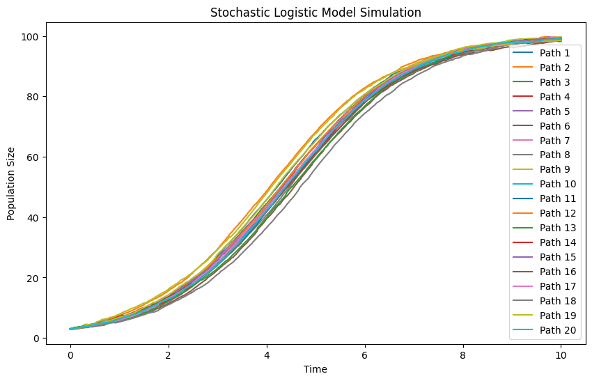
=== "D = 1"
    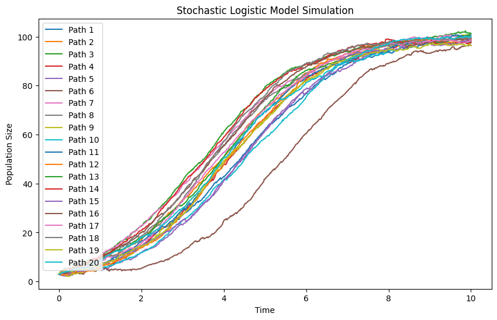
=== "D=5"
    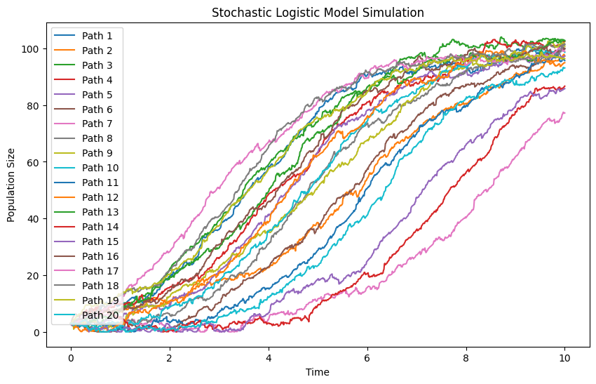
=== "D=10"
    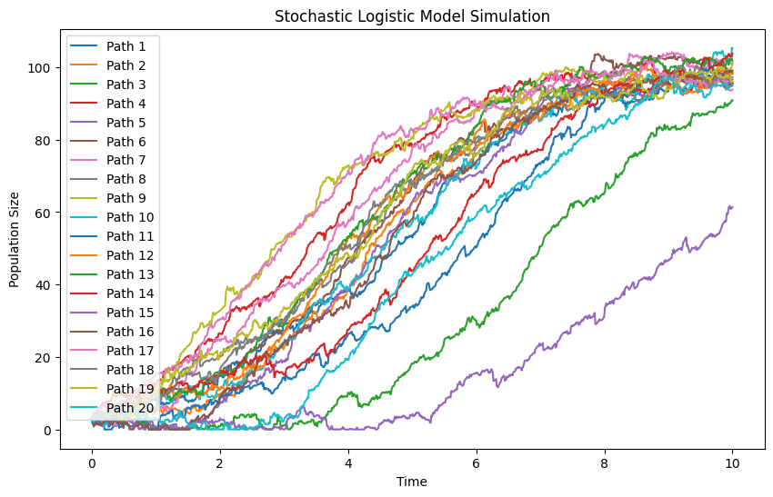
The simulation shows population growth under logistic constraints with stochastic fluctuations. Initially, the population grows exponentially but slows as it nears the carrying capacity \( K \). Random noise causes deviations from the deterministic trend, leading to varied trajectories. Higher noise intensity \( D \) increases fluctuations, sometimes pushing populations below or above expected levels. Despite randomness, most paths stabilize around \( K \) over time.

We can also consider this in the ==expectation== point of view. Given a fixed starting point, let's see what is the distribution at given time $t$ for the pupolation size.

=== "D=0.001"
    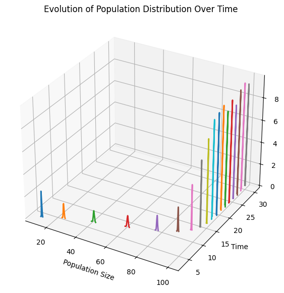
=== "D=0.1"
    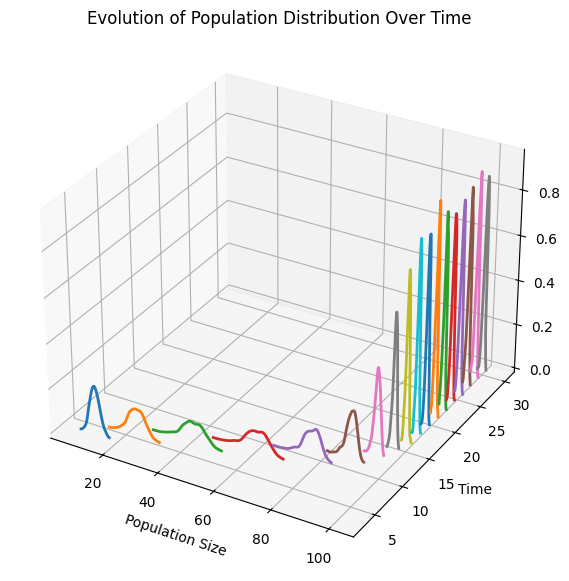
=== "D=0.5"
    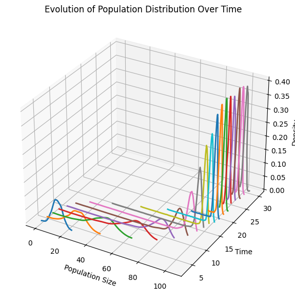
=== "D=1"
    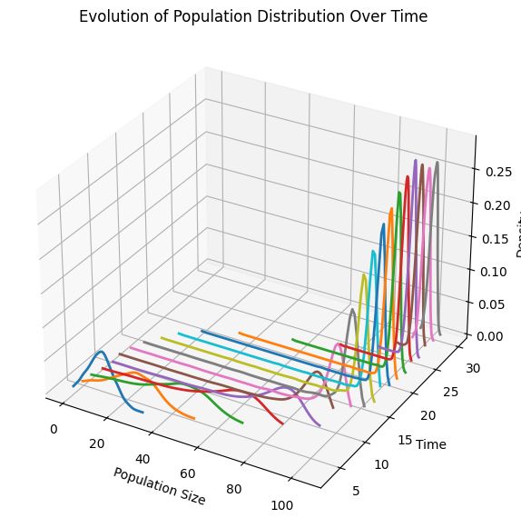
=== "D=5"
    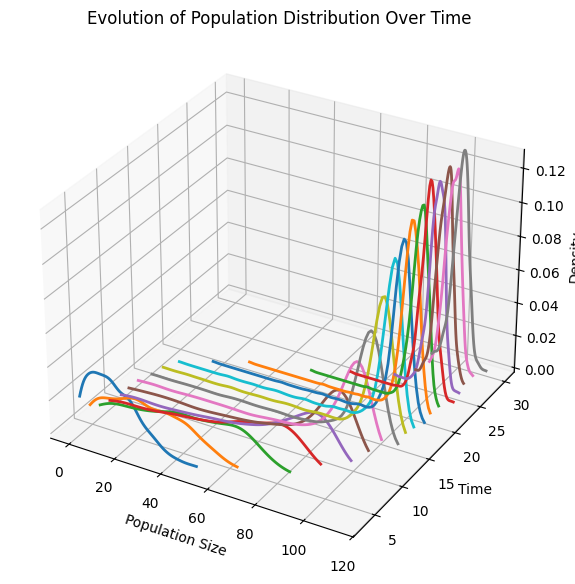
=== "D=10"
    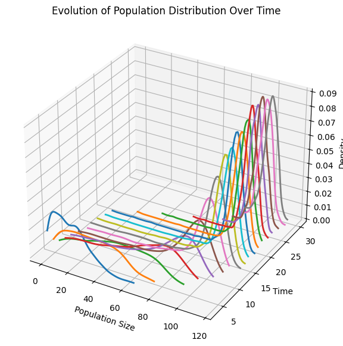
=== "D=50"
    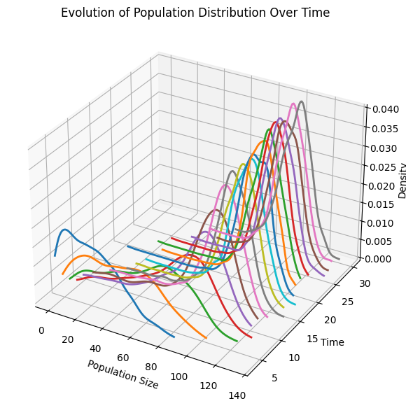
=== "Code"
    ```py3 title="simulation Code"
    import numpy as np
    import matplotlib.pyplot as plt
    import seaborn as sns
    from mpl_toolkits.mplot3d import Axes3D
    from scipy.stats import gaussian_kde

    def stochastic_logistic_SDE(X0, r, K, D, T, dt, N_paths):
        """
        Simulates the stochastic logistic model using the given SDE formulation.

        Parameters:
            X0 (float): Initial population size
            r (float): Growth rate
            K (float): Carrying capacity
            D (float): Diffusion coefficient (noise intensity)
            T (float): Total time
            dt (float): Time step size
            N_paths (int): Number of simulation paths
        """
        N_steps = int(T / dt)
        t = np.linspace(0, T, N_steps + 1)
        X = np.zeros((N_paths, N_steps + 1))
        X[:, 0] = X0

        for i in range(N_steps):
            dW = np.sqrt(2 * D * dt) * np.random.randn(N_paths)  # Brownian motion increment
            X_t = X[:, i]
            dX = r * X_t * (1 - X_t / K) * dt + dW * np.random.randn(N_paths)
            X[:, i + 1] = np.maximum(X_t + dX, 0)  # Ensure non-negativity

        return t, X

    # Parameters
    X0 = 3   # Initial population size
    r = 0.5   # Growth rate
    K = 100   # Carrying capacity
    D = 50   # Diffusion coefficient
    T = 30    # Total time
    dt = 0.01 # Time step size
    N_paths = 1000  # Number of simulation paths

    # Run simulation
    t, X = stochastic_logistic_SDE(X0, r, K, D, T, dt, N_paths)

    # Select multiple time points for distribution analysis
    time_points = np.linspace(0, T, num=20)  # Sample 10 time points
    time_points = time_points[2:]
    time_indices = [int(tp / dt) for tp in time_points]

    # Create 3D figure
    fig = plt.figure(figsize=(10, 7))
    ax = fig.add_subplot(111, projection='3d')

    # Plot smooth KDE-based distributions over time
    for i, index in enumerate(time_indices):
        kde = gaussian_kde(X[:, index])
        x_range = np.linspace(np.min(X[:, index]), np.max(X[:, index]), 100)
        density = kde(x_range)
        ax.plot(x_range, [time_points[i]] * len(x_range), density, lw=2)

    ax.set_xlabel('Population Size')
    ax.set_ylabel('Time')
    ax.set_zlabel('Density')
    ax.set_title('Evolution of Population Distribution Over Time')
    plt.show()
    ```
## Extension: Other SDE type

Below are several common forms of stochastic differential equations (SDEs) when different types of noise are used as the driving term, along with their corresponding integral forms:

### 1. SDE Driven by Brownian Motion

**Differential Form:**
$$
dX_t = b(X_t, t)\,dt + \sigma(X_t, t)\,dW_t,
$$
where:

- \(b(X_t, t)\) is the drift coefficient,
- \(\sigma(X_t, t)\) is the diffusion coefficient, and
- \(W_t\) is a standard Brownian motion.

**Integral Form:**
$$
X_t = X_0 + \int_0^t b(X_s, s)\,ds + \int_0^t \sigma(X_s, s)\,dW_s.
$$
Here, the stochastic integral \(\int_0^t \sigma(X_s, s)\,dW_s\) is interpreted in the Itô sense.

---

### 2. SDE Driven by a Lévy Process (Including Jumps)

Lévy processes generalize Brownian motion by allowing jumps. In many models, a Lévy process is represented as a combination of a continuous part (often still a Brownian motion) and a jump part, typically modeled using a compensated Poisson random measure.

**Differential Form:**
$$
dX_t = b(X_{t-}, t)\,dt + \sigma(X_{t-}, t)\,dW_t + \int_{\mathbb{R}} \gamma(X_{t-}, t, z)\,\tilde{N}(dt,dz),
$$
where:

- \(X_{t-}\) denotes the left-limit of \(X\) at time \(t\) (to handle jump discontinuities),
- \(\tilde{N}(dt,dz)\) is the compensated Poisson random measure, and
- \(\gamma(X_{t-}, t, z)\) describes the impact on \(X_t\) when a jump of size \(z\) occurs.

**Integral Form:**
$$
X_t = X_0 + \int_0^t b(X_{s-}, s)\,ds + \int_0^t \sigma(X_{s-}, s)\,dW_s + \int_0^t\int_{\mathbb{R}} \gamma(X_{s-}, s, z)\,\tilde{N}(ds,dz).
$$

---

### 3. SDE Driven by a Pure Jump Process (Jump-Diffusion Model)

In some models, the jump component is emphasized. Here, the SDE might include both a continuous part (from Brownian motion) and a pure jump part, often represented by a Poisson random measure.

**Differential Form:**
$$
dX_t = b(X_{t-}, t)\,dt + \sigma(X_{t-}, t)\,dW_t + dJ_t,
$$
where the jump process \(J_t\) is given by
$$
J_t = \int_0^t\int_{\mathbb{R}} z\,N(ds,dz),
$$
with \(N(ds,dz)\) being the (non-compensated) Poisson random measure.

**Integral Form:**
$$
X_t = X_0 + \int_0^t b(X_{s-}, s)\,ds + \int_0^t \sigma(X_{s-}, s)\,dW_s + \int_0^t\int_{\mathbb{R}} z\,N(ds,dz).
$$

---

### 4. SDE Driven by Fractional Brownian Motion (fBm)

Fractional Brownian motion \(B^H_t\) is a generalization of standard Brownian motion that exhibits self-similarity and long-range dependence. Its increments are not independent, which means that the standard Itô calculus does not apply; one must use other definitions of stochastic integration (e.g., Young integration or the rough paths approach).

**Differential Form:**
$$
dX_t = b(X_t, t)\,dt + \sigma(X_t, t)\,dB^H_t,
$$
where \(B^H_t\) is a fractional Brownian motion with Hurst parameter \(H \in (0,1)\).

**Integral Form:**
$$
X_t = X_0 + \int_0^t b(X_s, s)\,ds + \int_0^t \sigma(X_s, s)\,dB^H_s.
$$
The integral \(\int_0^t \sigma(X_s, s)\,dB^H_s\) is defined according to a theory appropriate for fractional Brownian motion, such as Young integration or the rough paths framework.

---

### Summary

- **Standard Brownian Motion:**
  Uses Itô integration; the noise is continuous and has independent, normally distributed increments.

- **Lévy Process:**
  Combines a Brownian motion component with a jump component modeled by a compensated Poisson random measure.

- **Pure Jump Process:**
  Focuses on the jump component, often represented by a Poisson random measure, sometimes combined with a Brownian motion.

- **Fractional Brownian Motion:**
  Incorporates memory effects and long-range dependence; requires alternative integration methods due to the non-independent increments.

Each of these forms is chosen based on the characteristics of the system being modeled and the specific features (such as jumps or long-range dependence) that need to be captured.

## refered book

- [AN INTRODUCTION TO STOCHASTIC DIFFERENTIAL EQUATIONS](https://www.cmor-faculty.rice.edu/~cox/stoch/SDE.course.pdf)

下图模拟了花粉(黄色)收到大量水分子的撞击进行随机的布朗运动的情形。

## reference

1. [AN INTRODUCTION TO STOCHASTIC DIFFERENTIAL EQUATIONS](https://www.cmor-faculty.rice.edu/~cox/stoch/SDE.course.pdf)
2. [扩散模型中布朗运动](https://zhuanlan.zhihu.com/p/38293827)
