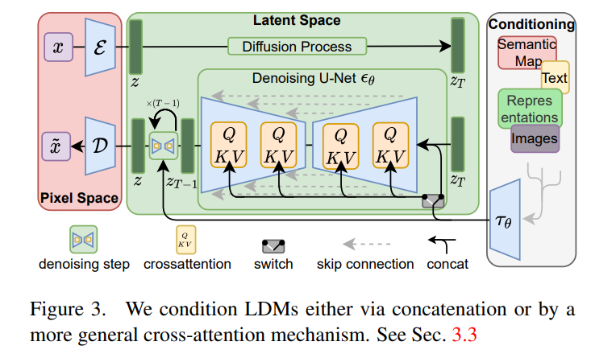
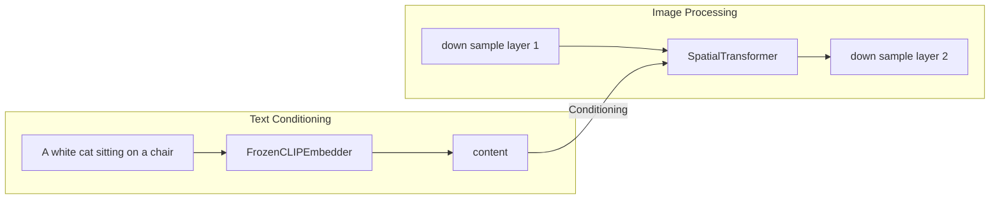
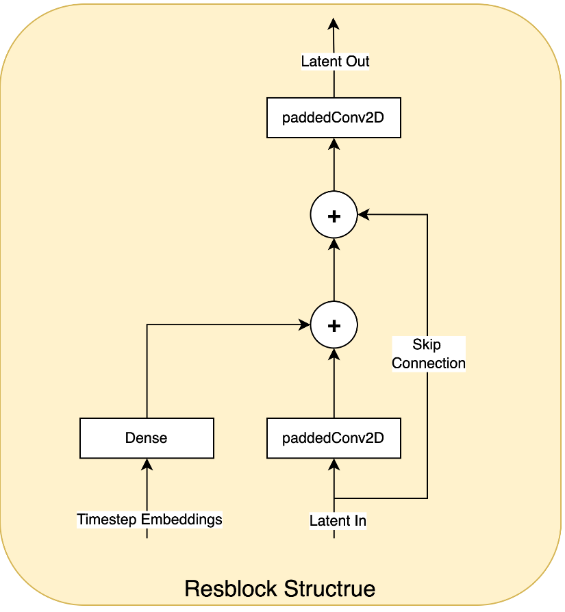
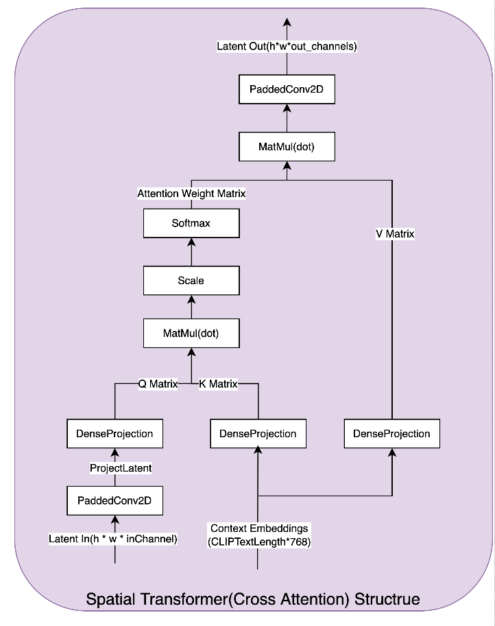

# **Understanding Latent Diffusion Models (LDMs): A Comprehensive Guide**

## **Introduction**
Latent Diffusion Models (LDMs) have revolutionized the field of generative AI by significantly improving efficiency and control in image generation tasks. Unlike traditional diffusion models that operate in pixel space, LDMs perform the diffusion process in a compressed latent space, reducing computational overhead while maintaining high-quality results. This blog explores the fundamental concepts of LDMs, their architecture, training process, and practical applications in image editing and style transfer.

---

## **1. What Are Latent Diffusion Models (LDMs)?**
LDMs are a class of diffusion models designed to operate in a lower-dimensional latent space rather than directly on high-dimensional pixel data. This key innovation allows them to be computationally efficient while retaining the expressive power of traditional diffusion models.

### **Key Concepts of LDMs**

1. **Latent Space Diffusion**: Instead of applying noise and denoising directly on images, LDMs first compress the image into a latent space using a pre-trained Variational Autoencoder (VAE). The diffusion process then occurs in this latent space.
2. **U-Net for Denoising**: LDMs utilize a U-Net-based architecture to learn the denoising process and reconstruct the original latent representation.
3. **Cross-Attention for Conditional Control**: By incorporating a cross-attention mechanism, LDMs can accept various forms of input conditions, such as text prompts, image guides, or segmentation masks.
4. **Efficient Computation**: By reducing the dimensionality of the data before diffusion, LDMs significantly lower computational requirements compared to full-resolution diffusion models.

## Conditional Generating

Besides the effects from the the latent diffusion, another important contribution is to use conditional generation.

Take the text-image as an example,

Let $\tau_\theta(y)$ be a encoder (like the clip or orther pretrained models), $\tau_\theta$ maps the condition $y$ into the space $R^{M\times d}$, and then use cross attention in the UNet to combine the condition in the model, which looks like

The overall frame work is

- Training

- Inference

The training must be jointed with the condition encodind network. If the condition encoding network is using some pretrained network, it can be fixed and the training only aligned with the latent space with the latent space from the pretrained conditioning model.

## **2. Training and Inference in LDMs**
The training and inference processes of LDMs involve multiple stages, primarily leveraging a VAE for encoding-decoding and a diffusion model for denoising.

### **(1) Training Process**

#### Train the VAE

- The VAE consists of an **encoder** that compresses an input image into a latent representation \( z \).
- A **decoder** reconstructs the image from \( z \), ensuring the latent space preserves meaningful image information.

It has two types of VAEs

##### VQ-VAE
It is exactly same as that of `VQ-GAN`, refer this article [VQ_GAN](../chapter5_GAN/vq_gan.md) for more details
##### KL-VAE
This type is modified based on the VQ-GAN, to replace the quantilizer module with the normal `KL` divergence loss. In that sense, the overall framework is simplifed as `VAE` + `GAN`

The loss can be represented as:

$$
 \mathcal{L} = \frac{1}{N} \sum_{i=1}^{N} \| x_i - \hat{x}_i \|^2+ \sum_{l} \lambda_l \| \phi_l(x) - \phi_l(G(z)) \|_2^2  + \frac{1}{2} \sum_{j=1}^{d} (1 + \log \sigma_{i,j}^2 - \mu_{i,j}^2 - \sigma_{i,j}^2)+ L_{adv}
$$
Refer [Latent Diffusion](./ldm_handson.md) for more details about the coding.

#### Train the Latent Diffusion Model

- Noise is gradually added to the latent representation \( z \), following a Gaussian noise schedule.
- The U-Net model learns to denoise and recover the original latent representation.

### **(2) Inference Process**

1. **Start with Random Noise**: Generate a noisy latent variable \( z_T \).
2. **Denoising Through U-Net**: The trained U-Net progressively removes noise, reconstructing a meaningful latent representation \( z_0 \).
3. **Decode Back to Image**: The VAE decoder converts the denoised latent representation into a final high-resolution image.

This workflow enables **fast and high-quality image synthesis**, forming the backbone of models like **Stable Diffusion**.

---

## **3. Applications of LDMs**
LDMs enable a range of advanced applications in image generation and editing. Below, we explore two key applications: **image editing** and **style transfer**.

### **(1) Image Editing with LDMs**
LDMs provide powerful image editing capabilities, including **Inpainting** and **Outpainting**, by leveraging latent space manipulations.

#### **A. Inpainting (Filling Missing Regions)**

- **Goal**: Fill missing parts of an image naturally while keeping the existing content unchanged.
- **Process**:
  1. Encode the image into latent space.
  2. Apply noise selectively to the missing region.
  3. Use the U-Net denoising model to reconstruct plausible content.
  4. Decode the latent representation back into an image.

📌 **Real-world example**: Adobe Photoshop’s "Generative Fill" uses similar techniques for intelligent image restoration.

#### **B. Outpainting (Expanding Image Boundaries)**

- **Goal**: Extend an image beyond its original borders while preserving its consistency.
- **Process**:
  1. Encode the original image.
  2. Initialize the extended region with random noise.
  3. Perform controlled denoising while maintaining visual coherence.
  4. Decode the expanded latent space back into a complete image.

📌 **Real-world example**: OpenAI’s DALL·E 2 uses outpainting for creative image expansion.

---

### **(2) Style Transfer with LDMs**
Style transfer refers to transforming an image into a new artistic style while maintaining its structural content. LDMs achieve this through two main approaches:

#### **A. Direct Latent Space Manipulation**

- **Process**:
  1. Encode the image into latent space.
  2. Introduce a style prompt (e.g., "Van Gogh style").
  3. Modify the denoising process with a cross-attention mechanism to enforce the style.
  4. Decode the final image.

📌 **Example**: Stable Diffusion allows users to generate images in various artistic styles using text prompts.

#### **B. Fine-tuning with DreamBooth or ControlNet**

1. **DreamBooth**:
   - Fine-tunes an LDM with a few style-specific images to learn and replicate custom styles.
   - Useful for **custom artistic portrait generation**.

2. **ControlNet**:
   - Guides the diffusion process using structural constraints like **depth maps, edge detection, or pose estimation**.
   - Enables precise **style transfer with structural preservation**.

📌 **Example**: ControlNet is widely used for **anime-style conversions** and **photo-to-painting transformations**.

---

## **4. Key Advantages of LDMs**

| Feature | Description |
|---------|------------|
| **Computational Efficiency** | LDMs perform diffusion in a compressed latent space, reducing the cost significantly. |
| **High-Quality Image Generation** | Produces highly detailed and realistic images. |
| **Flexible Conditioning** | Allows fine-grained control through text prompts, sketches, depth maps, etc. |
| **Versatile Applications** | Used in text-to-image generation, inpainting, style transfer, and more. |

## Code Explain

Overall structure of the network

### Combination of condition information

{width=30%}
{width=30%}
## Conclusion
Latent Diffusion Models (LDMs) have emerged as a groundbreaking approach in AI-generated content. By performing diffusion in latent space, they **enhance efficiency, improve image quality, and enable advanced conditional control mechanisms**. Their applications range from **text-to-image generation to professional-grade image editing and style transfer**.

With continuous advancements, LDM-based models like **Stable Diffusion** are shaping the future of generative AI, making high-quality image synthesis accessible to a broad audience.

## Further Reading

- 📄 [High-Resolution Image Synthesis with Latent Diffusion Models](https://arxiv.org/abs/2112.10752) - The original LDM paper by Rombach et al.
- 🛠️ [Stable Diffusion GitHub](https://github.com/CompVis/stable-diffusion) - Open-source implementation of LDMs.
- 🎨 [ControlNet for Stable Diffusion](https://github.com/lllyasviel/ControlNet) - Advanced conditioning techniques for precise control.
