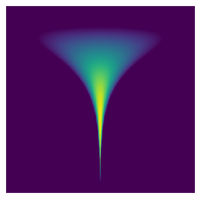

# Understanding Probability Flow ODE: Converting SDEs into Deterministic Sampling

## Introduction

Score-based generative models (SBMs) and diffusion models rely on **stochastic differential equations (SDEs)**  to model data distributions. However, while SDEs introduce randomness in sample trajectories, they can be **converted into an equivalent ordinary differential equation (ODE)**  that retains the same probability density evolution. This ODE, known as the **Probability Flow ODE** , enables **deterministic sampling**  while preserving the learned data distribution.
This post will:

- **Explain how SDE-based models generate samples**

- **Derive Probability Flow ODE from Fokker-Planck theory**

- **Provide an intuitive understanding of why this works**

- **Give a Python implementation for deterministic sampling**

---

## What is an SDE-Based Generative Model?

A **stochastic differential equation (SDE)**  is used to describe how data evolves over time:

$$
 dx = f(x, t) dt + g(t) dW
$$

where:

- $f(x, t)$ is the **drift term**  (deterministic evolution).

- $g(t) dW$ is the **diffusion term**  (random noise from a Wiener process $dW$).

- $p_t(x)$ is the **time-dependent probability density**  of $x_t$.
Since SDEs include **random noise** , different samples follow different trajectories even if they start at the same initial condition.

---

## The Fokker-Planck Equation

The Key to Probability Density Evolution**Although each sample follows a **random trajectory** , the probability density function $p_t(x)$**  follows a deterministic evolution governed by the **Fokker-Planck equation (FPE)** :
$$
 \frac{\partial p_t(x)}{\partial t} = -\nabla \cdot (f(x, t) p_t(x)) + \frac{1}{2} g^2(t) \nabla^2 p_t(x)
$$

- The **first term**  $-\nabla \cdot (f(x, t) p_t(x))$ describes the effect of the drift term $f(x, t)$ on the probability density.

- The **second term**  $\frac{1}{2} g^2(t) \nabla^2 p_t(x)$ captures how diffusion smooths out the density over time.
Even though each particle moves randomly, the overall probability distribution $p_t(x)$ evolves in a **deterministic**  manner.

---

## How Can We Convert an SDE into an ODE?

Since the probability density $p_t(x)$ follows a **deterministic**  equation (FPE), there should exist a corresponding **deterministic process**  that moves samples in a way that preserves the same $p_t(x)$.

This motivates the idea of a **Probability Flow ODE** :

$$
 dx = v(x, t) dt
$$

where $v(x, t)$ is a velocity field ensuring that the samples evolve according to the same probability density as the SDE, which is

$$
dx = \left[ f(x, t) - \frac{1}{2} g^2(t) s_t(x) \right] dt
$$

where $s_t(x) = \nabla_x \log p_t(x)$ is the **score function**  (gradient of the log density).

Proof: Convert SDE to Probability Flow ODE

Using the continuity equation  from fluid mechanics, the deterministic probability flow should satisfy:

$$
\frac{\partial p_t(x)}{\partial t} = -\nabla \cdot (v(x, t) p_t(x))
$$

For this to be **equivalent to the Fokker-Planck equation** , we set:

$$
-\nabla \cdot (v(x, t) p_t(x)) = -\nabla \cdot (f(x, t) p_t(x)) + \frac{1}{2} g^2(t) \nabla^2 p_t(x)
$$

Rearranging:

$$
v(x, t) p_t(x) = f(x, t) p_t(x) - \frac{1}{2} g^2(t) \nabla p_t(x)
$$

Dividing by $p_t(x)$ (assuming $p_t(x) > 0$):

$$
v(x, t) = f(x, t) - \frac{1}{2} g^2(t) \frac{\nabla p_t(x)}{p_t(x)}
$$

Since the **score function**  is:

$$
s_t(x) = \nabla_x \log p_t(x) = \frac{\nabla_x p_t(x)}{p_t(x)}
$$

we obtain the **Probability Flow ODE** :

$$
dx = \left[ f(x, t) - \frac{1}{2} g^2(t) s_t(x) \right] dt
$$

Thus, we have converted the original SDE into an equivalent deterministic ODE that preserves the same probability density evolution!

## Intuition: Why Does This Work?

- **SDE**  = Particles move randomly, but their overall density evolves deterministically.

- **ODE**  = Particles move deterministically in a way that ensures the density evolves the same way.

Thus, we can **replace SDE sampling with Probability Flow ODE sampling**  without changing the generated distribution!

## Implementing Probability Flow ODE Sampling

We can implement Probability Flow ODE sampling using an **ODE solver**  like `torchdiffeq.odeint`:

```python
import torch
from torchdiffeq import odeint

def probability_flow_ode(x, t, score_model):
    score = score_model(x, t)  # Compute score function s_t(x)
    drift = f(x, t) - 0.5 * g(t)**2 * score
    return drift

# Solve the ODE to generate samples
x_generated = odeint(probability_flow_ode, x_init, t_space)
```

- **Key difference from SDE sampling** :
  - No randomness → Every run gives identical outputs.

  - Faster sampling → Fewer steps needed than stochastic diffusion.

## Existence Condition and Uniqueness Condition

**Existence Conditions**

For $v(x, t)$ to **exist** , the following conditions must hold:

| Condition | Explanation |
| --- | --- |
| $p_t(x)$ is continuously differentiable ($p_t(x) \in C^1$) | Ensures that $\nabla_x p_t(x)$ and $\nabla_x \log p_t(x)$ are well-defined. |
| $p_t(x) > 0$ for all $x$ | Avoids division by zero in the score function $s_t(x) = \nabla_x \log p_t(x)$. |
| Drift term $f(x, t)$ is well-defined | Ensures the continuity equation has a meaningful solution. |
| $p_t(x)$ evolves deterministically under Fokker-Planck equation | The probability density function should not be singular. |
| $g(t) > 0$ (Non-degenerate diffusion) | If $g(t) = 0$, then the SDE is already deterministic and trivially satisfies an ODE. |

**Uniqueness Conditions**

| Condition | Explanation |
| --- | --- |
| $p_t(x)$ is log-concave ($\nabla^2 \log p_t(x) \preceq 0$) | Ensures the score function $s_t(x) = \nabla_x \log p_t(x)$ is unique and stable. |
| No divergence-free component in $v(x, t)$ | If an alternative field $v'(x,t)=v(x,t)+v_{div-free}​(x,t)$ exists, $v(x, t)$ is not unique. |
| $p_t(x)$ is strictly positive and smooth | Avoids singularities and undefined score function regions. |
| Drift term $f(x, t)$ is uniquely defined | Ensures a single solution to the continuity equation. |

## Experiment

### Target Distribution

The Funnel distribution is defined as follows:

- \( v \sim \mathcal{N}(0, 3^2) \)
- \( x \mid v \sim \mathcal{N}\bigl(0, \exp(v)\bigr) \)

Thus, the joint density is given by:

$$
p(x,v) = \frac{1}{3\sqrt{2\pi}} \exp\left(-\frac{v^2}{18}\right)
\cdot \frac{1}{\sqrt{2\pi\,\exp(v)}} \exp\left(-\frac{x^2}{2\exp(v)}\right)
$$



### sampling formula
Below are the expressions for the original distribution, the Langevin (diffusion) process, the DDPM reverse diffusion SDE, and the corresponding probability flow ODE for DDPM sampling.

#### Langevin Diffusion Expression

In overdamped Langevin dynamics, the update rule for a state \( z = (x,v) \) is:

$$
z_{t+1} = z_t + \epsilon\,\nabla_z \log p(z_t) + \sqrt{2\epsilon}\,\xi_t,\quad \xi_t \sim \mathcal{N}(0, I)
$$

This iterative update gradually moves samples toward the target distribution \( p(x,v) \).

#### DDPM Reverse Diffusion SDE

For a variance-preserving (VP) forward SDE defined as

$$
dx = -\frac{1}{2}\beta(t)x\,dt + \sqrt{\beta(t)}\,dW_t,
$$

the reverse-time SDE used for sampling (starting from pure Gaussian noise at \( t=1 \)) is:

$$
dx = \left[-\frac{1}{2}\beta(t)x - \beta(t)\nabla_x\log p_t(x)\right]\,dt + \sqrt{\beta(t)}\,d\bar{W}_t.
$$

Here, \( \nabla_x\log p_t(x) \) is the score function at time \( t \).

#### DDPM Probability Flow ODE

The deterministic probability flow ODE corresponding to the DDPM SDE is given by:

$$
dx = \left[-\frac{1}{2}\beta(t)x - \frac{1}{2}\beta(t)\nabla_x\log p_t(x)\right]\,dt.
$$

Solving this ODE from \( t=1 \) (Gaussian noise) to \( t=0 \) yields samples that follow the target distribution.

These expressions form the basis for diffusion-based generative modeling—from the formulation of the target distribution to sampling via both stochastic reverse diffusion and its deterministic ODE counterpart.

Sampling by the Langevin Dynamics


Now we build a diffusion process that convert the tunnel distribution into the Gaussian distribution in the same way as DDPM

sampling with DDPM inverse SDE


Sampling with Probability Flow ODE

## Conclusion

- **Every SDE can be converted into a Probability Flow ODE.**

- **The deterministic ODE preserves the same probability density as the SDE.**

- **Probability Flow ODE allows for efficient, repeatable sampling.**

- **ODE solvers can be used instead of SDE solvers for generative modeling.**
By leveraging Probability Flow ODE, **we gain a powerful tool for deterministic yet efficient sampling in deep generative models** . 🚀

## Further Reading

- **Song et al., "Score-Based Generative Modeling through Stochastic Differential Equations," NeurIPS 2021**

- **Chen et al., "Neural ODEs," NeurIPS 2018**

- **Fluid mechanics: Continuity equation and probability flow**

- **"The Probability Flow ODE is Provably Fast"**
*Authors:* Sitan Chen, Sinho Chewi, Holden Lee, Yuanzhi Li, Jianfeng Lu, Adil Salim
*Summary:* This paper provides the first polynomial-time convergence guarantees for the probability flow ODE implementation in score-based generative modeling. The authors develop novel techniques to study deterministic dynamics without contractivity.
*Link:* [arXiv:2305.11798](https://arxiv.org/abs/2305.11798)

- **"Convergence Analysis of Probability Flow ODE for Score-based Generative Models"**
*Authors:* Daniel Zhengyu Huang, Jiaoyang Huang, Zhengjiang Lin
*Summary:* This work studies the convergence properties of deterministic samplers based on probability flow ODEs, providing theoretical bounds on the total variation between the target and generated distributions.
*Link:* [arXiv:2404.09730](https://arxiv.org/abs/2404.09730)
**2. Practical Implementations and Tutorials:**
- **"On the Probability Flow ODE of Langevin Dynamics"**
*Author:* Mingxuan Yi
*Summary:* This blog post offers a numerical approach using PyTorch to simulate the probability flow ODE of Langevin dynamics, providing insights into practical implementation.
*Link:* [Mingxuan Yi's Blog](https://mingxuan-yi.github.io/blog/2023/prob-flow-ode/)

- **"Generative Modeling by Estimating Gradients of the Data Distribution"**
*Author:* Yang Song
*Summary:* This post discusses learning score functions (gradients of log probability density functions) on noise-perturbed data distributions and generating samples with Langevin-type sampling.
*Link:* [Yang Song's Blog](https://yang-song.net/blog/2021/score/)
**3. Advanced Topics and Related Methods:**
- **"An Introduction to Flow Matching"**
*Authors:* Cambridge Machine Learning Group
*Summary:* This blog post introduces Flow Matching, a generative modeling paradigm combining aspects from Continuous Normalizing Flows and Diffusion Models, offering a unique perspective on generative modeling.
*Link:* [Cambridge MLG Blog](https://mlg.eng.cam.ac.uk/blog/2024/01/20/flow-matching.html)

- **"Flow Matching: Matching Flows Instead of Scores"**
*Author:* Jakub M. Tomczak
*Summary:* This article presents a different perspective on generative models with ODEs, discussing Continuous Normalizing Flows and Probability Flow ODEs.
*Link:* [Jakub M. Tomczak's Blog](https://jmtomczak.github.io/blog/18/18_fm.html)
