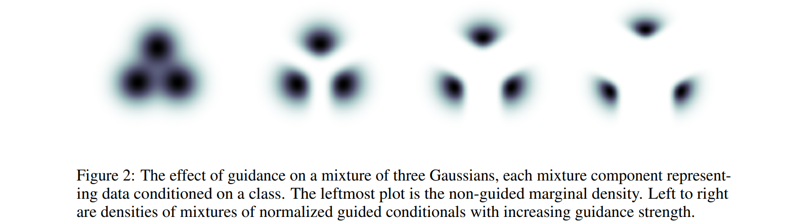
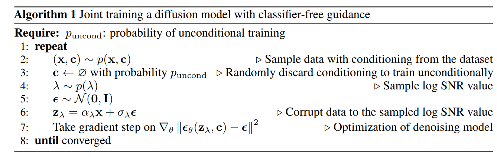
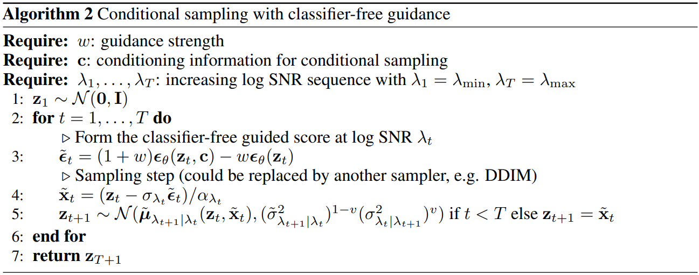

# Guidance of diffusion model

!!! note ""

    - Classifier Guidance: https://arxiv.org/abs/2105.05233
        - openai
        - Prafulla Dhariwal & Alex Nichol
    - Classifier Free Guidance: https://arxiv.org/pdf/2207.12598
        - google
        - **Tim Salimans**
            - **Generative Adversarial Networks (GANs) Improvements**
                - Developed techniques to improve GAN training stability
                - Introduced **semi-supervised learning with GANs**
                - Proposed **Inception Score** for evaluating generative models
            - **Autoregressive Models**
                - Worked on **PixelCNN++** and **GPT-1**
                - Contributed to sequence modeling advancements
            - **Variational Autoencoders (VAEs)**
                - Research in probabilistic generative modeling
                - Explored methods to improve sample quality and latent space learning
            - **Diffusion Models & Acceleration**
                - Contributed to **Imagen** (Google's high-quality text-to-image model)
                - Focused on **Imagen Video** for video generation
                - Developed **distillation techniques** to accelerate diffusion model inference

        - **Jonathan Ho**
            - **Denoising Diffusion Probabilistic Models (DDPM)**
                - Introduced a novel approach to generative modeling
                - Stepwise noise addition and removal for high-quality image synthesis
                - Established the foundation for modern diffusion models
            - **Diffusion Models**
                - Basis for state-of-the-art generative AI research
                - Inspired numerous advancements in image and video generation
            - **Google Research**
                - Works as a research scientist
                - Focused on AI, deep learning, and probabilistic generative models

## Classifier Guidance

Classifier guidance in diffusion models introduces an auxiliary classifier \( p_\theta(c | z_\lambda) \) that adjusts the score function \( \epsilon_\theta(z_\lambda, c) \) by incorporating the gradient of the log-likelihood of the classifier. This results in modifying the sampling process to encourage the generation of samples that the classifier confidently associates with the target class \( c \).

### Background: Score Function in Diffusion Models
Diffusion models rely on **score-based sampling**, where the denoising function \( \epsilon_\theta(z_\lambda, c) \) predicts noise at each timestep \( \lambda \) in the reverse diffusion process. The fundamental idea is to approximate:
$$
\epsilon_\theta(z_\lambda, c) \approx -\sigma_\lambda \nabla_{z_\lambda} \log p_\theta(z_\lambda | c)
$$
where:

- \( z_\lambda \) is the latent variable (noisy sample at time \( \lambda \)),
- \( p_\theta(z_\lambda | c) \) is the true conditional distribution we wish to sample from,
- \( \sigma_\lambda \) is the noise level.

### Classifier Guidance: Adjusting the Score Function

Instead of relying purely on the diffusion model's learned score, we introduce an auxiliary classifier \( p_\theta(c | z_\lambda) \) that provides an additional gradient term. This is done by **reweighting the gradient of the log-likelihood** of the classifier.

The modified score function incorporates this additional term:

$$
\tilde{\epsilon}_\theta(z_\lambda, c) = \epsilon_\theta(z_\lambda, c) - w \sigma_\lambda \nabla_{z_\lambda} \log p_\theta(c | z_\lambda).
$$

Since we know from Bayes' rule:

$$
\log p_\theta(z_\lambda | c) = \log p(z_\lambda) + \log p_\theta(c | z_\lambda) - \log p(c),
$$

taking the gradient with respect to \( z_\lambda \) gives:

$$
\nabla_{z_\lambda} \log p_\theta(z_\lambda | c) = \nabla_{z_\lambda} \log p(z_\lambda) + \nabla_{z_\lambda} \log p_\theta(c | z_\lambda).
$$

Thus, the modified score function can be rewritten as:

$$
\tilde{\epsilon}_\theta(z_\lambda, c) = -\sigma_\lambda \nabla_{z_\lambda} \left[ \log p_\theta(z_\lambda | c) + w \log p_\theta(c | z_\lambda) \right].
$$

This means that the diffusion model now **upweights regions of the sample space where the classifier assigns high confidence to the target class**.

### Classifier-Guided Sampling Distribution

By modifying the score function, we change the implicit generative distribution. The resulting conditional sampling distribution follows:

$$
\tilde{p}_\theta(z_\lambda | c) \propto p_\theta(z_\lambda | c) p_\theta(c | z_\lambda)^w.
$$

- The term \( p_\theta(c | z_\lambda)^w \) acts as a **reweighting factor**, increasing the probability of samples where the classifier confidently predicts class \( c \).
- As \( w \to 0 \), the model behaves like a standard conditional diffusion model.
- As \( w \to \infty \), the distribution concentrates on a small region of high-classifier-confidence samples, leading to **better Inception Scores** but reduced diversity.

### Comparing Classifier Guidance for Conditional vs. Unconditional Models

We can analyze the effect of applying classifier guidance to an unconditional model. If we start with an unconditional prior:

$$
\tilde{p}_\theta(z_\lambda) \propto p_\theta(z_\lambda) p_\theta(c | z_\lambda)^{w+1},
$$

which shows that applying classifier guidance with weight \( w + 1 \) to an unconditional model **should theoretically** match applying guidance with weight \( w \) to a conditional model.

However, in practice:

- **Best results** are obtained when classifier guidance is applied to an already class-conditional model.
- This suggests that learning class-conditioned priors during training is beneficial, even when applying guidance at inference time.

### Summary of Classifier Guidance in Diffusion Models
#### Key Equations

1. **Classifier-Guided Score Function**

   $$
   \tilde{\epsilon}_\theta(z_\lambda, c) = -\sigma_\lambda \nabla_{z_\lambda} \left[ \log p_\theta(z_\lambda | c) + w \log p_\theta(c | z_\lambda) \right].
   $$

2. **Modified Sampling Distribution**

   $$
   \tilde{p}_\theta(z_\lambda | c) \propto p_\theta(z_\lambda | c) p_\theta(c | z_\lambda)^w.
   $$

3. **Effect of Increasing Guidance Strength \( w \):**
    
   - **Higher \( w \)** → Better class consistency, improved **Inception Score**.
   - **Higher \( w \)** → Lower diversity, risk of mode collapse.
   - **Using classifier guidance on a conditional model performs better than using it on an unconditional model**.

#### **Practical Implications:**

- **Tuning \( w \)** is crucial: setting it too high leads to overfitting to classifier decisions.
- **Using classifier guidance with a conditional diffusion model** is empirically superior to using it with an unconditional model.

This derivation provides the theoretical foundation for classifier-guided diffusion models and explains how they bias generation towards perceptually better samples while balancing diversity. 🚀

## Classifier Free Guidance



Instead of having an explicit conditional score function

$$\nabla \log p_t(c|z_\lambda)$$

where the gradient is taken with respect to $z_\lambda$,

let's see if we can find an implicit representation of the conditional score function.

We want to express the gradient of the log-likelihood of the classifier \( p_\theta(c | z_\lambda) \) in terms of the gradients of the **unconditional log-likelihood** \( p_\theta(z_\lambda) \) and the **conditional log-likelihood** \( p_\theta(z_\lambda | c) \).

Using Bayes' theorem, we express the classifier probability \( p_\theta(c | z_\lambda) \) as:

$$
p_\theta(c | z_\lambda) = \frac{p_\theta(z_\lambda | c) p(c)}{p_\theta(z_\lambda)}
$$

Taking the logarithm:

$$
\log p_\theta(c | z_\lambda) = \log p_\theta(z_\lambda | c) + \log p(c) - \log p_\theta(z_\lambda)
$$

Now, we differentiate both sides with respect to \( z_\lambda \):

$$
\nabla_{z_\lambda} \log p_\theta(c | z_\lambda) = \nabla_{z_\lambda} \log p_\theta(z_\lambda | c) - \nabla_{z_\lambda} \log p_\theta(z_\lambda)
$$

where:

- \( \nabla_{z_\lambda} \log p_\theta(z_\lambda | c) \) is the **conditional score function**.
- \( \nabla_{z_\lambda} \log p_\theta(z_\lambda) \) is the **unconditional score function**.

Thus, we have derived:

$$
\nabla_{z_\lambda} \log p_\theta(c | z_\lambda) = \nabla_{z_\lambda} \log p_\theta(z_\lambda | c) - \nabla_{z_\lambda} \log p_\theta(z_\lambda)
$$

**Interpretation**

- This equation shows that the gradient of the classifier's log-likelihood can be **interpreted as the difference between the conditional and unconditional score functions**.
- This explains why **classifier guidance** modifies the score function in diffusion models—by shifting the unconditional score towards the class-conditional score.

In **Classifier-Guided Diffusion Models**, we modify the score function:

$$
\tilde{s}_\theta(z_\lambda, c) = s_\theta(z_\lambda, c) + w \nabla_{z_\lambda} \log p_\theta(c | z_\lambda)
$$

Substituting our derived equation:

$$
\tilde{s}_\theta(z_\lambda, c) = s_\theta(z_\lambda, c) + w [ s_\theta(z_\lambda, c) - s_\theta(z_\lambda)]
$$

which simplifies to:

$$
\tilde{s}_\theta(z_\lambda, c) = (1 + w) s_\theta(z_\lambda, c) - w s_\theta(z_\lambda)
$$

This is exactly the **Classifier-Free Guidance (CFG) formula**, showing that CFG **implicitly approximates classifier guidance without explicitly computing classifier gradients**.

Here we have an experiment on the guidance scale. When the value of $w$ increases, the model follows the prompt more tightly. However, if it is too large, this will result in poor quality.


=== "Classifier-Guided Diffusion (CG)"

    ```py3
    def classifier_guided_score(score_func, classifier, z_lambda, c, w, sigma_lambda):
        """
        Compute classifier-guided score.

        Args:
            score_func: Function predicting the unconditional score.
            classifier: Function computing log p(c | z_lambda).
            z_lambda: Current noisy sample.
            c: Target class.
            w: Guidance strength.
            sigma_lambda: Noise level.

        Returns:
            Adjusted score function.
        """
        base_score = score_func(z_lambda, c)  # s_theta(z_lambda, c)
        classifier_grad = torch.autograd.grad(classifier(z_lambda, c), z_lambda, retain_graph=True)[0]
        return base_score + w * sigma_lambda * classifier_grad
    ```

=== "Classifier-Free Guidance (CFG)"

    ```py3
    def classifier_free_score(score_func, z_lambda, c, w):
        """
        Compute classifier-free guided score.

        Args:
            score_func: Function predicting the score.
            z_lambda: Current noisy sample.
            c: Target class.
            w: Guidance strength.

        Returns:
            Adjusted score function.
        """
        score_cond = score_func(z_lambda, c)  # Conditional score s_theta(z_lambda, c)
        score_uncond = score_func(z_lambda, None)  # Unconditional score s_theta(z_lambda)
        return (1 + w) * score_cond - w * score_uncond
    ```

    !!! note "twice forward"

        For the classifier free guidance algorithm, it takes two forward each step which may be not that efficiency. This can be optimized
