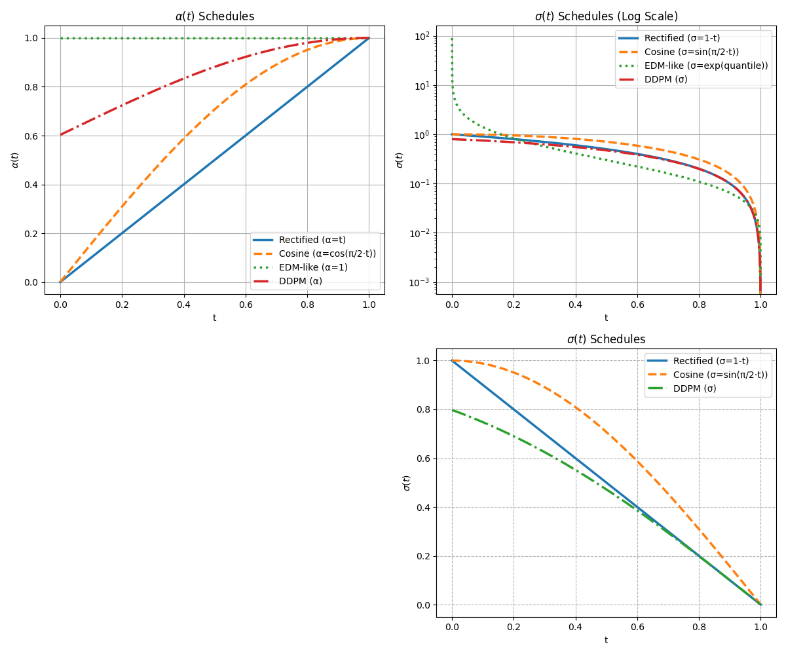

# Affine conditional flows

!!! note "Note"
    Please refere the article in flow matching theory for the general formula of flow matching and its optimization target.
    In this article, we will introduce the family of affine conditional flows from general to specific.

Although, we have studied the general conditional flow matching, but in pratice, it is usually used choose an another type of flow matching

!!! def "Trajectory"

    $$\tag{1} x_{t|1} = \psi_t(x_0|x_1) =  \alpha_t x_1 + \sigma_t x_0$$

The notation here is a little different from the diffusion process. In diffusion, $x_0$ means the clear image, $x_T$ or $x_1$ is the final noise distribution. But in the flow matching, in the forward process, we are pushiong the initial distribution $x_0$ (noise distribution) to the final data distribution $x_1$. Don't be confusing with diffusion notations. Please check the diffusion flow as described in [SDE diffusion unified representation](../chapter7_diffusion/sde_diffusion_unified_representation.md)

We still use the same name "scaling"  $\alpha_t$ and "scheduling"  $\sigma_t$, where scheduling controls the variance. We still need to ensure the initial condition and monotanuous increasing peroperties.

1. **确保插值路径的单调可逆性**
   在最简单的线性插值思路里，我们可能写下

   $$
   \psi_t(x,y) \;=\; \alpha_t\,x \;+\; \sigma_t\,y,
   $$

   其中 \(\alpha_t\) 从 0 单调增加到 1，\(\sigma_t\) 从 1 单调减少到 0。这样一来， \(\psi_0(x,y)=x\)（具体取决于边界条件），\(\psi_1(x,y)=y\)。若要保证这条“从 \(x\) 到 \(y\)”的路径在 \(t\in[0,1]\) 上不出现奇怪的回头、停滞、或者自相交等现象，就希望它的速度

   $$
   \frac{\mathrm{d}}{\mathrm{d}t}\,\psi_t(x,y)
   \;=\;
   \alpha'_t\,x \;+\; \sigma'_t\,y
   $$

   不要在中间时刻变号或变得奇异。通常会要求 \(\alpha'_t>0\)、\(\sigma'_t<0\)，因此 \(\alpha'_t - \sigma'_t > 0\)，可以理解为**插值系数一个严格上升、一个严格下降**，从而整个流是严格单调的，保证可逆。

2. **保证流场在“从 \(p\) 到 \(q\)”的方向上不会退化**
   在 Flow Matching 框架中，我们往往需要学一个速度场 \(v_\theta(x,t)\)，使得从初始分布 \(p\) 沿着这个流场积分到终止分布 \(q\)。如果 \(\alpha_t - \sigma_t\) 不满足某些正性（或单调性）条件，就有可能在中间某个时刻出现“停滞”或“逆向”流动，使得我们在做流形变换/ODE 积分时遇到奇异或不可逆的情况。
   - 例如，如果 \(\alpha_t\) 和 \(\sigma_t\) 都在某处“停”下来，或者二者的增减方向相反，就会让插值曲线在那段时间几乎不动，或者反复来回，这会给后续的流匹配带来困难。
   - 保持 \(\alpha_t\) 严格上升、\(\sigma_t\) 严格下降，也就意味着在任意时刻 \(t\) 都有一个确定且不为零的“前进方向”，从而流是**无奇点、可逆的**。

3. **数学推导中常见的边界与光滑性约束**
   在很多文献或推导中，会给出类似

   $$
   \alpha_0 = 0,\quad \alpha_1 = 1,\quad
   \sigma_0 = 1,\quad \sigma_1 = 0,\quad
   \alpha'_t>0,\;\sigma'_t<0\;\;\text{对 }t\in(0,1),
   $$

   这组条件直接蕴含了 \(\alpha_t - \sigma_t\) 在区间 \((0,1)\) 内是严格增加的，从而不为 0 并且不会出现符号翻转。这样就能确保从 \(t=0\) 到 \(t=1\) 的整个插值/流动在分布变换中是“干净”的。

Note that in some paper, in order to be consistent to notation of the diffusion, one may reverse the source and target distribution, that is

$$x_t = \alpha_t x_0 +  \sigma_t x_1$$

Now, the $x_0$ is the target distribution $x_1$ is a simple distribution similar as the noising diffusion process and the conditional distribution transit from $p_0 =p_{data}$ to $p_t(x|x_0) = \mathcal{N}(x|\alpha_t x_0, \sigma_t^2 I)$

!!! note "Velocity Field"

    $$
    \begin{aligned}
    v(x,t) &= E\left[ \frac{d \alpha_t}{dt} X_1 + \frac{d \sigma_t}{d t} X_0 \bigg| X_t = x\right]\\
    & = E_{\{x_0,x_1,t\}}\bigl[ \dot\alpha_t X_1+ \dot\sigma_t X_0| X_t = x\bigr]
    \end{aligned}
    $$

From the flow matching theory, we can prove that in the aboved defined trajectory push the probability $p(X_0)$ to $p(X_1)$.

在很多流匹配（Flow Matching）**或** 随机桥（Schrödinger Bridge）等场景下，我们希望在中间时刻 $t$ 看到某些状态 $X_t=x$ 时，对“来自哪里（$X_0$）”、“要去哪里（$X_1$）”这些信息做加权平均，从而构造一个**速度场** 或**漂移项**  $v_t(x)$。因此就会出现：

$$
v_t(x)\;=\;\underbrace{\mathbb{E}\bigl[\dot\alpha_t\,X_1 \;+\;\dot{\sigma}_t\,X_0 \;\bigm|\; X_t = x\bigr]}_{\text{对 }X_0,X_1\text{ 的条件期望}}\;=\;\int \!\!\int
\bigl(\dot\alpha_t\,x_1 + \dot{\sigma}_t\,x_0\bigr)\,
\mathrm{d}\mathbb{P}\bigl(X_0=x_0,X_1=x_1 \,\bigm|\; X_t=x\bigr).
$$

- 也就是说，给定此刻处于 $x$，我们对所有可能的“初始点 $X_0$ 和目标点 $X_1$”做期望，就得到一个确定性的数值（或向量）$v_t(x)$。

我们从以下线性插值出发：

$$
X_t \;=\; \alpha_t\,X_1 \;+\; \sigma_t\,X_0,
$$

并对时间 \(t\) 做导数：

$$
\dot{X}_t
\;=\;
\dot{\alpha}_t\,X_1 \;+\; \dot{\sigma}_t\,X_0.
$$

在“流匹配”（Flow Matching）或“随机桥”（Schrödinger Bridge）场景中，我们希望得到一个只依赖于“当前时刻 \(t\) 和当前状态 \(X_t\)”的速度场。于是对右侧取“给定 \(X_t\)”的**条件期望**，定义

$$
v_t(X_t)
\;=\;
\mathbb{E}\bigl[\dot{\alpha}_t\,X_1 + \dot{\sigma}_t\,X_0 \,\bigm|\; X_t\bigr].
$$

由于 \(\dot{\alpha}_t\) 和 \(\dot{\sigma}_t\) 只是随时间的确定函数，可以提到期望外面，得到

$$
v_t(X_t)
\;=\;
\dot{\alpha}_t\,\mathbb{E}[X_1 \mid X_t]
\;+\;
\dot{\sigma}_t\,\mathbb{E}[X_0 \mid X_t].
$$

对“\(X_t\) 取值为 \(x\)”的情形，便写作

$$
v_t(x)
\;=\;
\dot{\alpha}_t\,\mathbb{E}[X_1 \mid X_t = x]
\;+\;
\dot{\sigma}_t\,\mathbb{E}[X_0 \mid X_t = x].
$$

从

$$
X_t \;=\; \alpha_t\,X_1 \;+\; \sigma_t\,X_0,
$$

对两边取条件期望（给定 \(X_t = x\)），可得

$$
\mathbb{E}[X_t \mid X_t = x] \;=\;
\alpha_t\,\mathbb{E}[X_1 \mid X_t = x]
\;+\;
\sigma_t\,\mathbb{E}[X_0 \mid X_t = x].
$$

但左边就是 \(x\)，因此

$$
x
\;=\;
\alpha_t\,\mathbb{E}[X_1 \mid X_t = x]
\;+\;
\sigma_t\,\mathbb{E}[X_0 \mid X_t = x].
$$

用 \(\mathbb{E}[X_0 \mid X_t = x]\) 消去 \(\mathbb{E}[X_1 \mid X_t = x]\)

$$
\mathbb{E}[X_1 \mid X_t = x]
\;=\;
\frac{x - \sigma_t\,\mathbb{E}[X_0 \mid X_t = x]}{\alpha_t}.
$$

将它代入 (A) 式：

$$
v_t(x)
\;=\;
\dot{\alpha}_t \cdot \underbrace{\frac{x - \sigma_t\,\mathbb{E}[X_0 \mid X_t = x]}{\alpha_t}}_{\mathbb{E}[X_1 \mid X_t=x]}
\;+\;
\dot{\sigma}_t\,\mathbb{E}[X_0 \mid X_t = x].
$$

把系数展开整理：

$$
v_t(x)
=\;
\frac{\dot{\alpha}_t}{\alpha_t}\,x
\;-\;
\frac{\dot{\alpha}_t\,\sigma_t}{\alpha_t}\,\mathbb{E}[X_0 \mid X_t = x]
\;+\;
\dot{\sigma}_t\,\mathbb{E}[X_0 \mid X_t = x]
$$

$$
=\;
\frac{\dot{\alpha}_t}{\alpha_t}\,x
\;+\;
\Bigl(\dot{\sigma}_t \;-\; \frac{\dot{\alpha}_t\,\sigma_t}{\alpha_t}\Bigr)\,
\mathbb{E}[X_0 \mid X_t = x].
$$

这就得到一种**以 \(\mathbb{E}[X_0 \mid X_t = x]\) 为主**的等价形式：

$$
\boxed{
v_t(x)
\;=\;
\frac{\dot{\alpha}_t}{\alpha_t}\,x
\;+\;
\Bigl(\dot{\sigma}_t - \tfrac{\dot{\alpha}_t\,\sigma_t}{\alpha_t}\Bigr)
\,\mathbb{E}[X_0 \mid X_t = x].
}
$$

用 \(\mathbb{E}[X_1 \mid X_t = x]\) 消去 \(\mathbb{E}[X_0 \mid X_t = x]\)

同理，也可从(1)中解得

$$
\mathbb{E}[X_0 \mid X_t = x]
\;=\;
\frac{x - \alpha_t\,\mathbb{E}[X_1 \mid X_t = x]}{\sigma_t}.
$$

将它代入 (A) 式：

$$
v_t(x)
\;=\;
\dot{\alpha}_t\,\mathbb{E}[X_1 \mid X_t = x]
\;+\;
\dot{\sigma}_t \cdot \underbrace{\frac{x - \alpha_t\,\mathbb{E}[X_1 \mid X_t = x]}{\sigma_t}}_{\mathbb{E}[X_0 \mid X_t=x]}.
$$

同样展开整理：

$$
\begin{aligned}
v_t(x)
&=\;
\dot{\alpha}_t\,\mathbb{E}[X_1 \mid X_t = x]
\;+\;
\frac{\dot{\sigma}_t}{\sigma_t}\,x
\;-\;
\frac{\dot{\sigma}_t\,\alpha_t}{\sigma_t}\,\mathbb{E}[X_1 \mid X_t = x]\\
&=\;
\frac{\dot{\sigma}_t}{\sigma_t}\,x
\;+\;
\Bigl(\dot{\alpha}_t \;-\; \tfrac{\dot{\sigma}_t\,\alpha_t}{\sigma_t}\Bigr)\,
\mathbb{E}[X_1 \mid X_t = x].
\end{aligned}
$$

得到另一种**以 \(\mathbb{E}[X_1 \mid X_t = x]\) 为主**的等价形式：

$$
\boxed{
v_t(x)
\;=\;
\frac{\dot{\sigma}_t}{\sigma_t}\,x
\;+\;
\Bigl(\dot{\alpha}_t - \tfrac{\dot{\sigma}_t\,\alpha_t}{\sigma_t}\Bigr)
\,\mathbb{E}[X_1 \mid X_t = x].
}
$$

因此，**同一个速度场** \(v_t(x)\) 可以有以下几种互相等价的写法：

!!! note "等价形式"

    1. **最直接的条件期望形式**

    $$
    v_t(x)
    \;=\;
    \dot{\alpha}_t\,\mathbb{E}[X_1 \mid X_t = x]
    \;+\;
    \dot{\sigma}_t\,\mathbb{E}[X_0 \mid X_t = x].
    $$

    2. **显式用 \(\mathbb{E}[X_0 \mid X_t=x]\) 消去 \(\mathbb{E}[X_1 \mid X_t=x]\)**

    $$
    v_t(x)
    \;=\;
    \frac{\dot{\alpha}_t}{\alpha_t}\,x
    \;+\;
    \Bigl(\dot{\sigma}_t - \tfrac{\dot{\alpha}_t\,\sigma_t}{\alpha_t}\Bigr)\,
    \mathbb{E}[X_0 \mid X_t = x].
    $$

    3. **显式用 \(\mathbb{E}[X_1 \mid X_t=x]\) 消去 \(\mathbb{E}[X_0 \mid X_t=x]\)**

    $$
    v_t(x)
    \;=\;
    \frac{\dot{\sigma}_t}{\sigma_t}\,x
    \;+\;
    \Bigl(\dot{\alpha}_t - \tfrac{\dot{\sigma}_t\,\alpha_t}{\sigma_t}\Bigr)\,
    \mathbb{E}[X_1 \mid X_t = x].
    $$

!!! note "conditional velocity"

    $$\begin{aligned}
    v_t(x|x_1)& = \dot\alpha_t x_1 + \dot\sigma_t x_0 = \frac{\dot\sigma_t}{\sigma_t} x + (\dot\alpha_t - \frac{\dot\sigma_t}{\sigma_t}\alpha_t)x_1 = \frac{\dot\alpha_t}{\alpha_t}x  + (\dot\sigma_t - \frac{\dot\alpha_t}{\alpha_t}\sigma_t )x_0\\
    & =(\log \alpha_t)' x - ((\log \alpha_t)' - (\log \sigma_t)' )\sigma_t x_0\\
    & =(\log \alpha_t)' x - \lambda_t'\sigma_t x_0\\
    &  =(\log \sigma_t)' x + ((\log \alpha_t)' - (\log \sigma_t)' )\alpha_t x_1\\
    &  =(\log \sigma_t)' x + \lambda_t'\alpha_t x_1\\
    \end{aligned}
    $$

    where $\lambda_t = \log\frac{\alpha_t}{\sigma_t}$ is the half of signal-to-noise ratio.

Assume we have the learned velocity field, the forward process becomes the ODE, assume $x_0$ is the noise, $x_1$ is the target. To be further clearly, we can notate $x_0=\epsilon$ which means a simple distribution and usually take the "noise" Gaussian distribution. And we use $x_{data}$ to indicate our target distribution, usually the complicate distribution with unknow expression of the density function and usually take sampling to  simulate the expectation.

!!! note "conditional flow from $\epsilon$ to $x_{data}$"

    $$ x_t = \alpha_t x_{data} + \sigma_t \epsilon$$

!!! note "$\epsilon$ -  prediction"

    $$
    \mathcal{L} = E_{t,\epsilon}\Bigl[(\sigma_t\lambda_t')^2|| \epsilon_\theta(x_t,t)-\epsilon||^2\Bigr]
    $$

    $$
    \epsilon_\theta(x,t) = - \frac{v_\theta(x,t) - (\log\alpha_t)' x}{\lambda_t' \sigma_t}
    $$

    $$
    \frac{d x}{d t} = (\log \alpha_t)' x - \lambda_t'\sigma_t \epsilon_\theta(x,t)
    $$

!!! note "$x$ - prediction"

    The network predicted the target instead of the noise.

    $$
    \mathcal{L} = E_{t,x_{data}}\Bigl[(\alpha_t\lambda_t')^2|| x_{data}^\theta(x_t,t)-x_{data}||^2\Bigr]
    $$

    $$
    x_{data}^\theta(x,t) = \frac{v_\theta(x,t) - (\log\sigma_t)' x}{\lambda_t' \alpha_t}
    $$

    $$
    \frac{d x}{d t} = (\log \sigma_t)' x + \lambda_t'\alpha_t x_{data}^\theta(x_t,t)
    $$

The final ODE can borrow the idea from the ODE solver like the DPM Solver with the formula of semi-linear ODE.
## Gaussian Path

We assume $X_0\sim N(0,1)$ is the Gaussian distribution, according to the Affine Conditin Flow, we can have a exact close-form of the conditional velocity field and its condition flow matching loss.

We have the conditional prbability path will be

$$p_{t|1}(x|x_1) = \mathcal{N}(x|\alpha_t x_1, \sigma_t^2 I)$$

One benifitial from the Gaussian distribution is the explicite expression of the score function

$$\nabla_x \log p_{t|1}(x|x_1) = - \frac{1}{\sigma_t^2}(x - \alpha_t x_1)$$

And therefor, the marginal probability path $p_t$

$$
\begin{aligned}
\nabla_x \log p_t(x) & =\int \frac{1}{p_t(x)}\nabla_x p_{t|1}(x|x_1)q(x_1) \mathrm{d} x_1  \\
& = \int \nabla_x \log p_{t|1}(x|x_1)  \frac{p_{t|1}(x|x_1)q(x_1)}{p_t(x)} \mathrm{d} x_1\\
& = E_{x_1\sim p_{1|t}(\cdot|x)} \Bigl[ \nabla_x \log p_{t|1}(x|x_1)\big| X_t = x \Bigr]\\
& = E_{x_1\sim p_{1|t}(\cdot|x)} \Bigl[ - \frac{1}{\sigma_t^2} ( x_t - \alpha_t X_1) \big| X_t = x \Bigr]\\
& =  E_{x_1\sim p_{1|t}(\cdot|x)} \Bigl[ - \frac{1}{\sigma_t} X_0 \big| X_t = x \Bigr]\\
& =  - \frac{1}{\sigma_t} E_{x_1\sim p_{1|t}(\cdot|x)} \Bigl[  X_0 \big| X_t = x \Bigr]\\
& = - \frac{1}{\sigma_t} x_{0|1}(x)
\end{aligned}
$$

But not if we don't care about the probability, there is no requirement to assume $p_0$ be the gaussian distribution. Instead, we can train the velocity field with any distributions $p_0$ and $p_1$ by sampling.

## Design of $\alpha_t$ and $\sigma_t$
> Experiments of flow matching

To further understand how the flow matching work, let's consider some concrete examples of flow matching methods.

To have a similar compare with what we done in the SDE diffusion model, we take the distribution $p_0$ be the gaussian distribution and $p_1$ be the funnel distribution in the two dimensional space.

The Funnel distribution is defined as follows:

- \( v \sim \mathcal{N}(0, 3^2) \)
- \( x \mid v \sim \mathcal{N}\bigl(0, \exp(v)\bigr) \)

|gaussian distribution $\epsilon$|funnel distribution $x_{data}$|
|---|---|
|||

Thus, the joint density is given by:

$$
q(x,v) = p_1(x,v) = \frac{1}{3\sqrt{2\pi}} \exp\left(-\frac{v^2}{18}\right)
\cdot \frac{1}{\sqrt{2\pi\,\exp(v)}} \exp\left(-\frac{x^2}{2\exp(v)}\right)
$$

By constructing different $\alpha_t$ and $\sigma_t$, $t\in [0,1]$, in eq.(1),  we wil result in different flow matching methods.

Now, we will compare several different design of them

- Rectified FLow (RF)
- Cosine
- EDM
- LDM (DDPM)

### Summary
Let $\epsilon$ be the initial distribution $p_0$.

|method|Rectified Flow|Consine|EDM|DDPM|
|:---:|:---:|:---:|:---:|:---:|
|conditional Flow|$x_t = t x_{data} +  (1-t)\epsilon  $| $x_t = \sin(\frac{\pi}{2}t)x_{data} + \cos(\frac{\pi}{2}t)\epsilon$|$x_t = x_{data} + \sigma_t \epsilon$| $x_t = \alpha_t x_{data} + \sqrt{1-\alpha_t^2}\epsilon$|
|$\alpha_t$| $t$| $ \sin(\frac{\pi}{2}t)$|1| $\exp[-1/2\int_0^t \beta(s)\mathrm]$|
|$\sigma_t$| $1-t$| $ \cos(\frac{\pi}{2}t)$|$\sigma_t = e^{-F^{-1}(N(t\|P_m,P_s^2))}$|$\sqrt{1-\alpha_t^2}$|
|$\lambda_t=\log\frac{\alpha_t}{\sigma_t}$|$\log\frac{t}{1-t}$|$\log\tan (\frac{\pi}{2}t)$ |$F^{-1}=P_m + P_s \Phi^{-1}(t)$|$\log\frac{\alpha_t}{\sqrt{1-\alpha_t^2}}$|
|$(\log\alpha_t)'$|$\frac{1}{t}$ |$ \frac{\pi}{2} \cot(\frac{\pi}{2}t)$|0|$-\frac{\beta(t)}{2}$|
|$(\log\sigma_t)'$|$-\frac{1}{1-t}$| $-\frac{\pi}{2} \tan(\frac{\pi}{2}t)$|$-P_s\dot\Phi^{-1}(t)$|$\frac{\alpha_t^2\beta_t}{2(1-\alpha^2_t}$|
|$\lambda_t'$| $\frac{1}{t(1-t)}$|$\frac{\pi}{\sin(\pi t)}$|$P_s\dot\Phi^{-1}(t)$|$-\frac{\beta_t}{2(1-\alpha_t^2)}$|
|$\epsilon$ - predict ODE|$\frac{d x}{d t} =  \frac{1}{t} x - \frac{1}{t}\epsilon_\theta(x,t)$|\( \frac{dx}{dt} = \frac{\pi}{2} \cot\left(\frac{\pi}{2}t\right)x - \frac{\pi}{2 \sin\left(\frac{\pi}{2}t\right)}\epsilon_\theta(x,t) \)| $\frac{dx}{dt} = - P_s \dot\Phi^{-1}(t)e^{-F^{-1}(t)}\epsilon_\theta(x,t)$| $\frac{dx}{dt} = - \frac{\beta_t}{2}x - \frac{\beta_t}{2\sigma_t}\epsilon_\theta(x,t)$|
|$\epsilon$ - predict loss|$E_{t,\epsilon}w_t\lambda_t'\|\|\epsilon_\theta(x_t,t) - \epsilon\|\|^2$| |||
|$x$- predict ODE| $\frac{d x}{d t} = - \frac{1}{1-t} x + \frac{1}{1-t}x_{data}^\theta(x,t)$| \( \frac{dx}{dt} = -\frac{\pi}{2} \tan\left(\frac{\pi}{2}t\right)x + \frac{\pi}{2 \cos\left(\frac{\pi}{2}t\right)}x^\theta_{data}(x,t) \) |$\frac{dx}{dt} =- P_s\dot\Phi^{-1}(t)\left[x- x_{data}^{\theta}(x,t\right]$| $\frac{dx}{dt} = - \frac{\beta_t}{2\sigma_t^2} x - \frac{\beta_t\alpha_t}{2\sigma_t^2} x_{data}^\theta(x,t)$|
|$x$ - predict loss|$E_{t,x_{data}}w_t\lambda_t'\|\|x_{data}^\theta(x_t,t) - x_{data}\|\|^2$||||

Note that

- $w_t$ is the weighted function for $t$, there could be different choices to focus on different time range in the training. Default config is

    $$w_t = \lambda_t'\sigma_t^2$$

- $\epsilon_\theta(x,t)$ mean the predicted noise given the current noisy input $x$ and time $t$
- $x_{data}^\theta (x,t)$ mean the predicted noiseless image given the current noisy input $x$ and time $t$
- $F$ is the quntile funciton of the normal distribution with mean $P_m$ and variance $P_s^2$. Usullay

    $$F(p) = p_m + p_s\Phi^{-1}(p)$$

  where $\Phi^{-1}(p)$ is the quntile funciton of the standard Gaussian distribution if $p_m$ is the mean and $p_s^2$ is the variance.
- the derivative of the quantile function is

    $$\dot\Phi^{-1} (p)= \frac{ d\Phi^{-1}(p)}{dt} =  \sqrt{2\pi} e^{(\Phi^{-1}(p))^2 / 2}, \; p\in[0,1] $$

Here we visualize the curve of $\alpha(t)$ and $\sigma(t)$ respectively.

Next, we will do the experiment of the flow matching similar to the experiment in [sde diffusion](../chapter7_diffusion/probability_flow_ode.md)
