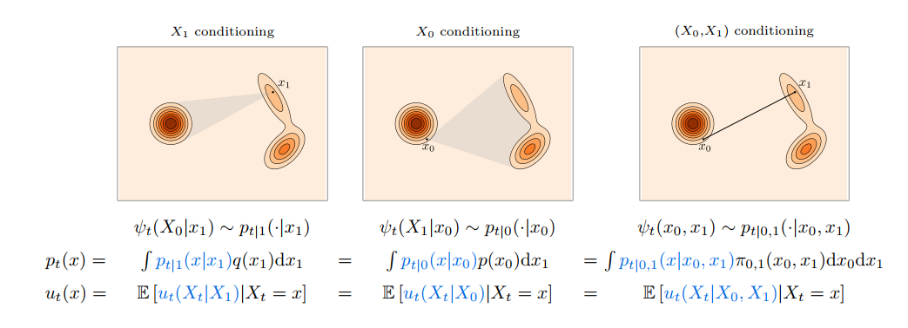

# Flow Matching Theorem

[toc]

!!! quote "Note"
      In this article, we establish the theroy foundation of the flow matching method

      Please read the section introduction for common knowledges of the flow matching and standard notations

## Formula of flow matching

Suppose $v(x,t)$ is the velocity field from push the probability $p$ to $q$. Our aim is to estimate the delocity field

!!! def "Flow Matching Loss"
      The flow matching loss is defined as

      $$
      \begin{equation}
      L_{F M}=E_{t,X_t\sim p_t} ||v(x,t) - v_\theta(x,t)||^2
      \end{equation}
      $$

Here **$||$** could be any distance metric besides the normal mean square error.

For simplicity, we denote the $\pi_{0,1}(X_0,X_1)$ be the joint distribution of the data coupling

$$(X_0,X_1)\sim \pi_{0,1}(X_0,X_1)$$

Although, the common used distirbution of $X_0$ is the Gaussian noise, we just consider the general distribution in this section.

### Conditional probability path

Let $p_{t|1}(x|x_1)$ be the consitional probability path.

Then the marginal probability path (responde to the joint distribution $\pi_{0,1}$) $p_t$

$$\tag{1}p_t(x) = \int p_{t|1}(x|x_1) q(x_1)d x_1.$$

and $p_t$ satisfied the boundary condition

$$p_0 = p, \qquad p_1 = q$$

which required the conditional probability path satisfy

$$
p_{0|1}(x|x_1) = \pi_{0|1}(x|x_1), and \; p_{1|1} (x|x_1) = \delta_{x_1}(x)
$$

where $\delta_{x_1}$ is the delta measure centered at $x_1$.

If we consider the independent data coupling, then

$$\pi_{0|1}(x_0|x_1) = \pi_{0,1}(x_0,x_1)/q(x_1)$$

The constrains becomes $p_{0|1}(x|x_1) = p(x)$.

The second condition could also be written as

$$\int p_{t|1}(x|y) f(y) d y \rightarrow f(x)$$

as $t\rightarrow 1$ for any continuous function $f$ since $\delta$ has no density function.

### Conditional Velocity Field

Let $v_t(\cdot|x_1)$ generates $p_{t|1}(\cdot | x_1)$

Thus we have

$$\tag{2}v_t(x) = \int v_t(x|x_1) p_{x_1|x} d x_1$$

This can be viewed as a weighted average of the conditional velocities or it can be regared as the conditional expectation

$$v_t(x) = \mathbf{E}[v_t(X_t|X_1)|X_t=x]$$

!!! thm "Expectation of conditional velocity"
      Given any Random Variable $Z$, $p_Z$ has bounded support,

      $$p_{t|Z}(x|z)\in C^1([0,1]\times R^d)$$

      $$v_t(x|z) \in C^1([0,1]\times R^d,R^d), p_t(x)>0 \; \forall x \in R^d, t\in[0,1)$$

      If $v_t(x|z)$ is conditional integrable and generates the conditional probability path $p_t(\cdot|z)$, then the marginal velocity field $v_t$ generates the marginal probability path $p_t$ for all $t\in [0,1)$

??? proof "Expectation of conditional velocity"

      Step 1: Differentiating $ p_t(x) $
      By the law of total probability:

      $$
      p_t(x) = \int p_{t|Z}(x|z) p_Z(z) dz.
      $$

      Differentiating both sides:

      $$
      \frac{d}{dt} p_t(x) = \int \frac{d}{dt} p_{t|Z}(x|z) p_Z(z) dz.
      $$

      Since $ v_t(x|z) $ generates $ p_{t|Z}(x|z) $, we have:

      $$
      \frac{d}{dt} p_{t|Z}(x|z) = -\nabla_x \cdot [ v_t(x|z) p_{t|Z}(x|z) ].
      $$

      Thus,

      $$
      \frac{d}{dt} p_t(x) = -\int \nabla_x \cdot\left[ v_t(x|z) p_{t|Z}(x|z) \right] p_Z(z) dz.
      $$

      Using the Leibniz rule to move differentiation outside the integral:

      $$
      \frac{d}{dt} p_t(x) = -\nabla_x \cdot \int v_t(x|z) p_{t|Z}(x|z) p_Z(z) dz.
      $$

      Step 2: Expressing $ v_t(x) $ Using **Bayes' Formula**
      From **Bayes' rule**:

      $$
      p_{t|Z}(x|z) p_Z(z) = p_{Z|t}(z|x) p_t(x),
      $$

      we substitute:

      $$
      \frac{d}{dt} p_t(x) = -\nabla_x \cdot \int v_t(x|z) p_{Z|t}(z|x) p_t(x) dz.
      $$

      Since the definition of $ v_t(x) $ is:

      $$
      v_t(x) = \int v_t(x|z) p_{Z|t}(z|x) dz,
      $$

!!! def "Contitional Flow Matching"
      Define the conditional flow matching loss as
      $$
      L_{CF M}(\theta) = E_{t,z,x_t\sim p_{t|Z}(\cdot | Z)} || v_t(x_t|Z)-v_\theta(x_t,t)||^2
      $$

!!! thm "Equivalent of gradient of FM and CFM loss"
      The gradients of the Flow Matching loss and the Conditional Flow Matching loss coincide. In particular, the minimizer of the Conditional Flow Matching loss is the marginal velocity.

      $$
      \begin{equation}
      \nabla_\theta L_{F M}(\theta)  = \nabla_\theta L_{CF M}(\theta)
      \end{equation}
      $$

??? proof "Proof"
      To prove that the **gradients of the Flow Matching (FM) loss and the Conditional Flow Matching (CFM) loss coincide**, i.e.,

      Take the gradient

      $$
      \begin{equation}
      \nabla L_{F M}  = \nabla E_{t, X_t}[||v(x,t) - v_\theta(x,t)||^2]
       = E_{t, X_t} (v_\theta - v)\nabla v_\theta
      \end{equation}
      $$

      Use the expectation formula of conditional velocity field

      $$
      \begin{equation}
            \nabla L_{F M} =E_{t,X_t} (v_\theta - E_{Z\sim p_{Z|t}(\cdot|X_t)}[v_t(X_t|Z)])\nabla v_\theta = E_{t,X_t,Z\sim p_{Z|t}(\cdot|X_t) } (v_\theta - v_t(x_t|Z))\nabla v_\theta
      \end{equation}
      $$

      By chain rule,

      $$
      \nabla L_{F M} = = E_{t,X_t,Z\sim p_{Z|t}(\cdot|X_t) }[ \nabla (||v_t(x_t|Z) - v_\theta||^2)]
      $$

      Change the order of expectation and gradient we hvae

      $$
      \nabla L_{F M}  =  \nabla  E_{t,X_t,Z\sim p_{Z|t}(\cdot|X_t) }[||v_t(x_t|Z) - v_\theta||^2]
      $$

      By the Bayes's rule,

      $$p_{Z|t}(Z|X_t) p(X_t) = p_{t|Z}(X_t|z) $$

      we have

      $$ E_{X_t,Z\sim p_{Z|t}(\cdot|X_t) } \cdots  = \int p(X_t)p_{Z|t}(\cdot|X_t) \cdots dx_t dz $$

      which equals

      $$ E_{X,x_t\sim p_{t|Z}(X_t|z) } \cdots  = \int p(z)p_{t|Z}(x_t|z) \cdots dx_t dz $$

      Hence

      $$
      \begin{equation}
      \nabla L_{F M} = \nabla E_{t,z,x_t\sim p_{t|Z}(x_t|z)} [ ||v_t(x_t|Z) - v_\theta||^2]
      \end{equation}
      $$

Different conditioning choices Z exist but are essentially all equivalent.

Main options include fixing target samples $Z = X_1$, source samples $Z = X_0$, or two-sided $Z = (X_0, X_1)$.
