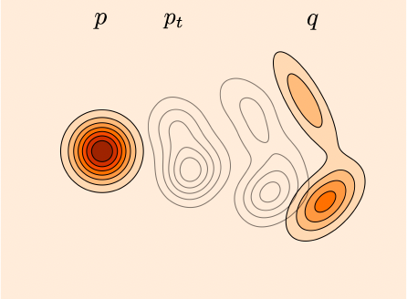
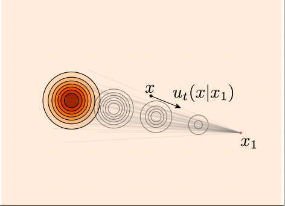
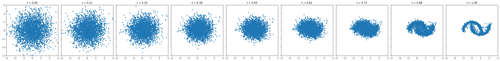

# Introduction to Flow Matching

The goal of the generative model is sampling from a real data distribution $p_{data}(x)$. However, it's not possible to unkow the density function of $p_{data}(x)$.

- If we know the density function $p_{data}(x)$ or the score function of $p_{data}(x)$, we can use the sampling algorithm to generate samples from $p_{data}(x)$ like the Langevin Dynamics as described in the engery based function.

- If we say, approximate the original density function is not easy, we can work around this problem by building a path from the original data distribution to a easy distribution. Then we can sample from the easy distribution and follow the path to sample the original data distribution. Like the diffusion process, either DDPM or SDE based model, we build a path that the original data distribution is gradually transformed to a standard normal distribution. The path is called the probability path.

By building the probability path, there are two main streams:

- random walk on the probability path
- deterministic flow on the probability path

While the first one is similar to the motion of particales in the heat diffusion phenomino. The partical is random walk has high probability to low temparature area. But the density function (heat) is changed over time deterministically and finally reach the uniform distribution.

The second one is similar to the motion of the particles in the water flow. The flow is driven by a force and particle is moved deterministically.

Mathematical, the first one can be written as

$$
\tag{1}
\boxed{
dx \;=\;f(x,t)\;dt \;+\; g(t)\,d\overline{W}_t,
}
$$

where $f$ is the drift term and $g$ is the diffusion term. See more in the diffusion chapter if reader is not clear about this process.

The second one can be written as

$$
\tag{2}
\boxed{
dx \;=\;v(x,t)\;dt,
}
$$

In either case, the probability path is deterministic, they can be described by the following ODE, respectively.

$$
\tag{3}
 \frac{d\, p_t(x)}{dt}  = -\nabla \cdot (p_t(x) f(x, t)) + \frac{1}{2} g^2(t) \nabla^2 p_t(x)
$$

$$
\tag{4}
 \frac{d\,p_t(x)}{dt}  = -\nabla \cdot (p_t(x) v(x, t))
$$

Correspondingly, the score function (see chapter energey based model for the score function explanation) can be written as

$$
\tag{5}
 \frac{d}{dt} \log p_t(x) = -\nabla \cdot f(x, t) - f(x, t) \cdot \nabla \log p_t(x) + \frac{1}{2} g^2(t) \frac{\nabla^2 p_t(x)}{p_t(x)}
$$

$$
\tag{6}
 \frac{d}{dt} \log p_t(x) = -\nabla \cdot v(x, t) - v(x, t) \cdot \nabla \log p_t(x)
$$

Refer the chapter diffusion for explanation of the equation (1), (3), and (5). Dont be afraid if not understand formula (2), (4) and (6). We will describe in the following contents.

Here we just indicate that the two different density map path both has a deterministic change with respect to time $t$.

Let's consider the deterministic flow and forget about the above formulas.

Just like the diffusion model, we can build a path from the easy distribution to the data destribution that we are interested. But unlike the diffusion, the path of the element moving is deterministic. If we can build this path, then we can sample from the easy distribution and follow the path to sample from the data distribution. That is the main idea of the **flow generative models**.

Mathematically, suppose we have the two distribution $p_{easy}(x)$ and $p_{data}(x)$. Generally, we denote them as $p$ and $q$ for the source and target distribution and $X_0\sim p$ and $X_1\sim q$ are two random variables, $x_0$ and $x_1$ are two samples from $p$ and $q$ respectively.

Suppose $\psi(x,t)=\psi_t(x)$ is the moving path of the samples from $p$ to $q$ at any time $t$ such that it starts from $X_0\sim p$ and ends at $X_1\sim q$, i.e.,

$$
\psi(X_0,t=0) = X_0\sim p, \; \psi(X_0,t=1) = X_1\sim q.
$$

Naturally, for any $t$, there will be a density $p_t(x)$, where

$$\psi(X_0,t)\sim p_t(x)$$



The problem is how to find the moving path $\psi(x,t)$ based on what we have is $p$ and $q$. Can we estimate $\psi(x,t)$ directly? This seems to have no help compared to estimating $\psi(x,1)$ directly and has no help from the flow that from easy to complex distribution.

If we can't estimate $\psi(x,t)$ directly, what else we can do.
One way is to estimate the velocity field $v(x,t)$ by the definition

$$\frac{d \psi(x,t)}{dt} = v(\psi(x,t),t)$$

Which sometimes noted as $\frac{dx}{dt} = v(x,t)$.

Due to the continuity equation (probability conservation), we have the relationship between $p_t$ and $v(x,t)$

$$
\tag{7}
\frac{d p_t(x)}{dt} = -\nabla \cdot\big[ v(x,t) p_t(x)\big]
$$

If we can estimate the velocity field, then we sample the data from $q$ and follow the velocity field to sample the data from $p$ by solving the ODE.

Although we haven't known how to build a path from $p$ to $q$, just assume we have a path. Let's see how to model it.

Let's say $v_\theta(x,t)$ is the estimated velocity field from the network with parameters $\theta$. Then how to find the loss function?

There are two main ways to find the loss function:

1. Maximal log likelihood (MLL)
2. Score matching (regression of velocity field)

In the MML sense, we have the loss

$$
\max_\theta \log p_\theta(x) = \log p(x(0)) -\max \int_{0}^{T} \operatorname{Tr}\Bigl(\frac{\partial v(x(t),t)}{\partial x(t)}\Bigr) dt,
$$

which is exactly the continuous normalization flow method, see chapter "normalize flow" for more details.

In the score matching sense, we have the loss

$$
 \mathcal{L}_{\text{FM}} = \mathbb{E}_{t\sim \mathcal{U}(0,T),\, x\sim p_t(x)} \Bigl[\, \|v_\theta(x,t) - v^*(x,t)\|^2 \Bigr].
$$

Which requires us to know the exact velocity field $v^*(x,t)$ at any time $t$ and position $x$.

<div class="definition">
<strong>Definition: Flow Matching </strong>

Let $\{p_t(x)\}_{t\in[0,T]}$ be a family of distributions interpolating between a base distribution $p_0(x)$ and a target distribution $p_T(x)$. Suppose there exists an ideal, time-dependent velocity field $v(x,t)$ that satisfies the continuity equation

$$
\frac{\partial p_t(x)}{\partial t} + \nabla \cdot \Bigl(p_t(x) \, v(x,t)\Bigr) = 0.
$$

**Flow Matching** trains a neural network $v_\theta(x,t)$ to approximate $v(x,t)$ by minimizing the distance:

$$
 \mathcal{L}(\theta) = \mathbb{E}_{t\sim \mathcal{U}(0,T),\, x\sim p_t(x)} D(v_\theta(x,t), v(x,t))
$$

where $D$ is the metric (distance function) of the distance between $v_\theta(x,t)$ and $v(x,t)$ and is usually chosen as the mean squared error (MSE).

Once trained, the learned velocity field defines a deterministic flow via the ODE

$$
 \frac{dx(t)}{dt} = v_\theta(x(t),t), \quad x(0) \sim p_0(x),
$$

which, upon integration from $t=0$ to $t=T$, transports samples from the base distribution $p_0(x)$ to approximate the target distribution $p_T(x)$.

</div>

Now we have defined what is the flow matching method. One thing that is not solved yet is

1. How to build a path from $p$ to $q$?
2. How to know the ground truth of the velocity field $v(x,t)$?

The first problem seems easy. For example, we can build

$$X_t = tX_1 + (1-t)X_0$$

This is a well-defined probability path transit from $X_0$ to $X_1$ gradually. Of course, there are many different constructions of the probability path.

Just take this probability path as an example, and see how to can find the ground truth of the velocity field $v(x,t)$.

Although we know the probability path, but for each particle, how they are moved is not easy to understand.

As we do usually, we can do it from simple to complex.

First, let's assume that $X_1$ contains only single particle $x_1$, then the path of each particle in $X_0$ is easy to know.

$$\psi(x,t) = t x_1 + (1-t) x, \quad \forall x \in X_0,\quad t\in [0,1]$$

as shown in the figure below.



We have

$$v(x,t) = x_1 - x\quad \forall x \in X_0,\quad t\in[0,1]$$

Thus we have the loss

$$
L_\theta = \mathbb{E}_{t\sim \mathcal{U}(0,T),\, x_0\sim p_0(x)} ||v_\theta(x,t) - (x_1-x_0)||
$$

It is too hard for us to find the ground truth of the velocity field $v(x,t)$. We introduce the **conditional velocity field** $v(x|x_1,t)$ by condition $X_1 = x_1$.

And we have the loss **conditional flow matching loss**

$$
L_{CFM}(\theta) = \mathbb{E}_{t\sim \mathcal{U}(0,T),\, x_0\sim X_0,x_1\sim X_1} ||v_\theta(x,t) - (x_1-x_0)||
$$

That is the target of the conditional flow matching. One may be confused why this conditional flow matching is equivalent to the original flow matching, we will give further explanation in the next sections.

By the above explanation, we can have a simple training script for the flow matching

```python
import torch
from torch import nn, Tensor
import matplotlib.pyplot as plt
from sklearn.datasets import make_moons

class Flow(nn.Module):
    def __init__(self, dim: int = 2, h: int = 64):
        super().__init__()
        self.net = nn.Sequential(
            nn.Linear(dim + 1, h), nn.ELU(),
            nn.Linear(h, h), nn.ELU(),
            nn.Linear(h, h), nn.ELU(),
            nn.Linear(h, dim))

    def forward(self, x_t: Tensor, t: Tensor) -> Tensor:
        return self.net(torch.cat((t, x_t), -1))

    def step(self, x_t: Tensor, t_start: Tensor, t_end: Tensor) -> Tensor:
        t_start = t_start.view(1, 1).expand(x_t.shape[0], 1)
        # For simplicity, using midpoint ODE solver in this example
        return x_t + (t_end - t_start) * self(x_t + self(x_t, t_start) * (t_end - t_start) / 2,
        t_start + (t_end - t_start) / 2)

# training
flow = Flow()
optimizer = torch.optim.Adam(flow.parameters(), 1e-2)
loss_fn = nn.MSELoss()
from tqdm import  tqdm
for _ in tqdm(range(20000)):
    x_1 = Tensor(make_moons(256, noise=0.05)[0])
    x_0 = torch.randn_like(x_1)
    t = torch.rand(len(x_1), 1)
    x_t = (1 - t) * x_0 + t * x_1
    dx_t = x_1 - x_0
    optimizer.zero_grad()
    loss_fn(flow(x_t, t), dx_t).backward()
    optimizer.step()

# sampling
x = torch.randn(3000, 2)
n_steps = 8
fig, axes = plt.subplots(1, n_steps + 1, figsize=(32, 4), sharex=True, sharey=True)
time_steps = torch.linspace(0, 1.0, n_steps + 1)

axes[0].scatter(x.detach()[:, 0], x.detach()[:, 1], s=10)
axes[0].set_title(f't = {time_steps[0]:.2f}')
axes[0].set_xlim(-3.0, 3.0)
axes[0].set_ylim(-3.0, 3.0)

for i in range(n_steps):
    x = flow.step(x, time_steps[i], time_steps[i + 1])
    axes[i + 1].scatter(x.detach()[:, 0], x.detach()[:, 1], s=10)
    axes[i + 1].set_title(f't = {time_steps[i + 1]:.2f}')

plt.tight_layout()
plt.show()
```

The density distribution changes


